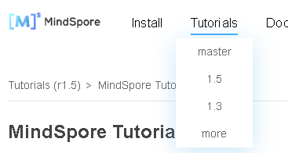
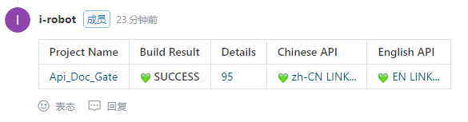
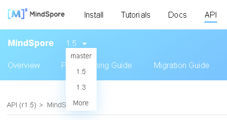

# Contributing Documents

[查看中文](./CONTRIBUTING_DOC_CN.md#)

You are welcome to contribute MindSpore documents. Documents that meet requirements will be displayed on the [MindSpore website](https://www.mindspore.cn/en).

This project supports contribution documents in markdown and reStructuredText formats. You can create `.md` or `.rst` files or modify existing files.

## Document

MindSpore docs repository provides [Document Writing Specifications](https://gitee.com/mindspore/docs/wikis/Document%20Writing%20Specifications?sort_id=3379825) for your reference.

### Updating or Adding a Document

#### Updating a Document

If you want to update an existing document, click `View source on Gitee` (as shown in the following figure) on the top of the page to go to the source file. Modify the document and commit changes to a PR to make the contribution.


#### Adding a Document

If you need to add a document, create a markdown or reStructuredText file in a proper directory. For details about the directory structure of the MindSpore docs repository, see [README](https://gitee.com/mindspore/docs/blob/master/README.md#directory-structure-description).

1. Create a document.

    Requirements for a new document are as follows:

    - Storage path: `source_en`.
    - Document name: A document name must consist of lowercase letters or underscores (_).

2. Add the new document to the web page.

    After the writing is complete, add the new document to the web page directory.

   Take a training tutorial as an example. Find the [index.rst](https://gitee.com/mindspore/docs/blob/master/tutorials/source_en/index.rst) file in the `source_en` directory. This file corresponds to the organization structure of the training tutorial web page.

    Add the new document to the corresponding category. You can also create a category before adding the document. Take **Implementing an Image Classification Application** as an example. Save the document in the `quick_start` directory and name it as `quick_start.md`. Add `quick_start/quick_start` to the Quick Start category, as shown below.

    ```rst
    .. toctree::
      :glob:
      :maxdepth: 1
      :caption: Quick Start
      :hidden:

      quick_start/quick_start
      quick_start/linear_regression
      quick_start/quick_video
    ```

After completing the preceding operations, commit to a PR to make contribution.

### Checking a Document

After committing to a PR, ensure that the `mindspore-cla/yes` and `ci-pipeline-passed` labels exist and the `stat/need-squash` label does not exist. The PR can be merged only after being approved by the committer.

- `mindspore-cla/yes`: indicates that the CLA has been properly signed. If the CLA is not signed, the system automatically adds the `mindspore-cla/no` label. After the CLA is signed, add the comment `/check-cla` under the PR. Then the `mindspore-cla/yes` label is automatically added.
- `ci-pipeline-passed`: indicates that the MindSpore CI check is passed. When a PR is created, MindSpore CI automatically starts the check. If the check is passed, the system automatically adds the label. If the check fails, the system automatically adds the `ci-pipeline-failed` label. After problems are resolved, add the comment `/retest` under the PR. If the check is successful, the `ci-pipeline-passed` label is automatically added.
- `stat/need-squash`: indicates that the PR has multiple commits. The label is automatically deleted only after the commits are merged into one commit through the `git rebase` operation.

MindSpore CI uses check tools such as Markdownlint, Pylint, Shellcheck, Cppcheck, Cpplint, and Tab.

Markdownlint is a tool for checking the markdown file format. You can use the tool to check the format based on the configured rules and new rules. MindSpore CI modifies the following rules based on the default configuration:

- MD007 (unordered list indentation): The **indent** parameter is set to **4**, indicating that all content in the unordered list needs to be indented using four spaces.
- MD009 (spaces at the line end): The **br_spaces** parameter is set to **2**, indicating that there can be 0 or 2 spaces at the end of a line.
- MD029 (sequence numbers of an ordered list): The **style** parameter is set to **ordered**, indicating that the sequence numbers of the ordered list are in ascending order.

For details, see [RULES](https://github.com/markdownlint/markdownlint/blob/master/docs/RULES.md#).

### Confirming the Content

On the next day after the PR is merged, you can view the new content on the MindSpore website. A new link will be created for the new document.

By default, tutorials and documents of the latest version are displayed on the official website. To view the newly merged content, switch to master from the drop-down list.



Take **Quick Start for Beginners** as an example. The document link is <https://www.mindspore.cn/tutorials/en/master/beginner/quick_start.html>.

## API

MindSpore docs repository provides [API Comment Specifications](https://gitee.com/mindspore/docs/wikis/MindSpore%20API%20Comment%20Specifications?sort_id=3379820) for your reference.

### Updating or Adding an API

#### Updating a Python API

If you want to update an existing API, find the source file of the API in the MindSpore code.

If you do not know the file link, click **source** and find the file link by referring to the content following `_modules` in the link.

Take Tensor as an example. After clicking **source**, you can obtain the source file link <https://gitee.com/mindspore/mindspore/blob/master/mindspore/python/mindspore/common/tensor.py>.


Modify the comments in the source file and commit changes to a PR to make the contribution.

#### Adding a Python API

If you want to add an API, check whether the API has been added to an existing module. For details about the existing modules, see <https://www.mindspore.cn/docs/en/master/index.html>.

- If the API belongs to an existing module, comment out the API in the MindSpore code repository based on the requirements and add the API to \_\_all\_\_ of the corresponding module. Ensure that the API can be used in importing **mindspore.*Module name*.*API name*** format.

    If the API belongs to the following modules, the API list of the MindSpore docs repository needs to be updated. Please add APIs in alphabetical order.

    - `mindspore.dataset`: [中文](https://gitee.com/mindspore/mindspore/blob/master/docs/api/api_python/mindspore.dataset.rst) | [English](https://gitee.com/mindspore/mindspore/blob/master/docs/api/api_python_en/mindspore.dataset.rst)
    - `mindspore.dataset.transforms`: [中文](https://gitee.com/mindspore/mindspore/blob/master/docs/api/api_python/mindspore.dataset.transforms.rst) | [English](https://gitee.com/mindspore/mindspore/blob/master/docs/api/api_python_en/mindspore.dataset.transforms.rst)
    - `mindspore.nn`: [中文](https://gitee.com/mindspore/mindspore/blob/master/docs/api/api_python/mindspore.nn.rst) | [English](https://gitee.com/mindspore/mindspore/blob/master/docs/api/api_python_en/mindspore.nn.rst)
    - `mindspore.nn.probability`: [中文](https://gitee.com/mindspore/mindspore/blob/master/docs/api/api_python/mindspore.nn.probability.rst) | [English](https://gitee.com/mindspore/mindspore/blob/master/docs/api/api_python_en/mindspore.nn.probability.rst)
    - `mindspore.ops`: [中文](https://gitee.com/mindspore/mindspore/blob/master/docs/api/api_python/mindspore.ops.rst) | [English](https://gitee.com/mindspore/mindspore/blob/master/docs/api/api_python_en/mindspore.ops.rst)
    - `mindspore.ops.primitive`: [中文](https://gitee.com/mindspore/mindspore/blob/master/docs/api/api_python/mindspore.ops.primitive.rst) | [English](https://gitee.com/mindspore/mindspore/blob/master/docs/api/api_python_en/mindspore.ops.primitive.rst)

- If the API does not belong to the existing module, add an API project file of the MindSpore docs repository. Please add modules to the [directory structure](https://gitee.com/mindspore/docs/blob/master/docs/mindspore/source_en/index.rst) in alphabetical order. To add the API of the `mindspore.mindrecord` module, you need to create the [mindspore.mindrecord.rst](https://gitee.com/mindspore/mindspore/blob/master/docs/api/api_python_en/mindspore.mindrecord.rst) file in the `docs/docs/api_python/source_en/mindspore` directory and add the file to the directory structure.

    ```rst
    .. toctree::
    :maxdepth: 1
    :caption: MindSpore Python API

    ...
    mindspore/mindspore.mindrecord
    ...
    ```

After completing the preceding modification, commit to a PR to make contribution.

### Checking the Python API

After committing to a PR, ensure that the `mindspore-cla/yes` and `ci-pipeline-passed` labels exist and the `stat/need-squash` label does not exist. The PR can be merged only after being approved by the committer.

For details about each label, see [Checking a Document](#checking-a-document).

MindSpore CI uses the Pylint check tool.

### Previewing Python API

To make it easier to see if the modified API displays as expected on the web page, MindSpore CI provides the ``/build_api_doc`` command to build the html.

```text
# You can start building the html by typing the following command in the comments
/build_api_doc
```

When execution is complete, a similar result is returned as below:



Click ``zh-CN LINK`` to see the html page built by Chinese API, and click ``EN LINK`` to see the html page built by English API.

### Confirming the Content

On the next day after the PR is merged, you can view the new content on the [MindSpore Python API](https://www.mindspore.cn/docs/en/master/index.html) page.

By default, APIs of the latest version are displayed. To view the newly merged content, switch to the master version.



## Image

The images in the document are mainly divided into program flowcharts, configuration flowcharts, functional structure diagrams and so on.

For specific image requirements and specifications, please refer to [Image Specifications](https://gitee.com/mindspore/docs/wikis/%E4%BD%9C%E5%9B%BE%E8%A7%84%E8%8C%83?sort_id=3498531) provided by MindSpore docs.

### Updating or Adding an Image

If you want to update an existing image or adding a new image, click  on the top of the page to go to the source file. Usually the images will be stored in the directory ./images. You only need to put the new images into this directory, or replace the modified images with the original ones, and commit changes to a PR to make the contribution.

> Please submit the original image to Gitee at the same time, and put it in the same path as the image for subsequent modification.

### Image Citation

The format of the image citation is: \!\[image name] (the path where the image is located). For details, please refer to [Markdown Image Citation Requirements](https://gitee.com/mindspore/docs/wikis/Document%20Writing%20Specifications?sort_id=3379825#image) and [Notebook Image Citation Requirements](https://gitee.com/mindspore/docs/wikis/Notebook%E5%86%99%E4%BD%9C%E8%A6%81%E6%B1%82?sort_id=3462614).

### Confirming the Content

On the next day after the PR is merged, you can view the new content on the MindSpore website. The new image will be shown in the document.

By default, tutorials and documents of the latest version are displayed on the official website. To view the newly merged content, switch to master from the drop-down list.

