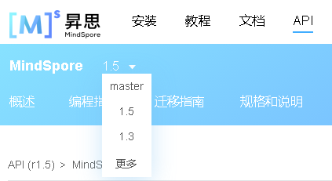

# 贡献文档

[View English](./CONTRIBUTING_DOC.md#)

欢迎参与MindSpore文档贡献，符合要求的文档将会在[MindSpore官网](http://www.mindspore.cn)中呈现。

本项目支持Markdown、reStructuredText和Jupyter Notebook格式的内容贡献，对应地可创建`.md`、`.rst`和`.ipynb`为后缀的文档或修改已存在的文档。

## 文档

MindSpore docs仓提供了[文档写作要求](https://gitee.com/mindspore/docs/wikis/文档写作要求?sort_id=3363974)供写作时参考。

### 更新/新增文档

#### 更新文档

如果您发现现有文档需要刷新，可点击页面上方的“View Source on Gitee”（如下图所示），跳转至源文件。修改该文件，并提交PR即可参与贡献。


#### 新增文档

如果您需要新增文档，请在合适目录新建Markdown或reStructuredText文件，MindSpore docs仓目录结构说明可参考[README](https://gitee.com/mindspore/docs/blob/master/README_CN.md#目录结构说明)。

1. 新建文件

    新建文件要求如下：

    - 存放路径：中文文档需新建在`source_zh_cn`目录下，英文文档需新建在`source_en`目录下。
    - 文件名：文件名需由英文小写或下划线组成。

2. 将新建文件添加到网页

    完成写作后，需在网页目录中添加新建的文件。

    以训练教程为例，先在`source_zh_cn`目录下找到[index.rst](https://gitee.com/mindspore/docs/blob/master/tutorials/source_zh_cn/index.rst)文件，该文件即对应训练教程网页的组织结构。

    在对应的分类中添加新建的文件，也可新建分类后再添加。以《实现一个图片分类应用》文档为例，该文档存放在`quick_start`目录，命名为`quick_start.md`，需将`quick_start/quick_start`添加至“快速入门”分类下，如下所示。

    ```rst
    .. toctree::
      :glob:
      :maxdepth: 1
      :caption: 快速入门
      :hidden:

      quick_start/quick_start
      quick_start/linear_regression
      quick_start/quick_video
    ```

完成上述操作后，并提交PR即可参与贡献。

### 检查文档

提交PR后，需要确保有`mindspore-cla/yes`和`ci-pipeline-passed`标签，没有`stat/need-squash`标签，并经过Committer审核后方可合入。

- `mindspore-cla/yes`：表示已正确签署CLA。如果已签署，系统会自动添加该标签。如果没有签署，系统会自动添加`mindspore-cla/no`标签，签署完后在PR下添加评论`/check-cla`，即可自动添加`mindspore-cla/yes`标签。
- `ci-pipeline-passed`：表示已通过MindSpore CI检查。创建PR时，MindSpore CI会自动启动检查，如果已检查通过，系统会自动添加该标签。如果没有检查通过，系统会自动添加`ci-pipeline-failed`标签，问题修改完后在PR下添加评论`/retest`，检查通过即可自动添加`ci-pipeline-passed`标签。
- `stat/need-squash`：表示该PR存在多次提交记录，需通过`git rebase`操作整合成一次提交记录后，才可自动删除该标签。

MindSpore CI采用了Markdownlint、Pylint、Shellcheck、Cppcheck、Cpplint、Tab等检查工具。

其中，Markdownlint是一款检查Markdown文件格式正确性的工具，可以根据设置的规则以及创建的新规则对Markdown文件进行全面的检查。MindSpore CI在默认配置的基础上，修改了如下规则：

- MD007（无序列表缩进）规则将参数indent设置为4，表示无序列表内的所有内容需缩进4格写作。
- MD009（行尾空格）规则将参数br_spaces设置为2，表示行尾可以有0个或2个空格。
- MD029（有序列表的前缀序号）规则将参数style设置为ordered，表示有序列表的前缀序号需按顺序递增。

更为详细规则信息请参考[RULES](https://github.com/markdownlint/markdownlint/blob/master/docs/RULES.md#)。

### 确认内容

PR合入后次日，即可在MindSpore官网中查看到新增内容，新增文档将新建链接。

官网各教程和文档默认选中最新发布版本，如需查看新合入的内容，需在下拉列表中切换至master。


以《初学入门》文档为例，该文档的链接为<https://www.mindspore.cn/tutorials/zh-CN/master/beginner/quick_start.html>。

## API

MindSpore docs仓提供了[API注释写作要求](https://gitee.com/mindspore/docs/wikis/API注释写作要求?sort_id=3364069)供写作时参考。

### 更新/新增API

#### 更新Python API

如果您发现现有API需要刷新，请先在MindSpore代码中找到该接口所在的源文件。

如果不清楚所在文件，可点击“source”，并参考跳转的链接地址中`_modules`后的内容，找到该文件。

以Tensor为例，点击“source”后得到源文件地址为<https://gitee.com/mindspore/mindspore/blob/master/mindspore/python/mindspore/common/tensor.py>。


修改源文件的注释，并提交PR即可参与贡献。

#### 新增Python API

如果您需要新增API，请先确认是否在已有模块中添加，已有模块列表请查看<https://www.mindspore.cn/docs/zh-CN/master/index.html>。

- 如果属于已有模块，在MindSpore代码仓按注释要求完成注释内容，并将该API添加至对应模块的\_\_all\_\_中，确保能通过导入“mindspore.模块名.API名”使用该API。

    如果属于以下模块，还需更新MindSpore docs仓的接口列表，请按字母序添加API。

    - `mindspore.dataset`：[中文页面列表](https://gitee.com/mindspore/mindspore/blob/master/docs/api/api_python/mindspore.dataset.rst) | [英文页面列表](https://gitee.com/mindspore/mindspore/blob/master/docs/api/api_python_en/mindspore.dataset.rst)
    - `mindspore.dataset.transforms`：[中文页面列表](https://gitee.com/mindspore/mindspore/blob/master/docs/api/api_python/mindspore.dataset.transforms.rst) | [英文页面列表](https://gitee.com/mindspore/mindspore/blob/master/docs/api/api_python_en/mindspore.dataset.transforms.rst)
    - `mindspore.nn`：[中文页面列表](https://gitee.com/mindspore/mindspore/blob/master/docs/api/api_python/mindspore.nn.rst) | [英文页面列表](https://gitee.com/mindspore/mindspore/blob/master/docs/api/api_python_en/mindspore.nn.rst)
    - `mindspore.nn.probability`：[中文页面列表](https://gitee.com/mindspore/mindspore/blob/master/docs/api/api_python/mindspore.nn.probability.rst) | [英文页面列表](https://gitee.com/mindspore/mindspore/blob/master/docs/api/api_python_en/mindspore.nn.probability.rst)
    - `mindspore.ops`：[中文页面列表](https://gitee.com/mindspore/mindspore/blob/master/docs/api/api_python/mindspore.ops.rst) | [英文页面列表](https://gitee.com/mindspore/mindspore/blob/master/docs/api/api_python_en/mindspore.ops.rst)
    - `mindspore.ops.primitive`：[中文页面列表](https://gitee.com/mindspore/mindspore/blob/master/docs/api/api_python/mindspore.ops.primitive.rst) | [英文页面列表](https://gitee.com/mindspore/mindspore/blob/master/docs/api/api_python_en/mindspore.ops.primitive.rst)

- 如果不属于已有模块，需新增MindSpore docs仓的接口工程文件，并按字母序添加模块到[目录结构](https://gitee.com/mindspore/docs/blob/master/docs/mindspore/source_zh_cn/index.rst)中。如需新增`mindspore.mindrecord`模块接口，需在`docs/docs/api_python/source_zh_cn/mindspore`目录下新增[mindspore.mindrecord.rst](https://gitee.com/mindspore/mindspore/blob/master/docs/api/api_python/mindspore.mindrecord.rst)文件，并将其添加到目录结构中。同时，在`docs/docs/api_python/source_en/mindspore`目录下做相应修改，即可生成英文页面内容。

    ```rst
    .. toctree::
    :maxdepth: 1
    :caption: MindSpore Python API

    ...
    mindspore/mindspore.mindrecord
    ...
    ```

完成上述修改，并提交PR即可参与贡献。

### 检查Python API

提交PR后，需要确保有`mindspore-cla/yes`和`ci-pipeline-passed`标签，没有`stat/need-squash`标签，并经过Committer审核后方可合入。

各标签的详细说明可参见[检查文档](#检查文档)中的相关内容。

MindSpore CI采用了Pylint检查工具。

### 预览Python API

为方便查看修改后的API在网页上的显示是否符合预期，MindSpore CI提供了``/build_api_doc``命令去构建html:

```text
# 在评论中输入如下命令即可开始构建html
/build_api_doc
```

执行完成后会返回如下类似结果：


点击``zh-CN LINK``可查看中文API构建的html页面，点击``EN LINK``可查看英文API构建的html页面。

### 确认内容

PR合入后次日，即可在MindSpore官网[Python API页面](https://www.mindspore.cn/docs/zh-CN/master/index.html)中查看到新增内容。

官网API默认展示最新发布版本，如需查看新合入的内容，如下图所示切换至master分支版本。



## 作图

文档中的图片主要分为程序流程图、配置流程图和功能结构图等。

具体的作图要求及规范，请参考MindSpore docs仓提供的[作图规范](https://gitee.com/mindspore/docs/wikis/%E4%BD%9C%E5%9B%BE%E8%A7%84%E8%8C%83?sort_id=3498531)。

### 更新/新增图片

如果您发现现有文档中的图片需要更新/新增，可点击页面上方的，跳转至源文件。通常图片会存放在./images目录中，只需将需要新增的图片放进这个目录，或将修改后的图片替换原图，并提交PR即可参与贡献。

> 请同时把原图一并提交到Gitee，放在与存放图片相同的路径下，方便后续修改。

### 图片引用

图片引用的格式为：\!\[图片名称](图片所在目录)。详情请参考[Markdown图片引用要求](https://gitee.com/mindspore/docs/wikis/%E6%96%87%E6%A1%A3%E5%86%99%E4%BD%9C%E8%A6%81%E6%B1%82?sort_id=3363974#%E5%9B%BE%E7%89%87)和[Notebook图片引用要求](https://gitee.com/mindspore/docs/wikis/Notebook%E5%86%99%E4%BD%9C%E8%A6%81%E6%B1%82?sort_id=3462614)。

### 确认内容

PR合入后次日，即可在MindSpore官网中查看到新增内容，更新/新增图片将会出现在文档中。

官网各教程和文档默认选中最新发布版本，如需查看新合入的内容，需在下拉列表中切换至master。

