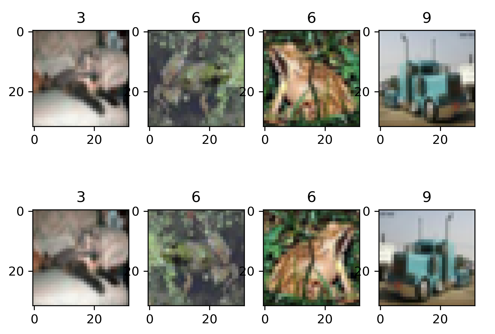
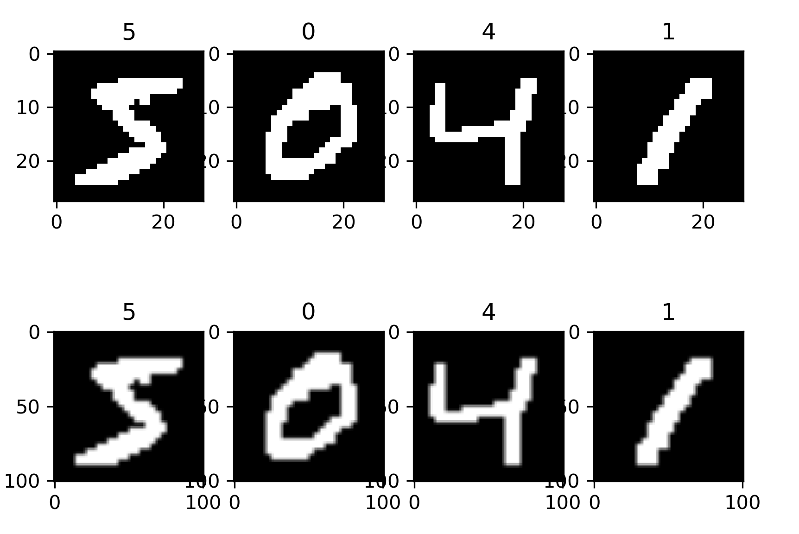
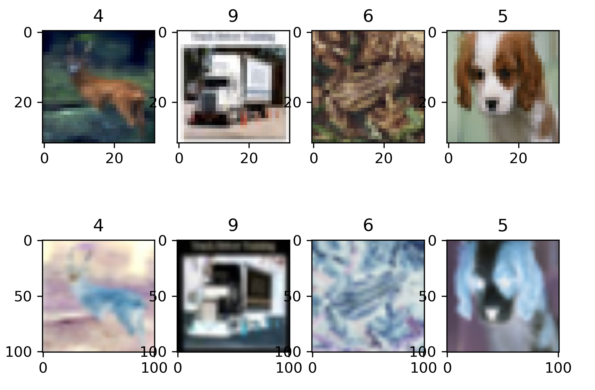
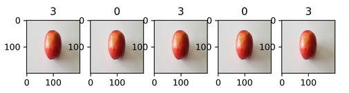
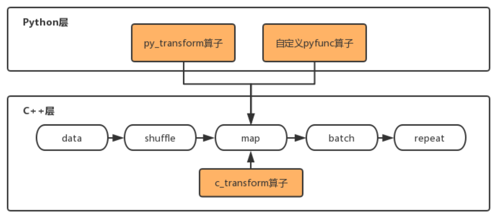
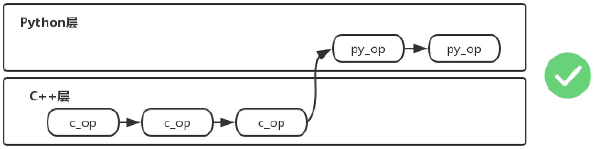
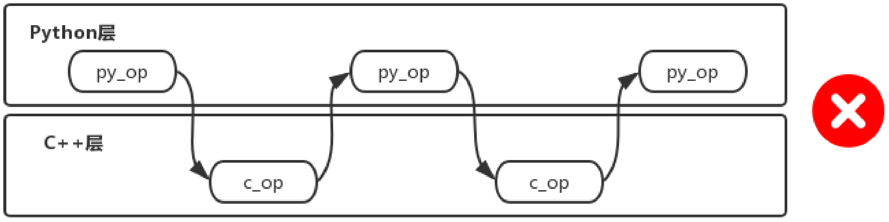

# 数据增强

<!-- TOC -->

- [数据增强](#数据增强)
    - [概述](#概述)
    - [c_transforms](#c_transforms)
        - [RandomCrop](#randomcrop)
        - [RandomHorizontalFlip](#randomhorizontalflip)
        - [Resize](#resize)
        - [Invert](#invert)
    - [py_transforms](#py_transforms)
        - [ComposeOp](#composeop)
    - [使用说明](#使用说明)

<!-- /TOC -->

<a href="https://gitee.com/mindspore/docs/blob/master/api/source_zh_cn/programming_guide/augmentation.md" target="_blank"></a>

## 概述

在计算机视觉任务中，数据量过小或是样本场景单一等问题都会影响模型的训练效果，用户可以通过数据增强操作对图像进行预处理，从而提升模型的泛化性。

MindSpore提供了c_transforms模块和py_transforms模块供用户进行数据增强操作，用户也可以自定义函数或者算子进行数据增强。

MindSpore目前支持的常用数据增强算子如下表所示，更多数据增强算子参见[API文档](https://www.mindspore.cn/api/zh-CN/master/api/python/mindspore/mindspore.dataset.vision.html)。

|  模块   | 实现  | 说明  |
|  ----                             | ----  | ----           |
| c_transforms                      | 基于C++的OpenCV实现 | 具有较高的性能。 |
| py_transforms                     | 基于Python的PIL实现 | 该模块提供了多种图像增强功能，并提供了PIL Image和numpy数组之间的传输方法。|


| 模块 | 算子 | 说明 |
| ---- | ---- | ---- |
| c_transforms | RandomCrop | 在图像随机位置裁剪指定大小子图像。 |
|  | RandomHorizontalFlip | 按照指定概率对图像进行水平翻转。 |
|  | Resize | 将图像缩放到指定大小。 |
|  | Invert | 将图像进行反相。 |
| py_transforms | RandomCrop | 在图像随机位置裁剪指定大小子图像。 |
|  | Resize | 将图像缩放到指定大小。 |
|  | Invert | 将图像进行反相。 |
|  |ComposeOp | 将列表中的数据增强操作依次执行。 |

##  c_transforms

下面将简要介绍几种常用的c_transforms模块数据增强算子的使用方法，更多的c_transforms模块数据增强算子参见[API文档](https://www.mindspore.cn/api/zh-CN/master/api/python/mindspore/mindspore.dataset.vision.html#module-mindspore.dataset.vision.c_transforms)。

### RandomCrop

对输入图像进行在随机位置的裁剪。

**参数说明：**
- *size: 裁剪图像的尺寸。*  
- *padding:  填充的像素数量。*  
- *pad_if_needed:  原图小于裁剪尺寸时，是否需要填充。*  
- *fill_value:  在常量填充模式时使用的填充值。*  
- *padding_mode:  填充模式。*  

```python
# 对输入图像进行在随机位置的裁剪

import matplotlib.pyplot as plt
import mindspore.dataset as ds
import mindspore.dataset.transforms.vision.c_transforms as c_trans

# 下载Cifar10数据集，将其解压到Cifar10Data目录
DATA_DIR = "../data/dataset/testCifar10Data2"

# 指定一个顺序采样器SequentialSampler，按照读取顺序获取3个样本数据
sampler = ds.SequentialSampler(num_samples=3)

# 使用Cifar10Dataset读取数据集，指定sampler为上述采样器
dataset1 = ds.Cifar10Dataset(DATA_DIR, sampler=sampler)

# 创建一个随机裁剪算子，裁剪后的长宽分为10个像素
random_crop = c_trans.RandomCrop([10, 10])

# 使用map算子将其作用到数据管道的数据集中
dataset2 = dataset1.map(input_columns=["image"], operations=random_crop)

# 启动数据管道，输出3个样本数据
image_list1, label_list1 = [], []
image_list2, label_list2 = [], []
for data1, data2 in zip(dataset1.create_dict_iterator(), dataset2.create_dict_iterator()):
    image_list1.append(data1['image'])
    label_list1.append(data1['label'])
    print("Source image Shape :", data1['image'].shape, ", Source label :", data1['label'])
    image_list2.append(data2['image'])
    label_list2.append(data2['label'])
    print("Cropped image Shape:", data2['image'].shape, ", Cropped label:", data2['label'])
    print("")

# 将原图与裁剪后的图可视化
num_samples = len(image_list1) + len(image_list2)
for i in range(num_samples):
    if i < len(image_list1):
        plt.subplot(2, len(image_list1), i + 1)
        plt.imshow(image_list1[i])
        plt.title(label_list1[i])
    else:
        plt.subplot(2, len(image_list2), i + 1)
        plt.imshow(image_list2[i % len(image_list2)])
        plt.title(label_list2[i % len(image_list2)])
plt.show()
```

```
Source image Shape : (32, 32, 3) , Source label : 6
Cropped image Shape: (10, 10, 3) , Cropped label: 6

Source image Shape : (32, 32, 3) , Source label : 9
Cropped image Shape: (10, 10, 3) , Cropped label: 9

Source image Shape : (32, 32, 3) , Source label : 9
Cropped image Shape: (10, 10, 3) , Cropped label: 9
```


### RandomHorizontalFlip

对输入图像进行随机水平翻转。

**参数说明：**
- *prob: 单张图片发生翻转的概率。*  

```python
# 对输入图像进行随机水平翻转

import matplotlib.pyplot as plt
import mindspore.dataset as ds
import mindspore.dataset.transforms.vision.c_transforms as c_trans

# 设置全局随机种子
ds.config.set_seed(6)

# 下载Cifar10数据集，将其解压到Cifar10Data目录
DATA_DIR = "../data/dataset/testCifar10Data2"

# 指定一个随机采样器RandomSampler，按照读取顺序获取4个样本数据
sampler = ds.RandomSampler(num_samples=4)

# 使用Cifar10Dataset读取数据集，指定sampler为上述采样器
dataset1 = ds.Cifar10Dataset(DATA_DIR, sampler=sampler)

# 创建一个随机翻转算子，设置翻转概率为0.8
random_horizontal_flip = c_trans.RandomHorizontalFlip(prob=0.8)

# 使用map算子将其作用到数据管道的数据集中
dataset2 = dataset1.map(input_columns=["image"], operations=random_horizontal_flip)

# 启动数据管道，输出4个样本数据
image_list1, label_list1 = [], []
image_list2, label_list2 = [], []
for data1, data2 in zip(dataset1.create_dict_iterator(), dataset2.create_dict_iterator()):
    image_list1.append(data1['image'])
    label_list1.append(data1['label'])
    print("Source image Shape :", data1['image'].shape, ", Source label :", data1['label'])
    image_list2.append(data2['image'])
    label_list2.append(data2['label'])
    print("Flipped image Shape:", data2['image'].shape, ", Flipped label:", data2['label'])
    print("")

# 将原图与裁剪后的图可视化
num_samples = len(image_list1) + len(image_list2)
for i in range(num_samples):
    if i < len(image_list1):
        plt.subplot(2, len(image_list1), i + 1)
        plt.imshow(image_list1[i])
        plt.title(label_list1[i])
    else:
        plt.subplot(2, len(image_list2), i + 1)
        plt.imshow(image_list2[i % len(image_list2)])
        plt.title(label_list2[i % len(image_list2)])
plt.show()
```

```
Source image Shape : (32, 32, 3) , Source label : 3
Flipped image Shape: (32, 32, 3) , Flipped label: 3

Source image Shape : (32, 32, 3) , Source label : 6
Flipped image Shape: (32, 32, 3) , Flipped label: 6

Source image Shape : (32, 32, 3) , Source label : 6
Flipped image Shape: (32, 32, 3) , Flipped label: 6

Source image Shape : (32, 32, 3) , Source label : 9
Flipped image Shape: (32, 32, 3) , Flipped label: 9
```



### Resize

对输入图像进行缩放。

**参数说明：**
- *self: 缩放的目标大小。*  
- *interpolation: 缩放时采用的插值方式。*

```python
# 对输入图像进行指定大小缩放

import matplotlib.pyplot as plt
import mindspore.dataset as ds
import mindspore.dataset.transforms.vision.c_transforms as c_trans

# 下载MNIST数据集，将其解压到MnistData目录
DATA_DIR = "../data/dataset/testMnistData2"

# 使用MnistDataset读取数据集
dataset1 = ds.MnistDataset(DATA_DIR, num_samples=4, shuffle=False)

# 创建一个缩放算子，将MNIST的图片从(28, 28)缩放到(101, 101)
resize = c_trans.Resize(size=[101, 101])

# 使用map算子将其作用到数据管道的数据集中
dataset2 = dataset1.map(input_columns=["image"], operations=resize)

# 启动数据管道
image_list1, label_list1 = [], []
image_list2, label_list2 = [], []
for data1, data2 in zip(dataset1.create_dict_iterator(), dataset2.create_dict_iterator()):
    image_list1.append(data1['image'])
    label_list1.append(data1['label'])
    print("Source image Shape :", data1['image'].shape, ", Source label :", data1['label'])
    image_list2.append(data2['image'])
    label_list2.append(data2['label'])
    print("Flipped image Shape:", data2['image'].shape, ", Flipped label:", data2['label'])
    print("")

# 将原图与裁剪后的图可视化
num_samples = len(image_list1) + len(image_list2)
for i in range(num_samples):
    if i < len(image_list1):
        plt.subplot(2, len(image_list1), i + 1)
        plt.imshow(image_list1[i].squeeze(), cmap=plt.cm.gray)
        plt.title(label_list1[i])
    else:
        plt.subplot(2, len(image_list2), i + 1)
        plt.imshow(image_list2[i % len(image_list2)].squeeze(), cmap=plt.cm.gray)
        plt.title(label_list2[i % len(image_list2)])
plt.show()
```

```
Source image Shape : (28, 28, 1) , Source label : 5
Flipped image Shape: (101, 101, 1) , Flipped label: 5

Source image Shape : (28, 28, 1) , Source label : 0
Flipped image Shape: (101, 101, 1) , Flipped label: 0

Source image Shape : (28, 28, 1) , Source label : 4
Flipped image Shape: (101, 101, 1) , Flipped label: 4

Source image Shape : (28, 28, 1) , Source label : 1
Flipped image Shape: (101, 101, 1) , Flipped label: 1
```



### Invert

对输入图像进行反相处理。

```python
# 对输入图像进行反相处理

import matplotlib.pyplot as plt
import mindspore.dataset as ds
import mindspore.dataset.transforms.vision.c_transforms as c_trans

# 设置全局随机种子
ds.config.set_seed(8)

# 下载Cifar10数据集，将其解压到Cifar10Data目录
DATA_DIR = "../data/dataset/testCifar10Data2"

# 使用Cifar10Dataset读取数据集
dataset1 = ds.Cifar10Dataset(DATA_DIR, num_samples=4, shuffle=True)

# 创建一个缩放算子，将图片缩放到(101, 101)
resize = c_trans.Resize(size=[101, 101])

# 创建一个反相算子
invert = c_trans.Invert()

# 使用map算子将其作用到数据管道的数据集中(两个算子按顺序起作用)
dataset2 = dataset1.map(input_columns=["image"], operations=[resize, invert])

# 启动数据管道
image_list1, label_list1 = [], []
image_list2, label_list2 = [], []
for data1, data2 in zip(dataset1.create_dict_iterator(), dataset2.create_dict_iterator()):
    image_list1.append(data1['image'])
    label_list1.append(data1['label'])
    print("Source image Shape :", data1['image'].shape, ", Source label :", data1['label'])
    image_list2.append(data2['image'])
    label_list2.append(data2['label'])
    print("Flipped image Shape:", data2['image'].shape, ", Flipped label:", data2['label'])
    print("")

# 将原图与裁剪后的图可视化
num_samples = len(image_list1) + len(image_list2)
for i in range(num_samples):
    if i < len(image_list1):
        plt.subplot(2, len(image_list1), i + 1)
        plt.imshow(image_list1[i].squeeze(), cmap=plt.cm.gray)
        plt.title(label_list1[i])
    else:
        plt.subplot(2, len(image_list2), i + 1)
        plt.imshow(image_list2[i % len(image_list2)].squeeze(), cmap=plt.cm.gray)
        plt.title(label_list2[i % len(image_list2)])
plt.show()
```

```
Source image Shape : (32, 32, 3) , Source label : 4
Flipped image Shape: (32, 32, 3) , Flipped label: 4

Source image Shape : (32, 32, 3) , Source label : 9
Flipped image Shape: (32, 32, 3) , Flipped label: 9

Source image Shape : (32, 32, 3) , Source label : 6
Flipped image Shape: (32, 32, 3) , Flipped label: 6

Source image Shape : (32, 32, 3) , Source label : 5
Flipped image Shape: (32, 32, 3) , Flipped label: 5
```



## py_transforms

下面将简要介绍几种常用的py_transforms模块数据增强算子的使用方法，更多的py_transforms模块数据增强算子参见[API文档](https://www.mindspore.cn/api/zh-CN/master/api/python/mindspore/mindspore.dataset.vision.html#module-mindspore.dataset.vision.py_transforms)。

### ComposeOp

```python
# 对输入图像进行解码，缩放组合操作

import matplotlib.pyplot as plt
import mindspore.dataset as ds
import mindspore.dataset.transforms.vision.py_transforms as py_trans

# 设置全局随机种子
ds.config.set_seed(8)

# 图像数据集目录
DATA_DIR = "../data/dataset/testPK/data"

# 使用ImageFolderDatasetV2读取数据集，获取5个样本
dataset1 = ds.ImageFolderDatasetV2(DATA_DIR, num_samples=5, shuffle=True)

# 创建一组数据增强算子的集合
transforms_list = [
  py_trans.Decode(),                  # 解码图像到PIL格式
  py_trans.Resize(size=(200,200)),    # 缩放图像到[200, 200]大小
  py_trans.ToTensor()                 # 将PIL图像转换到Numpy
]
compose_trans = py_trans.ComposeOp(transforms_list)

# 使用map算子将其作用到数据管道的数据集中
dataset2 = dataset1.map(input_columns=["image"], operations=compose_trans())

# 启动数据管道，输出5个样本数据
image_list, label_list = [], []
for data in dataset2.create_dict_iterator():
    image_list.append(data['image'])
    label_list.append(data['label'])
    print("Transformed image Shape:", data['image'].shape, ", Transformed label:", data['label'])

# 将原图与裁剪后的图可视化
num_samples = len(image_list)
for i in range(num_samples):
    plt.subplot(1, len(image_list), i + 1)
    plt.imshow(image_list[i].transpose(1, 2, 0))
    plt.title(label_list[i])
plt.show()
```

```
Transformed image Shape: (3, 200, 200) , Transformed label: 3
Transformed image Shape: (3, 200, 200) , Transformed label: 0
Transformed image Shape: (3, 200, 200) , Transformed label: 3
Transformed image Shape: (3, 200, 200) , Transformed label: 0
Transformed image Shape: (3, 200, 200) , Transformed label: 3
```



## 使用说明

请勿混用c_transforms与py_transforms，因为c_transforms是在C++内维护buffer管理，py_transforms是在Python内维护buffer管理，两者混用会降低性能。



混用会引发C++与Python切换的成本，建议不要过度混用两个模块的算子，但是适量混用是可以接受的。

**推荐的使用方式：**

- 单独使用py_transform或c_transform

    

- 先使用py_transform，再使用c_transform

    

- 先使用c_transform，再使用py_transform

    

**不推荐的使用方式：**

- 在两种transform之间频繁切换

    
