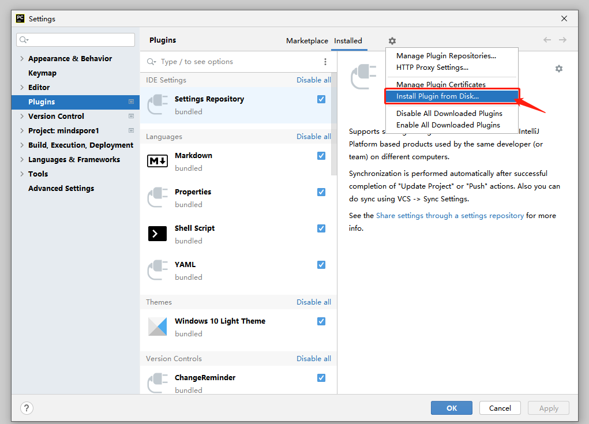

# PyCharm Plug-in Installation

## Installation Steps

1. Obtain [Plug-in Zip package](https://ms-release.obs.cn-north-4.myhuaweicloud.com/2.2.0/IdePlugin/any/MindSpore_Dev_ToolKit-2.2.0.zip).
2. Start Pycharm and click on the upper left menu bar, select File->Settings->Plugins->Install Plugin from Disk.
   As shown in the figure:

   

3. Select the plug-in zip package.