# Source Code Compilation Guide

<a href="https://gitee.com/mindspore/docs/blob/r1.9/docs/devtoolkit/docs/source_en/compiling.md" target="_blank"></a>

The following describes how to compile the MindSpore Dev ToolKit project based on the IntelliJ IDEA source code.

## Background

* MindSpore Dev ToolKit is a PyCharm plug-in developed using IntelliJ IDEA. [IntelliJ IDEA](https://www.jetbrains.com/idea/download) and PyCharm are IDEs developed by JetBrains.
* MindSpore Dev ToolKit is developed based on JDK 11. To learn JDK- and Java-related knowledge, visit [https://jdk.java.net/](https://jdk.java.net/).
* [Gradle 6.6.1](https://gradle.org) is used to build MindSpore Dev Toolkit and it does not need to be installed in advance. IntelliJ IDEA automatically uses the "gradle wrapper" mechanism to configure the required Gradle based on the code.

## Required Software

* [IntelliJ IDEA](https://www.jetbrains.com/idea/download)

* JDK 11

  Note: IntelliJ IDEA 2021.3 contains a built-in JDK named **jbr-11 JetBrains Runtime version 11.0.10**, which can be used directly.

    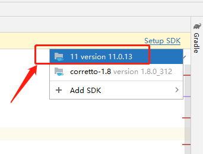

## Compilation

1. Verify that the required software has been successfully configured.

2. Download the [project](https://gitee.com/mindspore/ide-plugin) source code from the code repository.

    * Download the ZIP package.

      

    * Run the git command to download the package.

      ```
      git clone https://gitee.com/mindspore/ide-plugin.git
      ```

3. Use IntelliJ IDEA to open the project.

    3.1 Choose **File** > **Open**.

      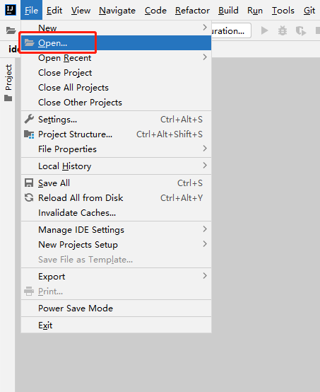

    3.2 Go to the directory for storing the project.

      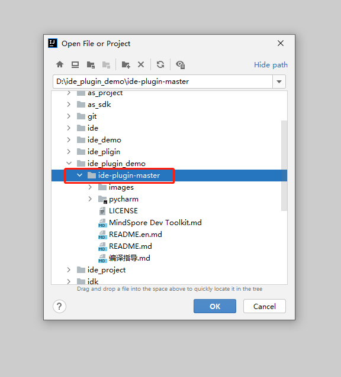

    3.3 Click **Load** in the dialog box that is displayed in the lower right corner. Alternatively, click **pycharm**, right-click the **settings.gradle** file, and choose **Link Gradle Project** from the shortcut menu.

      

      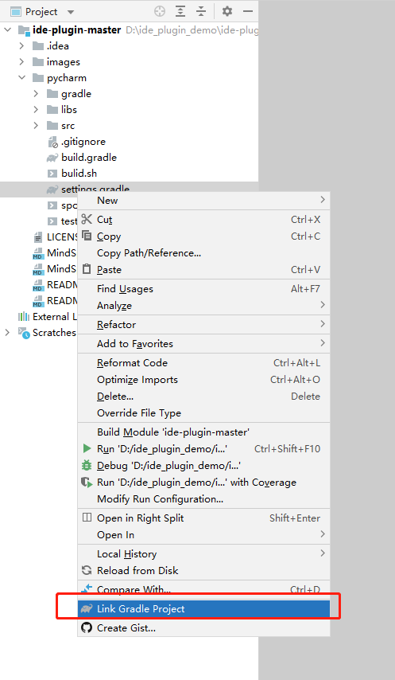

4. If the system displays a message indicating that no JDK is available, select a JDK. ***Skip this step if the JDK is available.***

    4.1 The following figure shows the situation when the JDK is not available.

      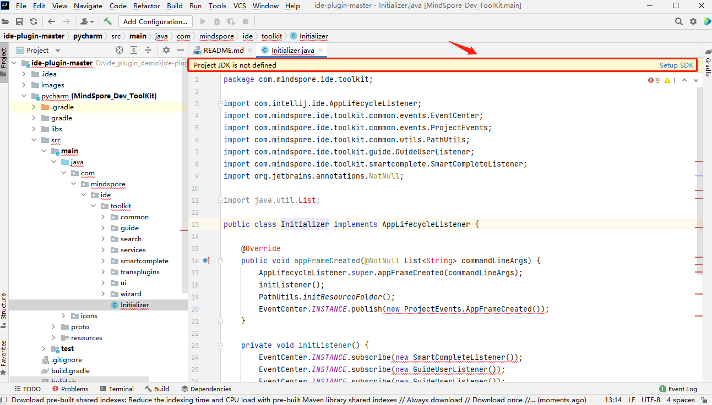

    4.2 Choose **File** > **Project Structure**.

      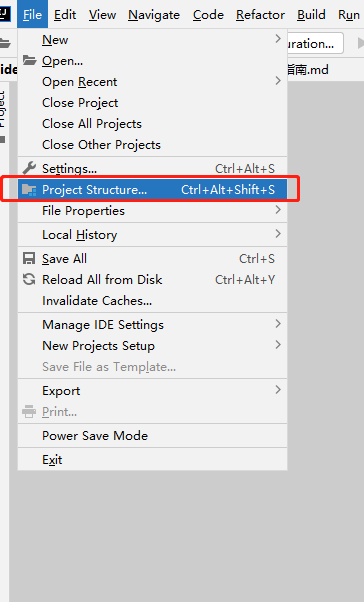

    4.3 Select JDK 11.

      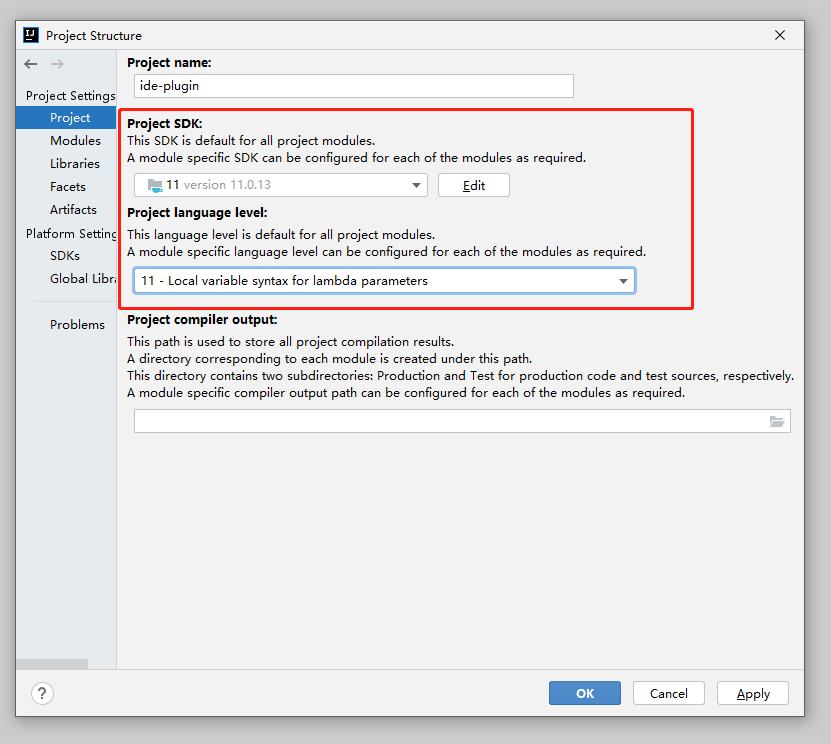

5. Wait until the synchronization is complete.

    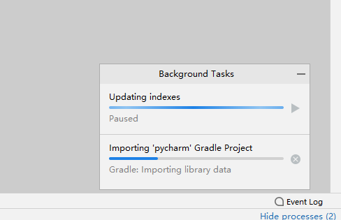

6. Build a project.

    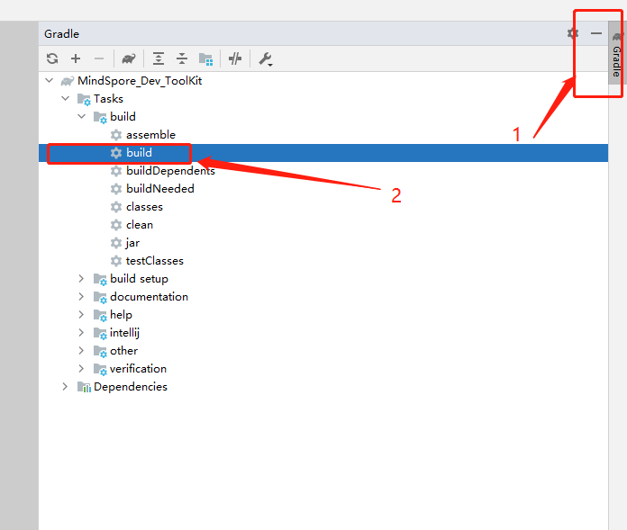

7. Wait till the build is complete.

    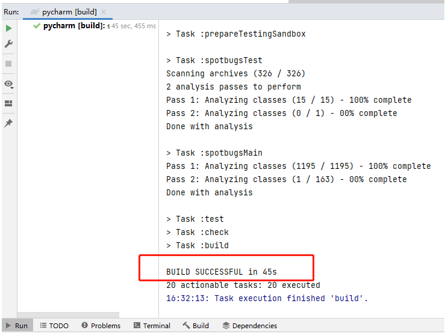

8. Obtain the plug-in installation package from the **/pycharm/build/distributions** directory in the project directory.

    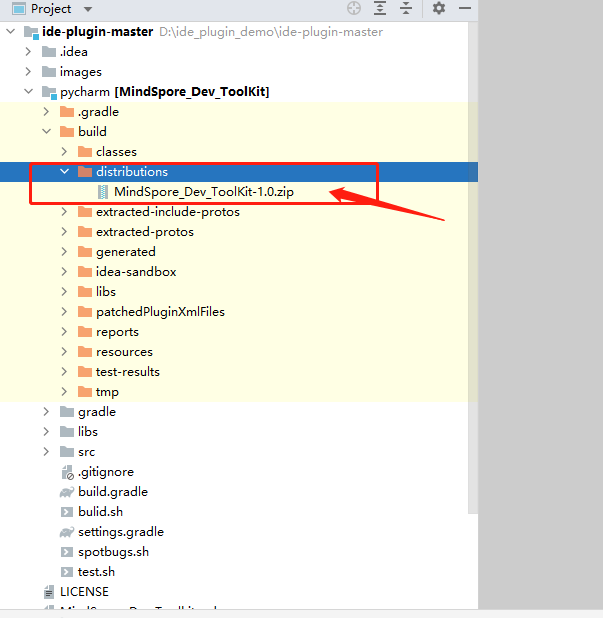

## References

* This project is built based on section [Building Plugins with Gradle](https://plugins.jetbrains.com/docs/intellij/gradle-build-system.html) in *IntelliJ Platform Plugin SDK*. For details about advanced functions such as debugging, see the official document.
