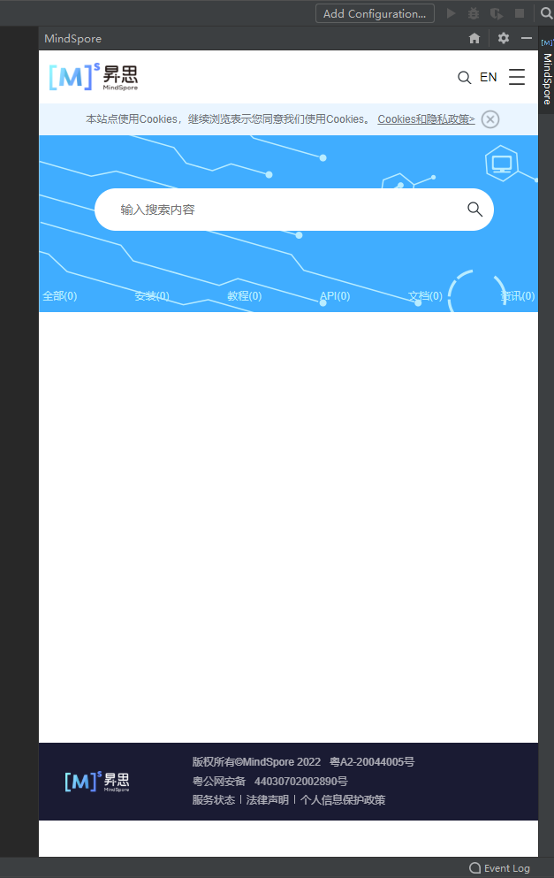
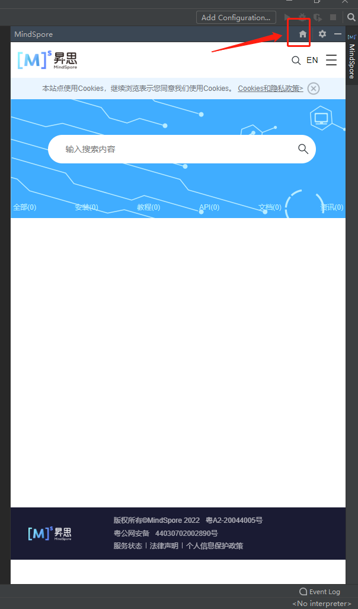

# Document Search

## Functions

* Recommendation: It provides exact search results based on user habits.
* It provides immersive document search experience to avoid switching between the IDE and browser. It resides on the sidebar to adapt to the page layout.

## Procedure

1. Click the sidebar to display the search page.

   

2. Enter **API Mapping** and click the search icon to view the result.

   

3. Click the home icon to return to the search page.

   
