# Creating a Project

## Background

This function is implemented based on the [conda](https://conda.io). Conda is a package management and environment management system. It is one of the recommended installation modes for MindSpore.

## Functions

* It creates a conda environment or selects an existing conda environment, and installs the MindSpore binary package in the conda environment.
* It deploys the best practice template. In addition to testing whether the environment is successfully installed, it also provides a tutorial for MindSpore beginners.
* When the network condition is good, the environment can be installed within 10 minutes and you can experience MindSpore immediately. It reduces up to 80% environment configuration time for beginners.

## Procedure

1. Choose **File** > **New Project**.

    

2. Select **MindSpore**.

    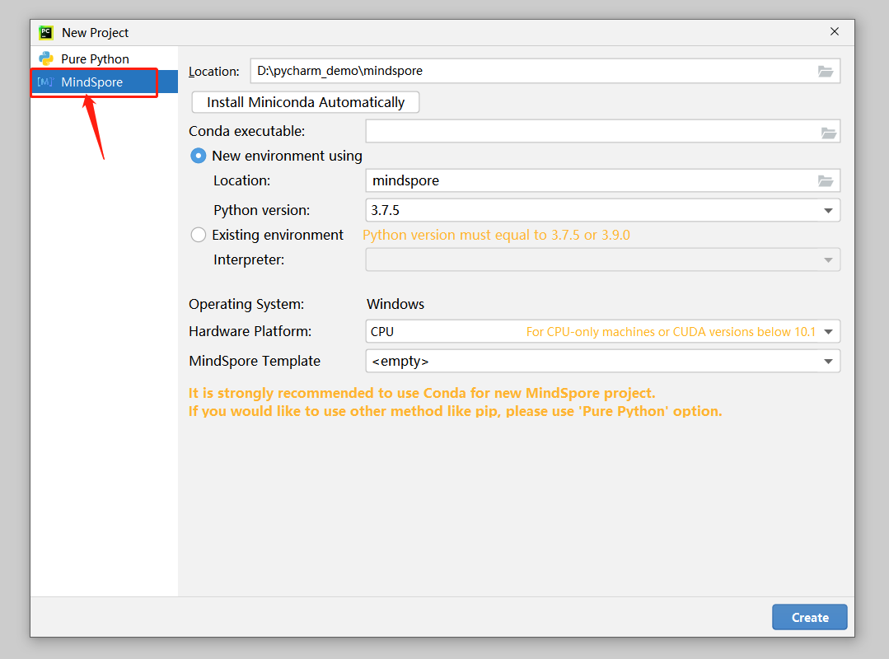

3. Download and install Miniconda. ***If conda has been installed, skip this step.***

    3.1 Click **Install Miniconda Automatically**.

      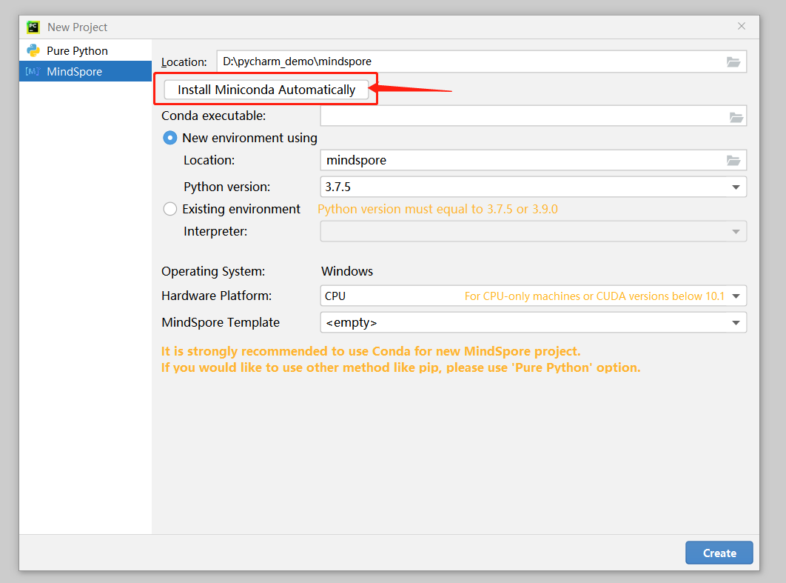

    3.2 Select an installation folder. **You are advised to use the default path to install conda.**

      

    3.3 Click **Install**.

      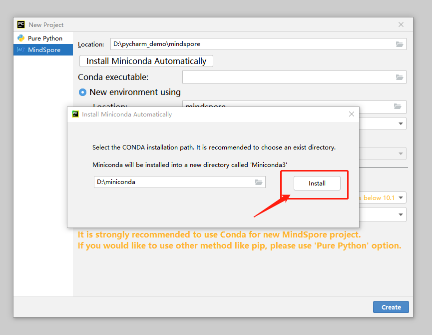

      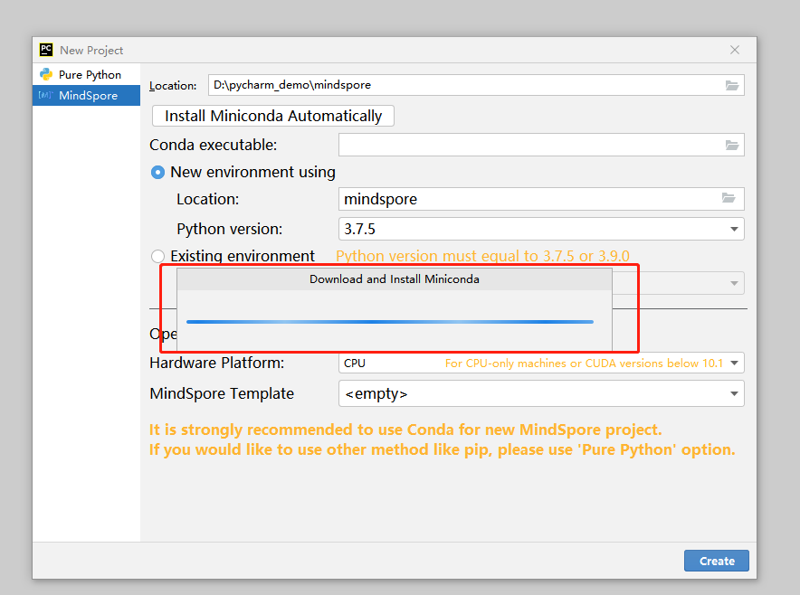

    3.4 Wait for the installation to complete.

      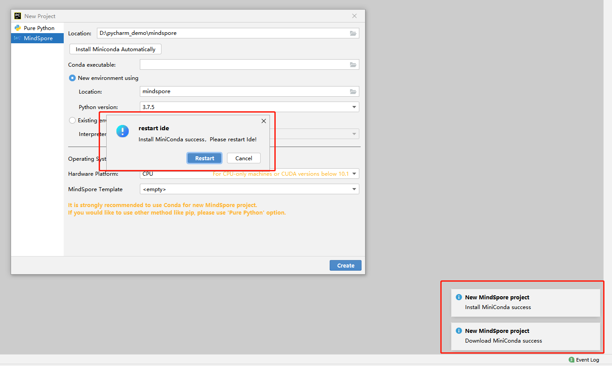

    3.5 Restart PyCharm as prompted or restart PyCharm later. **Note: The following steps can be performed only after PyCharm is restarted.**

      

4. If **Conda executable** is not automatically filled, select the path of the installed conda.

    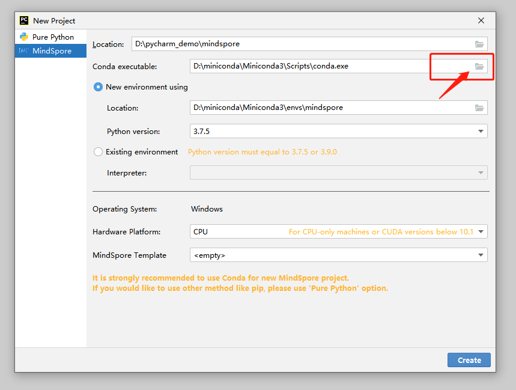

5. Create a conda environment or select an existing conda environment.

    * Create a conda environment. **You are advised to use the default path to create the conda environment. Due to PyCharm restrictions on Linux, you can only select the default directory.**

      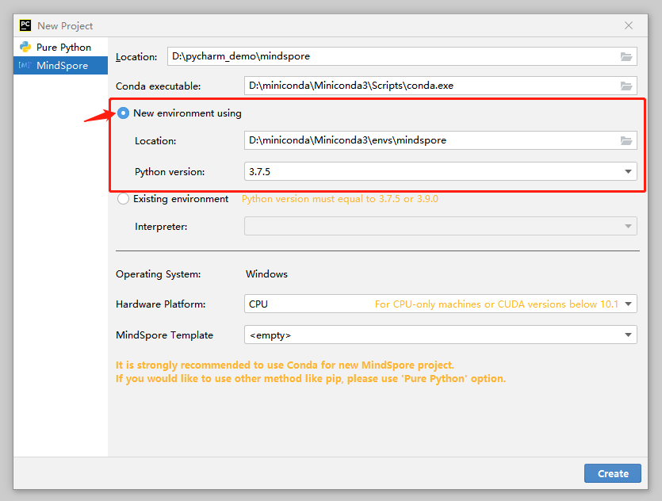

    * Select an existing conda environment in PyCharm.

      

6. Select a hardware environment and a MindSpore best practice template.

    6.1 Select a hardware environment.

      

    6.2 Select a best practice template. The best practice template provides some sample projects for beginners to get familiar with MindSpore. The best practice template can be run directly.

      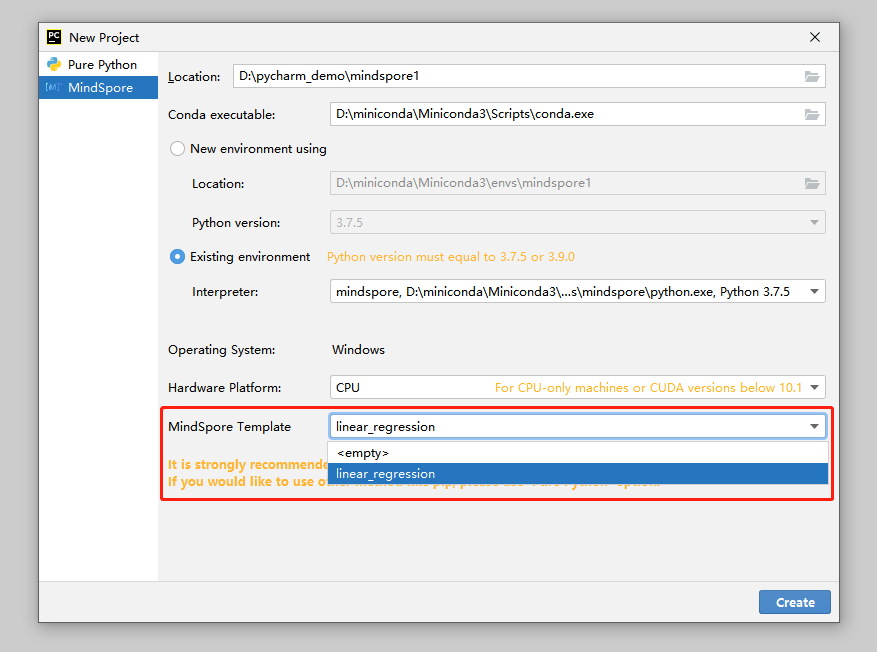

7. Click **Create** to create a project and wait until MindSpore is successfully downloaded and installed.

    7.1 Click **Create** to create a MindSpore project.

      

    7.2 The conda environment is being created.

      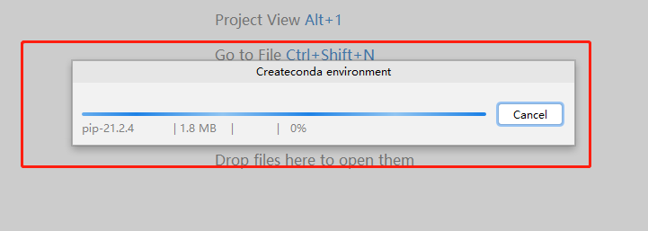

    7.3 MindSpore is being configured through conda.

      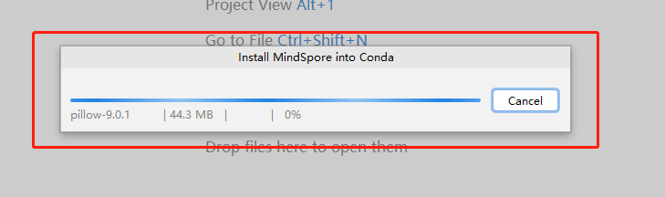

8. Wait till the MindSpore project is created.

    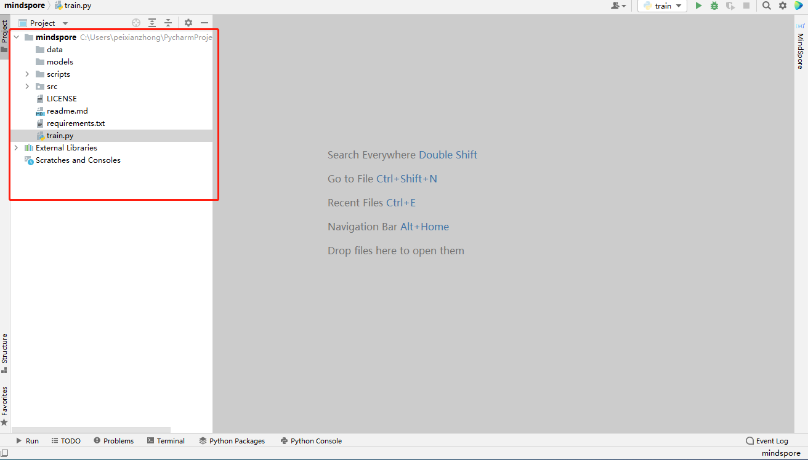

9. Check whether the MindSpore project is successfully created.

    * Click **Terminal**, enter **python -c "import mindspore;mindspore.run_check()"**, and check the output.  If the version number shown in the following figure is displayed, the MindSpore environment is available.

      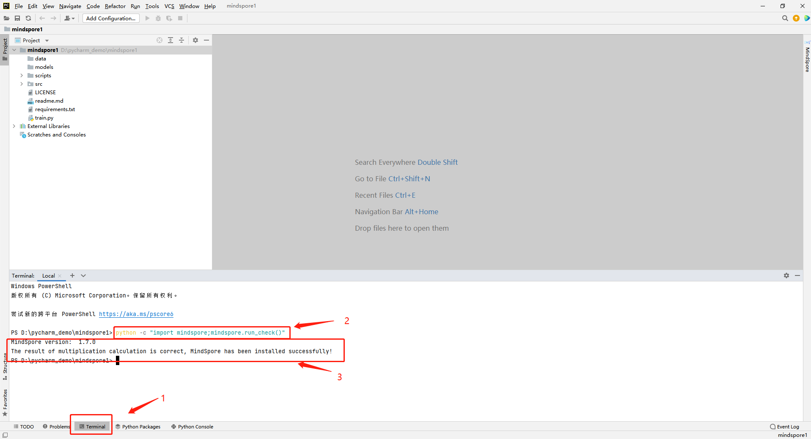

    * If you select a best practice template, you can run the best practice to test the MindSpore environment.

      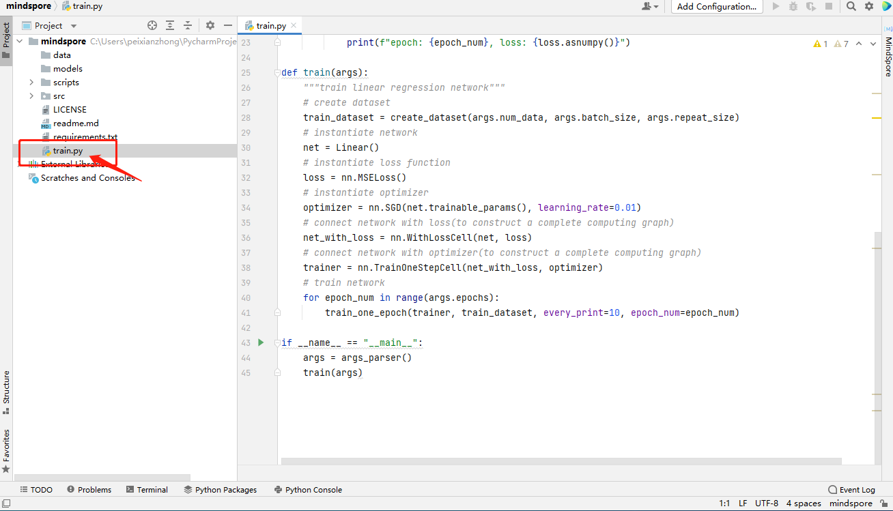

      

      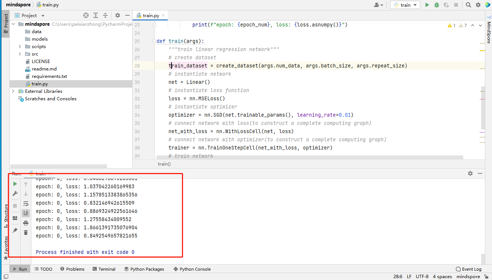
