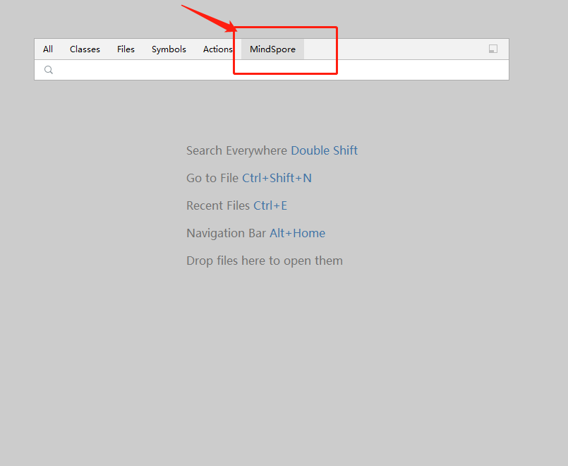
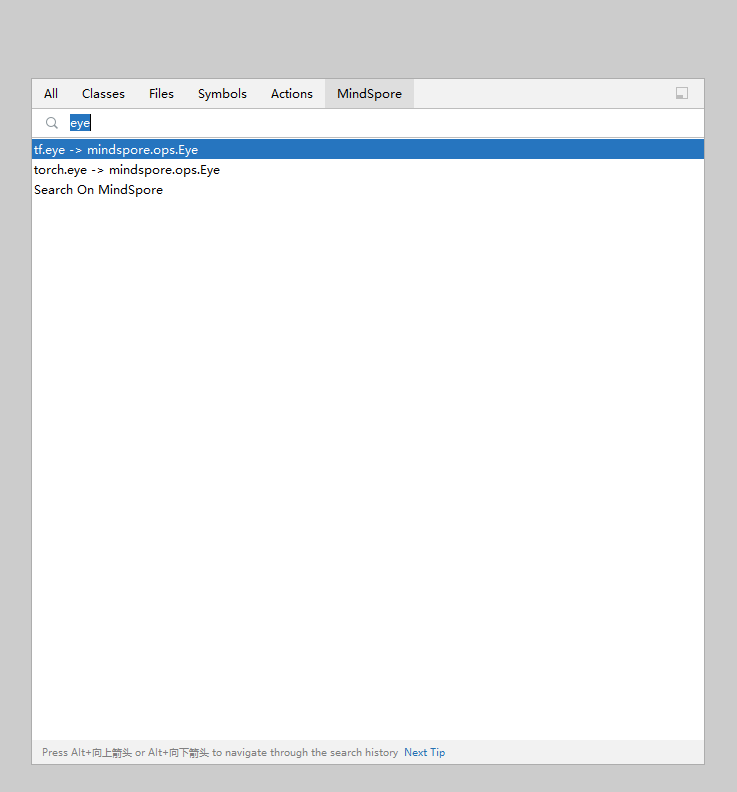

# Operator Search

## Functions

* You can quickly search for MindSpore operators and view operator details in the sidebar.
* If you use other machine learning frameworks, you can search for operators of other mainstream frameworks to match MindSpore operators.

## Procedure

1. Press **Shift** twice. The global search page is displayed.

   

2. Click **MindSpore**.

   

3. Search for a PyTorch or TensorFlow operator to obtain the mapping between the PyTorch or TensorFlow operator and the MindSpore operator.

   

   

4. Click an item in the list to view its official document in the sidebar.

   
