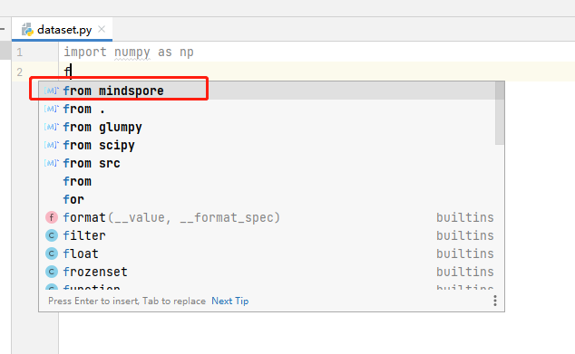
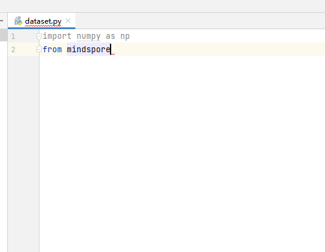
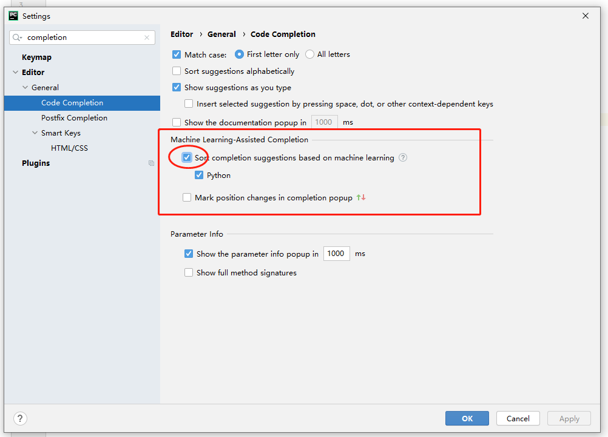
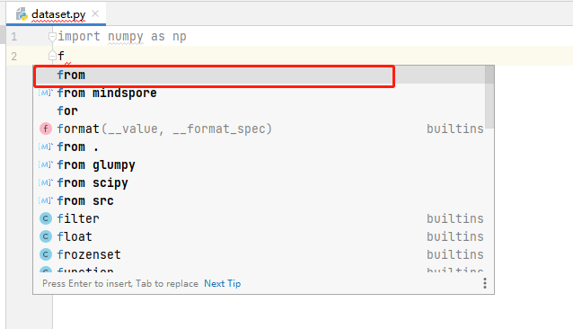

# Code Completion

## Functions

* It completes code based on AI for the MindSpore project.
* You can easily develop MindSpore without installing the MindSpore environment.

## Procedure

1. Open a Python file and write code.

   

2. During encoding, the code completion function is enabled automatically. Code lines with the "MindSpore" identifier are automatically completed by MindSpore Dev Toolkit.

   

   

## Description

1. In versions later than PyCharm 2021, the completed code will be rearranged based on machine learning. This behavior may cause the plug-in's completed code to be displayed with lower priority. You can disable this function in **Settings** and use MindSpore Dev Toolkit to sort code.

   

2. Comparison before and after this function is disabled.

    * Function disabled

      

    * Function enabled

      
