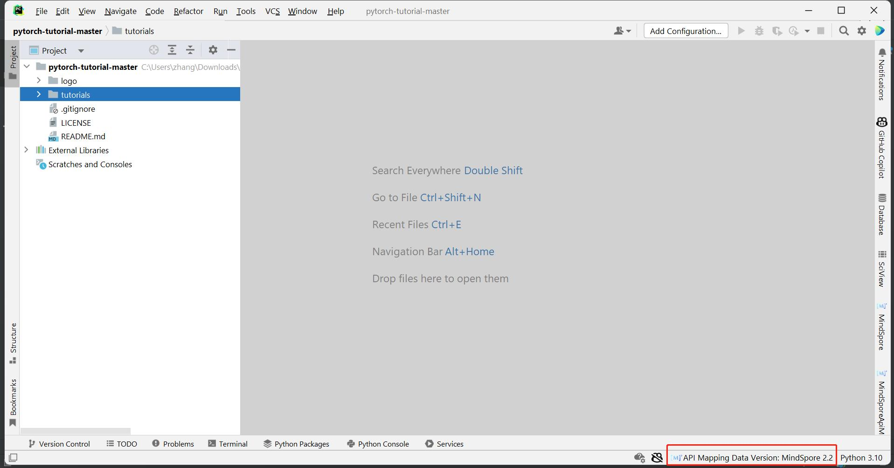
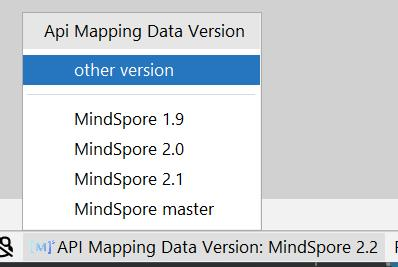
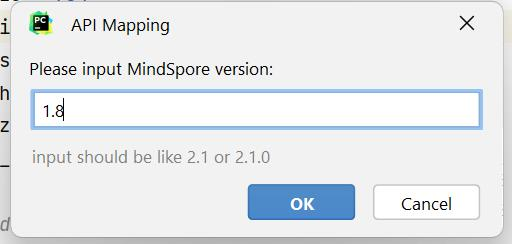
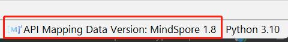
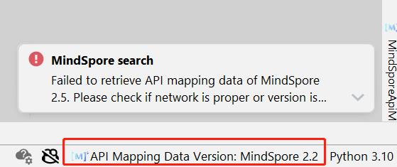
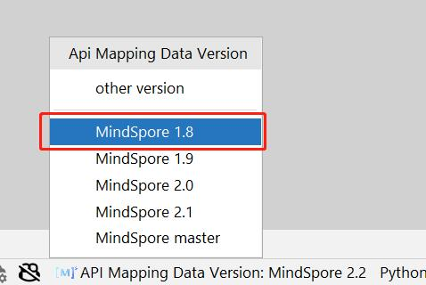

# API映射 - API版本切换

## 简介

API 映射指PyTorch API与MindSpore API的映射关系。
在MindSpore Dev Toolkit中，提供了API映射搜索和API映射扫描两大功能，且用户可以自由切换API映射数据的版本。

## API映射数据版本切换

1. 插件启动时，默认使用与插件目前版本相同的API映射数据版本。API映射数据版本在右下显示，此版本号仅影响本章节的API映射功能，不会改变环境中的MindSpore版本。

   

2. 点击API映射数据版本，弹出选择列表。可以选择点击预设版本切换至其他版本，也可以选择"other version"输入其他版本号尝试切换。

   

3. 点击任意版本号，开始切换版本。下方有动画提示正在切换的状态。

   

4. 若想自定义输入版本号，在选择列表中选择"other version"的选项，在弹框中输入版本号，点击ok开始切换版本。注：请按照2.1或2.1.0的格式输入版本号，否则点击ok键会没有反应。

   

5. 若切换成功，右下状态栏展示切换后的API映射数据版本信息。

   

6. 若切换失败，右下状态栏展示切换前的API映射数据版本信息。版本号不存在、网络错误会导致切换失败，请排查后再次尝试。如需查看最新文档，可以切换到master版本。

   

7. 当自定义输入的版本号切换成功后，此版本号会加入到版本列表中展示。

   

