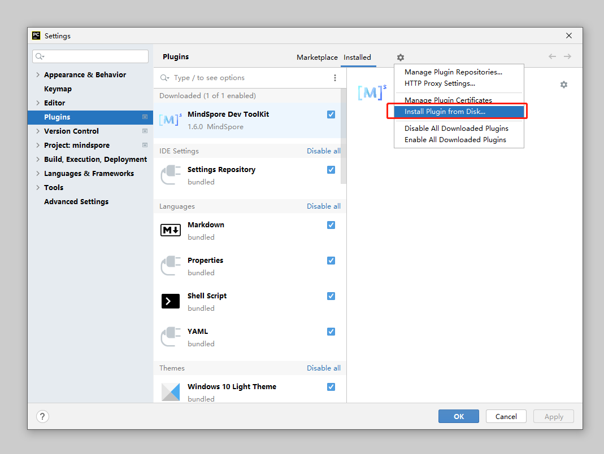

# PyCharm 插件安装

## 安装步骤

1. 获取[插件Zip包](https://ms-release.obs.cn-north-4.myhuaweicloud.com/2.1.0/IdePlugin/any/MindSpore_Dev_ToolKit-2.1.0.zip)。
2. 启动Pycharm，单击左上菜单栏，选择File->Settings->Plugins->Install Plugin from Disk。
   如图：

   

3. 选择插件zip包。