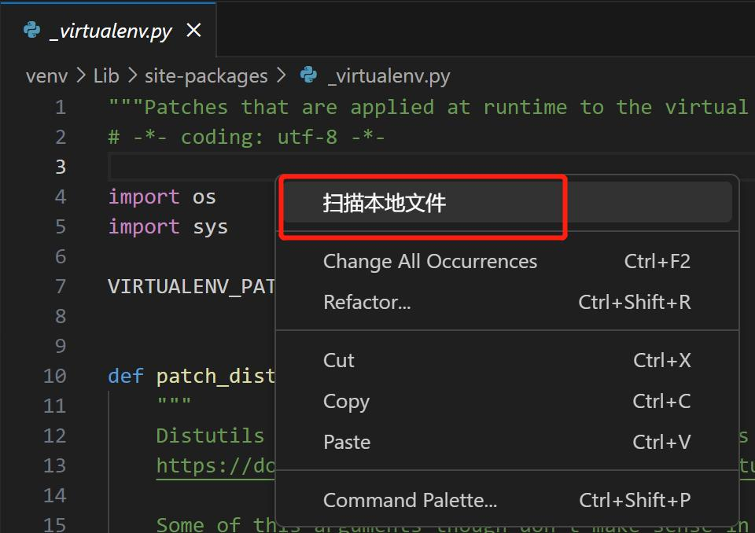
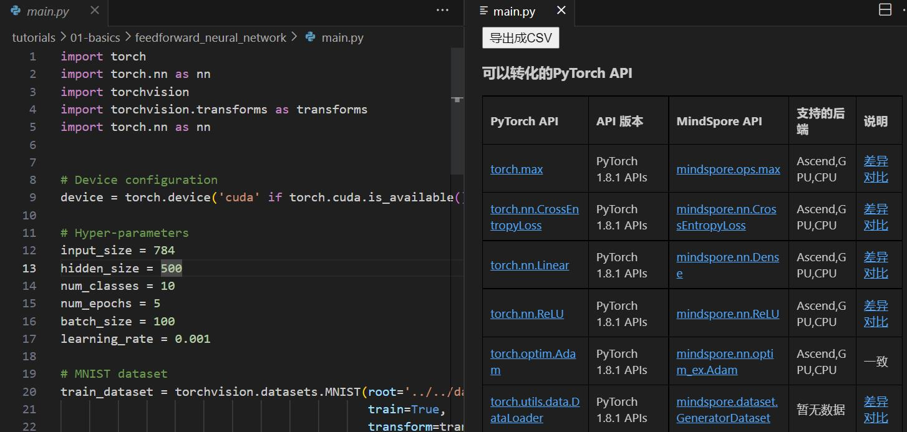
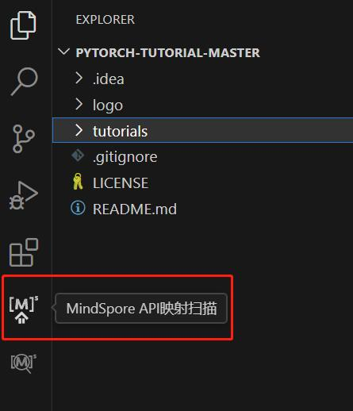
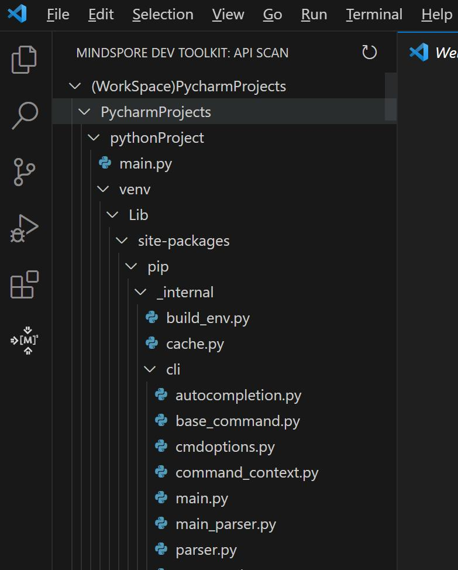
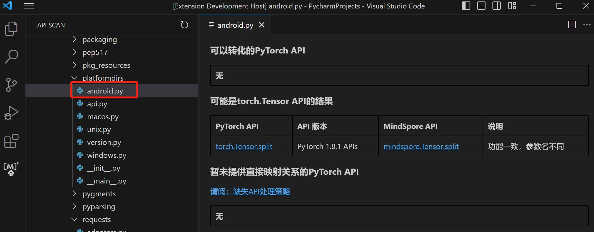
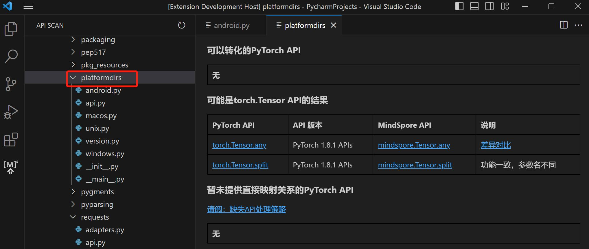
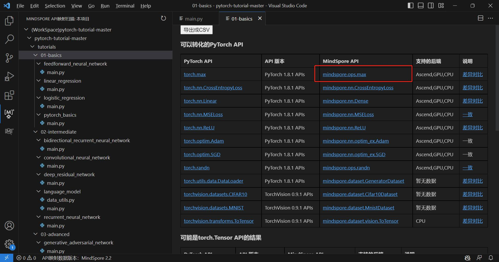
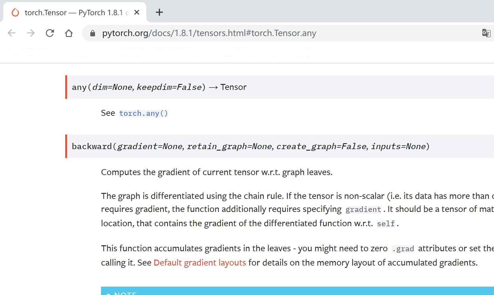

# API扫描

## 单文件分析

1. 在打开的Python文件编辑界面点击右键，选择“扫描本地文件”。

   

2. 以下图为例，扫描后，生成该文件中torch.Tensor接口使用分析结果，包括“可以转化的PyTorch API”、“可能是torch.Tensor API的结果”、
   “暂未提供直接映射关系的PyTorch API”三种分析结果。

   其中：

   - "可以转换的PyTorch API"指在文件中被使用的且可以转换为MindSpore API的PyTorch API
   - "可能是torch.Tensor API"指名字和torch.Tensor的API名字相同，可能是torch.Tensor的API且可以转换为MindSpore API的API
   - "暂未提供直接映射关系的PyTorch API"指虽然是PyTorch API或可能是torch.Tensor的API，但是暂时没有直接对应为MindSpore API的API

   

## 多文件分析

1. 点击左侧边栏MindSpore Dev Toolkit图标。

   

2. 在左侧生成当前IDE工程中仅含Python文件的工程树视图。

   

3. 若选中Python文件，可获取该文件的接口分析结果。

   

4. 若选中文件目录，可获取该目录下所有Python文件的接口分析结果。

   

5. 蓝色字体部分均可以点击，会自动在用户默认浏览器中打开网页。

   

   