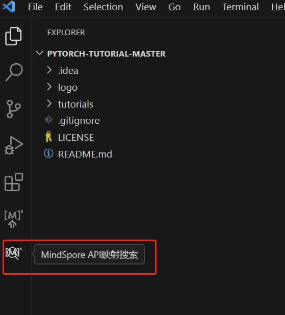
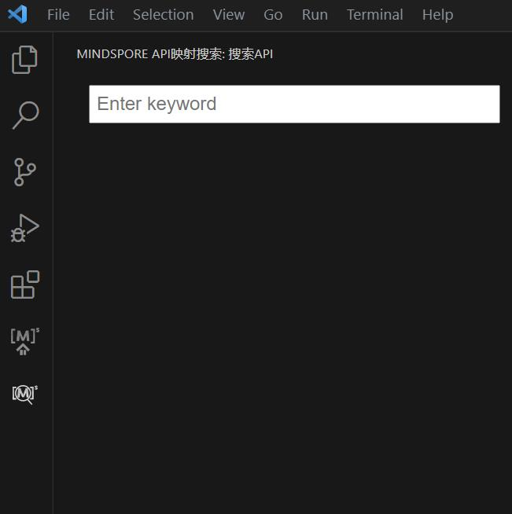
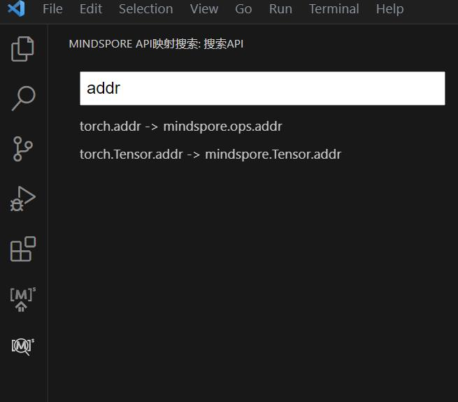
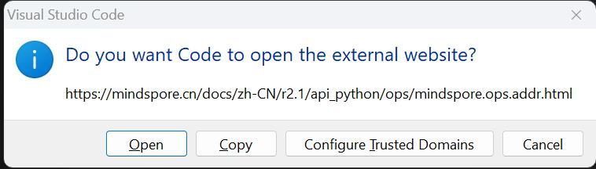
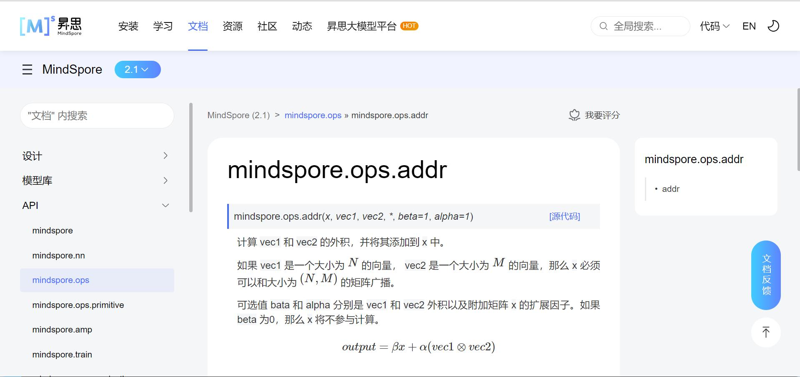

# API映射 - API搜索

## 功能介绍

* 快速搜索MindSpore API，在侧边栏直接展示API详情。
* 为方便其他机器学习框架用户，通过搜索其他主流框架API，联想匹配对应MindSpore API。
* API映射的数据版本支持切换，详情请参考[API映射-版本切换](https://www.mindspore.cn/devtoolkit/docs/zh-CN/master/VSCode_change_version.html)章节。

## 使用步骤

1. 点击Visual Studio Code左侧边栏MindSpore API映射搜索图标。

   

2. 左侧边栏会生成一个输入框。

   

3. 在输入框中输入任意单词，下方会展示出当前关键词的搜索结果，且搜索结果根据输入内容实时更新。

   

4. 点击任意搜索结果，会在用户默认浏览器中打开网页。

   

   
