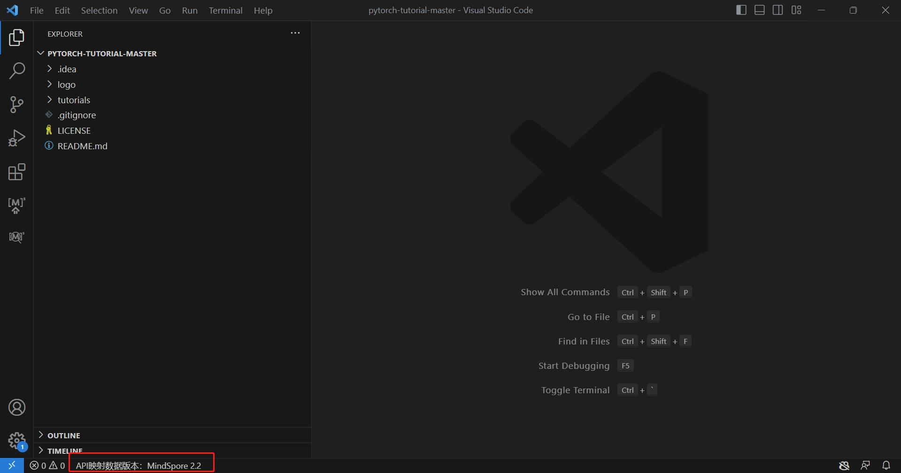
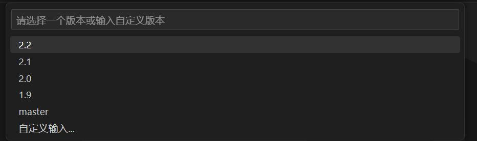
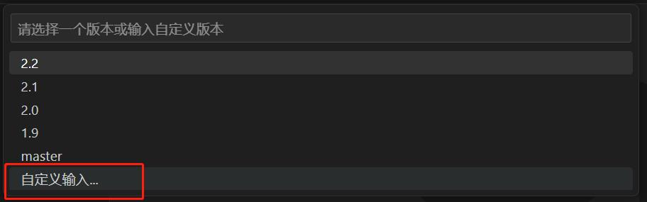
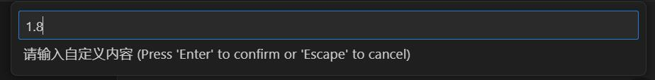
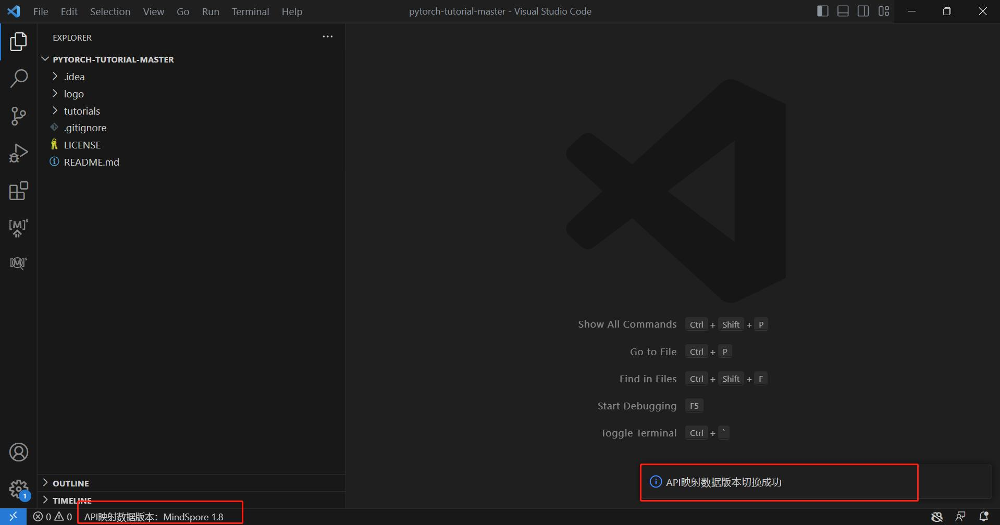
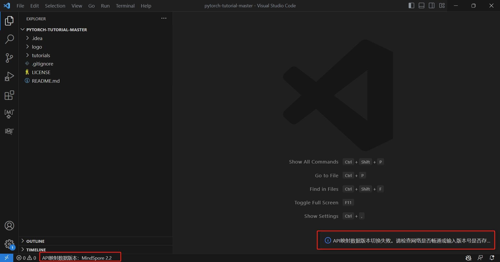
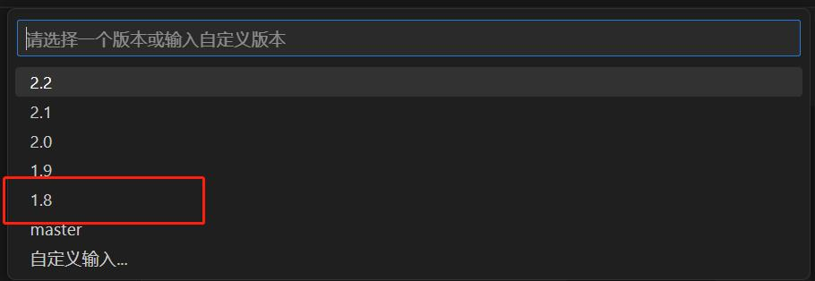

# API映射 - 版本切换

## 简介

API 映射指PyTorch API与MindSpore API的映射关系。在MindSpore Dev Toolkit中，提供了API映射搜索和API映射扫描两大功能，且用户可以自由切换API映射数据的版本。

## API映射数据版本切换

1. 不同版本的API映射数据会导致不同的API映射扫描和API映射搜索结果，但不会影响环境中的MindSpore版本。默认版本与插件版本一致，版本信息会展示在左下角状态栏。

   

2. 点击此状态栏，页面上方会弹出下拉框，包含了默认可以切换的版本号选项。用户可以点击任意版本号切换版本，或者点击”自定义输入“的选项以后，在再次弹出的输入框中输入其他版本号切换版本。

   

3. 点击任意版本号，开始切换版本，左下角状态栏提示版本切换中的状态

   

4. 若想自定义输入版本号，在下拉框时点击“自定义输入”的选项，下拉框转变为输入框，按照2.1或2.1.0的格式输入版本号，按回车键开始切换版本，左下角状态栏提示切换中的状态

   

   

5. 若切换成功，右下角信息提示切换成功，左下角状态栏展示切换后的API映射数据版本信息。

   

6. 若切换失败，右下角信息提示切换失败，左下角状态栏展示切换前的API映射数据版本信息。版本号不存在、网络错误会导致切换失败，请排查后再次尝试。如需查看最新文档，可以切换到master版本。

   

7. 当自定义输入的版本号切换成功后，此版本号会加入到下拉框中展示。

   