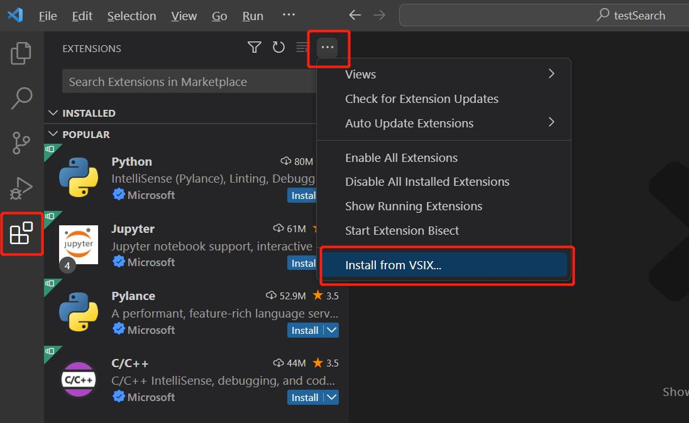
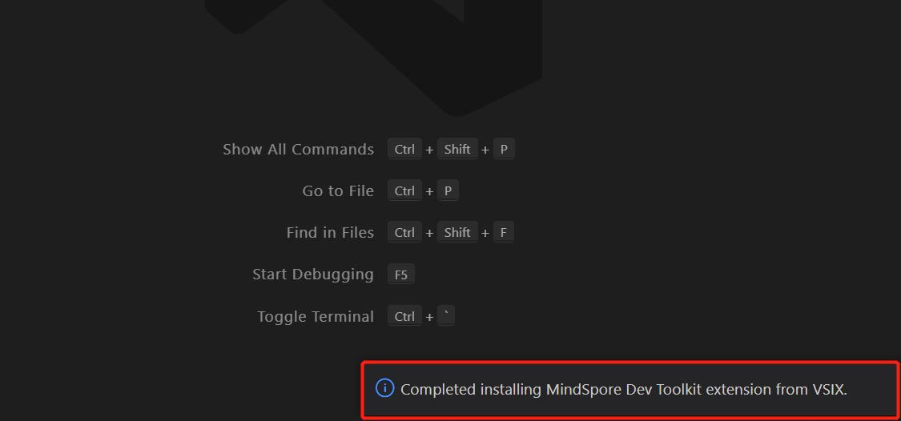

# Visual Studio Code 插件安装

## 安装步骤

1. 获取[插件vsix包](https://ms-release.obs.cn-north-4.myhuaweicloud.com/2.1.0/IdePlugin/any/mindspore-dev-toolkit-2.1.0.vsix)。
2. 点击左侧第五个按钮“Extensions”，点击右上角三个点，再点击“Install from VSIX...”

   

3. 从文件夹中选择下载好的vsix文件，插件自动开始安装。右下角提示"Completed installing MindSpore Dev Toolkit extension from VSIX"，则插件安装成功。

   

4. 点击左边栏的刷新按钮，能看到”INSTALLED“目录中有”MindSpore Dev Toolkit"插件，至此插件安装成功。

   