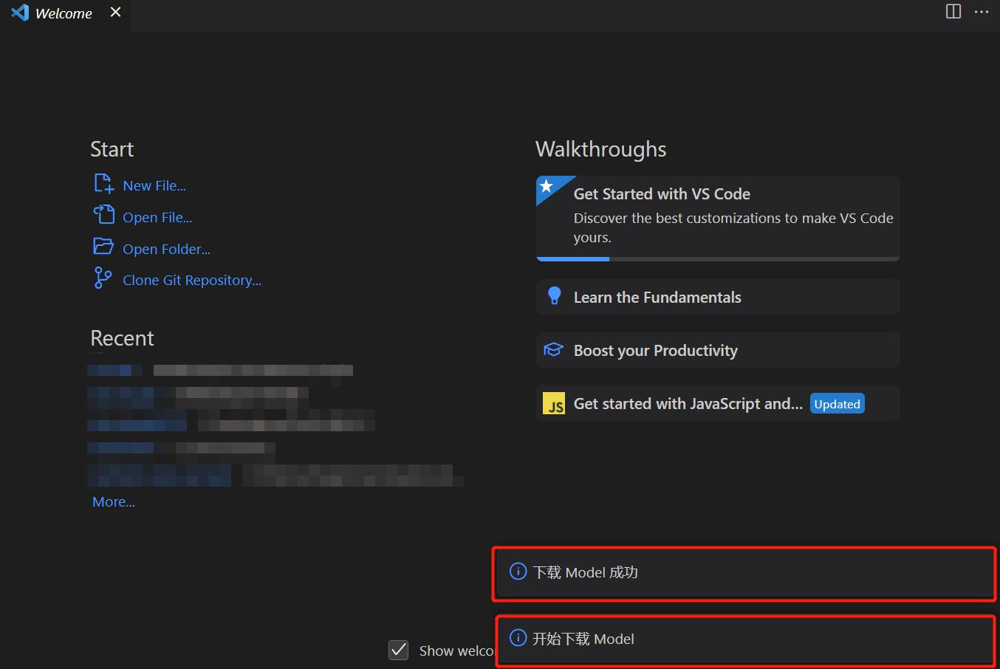
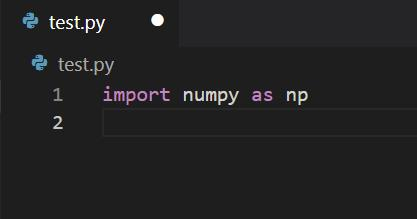
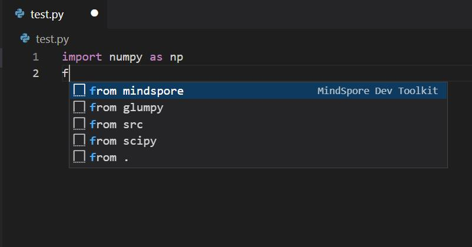

# 代码补全

## 功能介绍

* 提供基于MindSpore项目的AI代码补全。
* 无需安装MindSpore环境，也可轻松开发MindSpore。

## 使用步骤

1. 第一次安装或使用插件时，会自动下载模型，右下角出现"开始下载Model"，"下载Model成功"提示则表示模型下载且启动成功。若网速较慢，模型需要花费十余分钟下载。下载完成后才会出现"下载Model成功"的字样。若非第一次使用，将不会出现提示。

   

2. 打开Python文件编写代码。

   

3. 编码时，补全会自动生效。有MindSpore Dev Toolkit后缀名称的为此插件智能补全提供的代码。

   