# API映射 - API扫描

## 功能介绍

* 快速扫描代码中出现的API，在侧边栏直接展示API详情。
* 为方便其他机器学习框架用户，通过扫描代码中出现的主流框架API，联想匹配对应MindSpore API。
* API映射的数据版本支持切换，详情请参考[API映射-版本切换](https://www.mindspore.cn/devtoolkit/docs/zh-CN/master/PyCharm_change_version.html)章节。

## 使用步骤

### 文件级别API扫描

1. 在当前文件任意位置处点击鼠标右键，打开菜单，点击菜单最上方的"API scan"。

   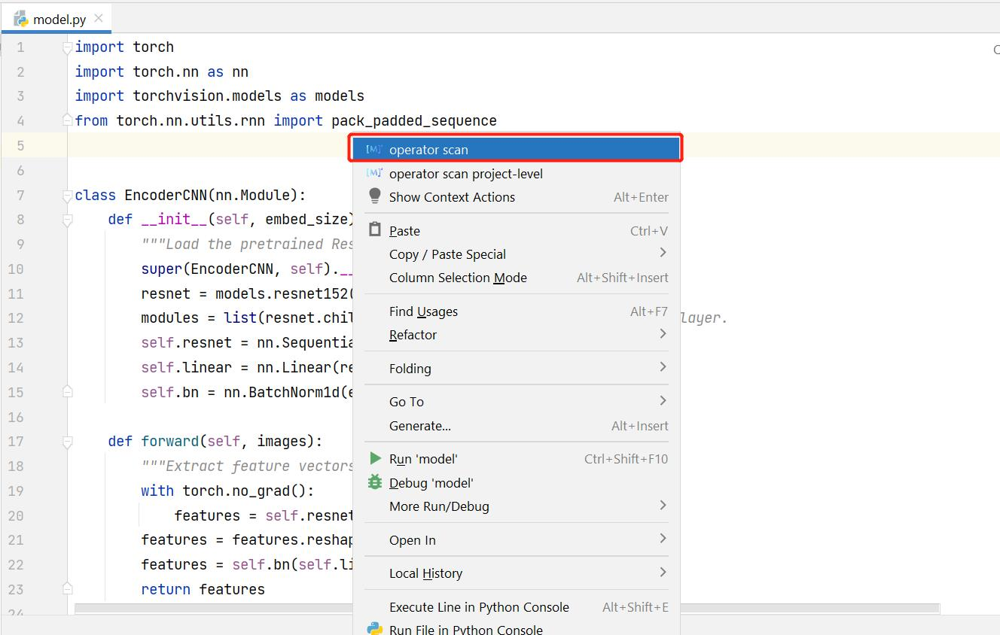

2. 右边栏会自动弹出，展示扫描出的API，并展示包含名称，网址等信息的详细列表。若本文件中未扫描到API，则不会弹出窗口。

    其中：

    * "可以转换为MindSpore API的PyTorch/TensorFlow API"指在文件中被使用的且可以转换为MindSpore API的PyTorch或TensorFlow API
    * "暂时不能转换的API"指虽然是PyTorch或TensorFlow API的API，但是暂时没有直接对应为MindSpore API的API
    * "可能是PyTorch/TensorFlow API的情况"指因为链式调用的原因，有可能是PyTorch或TensorFlow的API的可转换情况
    * TensorFlow API扫描是实验性功能

   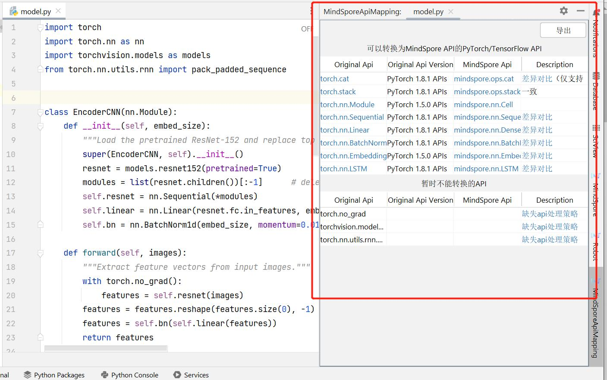

3. 蓝色字体的部分均可以点击，会自动在上方再打开一栏，展示网页。

   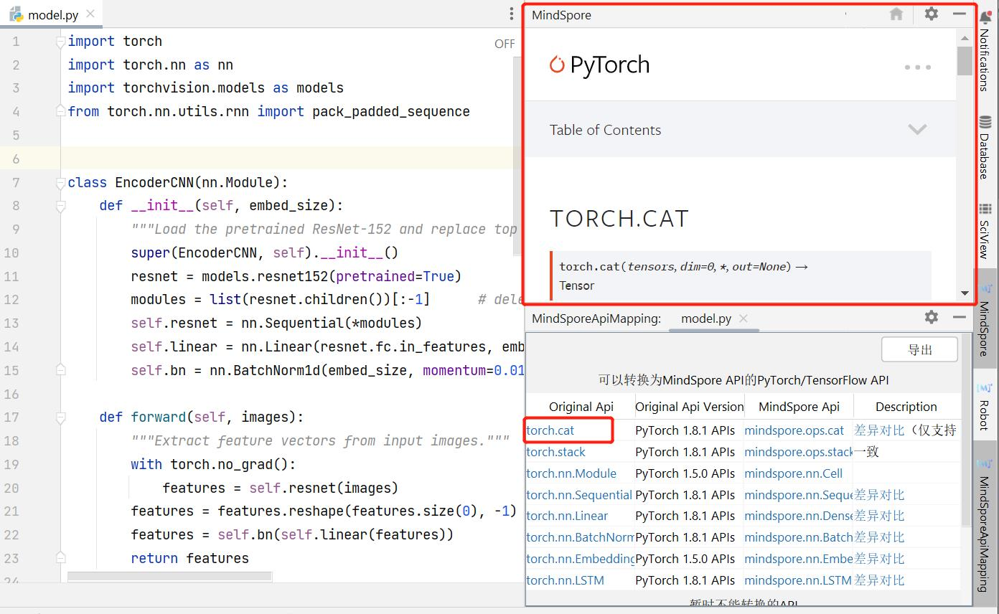

4. 点击右上角"导出"按钮，可将内容导出到csv表格。

   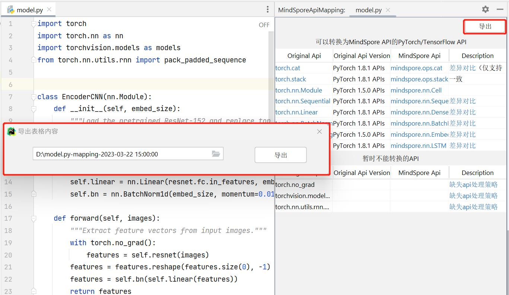

### 项目级别API扫描

1. 在当前文件任意位置处点击鼠标右键，打开菜单，点击菜单上方第二个"API scan project-level"，或在上方工具栏选择"Tools"，再选择"API scan project-level"。

   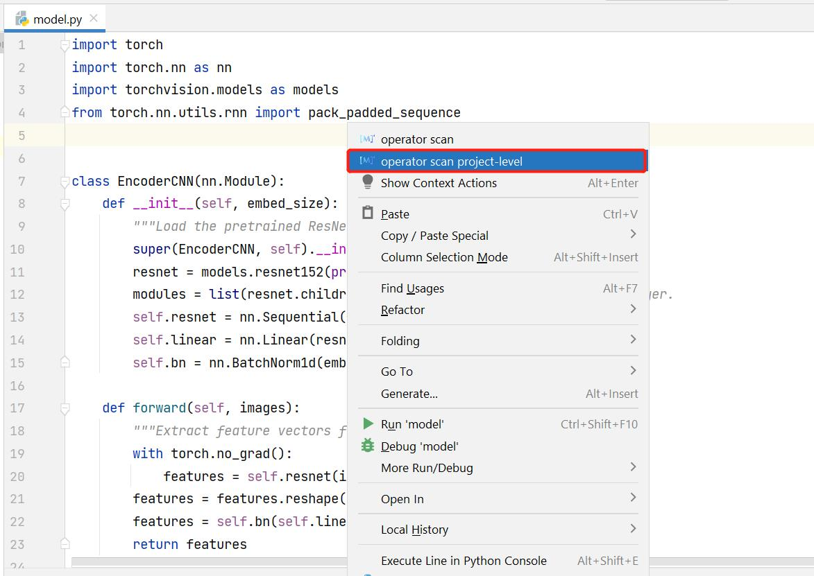

   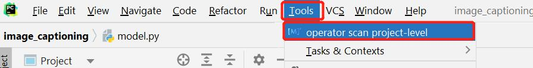

2. 右边栏会弹出整个项目中扫描出的API，并展示包含名称，网址等信息的详细列表。

   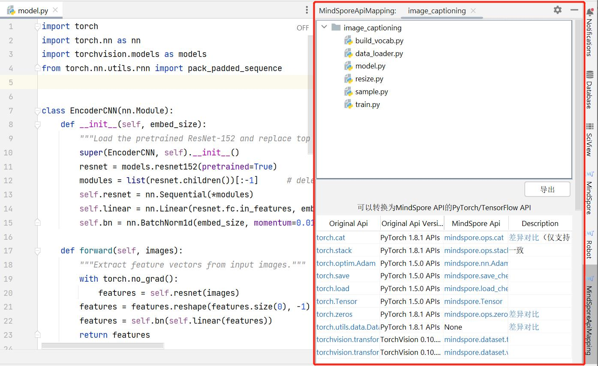

3. 在上方框中可以选择单个文件，下方框中将单独展示此文件中的API，文件选择可以随意切换。

   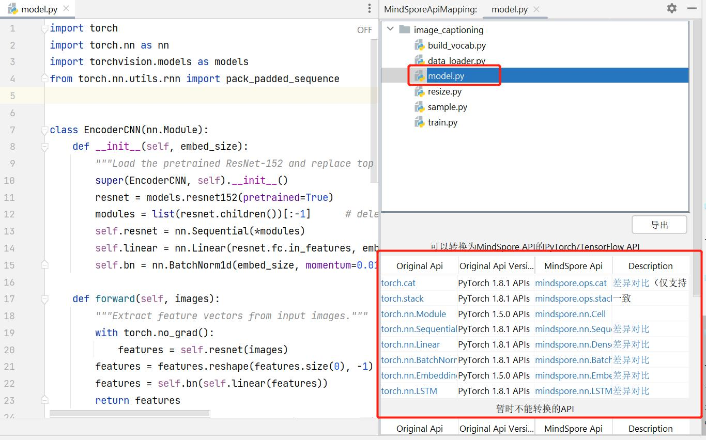

   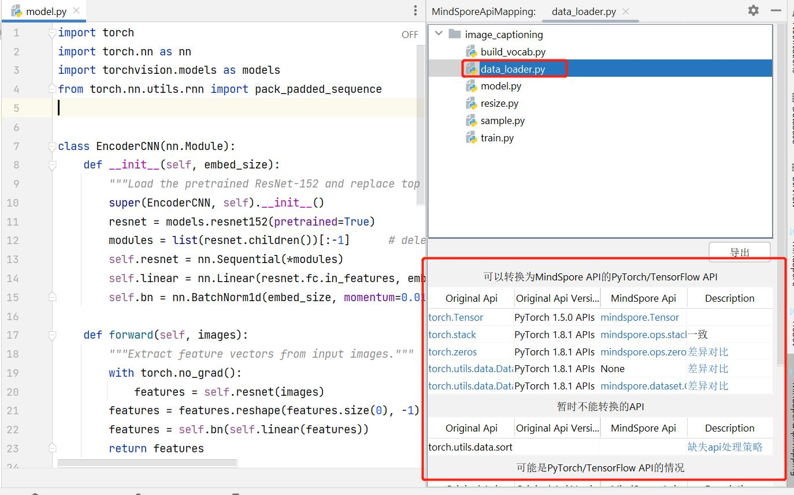

4. 蓝色字体部分均可以点击，会自动在上方再打开一栏，展示网页。

   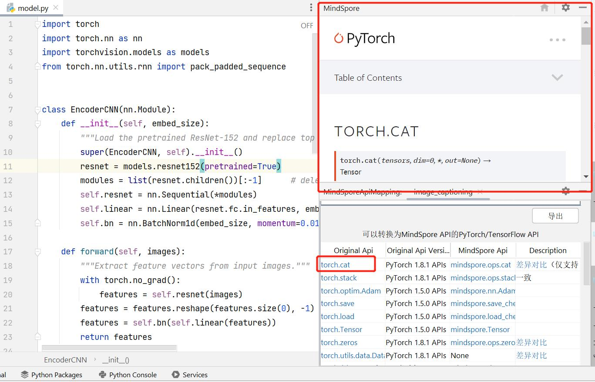

5. 点击"导出"按钮，可将内容导出到csv表格。

   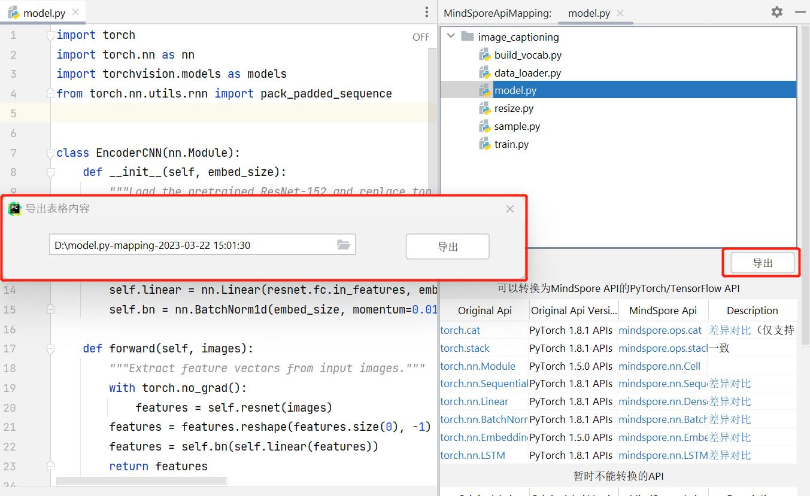
