# 创建项目

## 技术背景

本功能的实现基于[conda](https://conda.io)。Conda是一个包管理和环境管理系统，是MindSpore推荐的安装方式之一。

## 功能介绍

* 创建conda环境或选择已有conda环境，并安装MindSpore二进制包至conda环境。
* 部署最佳实践模版。不仅可以测试环境是否安装成功，对新用户也提供了一个MindSpore的入门介绍。
* 在网络状况良好时，10分钟之内即可完成环境安装，开始体验MindSpore。最大可节约新用户80%的环境配置时间。

## 使用步骤

1. 选择File -> New Project。

    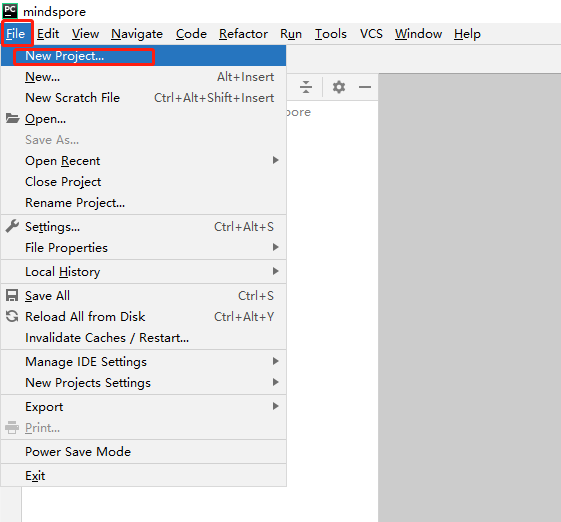

2. 选择MindSpore。

    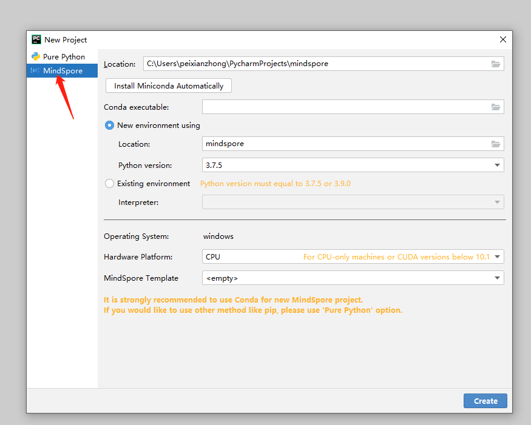

3. Miniconda下载安装。***已经安装过conda的可以跳过此步骤。***

    3.1 点击Install Miniconda Automatically按钮。

      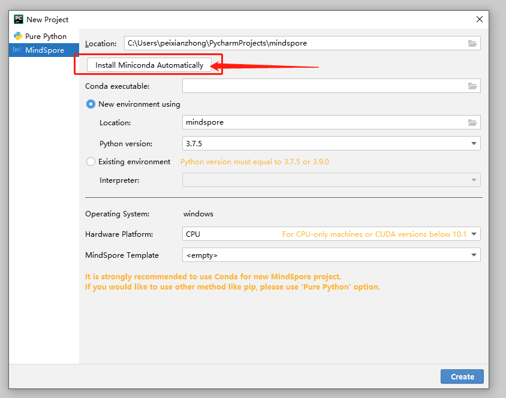

    3.2 选择下载安装文件夹。**建议不修改路径，使用默认路径安装conda。**

      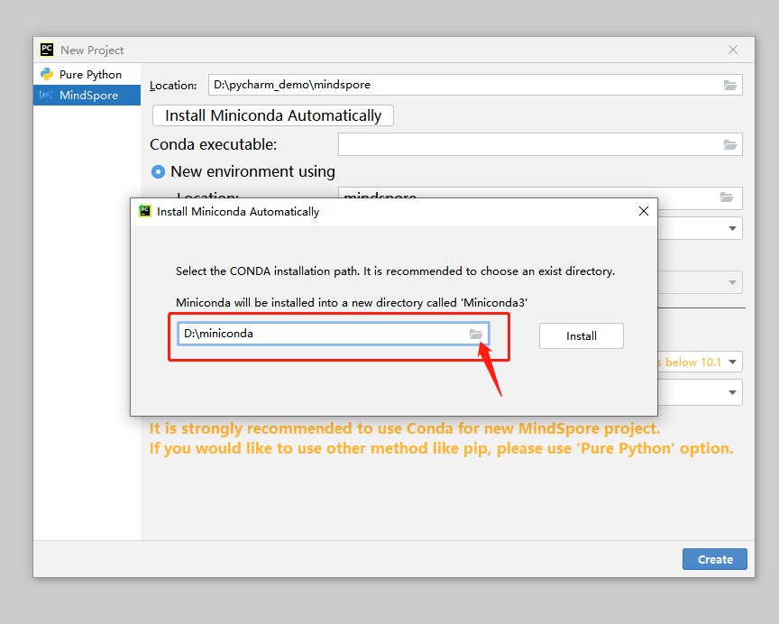

    3.3 点击Install按钮，等待下载安装。

      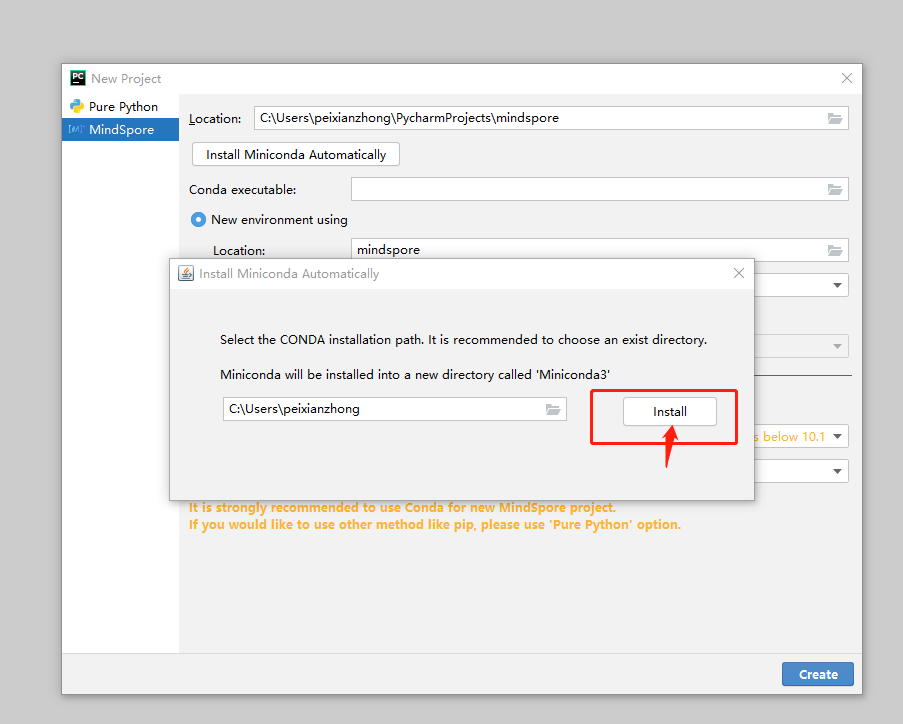

      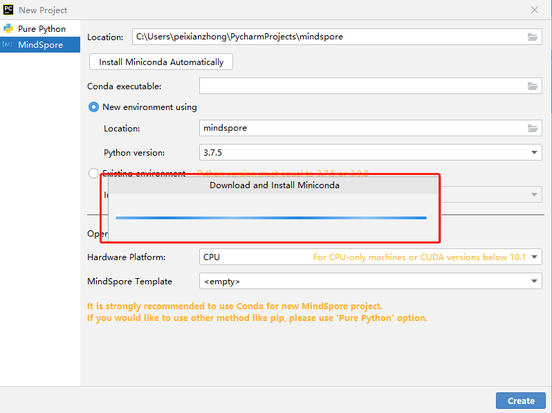

    3.4 Miniconda下载安装完成。

      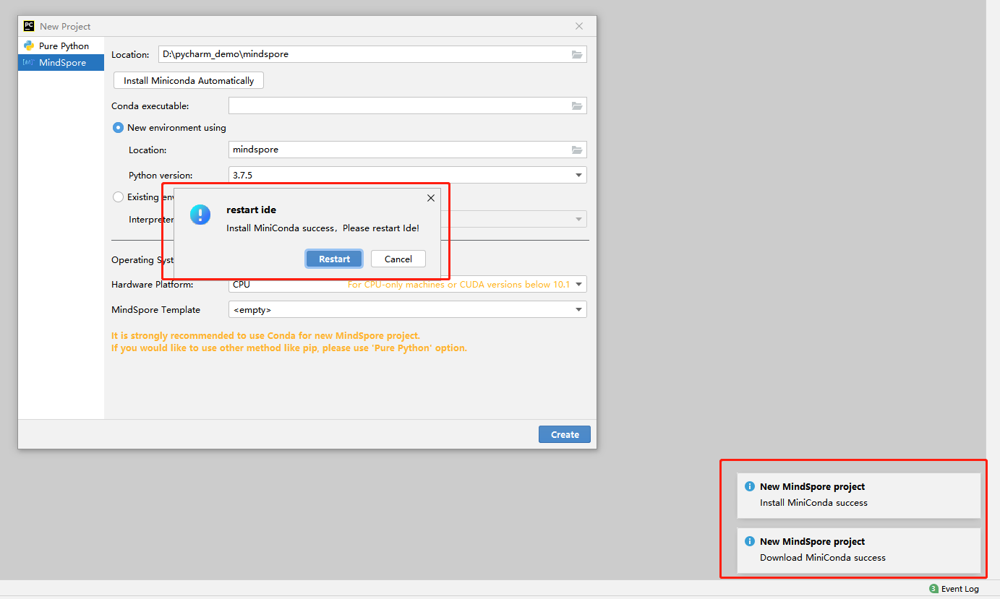

    3.5 根据提示重新启动PyCharm或者稍后自行重新启动PyCharm。***注意：接下来的步骤必须重启PyCharm后方可继续***

      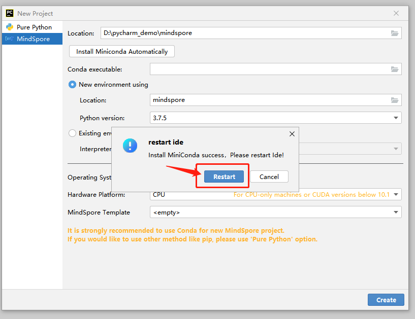

4. 确认Conda executable路径已正确填充。 如果Conda executable没有自动填充，点击文件夹按钮，选择本地已安装的conda的路径。

    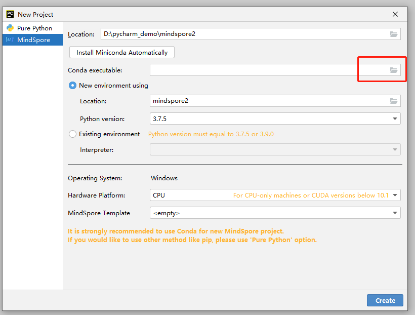

5. 创建或选择已有的conda环境。

    * 创建新的conda环境。 **建议不修改路径，使用默认路径创建conda环境。由于PyCharm限制，Linux系统下暂时无法选择默认目录以外的地址。**

      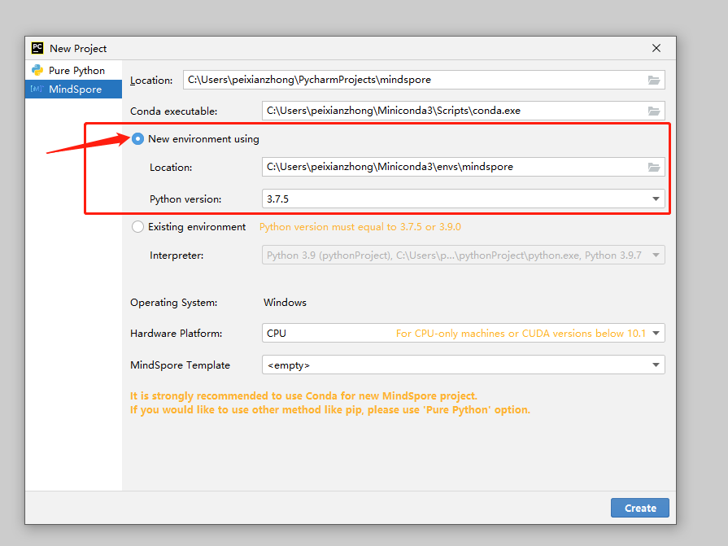

    * 选择PyCharm中已有的conda环境。

      

6. 选择硬件环境和MindSpore项目最佳实践模板。

    6.1 选择硬件环境。

      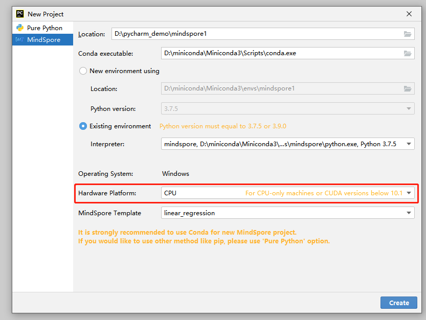

    6.2 选择最佳实践模板。最佳实践模版是MindSpore提供一些样例项目，以供新用户熟悉MindSpore。最佳实践模版可以直接运行。

      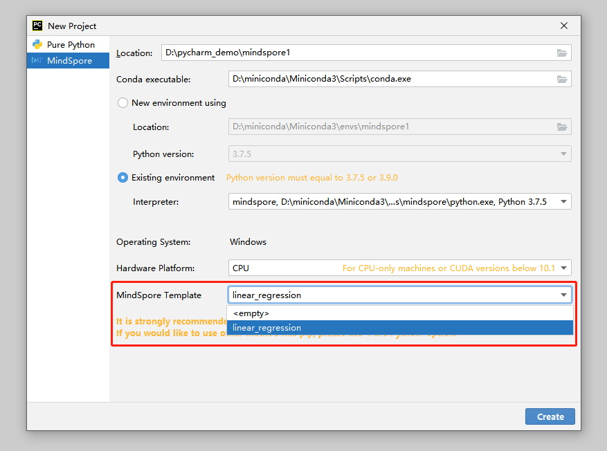

7. 点击Create按钮新建项目，等待MindSpore下载安装成功。

    7.1 点击Create按钮创建MindSpore新项目。

      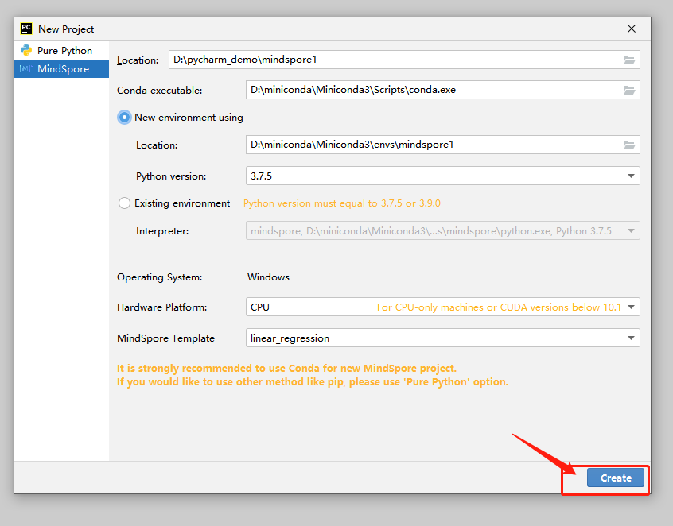

    7.2 正在创建创建conda环境。

      

    7.3 正在通过conda配置MindSpore。

      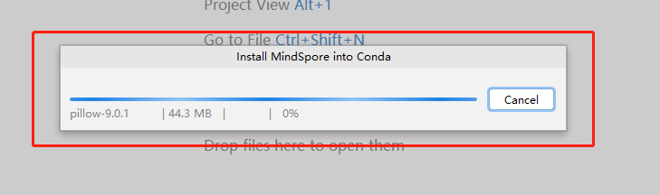

8. 创建MindSpore项目完成。

    

9. 验证MindSpore项目是否创建成功。

    * 点击下方Terminal，输入 python -c "import mindspore;mindspore.run_check()" ，查看输出。  如下图，显示了版本号等，表示MindSpore环境可用。

      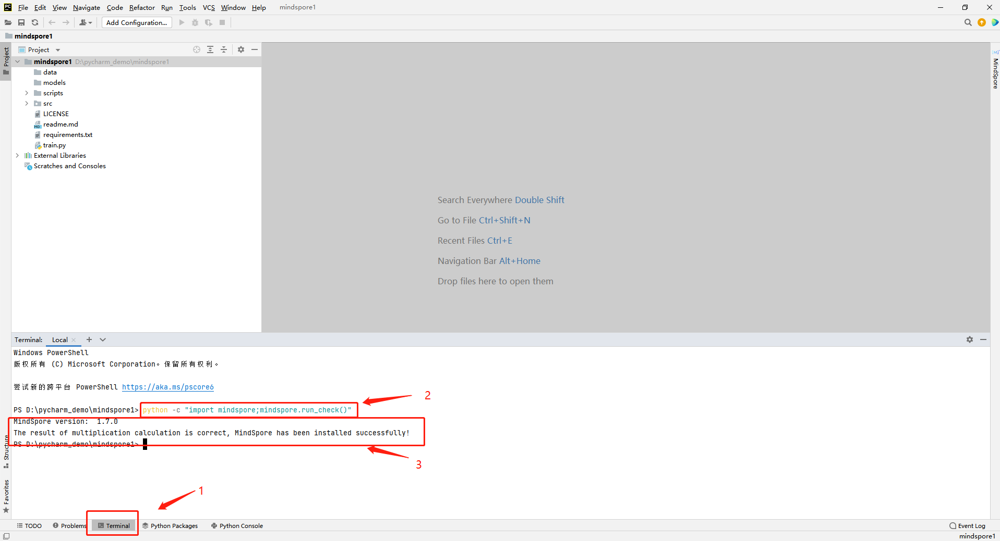

    * 如果选择了最佳实践模版，可以通过运行最佳实践，测试MindSpore环境。

      

      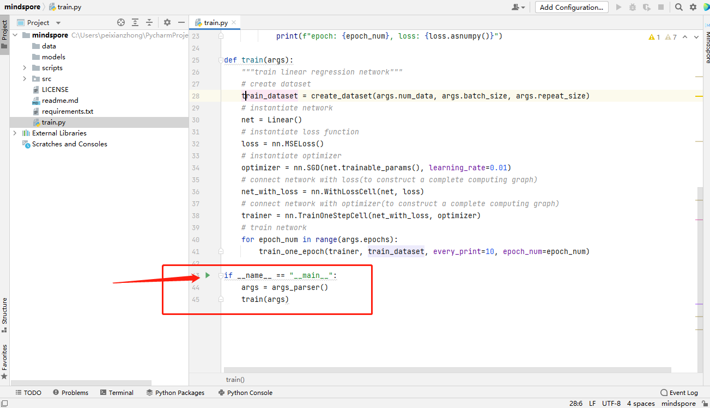

      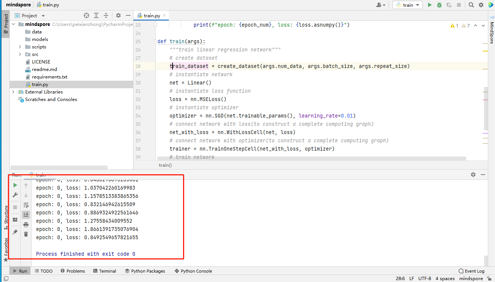