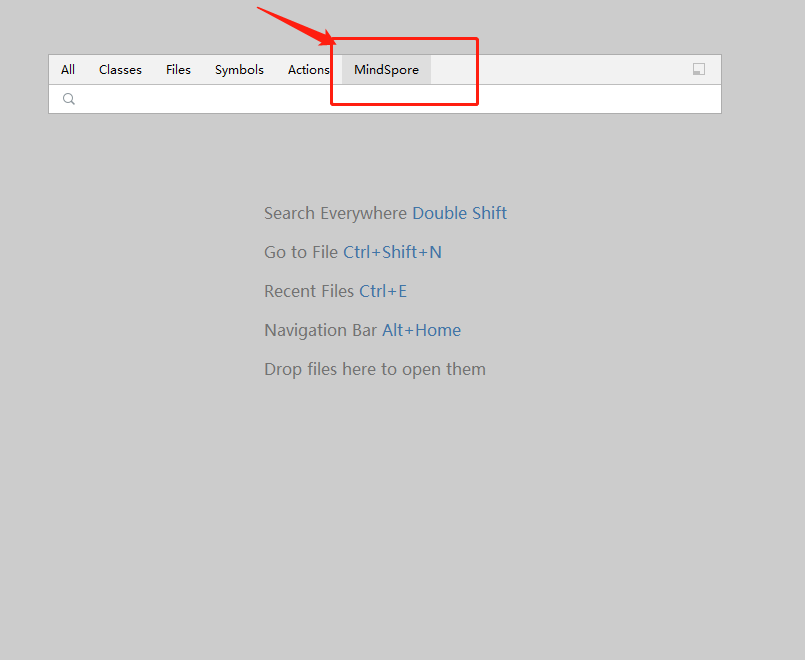
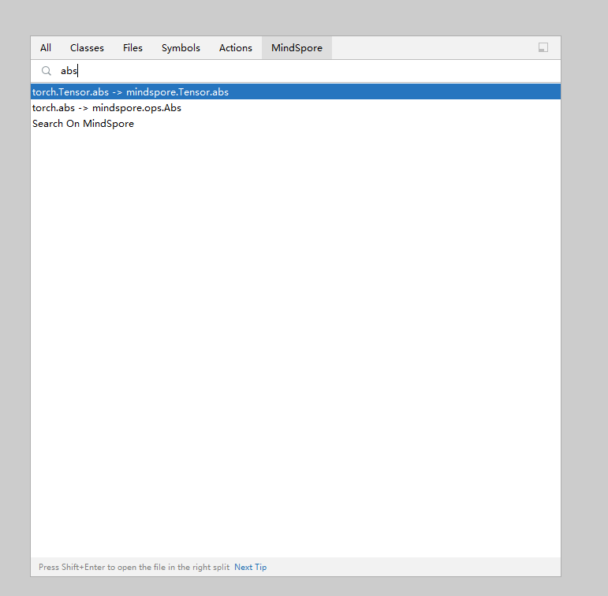
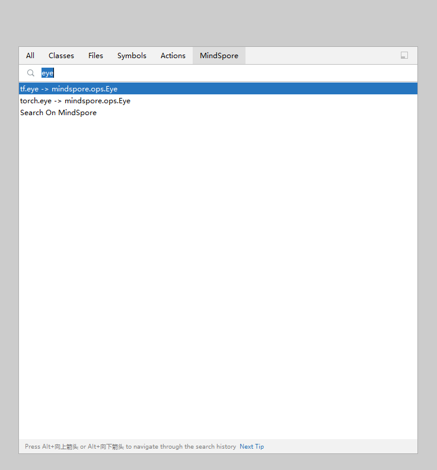

# API互搜

## 功能介绍

* 快速搜索MindSpore API，在侧边栏直接展示API详情。
* 为方便其他机器学习框架用户，通过搜索其他主流框架API，联想匹配对应MindSpore API。

## 使用步骤

1. 双击shift弹出全局搜索页面。

   

2. 选择MindSpore。

   

3. 输入要搜索的PyTorch或TensorFlow的API，获取与MindSpore API的对应关系列表。

   

   

4. 点击列表中的条目，可以在右边侧边栏浏览对应条目的官网文档。

   
