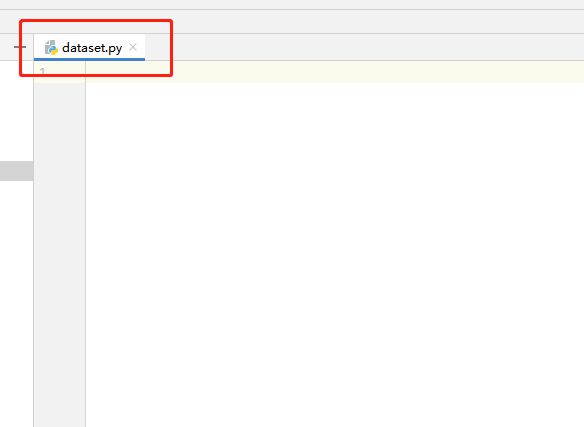
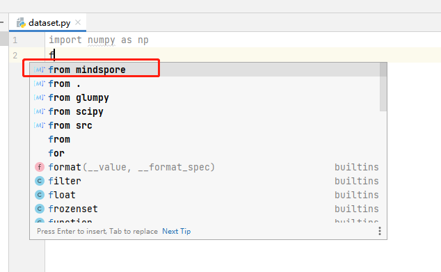
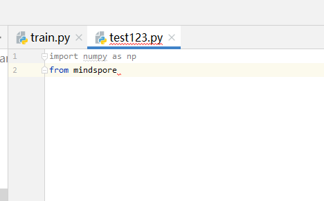
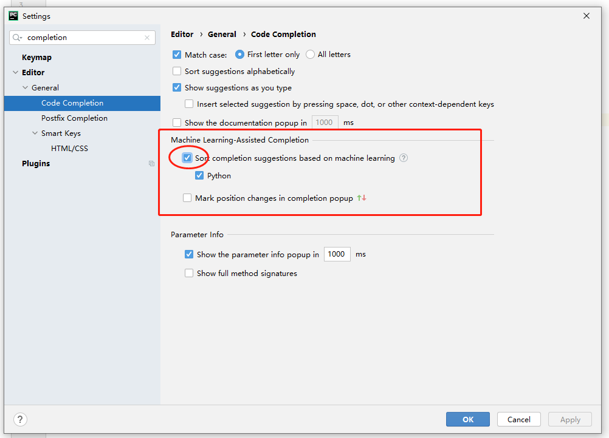
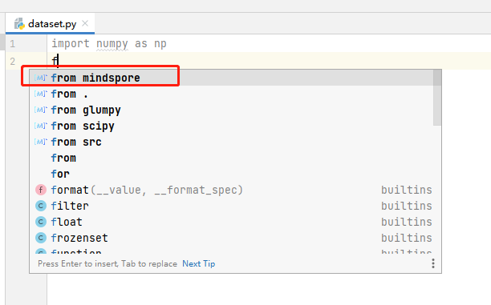
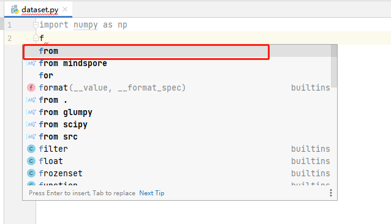

# 代码补全

## 功能介绍

* 提供基于MindSpore项目的AI代码补全。
* 无需安装MindSpore环境，也可轻松开发MindSpore。

## 使用步骤

1. 打开Python文件编写代码。

   

2. 编码时，补全会自动生效。有MindSpore图标的条目为MindSpore Dev Toolkit智能补全提供的代码。

   

   

## 备注

1. PyCharm的2021以后版本，会根据机器学习重新排列补全内容。此行为可能导致插件的补全条目排序靠后。可以在设置中停用此功能，使用MindSpore Dev Toolkit提供的排序。

   

2. 关闭此选项前后的对比。

    * 关闭后。

      

    * 关闭前。

      