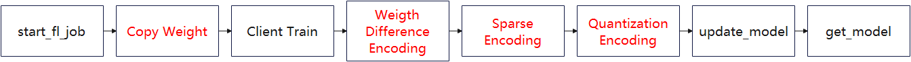
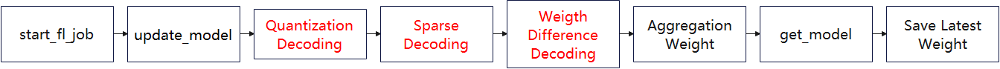
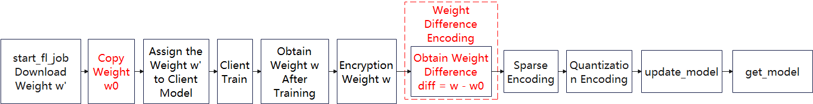
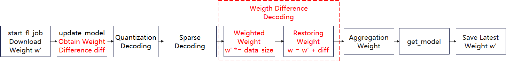
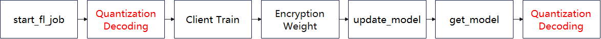

# Device-Cloud Federated Learning Communication Compression

<a href="https://gitee.com/mindspore/docs/blob/r2.0.0-alpha/docs/federated/docs/source_en/communication_compression.md" target="_blank"></a>

During the horizontal device-side federated learning training process, the traffic volume affects the user experience of the device-side (user traffic, communication latency, number of FL-Client participants) and is limited by the cloud-side performance constraints (memory, bandwidth, CPU usage). To improve user experience and reduce performance bottlenecks, MindSpore federated learning framework provides traffic compression for upload and download in device-cloud federated scenarios.

## Compression Method

### Upload Compression Method

The upload compression method can be divided into three main parts: weight difference codec, sparse codec and quantization codec. The flowcharts on FL-Client and FL-Server are given below.



Fig.1 Flowchart of the upload compression method on FL-Client



Fig.2 Flowchart of the upload compression method on FL-Server

### Weight Difference Codec

The weight difference is the vector difference of the weight matrix before and after the device-side training. Compared with the original weights, the distribution of the weight difference is more in line with the Gaussian distribution and therefore more suitable to be compressed. FL-Client performs the encoding operation on the weight difference, while FL-Server performs the decoding operation. Note that in order to reduce the weight difference to weights before FL-Server aggregates the weights, FL-Client does not multiply the weights by the amount of data when uploading the weights. When FL-Server decodes, it needs to multiply the weights by the amount of data.



Fig.3 Flow chart of weight difference encoding on FL-Client



Fig.4 Flow chart of weight difference decoding on FL-Server

### Sparse Codec

The device-side and cloud-side follow the same random algorithm to generate a sparse mask matrix that has the same shape as the original weights that need to be uploaded. The mask matrix contains only two values, 0 or 1. Each FL-Client only uploads data with the same weight as the non-zero value position of the mask matrix to the FL-Server.

Take the sparse method with a sparse rate of sparse_rate=0.08 as an example. The parameters that are required to be uploaded by FL-Client:

| Parameters               | Length  |
| -------------------- | ----- |
| albert.pooler.weight | 97344 |
| albert.pooler.bias   | 312   |
| classifier.weight    | 1560  |
| classifier.bias      | 5     |

Concatenate all parameters as one-dimensional vectors:

| Parameters  |     Length             |
| ----------- | ---------------------- |
| merged_data | 97344+312+1560+5=99221 |

Generate a mask vector with the same length as the concatenated parameter. There are 7937 values of 1, i.e., 7937 = int(sparse_rate*concatenated parameter length) and the rest have a value of 0, i.e., mask_vector = (1,1,1,... ,0,0,0,...):

| Parameters  |     Length   |
| ----------- | --------- |
| mask_vector | 99221 |

Use a pseudo-random algorithm to randomize the mask_vector. The random seed is the current number of iteration. Take out the indexes in the mask_vector with value 1. Take out the value of merged_data[indexes], i.e. the compressed vector.

| Parameters  |     Length   |
| ----------- | --------- |
| compressed_vector | 7937 |

After sparse compression, the parameter that FL-Client needs to upload is the compressed_vector.

After receiving the compressed_vector, FL-Server first constructs the mask vector mask_vector with the same pseudo-random algorithm and random seeds as FL-Client. Then it takes out the indexes with the value of 1 in the mask_vector. Generate the all-zero matrix with the same shape as the model. The values in compressed_vector are put into weight_vector[indexes] in turn. weight_vector is the sparsely decoded vector.

### Quantization Codec

The quantization compression method is approximating communication data fixed-point of floating-point type to a finite number of discrete values.

Taking the 8-bit quantization as an example:

Quantify the number of bits num_bits = 8

The floating-point data before compression is

data = [0.03356021, -0.01842778, -0.009684053, 0.025363436, -0.027571501, 0.0077043395, 0.016391572, -0.03598478,  -0.0009508357]

Compute the max and min values:

min_val = -0.03598478

max_val = 0.03356021

Calculate scaling factor:

scale = (max_val - min_val ) / (2 ^ num_bits - 1) = 0.000272725450980392

Convert the pre-compressed data to an integer between -128 and 127 with the conversion formula quant_data = round((data - min_val) / scale) - 2 ^ (num_bits - 1). And strongly convert the data type to int8:

quant_data = [127, -64, -32, 97, -97, 32, 64, -128, 0]

After the quantitative encoding, the parameters that FL-Client needs to upload are quant_data and the minimum and maximum values min_val and max_val.

After receiving quant_data, min_val and max_val, FL-Server uses the inverse quantization formula (quant_data + 2 ^ (num_bits - 1)) * (max_val - min_val) / (2 ^ num_bits - 1) + min_val to reduce the weights.

## Download Compression Method

The download compression method is mainly a quantization codec operation, and the flow charts on FL-Server and FL-Client are given below.


Fig.5 Flowchart of the download compression method on FL-Server



Fig.6 Flowchart of the download compression method on FL-Client

### Quantization Codec

The quantization codec is the same as that in upload compression.

## Code Implementation Preparation

To use the upload and download compression methods, first successfully complete the training aggregation process for either device or cloud federated scenario, e.g. [Implementing a Sentiment Classification Application (Android)](https://www.mindspore.cn/federated/docs/en/r2.0.0-alpha/sentiment_classification_application.html). The preparation work including datasets and network models and the simulation of the process to initiate multi-client participation in federated learning are described in detail in this document.

## Algorithm Open Script

The upload and download compression methods are currently only supported in the device-cloud federated learning scenario. The open method requires setting `upload_compress_type='DIFF_SPARSE_QUANT'` and `download_compress_type='QUANT'` in the corresponding yaml in the server startup script when starting the cloud-side service.

The relevant parameter configuration to start the algorithm is given in the cloud-side [full startup script](https://gitee.com/mindspore/federated/tree/r2.0.0-alpha/tests/st/cross_device_cloud/). After determining the parameter configuration, the user needs to configure the corresponding parameters before executing the training, as follows:

```yaml
compression:
  upload_compress_type: NO_COMPRESS
  upload_sparse_rate: 0.4
  download_compress_type: NO_COMPRESS
```

| Hyperparameter Names and Reference Values        | Hyperparameter Description                                                     |
| ---------------------- | ------------------------------------------------------------ |
| upload_compress_type   | Upload compression type, string type, including: "NO_COMPRESS", "DIFF_SPARSE_QUANT" |
| upload_sparse_rate     | Sparse ratio, i.e., weight retention, float type, defined in the domain (0, 1]            |
| download_compress_type | Download compression type, string type, including: "NO_COMPRESS", "QUANT"       |

## ALBERT Results

The total number of federated learning iterations is 100. The number of client local training epochs is 1. The number of clients is 20. The batchSize is set to 16. The learning rate is 1e-5. Both upload and download compression methods are turned on. The upload sparse ratio is 0.4. The final accuracy on the validation set is 72.5%, and 72.3% for the common federated scenario without compression.
