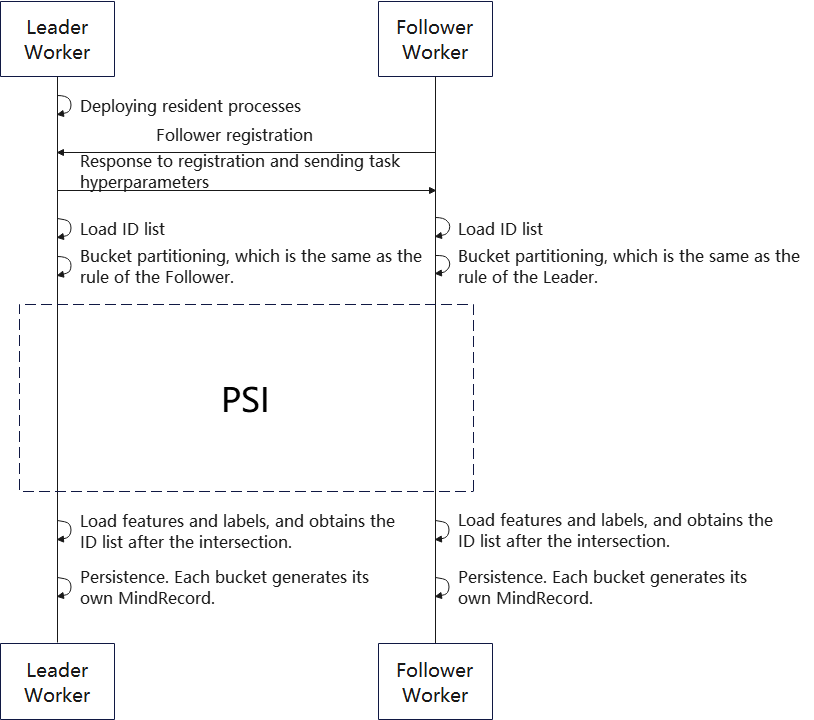

# Vertical Federated Learning Data Access

<a href="https://gitee.com/mindspore/docs/blob/master/docs/federated/docs/source_en/data_join.md" target="_blank"></a>

Unlike horizontal federated learning, two participants (leader and follower) have the same sample space for training or inference in vertical federated learning. Therefore, the data intersection must be done collaboratively before both parties in vertical federated learning initiate training or inference. Both parties must read their respective original data and extract the ID (unique identifier of each data, and none of them is the same) corresponding to each data for intersection (i.e., finding the intersection). Then, both parties obtain features or tags from the original data based on the intersected IDs. Finally, each side exports the persistence file and reads the data in the reordering manner before subsequent training or inference.

## Overall Process

Data access can be divided into two parts: data export and data read.

### Exporting Data

The MindSpore Federated vertical federated learning data export process framework is shown in Figure 1:



Fig. 1 Vertical Federated Learning Data Export Process Framework Diagram

In the data export process, Leader Worker and Follower Worker are the two participants in the vertical federated learning. The Leader Worker is resident and keeps a listening ear on the Follower Worker, who can enter the data access process at any moment.

After the Leader Worker receives a registration request from the Follower Worker, it checks the registration content. If the registration is successful, the task-related hyperparameters (PSI-related hyperparameters, bucketing rules, ID field names, etc.) are sent to the Follower Worker.

The Leader Worker and Follower Worker read their respective raw data, extract the list of IDs from their raw data and implement bucketing.

Each bucket of Leader Worker and Follower Worker initiates the privacy intersection method to obtain the ID intersections of the two parties.

Finally, the two parties extract the corresponding data from the original data based on the ID intersections and export it to a file in MindRecord format.

### Reading Data

Vertical federated requires that both participants have the same value and order of data IDs for each batch of training or inference. MindSpore Federated ensures that the data is read in the same order by using the same random seed and by using dictionary sorting on the exported file sets when both parties read their respective data.

## An Example for Quick Experience

### Sample Data Preparation

To use the data access method, the original data needs to be prepared first. The user can use [random data generation script](https://gitee.com/mindspore/federated/blob/master/tests/st/data_join/generate_random_data.py) to generate forged data for each participant as a sample.

```shell
python generate_random_data.py \
    --seed=0 \
    --total_output_path=vfl/input/total_data.csv \
    --leader_output_path=vfl/input/leader_data_*.csv \
    --follower_output_path=vfl/input/follower_data_*.csv \
    --leader_file_num=4 \
    --follower_file_num=2 \
    --leader_data_num=300 \
    --follower_data_num=200 \
    --overlap_num=100 \
    --id_len=20 \
    --feature_num=30
```

The user can set the hyperparameter according to the actual situation:

| Hyperparameter names            | Hyperparameter description                                                     |
| -------------------- | ------------------------------------------------------------ |
| seed                 | Random seed, int type.                                          |
| total_output_path    | The output path of all data, str type.                                |
| leader_output_path   | The export path of the leader data. If the configuration includes the `*`, the `*` will be replaced by the serial number of 0, 1, 2 ...... in order when exporting multiple files. str type. |
| follower_output_path | The export path of the follower data. If the configuration includes the `*`, the `*` will be replaced by the serial number of 0, 1, 2 ...... in order when exporting multiple files. str type. |
| leader_file_num      | The number of output files for leader data. int type.                        |
| follower_file_num    | The number of output files for follower data. int type.                      |
| leader_data_num      | The total number of leader data. int type.                                  |
| follower_data_num    | The total number of follower data. int type.                                |
| overlap_num          | The total amount of data that overlaps between leader and follower data. int type.                                |
| id_len               | The data ID is a string type. The hyperparameter is the length of the string. int type.          |
| feature_num          | The number of columns of the exported data                                           |

Multiple csv files are generated after running the data preparation:

```text
follower_data_0.csv
follower_data_1.csv
intersection_data.csv
leader_data_0.csv
leader_data_1.csv
leader_data_2.csv
leader_data_3.csv
```

### Sample of Data Export

Users can use [script of finding data intersections](https://gitee.com/mindspore/federated/blob/master/tests/st/data_join/run_data_join.py) to implement data intersections between two parties and export it to MindRecord format file. The users need to start Leader and Follower processes separately.

Start Leader:

```shell
python run_data_join.py \
    --role="leader" \
    --main_table_files="vfl/input/leader/" \
    --output_dir="vfl/output/leader/" \
    --data_schema_path="vfl/leader_schema.yaml" \
    --http_server_address="127.0.0.1:1086" \
    --remote_server_address="127.0.0.1:1087" \
    --primary_key="oaid" \
    --bucket_num=5 \
    --store_type="csv" \
    --shard_num=1 \
    --join_type="psi" \
    --thread_num=0
```

Start Follower:

```shell
python run_data_join.py \
    --role="follower" \
    --main_table_files="vfl/input/follower/" \
    --output_dir="vfl/output/follower/" \
    --data_schema_path="vfl/follower_schema.yaml" \
    --http_server_address="127.0.0.1:1087" \
    --remote_server_address="127.0.0.1:1086" \
    --store_type="csv" \
    --thread_num=0
```

The user can set the hyperparameter according to the actual situation.

| Hyperparameter names            | Hyperparameter description                                                |
| ------------------- | ------------------------------------------------------- |
| role                | Role types of the worker. str type. Including: "leader", "follower". |
| main_table_files                  | The path of raw data, configure either single or multiple file paths, data directory paths, list or str types |
| output_dir                        | The directory path of the exported MindRecord related files, str type.                |
| data_schema_path         | The path of the super reference file to be configured during export, str type.         |
| http_server_address      | Local IP and port address, str type.                             |
| remote_server_address | Peer IP and port address, str type.                                |
| primary_key (Follower does not need to be configured) | The name of data ID, str type.                                      |
| bucket_num (Follower does not need to be configured)  | Find the number of sub-buckets when intersecting and exporting, int type.                          |
| store_type                        | Raw data storage type, str type.                                  |
| shard_num (Follower does not need to be configured)   | The number of files exported from a single bucket, int type.                              |
| join_type (Follower does not need to be configured)   | Algorithm of intersection finding, str type.                                          |
| thread_num                        | Calculate the number of threads required when using the PSI intersection algorithm, int type.                 |

In the above sample, the files corresponding data_schema_path can be referred to the corresponding files configuration of [leader_schema.yaml](https://gitee.com/mindspore/federated/blob/master/tests/st/data_join/vfl/leader_schema.yaml) and [follower_schema.yaml](https://gitee.com/mindspore/federated/blob/master/tests/st/data_join/vfl/follower_schema.yaml). The user needs to provide the column names and types of the data to be exported in this file.

After running the data export, generate multiple MindRecord related files.

```text
mindrecord_0
mindrecord_0.db
mindrecord_1
mindrecord_1.db
mindrecord_2
mindrecord_2.db
mindrecord_3
mindrecord_3.db
mindrecord_4
mindrecord_4.db
```

### Sample of Data Reading

The user can use the [script of reading data](https://gitee.com/mindspore/federated/blob/master/tests/st/data_join/load_joined_data.py) to implement data reading after intersection.

```shell
python load_joined_data.py \
    --seed=0 \
    --input_dir=vfl/output/leader/ \
    --shuffle=True
```

The user can set the hyperparameter according to the actual situation.

| Hyperparameter names            | Hyperparameter description                                                |
| --------- | ----------------------------------------- |
| seed      | Random seed. int type.                       |
| input_dir | The directory of the input MindRecord related files, str type. |
| shuffle   | Whether the data order needs to be changed, bool type.              |

If the intersection result is correct, when each of the two parties reads the data, the OAID order of each data of the two parties is the same, while the data of the other columns in each data can be different values. Print the intersection data after running the data read:

```text
Leader data export results:
{……, 'oaid': Tensor(shape=[], dtype=String, value= 'uMbgxIMMwWhMGrVMVtM7')}
{……, 'oaid': Tensor(shape=[], dtype=String, value= 'IwoGP08kWVtT4WHL2PLu')}
{……, 'oaid': Tensor(shape=[], dtype=String, value= 'MSRe6mURtxgyEgWzDn0b')}
{……, 'oaid': Tensor(shape=[], dtype=String, value= 'y7X0WcMKnTLrhxVcWfGF')}
{……, 'oaid': Tensor(shape=[], dtype=String, value= 'DicKRIVvbOYSiv63TvcL')}
{……, 'oaid': Tensor(shape=[], dtype=String, value= 'TCHgtynOhH3z11QYemsH')}
{……, 'oaid': Tensor(shape=[], dtype=String, value= 'OWmhgIfC3k8UTteGUhni')}
{……, 'oaid': Tensor(shape=[], dtype=String, value= 'NTV3qEYXBHqKBWyHGc7s')}
{……, 'oaid': Tensor(shape=[], dtype=String, value= 'wuinSeN1bzYgXy4XmSlR')}
{……, 'oaid': Tensor(shape=[], dtype=String, value= 'SSsCU0Pb46XGzUIa3Erg')}
……

Follower data export results:
{……, 'oaid': Tensor(shape=[], dtype=String, value= 'uMbgxIMMwWhMGrVMVtM7')}
{……, 'oaid': Tensor(shape=[], dtype=String, value= 'IwoGP08kWVtT4WHL2PLu')}
{……, 'oaid': Tensor(shape=[], dtype=String, value= 'MSRe6mURtxgyEgWzDn0b')}
{……, 'oaid': Tensor(shape=[], dtype=String, value= 'y7X0WcMKnTLrhxVcWfGF')}
{……, 'oaid': Tensor(shape=[], dtype=String, value= 'DicKRIVvbOYSiv63TvcL')}
{……, 'oaid': Tensor(shape=[], dtype=String, value= 'TCHgtynOhH3z11QYemsH')}
{……, 'oaid': Tensor(shape=[], dtype=String, value= 'OWmhgIfC3k8UTteGUhni')}
{……, 'oaid': Tensor(shape=[], dtype=String, value= 'NTV3qEYXBHqKBWyHGc7s')}
{……, 'oaid': Tensor(shape=[], dtype=String, value= 'wuinSeN1bzYgXy4XmSlR')}
{……, 'oaid': Tensor(shape=[], dtype=String, value= 'SSsCU0Pb46XGzUIa3Erg')}
……
```

## An Example for Deep Experience

For detailed API documentation for the following code, see [Data Access Documentation](https://gitee.com/mindspore/federated/blob/master/docs/api/api_python/data_join.rst).

### Data Export

The user can implement data export by using the encapsulated interface in the following way:

```python
from mindspore_federated.data_join import FLDataWorker


if __name__ == '__main__':
    worker = FLDataWorker(role="leader",
                          main_table_files="vfl/input/leader/",
                          output_dir="vfl/output/leader/",
                          data_schema_path="vfl/leader_schema.yaml",
                          http_server_address="127.0.0.1:1086",
                          remote_server_address="127.0.0.1:1087",
                          primary_key="oaid",
                          bucket_num=5,
                          store_type="csv",
                          shard_num=1,
                          join_type="psi",
                          thread_num=0,
                          )
    worker.export()
```

### Data Reading

The user can implement data reading by using the encapsulated interface in the following way:

```python
from mindspore_federated.data_join import load_mindrecord


if __name__ == "__main__":
    dataset = load_mindrecord(input_dir="vfl/output/leader/", shuffle=True, seed=0)
```
