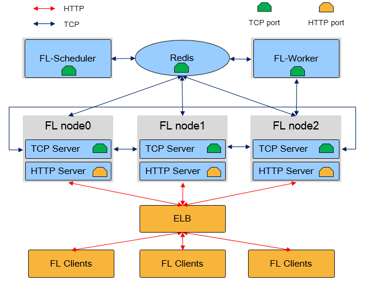

# Cloud-based Deployment

<a href="https://gitee.com/mindspore/docs/blob/master/docs/federated/docs/source_en/deploy_federated_server.md" target="_blank"></a>

The following uses LeNet as an example to describe how to use MindSpore to deploy a federated learning cluster.

> You can download the complete demo from [here](https://gitee.com/mindspore/mindspore/tree/master/tests/st/fl/mobile).

The following figure shows the physical architecture of the MindSpore Federated Learning (FL) Server cluster:



As shown in the preceding figure, in the federated learning cloud cluster, there are two MindSpore process roles: `Federated Learning Scheduler` and `Federated Learning Server`:

- Federated Learning Scheduler

    `Scheduler` provides the following functions:

    1. Cluster networking assistance: During cluster initialization, the `Scheduler` collects server information and ensures cluster consistency.
    2. Open management plane: You can manage clusters through the `RESTful` APIs.

    In a federated learning task, there is only one `Scheduler`, which communicates with the `Server` using the TCP proprietary protocol.

- Federated Learning Server

    `Server` executes federated learning tasks, receives and parses data from devices, and provides capabilities such as secure aggregation, time-limited communication, and model storage. In a federated learning task, users can configure multiple `Servers` which communicate with each other through the TCP proprietary protocol and open HTTP ports for device-side connection.

    > In the MindSpore federated learning framework, `Server` also supports auto scaling and disaster recovery, and can dynamically schedule hardware resources without interrupting training tasks.

`Scheduler` and `Server` must be deployed on a server or container with a single NIC and in the same network segment. MindSpore automatically obtains the first available IP address as the `Server` IP address.

> The servers will verify the timestamp carried by the clients. It is necessary to eunsure the servers are periodically time synchronized to avoid a large time offset.

## Preparations

### Installing MindSpore

The MindSpore federated learning cloud cluster supports deployment on x86 CPU and GPU CUDA hardware platforms. Run commands provided by the [MindSpore Installation Guide](https://www.mindspore.cn/install) to install the latest MindSpore.

## Defining a Model

To facilitate deployment, the `Scheduler` and `Server` processes of MindSpore federated learning can reuse the training script. You can select different startup modes by referring to [Configuring Parameters](#configuring-parameters).

This tutorial uses LeNet as an example. For details about the network structure, loss function, and optimizer definition, see [LeNet sample code](https://gitee.com/mindspore/docs/blob/master/docs/sample_code/lenet/lenet.py).

## Configuring Parameters

The MindSpore federated learning task process reuses the training script. You only need to use the same script to transfer different parameters through the Python API `set_fl_context` and start different MindSpore process roles. For details about the parameter configuration, see [MindSpore API](https://www.mindspore.cn/federated/docs/en/master/federated_server.html#mindspore.context.set_fl_context).

After parameter configuration and before training, call the `set_fl_context` API as follows:

```python
from mindspore import set_fl_context
...

enable_fl = True
server_mode = "FEDERATED_LEARNING"
ms_role = "MS_SERVER"
server_num = 4
scheduler_ip = "192.168.216.124"
scheduler_port = 6667
fl_server_port = 6668
fl_name = "LeNet"
scheduler_manage_port = 11202
config_file_path = "./config.json"

fl_ctx = {
    "enable_fl": enable_fl,
    "server_mode": server_mode,
    "ms_role": ms_role,
    "server_num": server_num,
    "scheduler_ip": scheduler_ip,
    "scheduler_port": scheduler_port,
    "fl_server_port": fl_server_port,
    "fl_name": fl_name,
    "scheduler_manage_port": scheduler_manage_port,
    "config_file_path": config_file_path
}
set_fl_context(**fl_ctx)
...

model.train()
```

In this example, the training task mode is set to `federated learning` (`FEDERATED_LEARNING`), and the training process role is `Server`. In this task, `4` `Servers` need to be started to complete the cluster networking. The IP address of the cluster `Scheduler` is `192.168.216.124`, the cluster `Scheduler` port number is `6667`, the `HTTP service port number` of federated learning is `6668` (connected by the device), the task name is `LeNet`, and the cluster `Scheduler` management port number is `11202`.

> Some parameters are used by either `Scheduler` (for example, scheduler_manage_port) or `Server` (for example, fl_server_port). To facilitate deployment, transfer these parameters together to MindSpore. MindSpore reads different parameters based on process roles.
> You are advised to import the parameter configuration through the Python `argparse` module:

```python
import argparse

parser = argparse.ArgumentParser()
parser.add_argument("--server_mode", type=str, default="FEDERATED_LEARNING")
parser.add_argument("--ms_role", type=str, default="MS_SERVER")
parser.add_argument("--server_num", type=int, default=4)
parser.add_argument("--scheduler_ip", type=str, default="192.168.216.124")
parser.add_argument("--scheduler_port", type=int, default=6667)
parser.add_argument("--fl_server_port", type=int, default=6668)
parser.add_argument("--fl_name", type=str, default="LeNet")
parser.add_argument("--scheduler_manage_port", type=int, default=11202)
parser.add_argument("--config_file_path", type=str, default="")

args, t = parser.parse_known_args()
server_mode = args.server_mode
ms_role = args.ms_role
server_num = args.server_num
scheduler_ip = args.scheduler_ip
scheduler_port = args.scheduler_port
fl_server_port = args.fl_server_port
fl_name = args.fl_name
scheduler_manage_port = args.scheduler_manage_port
config_file_path = args.config_file_path
```

> Each Python script corresponds to a process. If multiple `Server` roles need to be deployed on different hosts, you can use shell commands and Python to quickly start multiple `Server` processes. You can refer to the [examples](https://gitee.com/mindspore/mindspore/tree/master/tests/st/fl/mobile).
>
> Each `Server` process needs a unique identifier `MS_NODE_ID` which should be set by environment variable. In this tutorial, this environment variable has been set in the script [run_mobile_server.py](https://gitee.com/mindspore/mindspore/blob/master/tests/st/fl/mobile/run_mobile_server.py).

## Starting a Cluster

Start the cluster by referring to the [examples](https://gitee.com/mindspore/mindspore/tree/master/tests/st/fl/mobile). An example directory structure is as follows:

```text
mobile/
├── config.json
├── finish_mobile.py
├── run_mobile_sched.py
├── run_mobile_server.py
├── src
│   └── model.py
└── test_mobile_lenet.py
```

Descriptions of the documents:

- config.json: The config file, which is used to configure security, disaster recovery, etc.
- finish_mobile.py: This script is used to stop the cluster.
- run_mobile_sched.py: Launch scheduler.
- run_mobile_server.py: Launch server.
- model.py: The model.
- test_mobile_lenet.py: Training script.

1. Start the `Scheduler`.

    `run_mobile_sched.py` is a Python script provided for you to start `Scheduler` and supports configuration modification through passing the `argparse` parameter. Run the following command to start the `Scheduler` of the federated learning task. The TCP port number is `6667`, the HTTP service port number starts with `6668`, the number of `Server` is `4`, and the management port number of the cluster `Scheduler` is `11202`:

    ```sh
    python run_mobile_sched.py --scheduler_ip=192.168.216.124 --scheduler_port=6667 --fl_server_port=6668 --server_num=4 --scheduler_manage_port=11202 --config_file_path=$PWD/config.json
    ```

2. Start the `Servers`.

    `run_mobile_server.py` is a Python script provided for you to start multiple `Servers` and supports configuration modification through passing the `argparse` parameter. Run the following command to start the `Servers` of the federated learning task. The TCP port number is `6667`, the HTTP service port number starts with `6668`, the number of `Server` is `4`, and the number of devices required for the federated learning task is `8`.

    ```sh
    python run_mobile_server.py --scheduler_ip=192.168.216.124 --scheduler_port=6667 --fl_server_port=6668 --server_num=4 --start_fl_job_threshold=8 --config_file_path=$PWD/config.json
    ```

    The preceding command is equivalent to starting four `Server` processes, of which the federated learning service port numbers are `6668`, `6669`, `6670`, and `6671`. For details, see [run_mobile_server.py](https://gitee.com/mindspore/mindspore/blob/master/tests/st/fl/mobile/run_mobile_server.py).

    > If you only want to deploy `Scheduler` and `Server` in a standalone system, change the `scheduler_ip` to `127.0.0.1`.

    To distribute the `Servers` on different physical nodes, you can use the `local_server_num` parameter to specify the number of `Server` processes to be executed on **the current node**.

    ```sh
    #Start three `Server` processes on node 1.
    python run_mobile_server.py --scheduler_ip={ip_address_node_1} --scheduler_port=6667 --fl_server_port=6668 --server_num=4 --start_fl_job_threshold=8 --local_server_num=3 --config_file_path=$PWD/config.json
    ```

    ```sh
    #Start one `Server` process on node 2.
    python run_mobile_server.py --scheduler_ip={ip_address_node_2} --scheduler_port=6667 --fl_server_port=6668 --server_num=4 --start_fl_job_threshold=8 --local_server_num=1 --config_file_path=$PWD/config.json
    ```

    The log is displayed as follows:

    ```sh
    Server started successfully.
    ```

    If the preceding information is displayed, it indicates that the startup is successful.

    > In the preceding commands for distributed deployment, all values of `server_num` are set to 4. This is because this parameter indicates the number of global `Servers` in the cluster and should not change with the number of physical nodes. `Servers` on different nodes do not need to be aware of their own IP addresses. The cluster consistency and node discovery are scheduled by `Scheduler`.

3. Stop federated learning.

    Currently, `finish_mobile.py` is used to stop the federated learning server. Run the following command to stop the federated learning cluster. The value of the `scheduler_port` parameter is the same as that passed when the server is started.

    ```sh
    python finish_mobile.py --scheduler_port=6667
    ```

    The result is as follows:

    ```sh
    killed $PID1
    killed $PID2
    killed $PID3
    killed $PID4
    killed $PID5
    killed $PID6
    killed $PID7
    killed $PID8
    ```

    The services are stopped successfully.

## Auto Scaling

The MindSpore federated learning framework supports auto scaling of `Server` and provides the `RESTful` service through the `Scheduler` management port. In this way, you can dynamically schedule hardware resources without interrupting training tasks. Currently, MindSpore supports only horizontal scaling (scale-out or scale-in) and does not support vertical scaling (scale-up or scale-down). In the auto scaling scenario, the number of `Server` processes either increases or decreases according to user settings.

The following describes how to control cluster scale-in and scale-out using the native RESTful APIs.

1. Scale-out

    After the cluster is started, send a scale-out request to `Scheduler`. Use the `curl` instruction to construct a `RESTful` scale-out request, indicating that two `Server` nodes need to be added to the cluster.

    ```sh
    curl -i -X POST \
    -H "Content-Type:application/json" \
    -d \
    '{
    "worker_num":0,
    "server_num":2
    }' \
    'http://192.168.216.124:11202/scaleout'
    ```

    Start `2` new `Server` processes and add up the values of `server_num` to ensure that the global networking information is correct. After the scale-out, the value of `server_num` should be `6`.

    ```sh
    python run_mobile_server.py --scheduler_ip=192.168.216.124 --scheduler_port=6667 --fl_server_port=6672 --server_num=6 --start_fl_job_threshold=8 --local_server_num=2 --config_file_path=$PWD/config.json
    ```

    This command is used to start two `Server` nodes. The port numbers of the federated learning services are `6672` and `6673`, and the total number of `Servers` is `6`.

2. Scale-in

    After the cluster is started, send a scale-in request to `Scheduler`. Obtain the node information to perform the scale-in operation on specific nodes.

    ```sh
    curl -i -X GET \
    'http://192.168.216.124:11202/nodes'
    ```

    The `scheduler` will return the query results in the `json` format:

    ```json
    {
        "message": "Get nodes info successful.",
        "nodeIds": [
            {
                "alive": "true",
                "nodeId": "3",
                "rankId": "3",
                "role": "SERVER"
            },
            {
                "alive": "true",
                "nodeId": "0",
                "rankId": "0",
                "role": "SERVER"
            },
            {
                "alive": "true",
                "nodeId": "2",
                "rankId": "2",
                "role": "SERVER"
            },
            {
                "alive": "true",
                "nodeId": "1",
                "rankId": "1",
                "role": "SERVER"
            },
            {
                "alive": "true",
                "nodeId": "20",
                "rankId": "0",
                "role": "SCHEDULER"
            }
        ]
    }
    ```

    Select `Rank3` and `Rank2` for scale-in.

    ```sh
    curl -i -X POST \
    -H "Content-Type:application/json" \
    -d \
    '{
    "node_ids": ["2", "3"]
    }' \
    'http://192.168.216.124:11202/scalein'
    ```

> - After the cluster scale-out or scale-in is successful, the training task is automatically restored. No manual intervention is required.
>
> - You can use a cluster management tool (such as Kubernetes) to create or release `Server` resources.
>
> - After scale-in, the process scaled in will not exit. You need to use the cluster management tool (such as Kubernetes) or command `kill -15 $PID` to control the process to exit. Please note that you need to query the cluster status from the 'scheduler' node and wait for the cluster status to be set to `CLUSTER_READY`, the reduced node can be recycled.

## Disaster Recovery

After a node in the MindSpore federated learning cluster goes offline, you can keep the cluster online without exiting the training task. After the node is restarted, you can resume the training task. Currently, MindSpore supports disaster recovery for `Server` nodes (except Server 0).

To enable disaster recovery, the fields below should be added to the config.json set by config_file_path:

```json
{
    "recovery": {
        "storage_type": 1,
        "storge_file_path": "config.json"
    }
}
```

- recovery: If this field is set, the disaster recovery feature is enabled.
- storage_type: Persistent storage type. Only `1` is supported currently which represents file storage.
- storage_file_path: The recovery file path.

The node restart command is similar to the scale-out command. After the node is manually brought offline, run the following command:

```sh
python run_mobile_server.py --scheduler_ip=192.168.216.124 --scheduler_port=6667 --fl_server_port=6673 --server_num=6 --start_fl_job_threshold=8 --local_server_num=1 --config_file_path=$PWD/config.json
```

This command indicates that the `Server` is restarted. The federated learning service port number is `6673`.

> MindSpore does not support disaster recovery after the auto scaling command is successfully delivered and before the scaling service is complete.
>
> After recovery, the restarted node's `MS_NODE_ID` variable should be the same as the one which exited in exception to ensure the networking recovery.
