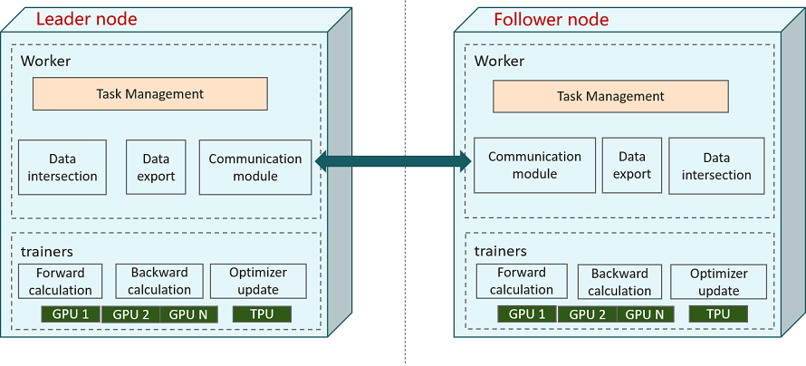

# Vertical Federated Deployment

<a href="https://gitee.com/mindspore/docs/blob/master/docs/federated/docs/source_en/deploy_vfl.md" target="_blank"></a>

This document explains how to use and deploy the vertical federated learning framework.

The MindSpore Vertical Federated Learning (VFL) physical architecture is shown in the figure:



As shown above, there are two participants in the vertical federated interaction: the Leader node and the Follower node, each of which has processes in two roles: `FLDataWorker` and `VFLTrainer`:

- FLDataWorker

    The functions of `FLDataWorker` mainly includes:

    1. Dataset intersection: obtains a common user intersection for both vertical federated participants, and supports a privacy dataset intersection protocol that prevents federated learning participants from obtaining ID information outside the intersection.
    2. Training data generation: After obtaining the intersection ID, the data features are expanded to generate the mindrecord file for training.
    3. Open management surface: `RESTful` interface is provided to users for cluster management.

    In a federated learning task, there is only one `Scheduler`, which communicates with the `Server` through TCP protocol.

- VFLTrainer

    `VFLTrainer` is the main body that performs the vertical federated training tasks, and performs the forward and reverse computation after model slicing, Embedding tensor transfer, gradient tensor transfer, and reverse optimizer update. The current version supports single-computer single-card and single-computer multi-card training modes.

    In the MindSpore federated learning framework, `Server` also supports elastic scaling and disaster recovery, enabling dynamic provisioning of hardware resources without interruption of training tasks.

`FLDataWorker` and `VFLTrainer` are generally deployed in the same server or container.

## Preparation

> It is recommended to use [Anaconda](https://www.anaconda.com/) to create a virtual environment for the following operations.

### Installing MindSpore

MindSpore vertical federated supports deployment on x86 CPU, GPU CUDA and Ascend hardware platforms. The latest version of MindSpore can be installed by referring to [MindSpore Installation Guide](https://www.mindspore.cn/install).

### Installing MindSpore Federated

Compile and install via [source code](https://gitee.com/mindspore/federated).

```shell
git clone https://gitee.com/mindspore/federated.git -b master
cd federated
LD_LIBRARY_PATH=/usr/local/cuda-11.1/lib64:/usr/local/lib:/usr/local/openmpi/lib:/home/nishome/xq/anaconda3/envs/lib/:$LIBRARY_PATH
bash build.sh
```

For `bash build.sh`, accelerate compilation through the `-jn` option, e.g. `-j16`, and download third-party dependencies from gitee instead of github by the `-S on` option.

Once compiled, find the Federated whl installation package in the `build/package/` directory to install.

```shell
pip install mindspore_federated-{version}-{python_version}-linux_{arch}.whl
```

#### Verifying installation

Execute the following command to verify the installation. The installation is successful if no error is reported when importing Python modules.

```python
from mindspore_federated import FLServerJob
```

## Running the Example

A running sample of FLDataWorker can be found in [Vertical federated learning data access](https://www.mindspore.cn/federated/docs/en/master/data_join.html).

A running sample of VFLTrainer can be found in [Vertical federated learning model training - Wide&Deep Recommended Application](https://www.mindspore.cn/federated/docs/en/master/split_wnd_application.html).
