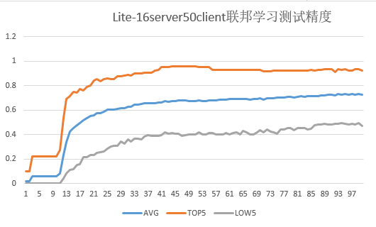

# Implementing an Image Classification Application of Cross-device Federated Learning (x86)

<a href="https://gitee.com/mindspore/docs/blob/master/docs/federated/docs/source_en/image_classification_application.md" target="_blank"></a>

Federated learning can be divided into cross-silo federated learning and cross-device federated learning according to different participating customers. In the cross-silo federation learning scenario, the customers participating in federated learning are different organizations (for example, medical or financial) or geographically distributed data centers, that is, training models on multiple data islands. The clients participating in the cross-device federation learning scenario are a large number of mobiles or IoT devices. This framework will introduce how to use the network LeNet to implement an image classification application on the MindSpore cross-silo federation framework, and provides related tutorials for simulating to start multi-client participation in federated learning in the x86 environment.

Before you start, check whether MindSpore has been correctly installed. If not, install MindSpore on your computer by referring to [Install](https://www.mindspore.cn/install/en) on the MindSpore website.

## Preparatory Work

We provide [Federated Learning Image Classification Dataset FEMNIST](https://mindspore-website.obs.cn-north-4.myhuaweicloud.com/notebook/datasets/federated/3500_clients_bin.zip) and the [device-side model file](https://mindspore-website.obs.cn-north-4.myhuaweicloud.com/notebook/models/lenet_train.ms) of the `.ms` format for users to use directly. Users can also refer to the following tutorials to generate the datasets and models based on actual needs.

### Data Processing

In this example, the federated learning dataset `FEMNIST` in the `leaf` dataset is used. For the specific acquisition method of the dataset, please refer to the document [Device-cloud federation learning image classification dataset processing](https://gitee.com/mindspore/mindspore/blob/master/tests/st/fl/cross_device_lenet/client/image_classfication_dataset_process_en.md ).

Users can also define the dataset by themselves. Note that the dataset must be a `.bin` format file, and the data dimension in the file must be consistent with the input dimension of the network.

### Generating a Device Model File

1. **Define the network and training process**

    For the definition of the specific network and training process, please refer to [Beginners Getting Started](https://www.mindspore.cn/tutorials/en/master/beginner/quick_start.html).

    We provide the network definition file [model.py](https://gitee.com/mindspore/mindspore/blob/master/tests/st/fl/mobile/src/model.py) and the training process definition file [run_export_lenet](https://gitee.com/mindspore/mindspore/blob/master/tests/st/fl/cross_device_lenet/cloud/run_export_lenet.py) for your reference.

2. **Export a model as a MindIR file.**

    Run the script `run_export_lenet` to obtain the MindIR format model file, the code snippet is as follows:

    ```python
    from mindspore import export
    ...

    parser = argparse.ArgumentParser(description="export mindir for lenet")
    parser.add_argument("--device_target", type=str, default="CPU")
    parser.add_argument("--mindir_path", type=str, default="lenet_train.mindir")  # The path for the file in MindIR format.
    ...

    for _ in range(epoch):
            data = Tensor(np.random.rand(32, 3, 32, 32).astype(np.float32))
            label = Tensor(np.random.randint(0, 61, (32)).astype(np.int32))
            loss = train_network(data, label).asnumpy()
            losses.append(loss)
            export(train_network, data, label, file_name= mindir_path, file_format='MINDIR')  # Add the export statement to obtain the model file in MindIR format.
        print(losses)
    ```

    The specific operating instructions are as follows:

    ```sh
    python export_lenet_mindir.py --mindir_path="ms/lenet/lenet_train.mindir"
    ```

    The parameter `--mindir_path` is used to set the path of the generated file in MindIR format.

3. **Convert the MindIR file into an .ms file that can be used by the federated learning framework on the device.**

    For details about model conversion, see [Training Model Conversion Tutorial](https://www.mindspore.cn/lite/docs/en/master/use/converter_train.html).

    The following is an example of model conversion:

    Assume that the model file to be converted is `lenet_train.mindir`. Run the following command:

    ```sh
    ./converter_lite --fmk=MINDIR --trainModel=true --modelFile=lenet_train.mindir --outputFile=lenet_train
    ```

    If the conversion is successful, the following information is displayed:

    ```sh
    CONVERTER RESULT SUCCESS:0
    ```

    This indicates that the MindSpore model is successfully converted to the MindSpore device model and the new file `lenet_train.ms` is generated. If the conversion fails, the following information is displayed:

    ```sh
    CONVERT RESULT FAILED:
    ```

    Save the generated model file in `.ms` format to a path. When the federated learning API is called, FLParameter.trainModelPath can be set to the path of the model file.

## Simulating Multi-client Participation in Federated Learning

1. **Prepare a model file for the client.**

    In the actual scenario, a client contains a model file in .ms format. In the simulation scenario, you need to copy multiple .ms files and name them in `lenet_train{i}.ms` format. In the format, i indicates the client ID. Due to the script settings in `run.py`, i must be set to a number, such as `0, 1, 2, 3, 4, 5...`. Each client uses an .ms file.

    You can copy and name the original .ms file by referring to the following steps:

    ```python
    import shutil
    import os

    def copy_file(raw_path,new_path,copy_num):
        # Copy the specified number of files from the raw path to the new path
        for i in range(copy_num):
            file_name = "lenet_train" + str(i) + ".ms"
            new_file_path = os.path.join(new_path, file_name)
            shutil.copy(raw_path ,new_file_path)
            print('====== copying ',i, ' file ======')
        print("the number of copy .ms files: ", len(os.listdir(new_path)))

    if __name__ == "__main__":
        raw_path = "lenet_train.ms"
        new_path = "ms/lenet"
        num = 5
        copy_file(raw_path, new_path, num)
    ```

    Set `raw_path` to the path of the original .ms file, `new_path` to the path of the .ms file to be copied, and `num` to the number of copies. Generally, you need to simulate the number of started clients.

    For example, in the preceding script, the .ms file is generated in the `ms/lenet` directory for five clients. The directory structure is as follows:

    ```sh
    ms/lenet
    ├── lenet_train0.ms  # .ms file used by client 0.
    ├── lenet_train1.ms  # .ms file used by client 1.
    ├── lenet_train2.ms  # .ms file used by client 2.
    ├── lenet_train3.ms  # .ms file used by client 3.
    └── lenet_train4.ms  # .ms file used by client 4.
    ```

2. **Start the cloud side service**

    Users can first refer to [cloud-side deployment tutorial](https://www.mindspore.cn/federated/docs/en/master/deploy_federated_server.html) to deploy the cloud-side environment and start the cloud-side service.

3. **Start the client**

    Before starting the client, please refer to the section [x86](https://www.mindspore.cn/federated/docs/en/master/deploy_federated_client.html) in the Federated-Client deployment tutorial for deployment of device environment.

    Our framework provides three types of federated learning interfaces for users to call. For specific interface introduction, please refer to [API file](https://www.mindspore.cn/federated/docs/en/master/java_api_syncfljob.html) :

    - `SyncFLJob.flJobRun()`

        Used to start the client to participate in the federated learning training task, and to obtain the final trained aggregation model.

    - `SyncFLJob.modelInfer()`

        Used to obtain the inference result of a given dataset.

    - `SyncFLJob.getModel()`

        Used to get the latest model on the cloud side.

    After the cloud-side service starts successfully, you can write a Python script to call the federated learning framework jar package `mindspore-lite-java-flclient.jar` and the jar package corresponding to the model script `quick_start_flclient.jar` (refer to [Building a Package](https://gitee.com/mindspore/docs/blob/master/docs/federated/docs/source_en/deploy_federated_client.md) in the Federated-Client deployment tutorial) to simulate multi-client participation in federated learning tasks.

    We provide a reference script [run_client_x86.py](https://gitee.com/mindspore/mindspore/blob/master/tests/st/fl/cross_device_lenet/client/run_client_x86.py), users can set relevant parameters to start different federated learning interfaces.

    Taking the LeNet network as an example, some of the input parameters in the `run_client_x86.py` script have the following meanings, and users can set them according to the actual situation:

    - **`--jarPath`**

        Specifies the path of the JAR package of the federated learning framework. For details about how to obtain the JAR package in the x86 environment, see [Building a Package](https://gitee.com/mindspore/docs/blob/master/docs/federated/docs/source_en/deploy_federated_client.md) in the Federated-Client deployment tutorial.

        Note, please make sure that only the JAR package is included in the path. For example, in the above reference script, `--jarPath` is set to `"jarX86/mindspore-lite-java-flclient.jar"`, you need to make sure that the `jarX86` folder contains only one JAR package `mindspore-lite- java-flclient.jar`.

    - **`--case_jarPath`**

        Specifies the path of the JAR package `quick_start_flclient.jar` corresponding to the model script. For details about how to obtain the JAR package in the x86 environment, see [Building a Package](https://gitee.com/mindspore/docs/blob/master/docs/federated/docs/source_en/deploy_federated_client.md) in the Federated-Client deployment tutorial.

        Note, please make sure that only the JAR package is included in the path. For example, in the above reference script, `--case_jarPath` is set to `"case_jar/quick_start_flclient.jar"`, you need to make sure that the `case_jar` folder contains only one JAR package `quick_start_flclient.jar`.

    - **`--train_dataset`**

        Specifies the root path of the training dataset.The sentiment classification task stores the training data (in .txt format) of each client. The LeNet image classification task stores the training files data.bin and label.bin of each client, for example, `leaf-master/data/femnist/3500_clients_bin/`.

    - **`--flName`**

        Specifies the package path of model script used by federated learning. We provide two types of model scripts for your reference ([Supervised sentiment classification task](https://gitee.com/mindspore/mindspore/tree/master/mindspore/lite/examples/quick_start_flclient/src/main/java/com /mindspore/flclient/demo/albert), [Lenet image classification task](https://gitee.com/mindspore/mindspore/tree/master/mindspore/lite/examples/quick_start_flclient/src/main/java/com/mindspore /flclient/demo/lenet)). For supervised sentiment classification tasks, this parameter can be set to the package path of the provided script file [AlBertClient.java](https://gitee.com/mindspore/mindspore/blob/master/mindspore/lite/examples/quick_start_flclient/src/main/java/com/mindspore/flclient/demo/albert/AlbertClient.java), like as `com.mindspore.flclient.demo.albert.AlbertClient`; for Lenet image classification tasks, this parameter can be set to the package path of the provided script file [LenetClient.java](https://gitee.com/mindspore/mindspore/blob/master/mindspore/lite/examples/quick_start_flclient/src/main/java/com/mindspore/flclient/demo/lenet/LenetClient.java), like as `com.mindspore.flclient.demo.lenet.LenetClient`. At the same time, users can refer to these two types of model scripts, define the model script by themselves, and then set the parameter to the package path of the customized model file ModelClient.java (which needs to inherit from the class [Client.java](https://gitee.com/mindspore/mindspore/blob/master/mindspore/lite/java/java/fl_client/src/main/java/com/mindspore/flclient/model/Client.java)).

    - **`--train_model_path`**

        Specifies the training model path used for federated learning. The path is the directory where multiple .ms files copied in the preceding tutorial are stored, for example, `ms/lenet`. The path must be an absolute path.

    - **`--train_ms_name`**

        Set the same part of the multi-client training model file name. The model file name must be in the format `{train_ms_name}1.ms`, `{train_ms_name}2.ms`, `{train_ms_name}3.ms`, etc.

    - **`--domain_name`**

        Used to set the url for device-cloud communication. Currently, https and http communication are supported, the corresponding formats are like as: https://......, http://......, and when `if_use_elb` is set to true, the format must be: https://127.0.0.0:6666 or http://127.0.0.0:6666 , where `127.0.0.0` corresponds to the ip of the machine providing cloud-side services (corresponding to the cloud-side parameter `--scheduler_ip`), and `6666` corresponds to the cloud-side parameter `--fl_server_port`.

    - **`--task`**

        Specifies the type of the task to be started. `train` indicates that a training task is started. `inference` indicates that multiple data inference tasks are started. `getModel` indicates that the task for obtaining the cloud model is started. Other character strings indicate that the inference task of a single data record is started. The default value is `train`. The initial model file (.ms file) is not trained. Therefore, you are advised to start the training task first. After the training is complete, start the inference task. (Note that the values of client_num in the two startups must be the same to ensure that the model file used by `inference` is the same as that used by `train`.)

    - **`--batch_size`**

        Specifies the number of single-step training samples used in federated learning training and inference, that is, batch size. It needs to be consistent with the batch size of the input data of the model.

    - **`--client_num`**

        Specifies the number of clients. The value must be the same as that of `start_fl_job_cnt` when the server is started. This parameter is not required in actual scenarios.

    If you want to know more about the meaning of other parameters in the `run_client_x86.py` script, you can refer to the comments in the script.

    The basic startup instructions of the federated learning interface are as follows:

    ```sh
    python run.py --jarPath="libs/jarX86/mindspore-lite-java-flclient.jar" --case_jarPath="case_jar/quick_start_flclient.jar" --train_dataset="data/femnist/3500_clients_bin/"  --flName="com.mindspore.flclient.demo.lenet.LenetClient" --train_model_path="ms/lenet/ms/"  --train_ms_name="lenet_train.mindir"  --domain_name="http://127.0.0.0:6666"  --client_num=5  --batch_size=32 --task="train"
    ```

    Note that the path-related parameters must give an absolute path.

    The above commands indicate that five clients are started to participate in federated learning. If the startup is successful, log files corresponding to the five clients are generated in the current folder. You can view the log files to learn the running status of each client.

    ```sh
    ./
    ├── client_0
    │   └── client.log  # Log file of client 0.
    │           ......
    └── client_4
        └── client.log  # Log file of client 4.
    ```

    For different interfaces and scenarios, you only need to modify specific parameter values according to the meaning of the parameters, such as:

    - Start federated learning and training tasks: SyncFLJob.flJobRun()

        When `--task` in `Basic Start Command` is set to `train`, it means to start the task.

        You can use the command `grep -r "average loss:" client_0/client.log` to view the average loss of each epoch of `client_0` during the training process. It will be printed as follows:

        ```sh
        INFO: <FLClient> ----------epoch:0,average loss:4.1258564 ----------
        ......
        ```

        You can also use the command `grep -r "evaluate acc:" client_0/client.log` to view the verification accuracy of the model after the aggregation in each federated learning iteration for `client_0` . It will be printed like the following:

        ```sh
        INFO: <FLClient> [evaluate] evaluate acc: 0.125
        ......
        ```

    - Start the inference task: SyncFLJob.modelInference()

        When `--task` in `Basic Start Command` is set to `inference`, it means to start the task.

        You can view the inference result of `client_0` through the command `grep -r "the predicted labels:" client_0/client.log`:

        ```sh
        INFO: <FLClient> [model inference] the predicted labels: [0, 0, 0, 1, 1, 1, 2, 2, 2]
        ......
        ```

    - Start the task of obtaining the latest model on the cloud side: SyncFLJob.getModel()

        When `--task` in `Basic Start Command` is set to `inference`, it means to start the task.

        If there is the following content in the log file, it means that the latest model on the cloud side is successfully obtained:

        ```sh
        INFO: <FLClient> [getModel] get response from server ok!
        ```

4. **Stop the client process.**

    For details, see the `finish.py` script. The details are as follows:

    ```python
    import os
    import argparse
    import subprocess

    parser = argparse.ArgumentParser(description="Finish test_mobile_lenet.py case")
    parser.add_argument("--kill_tag", type=str, default="mindspore-lite-java-flclient")

    args, _ = parser.parse_known_args()
    kill_tag = args.kill_tag

    cmd = "pid=`ps -ef|grep " + kill_tag
    cmd += " |grep -v \"grep\" | grep -v \"finish\" |awk '{print $2}'` && "
    cmd += "for id in $pid; do kill -9 $id && echo \"killed $id\"; done"

    subprocess.call(['bash', '-c', cmd])
    ```

    Run the following command to shut down the client:

    ```sh
    python finish.py --kill_tag=mindspore-lite-java-flclient
    ```

    The parameter `--kill_tag` is used to search for the keyword to kill the client process. You only need to set the special keyword in `--jarPath`. The default value is `mindspore-lite-java-flclient`, that is, the name of the federated learning JAR package.

    The user can check whether the process still exists through the command `ps -ef |grep "mindspore-lite-java-flclient"`.

5. **Experimental results of 50 clients participating in federated learning and training tasks. **

    Currently, the **`3500_clients_bin`** folder contains data of 3500 clients. This script can simulate a maximum of 3500 clients to participate in federated learning.

    The following figure shows the accuracy of the test dataset for federated learning on 50 clients (set `server_num` to 16).

    

    The total number of federated learning iterations is 100, the number of epochs for local training on the client is 20, and the value of batchSize is 32.

    The test accuracy in the figure refers to the accuracy of each client test dataset on the aggregated model on the cloud for each federated learning iteration:

    AVG: average accuracy of 50 client test datasets

    TOP5: average accuracy of the five clients with the highest accuracy in the test dataset

    LOW5: average accuracy of the five clients with the lowest accuracy in the test dataset3