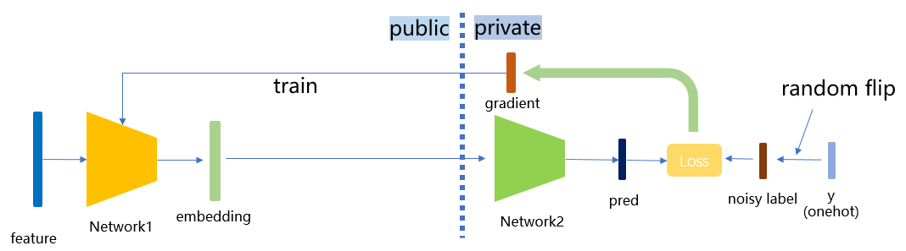

# Vertical Federated - Label Protection Based on Differential Privacy

<a href="https://gitee.com/mindspore/docs/blob/r2.0.0-alpha/docs/federated/docs/source_en/secure_vertical_federated_learning_with_DP.md" target="_blank"></a>

## Background

Vertical federated learning (vFL) is a major branch of federated learning (FL). When different participants have data from the same batch of users but with different attributes, they can use vFL for collaborative training. In vFL, the participants with user features (follower for short, participant A as shown in the figure below) hold a bottom network (Bottom Model). They input the features into the bottom network, compute the intermediate results (embedding), and send them to the participants with labels (leader for short, participant B as shown in the figure below). The leader uses these embeddings and its own labels to train the upper network (upper network), and then passes the computed gradients back to each participant to train the bottom network. It can be seen that vFL does not require any participant to upload their own raw data to collaboratively train the model.


The vFL framework avoids the direct upload of raw data, protecting data privacy at a certain level. However, there exists possibility for a semi-honest or a malicious party to infer the label information from the gradients passing back from the leader party, causing privacy disclosure. Given the large number of vFL scenarios where labels are the most valuable and most important piece of information to protect, in this context, we need to provide stronger privacy guarantees for vFL training to avoid the privacy disclosure.

Differential privacy (DP) is a definition of privacy based strictly on statistics/information theory, which currently the golden standard of privacy-preserving data analysis. The core idea behind DP is to induce randomness to overwhelm each individual data's influence on the algorithm's result, making sure that it is hard for the algorithm's results to be inverted to the individual data. The protection of DP can hold under an extreme threat model, which holds even when:

- the adversary knows all the details of the DP algorithm
- the adversary has infinite computing power
- the adversary has arbitrary auxiliary information about the raw data

Regarding the backgrounds, theories and implementation of DP, please refer to [1] for an excellent survey.

Our scheme is based on label differential privacy (label dp) [2], which provides differential privacy guarantees for the labels of the leader participants during vertical federated learning training, so that an attacker cannot invert the label information of the data from the returned gradients. Under the protection of this scheme, even if the follower party is semi-honest or malicious, the label information of the leader party is guaranteed to be protected, mitigating vFL participants' concerns on the data privacy risk.

## Algorithm Implementation

MindSpore Federated adopt a lightweight implementation of label dp. During training, a certain percentage of the labels are randomly flipped before using the label data from the leader participants. Due to the introduction of randomness, an attacker who wants to invert the labels can at most invert the labels after the random flip or perturbation, increasing the difficulty of inverting the original labels and satisfying the differential privacy guarantee. In practical applications, we can adjust the privacy parameter `eps` (which can be interpreted as the ratio of randomly flipped labels) to meet the needs of different scenarios:

- smaller `eps` (<1.0) corresponds to high privacy, low performance
- larger `eps`  (>5.0) corresponds to high performance, low privacy



The implementation of this scheme is divided into the binary case and the onehot case. Whether the input labels are binary or onehot is automatically recognized, and the same type of labels will then be output. The detailed algorithm is shown as follows:

### Binary Labels Protection

1. Calculate the flip probability $p = \frac{1}{1 + e^{eps}}$ according to the preset privacy parameter eps.
2. Flip each label with probability $p$.

### Onehot Labels Protection

1. For n classes of labels, calculate $p_1 = \frac{e^{eps}}{n - 1 + e^{eps}}$，$p_2 = \frac{1}{n - 1 + e^{eps}}$.
2. Randomly scramble the labels according to the following probabilities: the probability of keeping the current label unchanged is $p_1$ and the probability of changing to any of the other n - 1 classes is $p_2$.

## Quick Experience

We use the local case in [Wide&Deep Vertical Federated Learning Case](https://gitee.com/mindspore/federated/tree/r2.0.0-alpha/example/splitnn_criteo) as an example of how to add label dp to a vertical federated model protection.

### Front-End Needs

1. Install MindSpore 1.8.1 or its higher version, please refer to [MindSpore official website installation guide](https://www.mindspore.cn/install).
2. Install MindSpore Federated and the Python libraries which the MindSpore Federated depends on.

   ```shell
   cd federated
   python -m pip install -r requirements_test.txt
   ```

3. Prepare the criteo dataset, please refer to [Wide&Deep Vertical Federated Learning Case](https://gitee.com/mindspore/federated/tree/r2.0.0-alpha/example/splitnn_criteo).

### Starting the Script

1. Download federated

   ```bash
   git clone https://gitee.com/mindspore/federated.git
   ```

2. Go to the folder where the script is located

   ```bash
   cd federated/example/splitnn_criteo
   ```

3. Run the script

   ```bash
   sh run_vfl_train_local_label_dp.sh
   ```

### Viewing Results

Check loss changes of the model training in the training log `log_local_gpu.txt`.

```sh
INFO:root:epoch 0 step 100/2582 loss: 0.588637
INFO:root:epoch 0 step 200/2582 loss: 0.561055
INFO:root:epoch 0 step 300/2582 loss: 0.556246
INFO:root:epoch 0 step 400/2582 loss: 0.557931
INFO:root:epoch 0 step 500/2582 loss: 0.553283
INFO:root:epoch 0 step 600/2582 loss: 0.549618
INFO:root:epoch 0 step 700/2582 loss: 0.550243
INFO:root:epoch 0 step 800/2582 loss: 0.549496
INFO:root:epoch 0 step 900/2582 loss: 0.549224
INFO:root:epoch 0 step 1000/2582 loss: 0.547547
INFO:root:epoch 0 step 1100/2582 loss: 0.546989
INFO:root:epoch 0 step 1200/2582 loss: 0.552165
INFO:root:epoch 0 step 1300/2582 loss: 0.546926
INFO:root:epoch 0 step 1400/2582 loss: 0.558071
INFO:root:epoch 0 step 1500/2582 loss: 0.548258
INFO:root:epoch 0 step 1600/2582 loss: 0.546442
INFO:root:epoch 0 step 1700/2582 loss: 0.549062
INFO:root:epoch 0 step 1800/2582 loss: 0.546558
INFO:root:epoch 0 step 1900/2582 loss: 0.542755
INFO:root:epoch 0 step 2000/2582 loss: 0.543118
INFO:root:epoch 0 step 2100/2582 loss: 0.542587
INFO:root:epoch 0 step 2200/2582 loss: 0.545770
INFO:root:epoch 0 step 2300/2582 loss: 0.554520
INFO:root:epoch 0 step 2400/2582 loss: 0.551129
INFO:root:epoch 0 step 2500/2582 loss: 0.545622
...
```

## Deep Experience

We take the local case in [Wide&Deep Vertical Federated Learning Case](https://gitee.com/mindspore/federated/tree/r2.0.0-alpha/example/splitnn_criteo) as an example to introduce the specific operation method of adding label dp protection in the vertical federated model.

### Front-End Needs

Same as [Quick Experience](#quick-experience): Install MindSpore, Install MindSpore Federated, and Prepare dataset.

### Option 1: Call the integrated label dp function in the FLModel class

MindSpore Federated uses `FLModel` (see [Vertical Federated Learning Model Training Interface](https://www.mindspore.cn/federated/docs/en/r2.0.0-alpha/vertical/vertical_federated_FLModel.html) and yaml files (see [detailed configuration items of Vertical Federated Learning yaml](https://www.mindspore.cn/federated/docs/en/r2.0.0-alpha/vertical/vertical_federated_yaml.html)) to model the training process of vertical federated learning.

We have integrated the label dp function in the `FLModel` class. After the normal completion of modeling the entire vertical federated learning training process (for detailed vFl training, see [Vertical Federated Learning Model Training - Pangu Alpha Large Model Cross-Domain Training](https://www.mindspore.cn/federated/docs/en/r2.0.0-alpha/split_pangu_alpha_application.html)), users can simply add the `label_dp` submodule under the `privacy` module in the yaml file of the label side (or add it by user if there is no `privacy` module), and set the `eps` parameter in the `label_dp` module (differential privacy parameter $\epsilon$, the user can set the value of this parameter according to the actual needs). Let the model enjoy label dp protection:

```yaml
privacy:
  label_dp:
    eps: 1.0
```

### Option 2: Directly call the LabelDP class

Users can also call the `LabelDP` class directly to use the label dp function more flexibly. The `LabelDP` class is integrated in the `mindspore_federated.privacy` module. The user can define a `LabelDP` object by specifying the value of `eps`, and then pass the label group as an argument to this object. The `_call_` functio of objext will automatically recognize whether the current input is one-hot or binary label and outputs a label group processed by label dp. Refer to the following example:

```python
# make private a batch of binary labels
import numpy as np
import mindspore
from mindspore import Tensor
from mindspore_federated.privacy import LabelDP
label_dp = LabelDP(eps=0.0)
label = Tensor(np.zero(5, 1), dtype=mindspore.float32)
dp_label = label_dp(label)

# make private a batch of one-hot labels
label = Tensor(np.hstack((np.ones((5, 1)), np.zeros((5, 2)))), dtype=mindspore.float32)
dp_label = label_dp(label)
print(dp_label)
```

## References

[1] Dwork C, Roth A. The algorithmic foundations of differential privacy[J]. Foundations and Trends® in Theoretical Computer Science, 2014, 9(3–4): 211-407.

[2] Ghazi B, Golowich N, Kumar R, et al. Deep learning with label differential privacy[J]. Advances in Neural Information Processing Systems, 2021, 34: 27131-27145.

