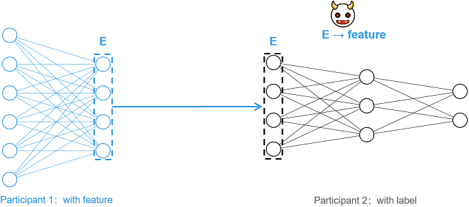
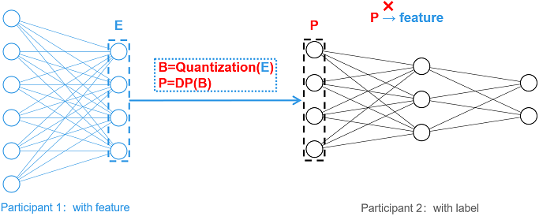

# Vertical Federated-Feature Protection Based on Information Obfuscation

[](https://gitee.com/mindspore/docs/blob/master/docs/federated/docs/source_en/secure_vertical_federated_learning_with_EmbeddingDP.md)

## Background

Vertical Federated Learning (vFL) is a mainstream and important joint learning paradigm. In vFL, n (n ≥ 2) participants have a large number of identical users, but the overlap of user characteristics is small. MindSpore Federated uses Split Learning (SL) technology to implement vFL. Taking the two-party split learning shown in the figure below as an example, each participant does not share the original data directly, but shares the intermediate features extracted by the local model for training and inference, satisfying the privacy requirement that the original data will not be leaked.

However, it has been shown [1] that an attacker (e.g., participant 2) can reduce the corresponding original data (feature) by intermediate features (E), resulting in privacy leakage. For such feature reconstruction attacks, this tutorial provides a lightweight feature protection scheme based on information obfuscation [2].



## Scheme Details

The protection scheme is named EmbeddingDP, and the overall picture is shown below. For the generated intermediate features E, the obfuscation operations such as Quantization and Differential Privacy (DP) are applied sequentially to generate P and send P to the participant 2 as an intermediate feature. The obfuscation operation greatly reduces the correlation between the intermediate features and the original input, which makes the attack more difficult.



Currently, this tutorial supports single-bit quantization and differential privacy protection based on random responses, and the details of the scheme are shown in the figure below.

1. **Single-bit quantization**: For the input vector E, single-bit quantization will set the number greater than 0 to 1 and the number less than or equal to 0 to 0, generating the binary vector B.

2. **Differential privacy based on random responses (DP)**: Differential privacy requires the configuration of the key parameter `eps`. If `eps` is not configured, no differential privacy is performed and the binary vector B is directly used as the intermediate feature to be transmitted. If `eps` is correctly configured (i.e., `eps` is a non-negative real number), the larger `eps` is, the lower the probability of confusion and the smaller the impact on the data, and at the same time, the privacy protection is relatively weak. For any dimension i in the binary vector B, if B[i] = 1, the value is kept constant with probability p. If B[i] = 0, B[i] is flipped with probability q, i.e., so that B[i] = 1. Probabilities p and q are calculated based on the following equations, where e denotes the natural base number.

$$p = \frac{e^{(eps / 2)}}{e^{(eps / 2)} + 1},\quad q = \frac{1}{e^{(eps / 2)} + 1}$$


## Feature Experience

This feature can work with one-dimensional or two-dimensional tensor arrays. One-dimensional arrays can only consist of the numbers 0 and 1, and two-dimensional arrays need to consist of one-dimensional vectors in the one-hot encoded format. After [installing MindSpore and Federated](https://mindspore.cn/federated/docs/en/master/federated_install.html#obtaining-mindspore-federated), this feature can be applied to process a tensor array that meets the requirements, as shown in the following sample program:

```python
import mindspore as ms
from mindspore import Tensor
from mindspore.common.initializer import Normal
from mindspore_federated.privacy import EmbeddingDP

ori_tensor = Tensor(shape=(2,3), dtype=ms.float32, init=Normal())
print(ori_tensor)
dp_tensor = EmbeddingDP(eps=1)(ori_tensor)
print(dp_tensor)
```

## Application Examples

### Protecting the Pangu Alpha Large Model Cross-Domain Training

#### Preparation

Download the federated code repository and follow the tutorial [Longitudinal Federated Learning Model Training - Pangu Alpha Large Model Cross-Domain Training](https://mindspore.cn/federated/docs/en/master/split_pangu_alpha_application.html#environment-preparation), configure the runtime environment and experimental dataset, and then run the single-process or multi-process example program as needed.

```bash
git clone https://gitee.com/mindspore/federated.git
```

#### Single-process Sample

1. Go to the directory where the sample is located and execute [running single-process sample](https://mindspore.cn/federated/docs/en/master/split_pangu_alpha_application.html#running-a-single-process-example) in steps 2 to 4:

    ```bash
    cd federated/example/splitnn_pangu_alpha
    ```

2. Start the training script with EmbeddingDP configured:

    ```bash
    sh run_pangu_train_local_embedding_dp.sh
    ```

3. View the training loss in the training log `splitnn_pangu_local.txt`:

    ```text
    2023-02-07 01:34:00 INFO: The embedding is protected by EmbeddingDP with eps 5.000000.
    2023-02-07 01:35:40 INFO: epoch 0 step 10/43391 loss: 10.653997
    2023-02-07 01:36:25 INFO: epoch 0 step 20/43391 loss: 10.570406
    2023-02-07 01:37:11 INFO: epoch 0 step 30/43391 loss: 10.470503
    2023-02-07 01:37:58 INFO: epoch 0 step 40/43391 loss: 10.242296
    2023-02-07 01:38:45 INFO: epoch 0 step 50/43391 loss: 9.970814
    2023-02-07 01:39:31 INFO: epoch 0 step 60/43391 loss: 9.735226
    2023-02-07 01:40:16 INFO: epoch 0 step 70/43391 loss: 9.594692
    2023-02-07 01:41:01 INFO: epoch 0 step 80/43391 loss: 9.340107
    2023-02-07 01:41:47 INFO: epoch 0 step 90/43391 loss: 9.356388
    2023-02-07 01:42:34 INFO: epoch 0 step 100/43391 loss: 8.797981
    ...
    ```

#### Multi-process Sample

1. Go to the directory where the sample is located, install the dependency packages, and configure the dataset:

    ```bash
    cd federated/example/splitnn_pangu_alpha
    python -m pip install -r requirements.txt
    cp -r {dataset_dir}/wiki ./
    ```

2. Start the training script on Server 1 with EmbeddingDP configured:

    ```bash
    sh run_pangu_train_leader_embedding_dp.sh {ip1:port1} {ip2:port2} ./wiki/train ./wiki/train
    ```

    `ip1` and `port1` denote the IP address and port number of the participating local server (server 1). `ip2` and `port2` denote the IP address and port number of the peer server (server 2). `./wiki/train` is the training dataset file path, and `./wiki/test` is the evaluation dataset file path.

3. Start training script of another participant on Server 2:

    ```bash
    sh run_pangu_train_follower.sh {ip2:port2} {ip1:port1}
    ```

4. View the training loss in the training log `leader_process.log`:

    ```text
    2023-02-07 01:39:15 INFO: config is:
    2023-02-07 01:39:15 INFO: Namespace(ckpt_name_prefix='pangu', ...)
    2023-02-07 01:39:21 INFO: The embedding is protected by EmbeddingDP with eps 5.000000.
    2023-02-07 01:41:05 INFO: epoch 0 step 10/43391 loss: 10.669225
    2023-02-07 01:41:38 INFO: epoch 0 step 20/43391 loss: 10.571924
    2023-02-07 01:42:11 INFO: epoch 0 step 30/43391 loss: 10.440327
    2023-02-07 01:42:44 INFO: epoch 0 step 40/43391 loss: 10.253876
    2023-02-07 01:43:16 INFO: epoch 0 step 50/43391 loss: 9.958257
    2023-02-07 01:43:49 INFO: epoch 0 step 60/43391 loss: 9.704673
    2023-02-07 01:44:21 INFO: epoch 0 step 70/43391 loss: 9.543740
    2023-02-07 01:44:54 INFO: epoch 0 step 80/43391 loss: 9.376131
    2023-02-07 01:45:26 INFO: epoch 0 step 90/43391 loss: 9.376905
    2023-02-07 01:45:58 INFO: epoch 0 step 100/43391 loss: 8.766671
    ...
    ```

## Works Cited

[1] Erdogan, Ege, Alptekin Kupcu, and A. Ercument Cicek. "Unsplit: Data-oblivious model inversion, model stealing, and label inference attacks against split learning." arXiv preprint arXiv:2108.09033 (2021).

[2] Anonymous Author(s). "MistNet: Towards Private Neural Network Training with Local Differential Privacy". (https://github.com/TL-System/plato/blob/2e5290c1f3acf4f604dad223b62e801bbefea211/docs/papers/MistNet.pdf)
