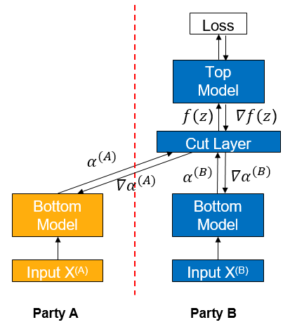
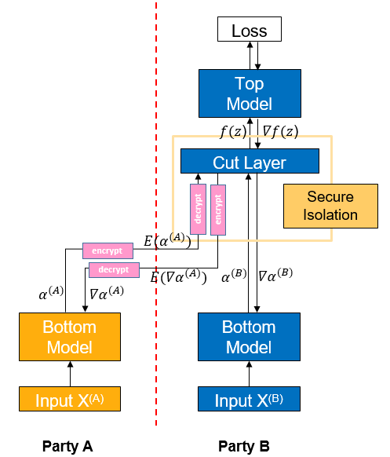

# Vertical Federated - Feature Protection Based on Trusted Execution Environment (TEE)

<a href="https://gitee.com/mindspore/docs/blob/master/docs/federated/docs/source_en/secure_vertical_federated_learning_with_TEE.md" target="_blank"></a>

Note: This is an experimental feature and may be modified or removed in the future.

## Background

Vertical federated learning (vFL) is a major branch of federated learning (FL). When different participants have data from the same batch of users but with different attributes, they can use vFL for collaborative training. In vFL, each participant with attributes holds a bottom model, and they input the attributes into the bottom model to get the intermediate result (embedding), which is sent to the participant with labels (referred to as leader paraticipant, participant B as shown in the figure below, as shown in the figure below, and the participant without labels, called follower, as shown in the figure below, as participant A). The leader side uses the embedding and labels to train the upper layer network, and then passes the calculated gradients back to each participant to train the lower layer network. It can be seen that vFL does not require any participant to upload their own raw data to collaboratively train the model.



By avoiding direct uploading of raw data, vFL protects privacy security to a certain extent, which is one of the core goals of vFL. However, it is still possible for an attacker to reverse user information from the uploaded embedding, causing privacy security risks. In such a context, we need to provide stronger privacy guarantees for the embedding and gradients transmitted during vFL training to circumvent privacy security risks.

Trusted execution environment (TEE) is a hardware-based trusted computing solution that provides data security of the computing process by making the whole computing process in hardware black-boxed relative to the outside world. By shielding the key layer in the vFL network through TEE, it can make the computation of that layer difficult to be reversed, thus ensuring the data security of the vFL training and inference process.

## Algorithm Introduction



As shown in the figure, if participant A sends the intermediate result $\alpha^{(A)}$ directly to participant B, it is easy for participant B to use the intermediate result to reverse the original data $X^{(A)}$ of participant A. To reduce such risk, participant A encrypts the intermediate result $\alpha^{(A)}$ computed by Bottom Model to get $E(\alpha^{(A)})$ first, and passes $E(\alpha^{(A)})$ to participant B. Participant B inputs $E(\alpha^{(A)})$ into the TEE-based Cut Layer, and then decrypts it into $\alpha^{(A)}$ for forward propagation inside the TEE, and the whole process is black-boxed for B.

The gradient is passed backward similarly, Cut Layer computes the gradient $\nabla\alpha^{(A)}$, encrypts it into $E(\nabla\alpha^{(A)})$ and then passes it back from participant B to participant A. Then participant A decrypts it into $\nabla\alpha^{(A)}$ and continues to do backward propagation.

## Quick Experience

We use the single-thread case in [Wide&Deep Vertical Federated Learning Case](https://gitee.com/mindspore/federated/tree/master/example/splitnn_criteo) as an example of configuring TEE protection.

### Front-End Needs and Environment Configuration

1. Environmental requirements.

   - Processor: Intel SGX (Intel Sofrware Guard Extensions) support required
   - OS: openEuler 21.03, openEuler 20.03 LTS SP2 or higher

2. Install SGX and SecGear (you can refer to [secGear official website](https://gitee.com/openeuler/secGear)).

   ```sh
   sudo yum install -y cmake ocaml-dune linux-sgx-driver sgxsdk libsgx-launch libsgx-urts sgxssl
   git clone https://gitee.com/openeuler/secGear.git
   cd secGear
   source /opt/intel/sgxsdk/environment && source environment
   mkdir debug && cd debug && cmake .. && make && sudo make install
   ```

3. To install MindSpore 1.8.1 or later in a Python environment, please refer to the [MindSpore Official Site Installation Guide](https://www.mindspore.cn/install).

4. Download federated

   ```sh
   git clone https://gitee.com/mindspore/federated.git
   ```

5. For installing MindSpore Federated relies on Python libraries, see [Wide&Deep Vertical Federated Learning Case](https://gitee.com/mindspore/federated/tree/master/example/splitnn_criteo).

6. Install MindSpore Federated for TEE compilation (before running the compilation script, you need to additionally set the MS_ENABLE_SGX environment variable to indicate whether to use SGX or not).

   ```sh
   export MS_ENABLE_SGX=ON
   sh federated/build.sh
   pip install federated/build/packages/mindspore_federated-XXXXX.whl
   ```

7. To prepare the criteo dataset, please refer to [Wide&Deep Vertical Federated Learning Case](https://gitee.com/mindspore/federated/tree/master/example/splitnn_criteo).

### Starting the Script

1. Go to the folder where the script is located

   ```sh
   cd federated/example/splitnn_criteo
   ```

2. Run the script

   ```sh
   sh run_vfl_train_TEE.sh
   ```

### Viewing Results

Check loss changes of the model training in the training log `log_local_cpu_custom.txt`.

```sh
INFO:root:epoch 0 step 100/41322 wide_loss: 0.661822 deep_loss: 0.662018
INFO:root:epoch 0 step 100/41322 wide_loss: 0.685003 deep_loss: 0.685198
INFO:root:epoch 0 step 200/41322 wide_loss: 0.649380 deep_loss: 0.649381
INFO:root:epoch 0 step 300/41322 wide_loss: 0.612189 deep_loss: 0.612189
INFO:root:epoch 0 step 400/41322 wide_loss: 0.630079 deep_loss: 0.630079
INFO:root:epoch 0 step 500/41322 wide_loss: 0.602897 deep_loss: 0.602897
INFO:root:epoch 0 step 600/41322 wide_loss: 0.621647 deep_loss: 0.621647
INFO:root:epoch 0 step 700/41322 wide_loss: 0.624762 deep_loss: 0.624762
INFO:root:epoch 0 step 800/41322 wide_loss: 0.622042 deep_loss: 0.622042
INFO:root:epoch 0 step 900/41322 wide_loss: 0.585274 deep_loss: 0.585274
INFO:root:epoch 0 step 1000/41322 wide_loss: 0.590947 deep_loss: 0.590947
INFO:root:epoch 0 step 1100/41322 wide_loss: 0.586775 deep_loss: 0.586775
INFO:root:epoch 0 step 1200/41322 wide_loss: 0.597362 deep_loss: 0.597362
INFO:root:epoch 0 step 1300/41322 wide_loss: 0.607390 deep_loss: 0.607390
INFO:root:epoch 0 step 1400/41322 wide_loss: 0.584204 deep_loss: 0.584204
INFO:root:epoch 0 step 1500/41322 wide_loss: 0.583618 deep_loss: 0.583618
INFO:root:epoch 0 step 1600/41322 wide_loss: 0.573294 deep_loss: 0.573294
INFO:root:epoch 0 step 1700/41322 wide_loss: 0.600686 deep_loss: 0.600686
INFO:root:epoch 0 step 1800/41322 wide_loss: 0.585533 deep_loss: 0.585533
INFO:root:epoch 0 step 1900/41322 wide_loss: 0.583466 deep_loss: 0.583466
INFO:root:epoch 0 step 2000/41322 wide_loss: 0.560188 deep_loss: 0.560188
INFO:root:epoch 0 step 2100/41322 wide_loss: 0.569232 deep_loss: 0.569232
INFO:root:epoch 0 step 2200/41322 wide_loss: 0.591643 deep_loss: 0.591643
INFO:root:epoch 0 step 2300/41322 wide_loss: 0.572473 deep_loss: 0.572473
INFO:root:epoch 0 step 2400/41322 wide_loss: 0.582825 deep_loss: 0.582825
INFO:root:epoch 0 step 2500/41322 wide_loss: 0.567196 deep_loss: 0.567196
INFO:root:epoch 0 step 2600/41322 wide_loss: 0.602022 deep_loss: 0.602022
```

## Deep Experience

The forward and backward propagation of the TEE layer requires calling its own functions rather than MindSpore, so there are differences in implementation from the usual vFL model.

Usually, the Top Model and Cut Layer are put together for the backpropagation of the vFL model during training, and are derived and updated in one step by Participant B through MindSpore. When the network containing TEE is back propagated, the Top Model is updated by Participant B based on MindSpore, while the Cut Layer (TEE) is updated within itself after receiving the gradients back from the Top Model. The gradients that need to be passed back to Participant A are encrypted and passed out to Participant B. The whole process is done within the TEE.

Currently in MindSpore Federated, the above function is used to implement a custom backward propagation process by passing `grad_network` into the `mindspore_federated.vfl_model.FLModel()` definition. Therefore, to implement a network containing TEE, the user can define the backward propagation process for Top Model and Cut Layer in `grad_network` and just pass in `FLModel`, and `FLModel` will go through the user-defined training process during backward propagation.

We use the single-thread case in [Wide&Deep Vertical Federated Learning Case](https://gitee.com/mindspore/federated/tree/master/example/splitnn_criteo) as an example of how to configure TEE protection in a vertical federated model. The presentation focuses on the differences between the configuration and the usual case when using TEE, and the same points will be skipped (a detailed description of vFL training can be found in [Vertical Federated Learning Model Training - Pangu Alpha Large Model Cross-Domain Training](https://mindspore.cn/federated/docs/zh-CN/master/split_pangu_alpha_application.html).

### Front-End Needs and Environment Configuration

Refer to [Quick Experience](#quick-experience).

### Defining the Network Model

#### Forward Propagation

As usual vFL training, users need to define a network model containing TEE based on the `nn.Cell` provided by MindSpore (see [mindspore.nn.Cell](https://mindspore.cn/docs/en/master/api_python/nn/mindspore.nn.Cell.html#mindspore-nn-cell)) to develop the training network. The difference is that at the layer where the TEE is located, the user needs to call the TEE forward propagation function in the `construct` function of the class:

```python
class TeeLayer(nn.Cell):
    """
    TEE layer of the leader net.
    Args:
        config (class): default config info.
    """
    def __init__(self, config):
        super(TeeLayer, self).__init__()
        init_tee_cut_layer(config.batch_size, 2, 2, 1, 3.5e-4, 1024.0)
        self.concat = ops.Concat(axis=1)
        self.reshape = ops.Reshape()

    def construct(self, wide_out0, deep_out0, wide_embedding, deep_embedding):
        """Convert and encrypt the intermediate data"""
        local_emb = self.concat((wide_out0, deep_out0))
        remote_emb = self.concat((wide_embedding, deep_embedding))
        aa = remote_emb.flatten().asnumpy().tolist()
        bb = local_emb.flatten().asnumpy().tolist()
        enc_aa, enc_aa_len = encrypt_client_data(aa, len(aa))
        enc_bb, enc_bb_len = encrypt_client_data(bb, len(bb))
        tee_output = secure_forward_tee_cut_layer(remote_emb.shape[0], remote_emb.shape[1],
                                                  local_emb.shape[1], enc_aa, enc_aa_len, enc_bb, enc_bb_len, 2)
        tee_output = self.reshape(Tensor(tee_output), (remote_emb.shape[0], 2))
        return tee_output
```

#### Backward Propagation

In the usual vfl model, backward propagation is automatically configured by the `FLModel` class, but in models containing TEE, the user needs to develop a `grad_network` to define the backward propagation process. `grad_network` is also based on `nn.Cell` and includes a `__init__` function and a `construct` function. When initializing, you need to pass in the network used for training and define in the `__init__` function: the derivative operator, the parameters for the network outside Cut Layer, the loss function, the Optimizer for the network outside the Cut Layer. The example is as follows:

```python
class LeaderGradNet(nn.Cell):
    """
    grad_network of the leader party.
    Args:
        net (class): LeaderNet, which is the net of leader party.
        config (class): default config info.
    """

    def __init__(self, net: LeaderNet):
        super().__init__()
        self.net = net
        self.sens = 1024.0

        self.grad_op_param_sens = ops.GradOperation(get_by_list=True, sens_param=True)
        self.grad_op_input_sens = ops.GradOperation(get_all=True, sens_param=True)

        self.params_head = ParameterTuple(net.head_layer.trainable_params())
        self.params_bottom_deep = vfl_utils.get_params_by_name(self.net.bottom_net, ['deep', 'dense'])
        self.params_bottom_wide = vfl_utils.get_params_by_name(self.net.bottom_net, ['wide'])

        self.loss_net = HeadLossNet(net.head_layer)
        self.loss_net_l2 = L2LossNet(net.bottom_net, config)

        self.optimizer_head = Adam(self.params_head, learning_rate=3.5e-4, eps=1e-8, loss_scale=self.sens)
        self.optimizer_bottom_deep = Adam(self.params_bottom_deep, learning_rate=3.5e-4, eps=1e-8, loss_scale=self.sens)
        self.optimizer_bottom_wide = FTRL(self.params_bottom_wide, learning_rate=5e-2, l1=1e-8, l2=1e-8,
                                          initial_accum=1.0, loss_scale=self.sens)
```

The input to the `construct` function of `grad_network` is two dictionaries `local_data_batch` and `remote_data_batch`. In the `construct` function, you first need to extract the corresponding data from the dictionaries. Next, the layers other than TEE need to call the MindSpore derivative operators on the parameters and the input for the derivative operation and update with the optimizer respectively. The TEE layer needs to call the built-in functions of TEE for the derivative and update. The examples are as follows:

```python
def construct(self, local_data_batch, remote_data_batch):
    """
    The backward propagation of the leader net.
    """
    # data processing
    id_hldr = local_data_batch['id_hldr']
    wt_hldr = local_data_batch['wt_hldr']
    label = local_data_batch['label']
    wide_embedding = remote_data_batch['wide_embedding']
    deep_embedding = remote_data_batch['deep_embedding']

    # forward
    wide_out0, deep_out0 = self.net.bottom_net(id_hldr, wt_hldr)
    local_emb = self.concat((wide_out0, deep_out0))
    remote_emb = self.concat((wide_embedding, deep_embedding))
    head_input = self.net.cut_layer(wide_out0, deep_out0, wide_embedding, deep_embedding)
    loss = self.loss_net(head_input, label)

    # update of head net
    sens = ops.Fill()(ops.DType()(loss), ops.Shape()(loss), 1024.0)
    grad_head_input, _ = self.grad_op_input_sens(self.loss_net)(head_input, label, sens)
    grad_head_param = self.grad_op_param_sens(self.loss_net, self.params_head)(head_input, label, sens)
    self.optimizer_head(grad_head_param)

    # update of cut layer

    tmp = grad_head_input.flatten().asnumpy().tolist()
    grad_input = backward_tee_cut_layer(remote_emb.shape[0], remote_emb.shape[1], local_emb.shape[1], 1, tmp)
    grad_inputa = self.reshape(Tensor(grad_input[0]), remote_emb.shape)
    grad_inputb = self.reshape(Tensor(grad_input[1]), local_emb.shape)
    grad_cutlayer_input = (grad_inputb[:, :1], grad_inputb[:, 1:2], grad_inputa[:, :1], grad_inputa[:, 1:2])

    # update of bottom net
    grad_bottom_wide = self.grad_op_param_sens(self.net.bottom_net,
                                               self.params_bottom_wide)(id_hldr, wt_hldr,
                                                                        grad_cutlayer_input[0:2])
    self.optimizer_bottom_wide(grad_bottom_wide)
    grad_bottom_deep = self.grad_op_param_sens(self.net.bottom_net,
                                               self.params_bottom_deep)(id_hldr, wt_hldr,
                                                                        grad_cutlayer_input[0:2])
    grad_bottom_l2 = self.grad_op_param_sens(self.loss_net_l2, self.params_bottom_deep)(sens)
    zipped = zip(grad_bottom_deep, grad_bottom_l2)
    grad_bottom_deep = tuple(map(sum, zipped))
    self.optimizer_bottom_deep(grad_bottom_deep)

    # output the gradients for follower party
    scales = {}
    scales['wide_loss'] = OrderedDict(zip(['wide_embedding', 'deep_embedding'], grad_cutlayer_input[2:4]))
    scales['deep_loss'] = scales['wide_loss']
    return scales
```

#### Definig the Optimizer

When defining the optimizer, there is no need to define the backward propagation part covered by `grad_network` in the yaml file, otherwise there is no difference with the usual vfl model to define the optimizer.

### Constructing the Training Script

#### Constructing the Network

As the usual vFL training, users need to use the classes provided by MindSpore Federated to wrap their constructed networks into a vertical federated network. Detailed API documentation can be found in [Vertical Federated Training Interface](https://gitee.com/mindspore/federated/blob/master/docs/api/api_python_en/vertical/vertical_federated_FLModel.rst). The difference is that when constructing the leader network, you need to add `grad_network`.

```python
from mindspore_federated import FLModel, FLYamlData
from network_config import config
from wide_and_deep import LeaderNet, LeaderLossNet, LeaderGradNet


leader_base_net = LeaderNet(config)
leader_train_net = LeaderLossNet(leader_base_net, config)
leader_grad_net = LeaderGradNet(leader_base_net, config)

leader_yaml_data = FLYamlData(config.leader_yaml_path)
leader_fl_model = FLModel(yaml_data=leader_yaml_data,
                          network=leader_base_net,
                          grad_network=Leader_grad_net,
                          train_network=leader_train_net)
```

Except for the above, the rest of TEE training is identical to the usual vFL training, and the user can enjoy the security of TEE once the configuration is completed.
