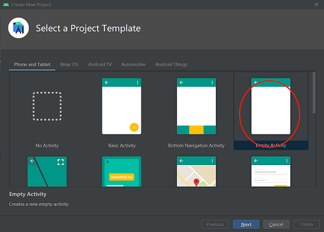
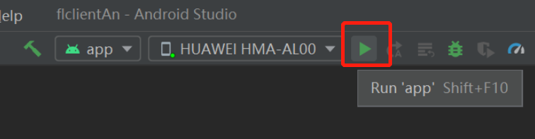

# Implementing a Sentiment Classification Application (Android)

<!-- TOC -->

- [Implementing a Sentiment Classification Application (Android)](#implementing-a-sentiment-classification-application-android)
    - [Preparations](#preparations)
        - [Environment](#environment)
        - [Data](#data)
        - [Model-related Files](#model-related-files)
    - [Defining the Network](#defining-the-network)
        - [Generating a Device Model File](#generating-a-device-model-file)
            - [Exporting a Model as a MindIR File](#exporting-a-model-as-a-mindir-file)
            - [Converting the MindIR File into an MS File that Can Be Used by the Federated Learning Framework on the Device](#converting-the-mindir-file-into-an-ms-file-that-can-be-used-by-the-federated-learning-framework-on-the-device)
    - [Starting the Federated Learning Process](#starting-the-federated-learning-process)
        - [Creating an Android Project](#creating-an-android-project)
        - [Building the MindSpore Lite AAR Package](#building-the-mindspore-lite-aar-package)
        - [Android Instance Program Structure](#android-instance-program-structure)
        - [Writing Code](#writing-code)
        - [Configuring Android Project Dependencies](#configuring-android-project-dependencies)
        - [Building and Running on Android](#building-and-running-on-android)
    - [Experiment Result](#experiment-result)
    - [References](#references)

<!-- /TOC -->

<a href="https://gitee.com/mindspore/docs/blob/r1.5/docs/federated/docs/source_en/sentiment_classification_application.md" target="_blank"></a>

In privacy compliance scenarios, the federated learning modeling mode based on device-cloud synergy can make full use of the advantages of device data and prevent sensitive user data from being directly reported to the cloud. When exploring the application scenarios of federated learning, we notice the input method scenario. Users attach great importance to their text privacy and intelligent functions on the input method. Therefore, federated learning is naturally applicable to the input method scenario. MindSpore Federated applies the federated language model to the emoji prediction function of the input method. The federated language model recommends emojis suitable for the current context based on the chat text data. During federated learning modeling, each emoji is defined as a sentiment label category, and each chat phrase corresponds to an emoji. MindSpore Federated defines the emoji prediction task as a federated sentiment classification task.

## Preparations

### Environment

For details, see [Server Environment Configuration](https://www.mindspore.cn/federated/docs/en/r1.5/deploy_federated_server.html) and [Client Environment Configuration](https://www.mindspore.cn/federated/docs/en/r1.5/deploy_federated_client.html).

### Data

The [training data](https://mindspore-website.obs.cn-north-4.myhuaweicloud.com/notebook/datasets/supervise/client.tar.gz) contains 100 user chat files. The directory structure is as follows:

```text
mobile/datasets/train/
├── 0.tsv  # Training data of user 0
├── 1.tsv  # Training data of user 1
│
│          ......
│
└── 99.tsv  # Training data of user 99
```

The [validation data](https://mindspore-website.obs.cn-north-4.myhuaweicloud.com/notebook/datasets/supervise/eval.tar.gz) contains one chat file. The directory structure is as follows:

```text
mobile/datasets/eval/
├── 0.tsv  # Validation data
```

The [emoji data corresponding to labels](https://mindspore-website.obs.cn-north-4.myhuaweicloud.com/notebook/datasets/memo.tar.gz) contains 107 images. The directory structure is as follows:

```text
mobile/datasets/memo/
├── 0.gif  # Emoji corresponding to the 0th label
├── 1.gif  # Emoji corresponding to the first label
│
│          ......
│
└── 106.gif  # Emoji corresponding to the 106th label
```

### Model-related Files

The directory structures of the initial [checkpoint](https://mindspore-website.obs.cn-north-4.myhuaweicloud.com/notebook/models/albert_init.ckpt) and [dictionary](https://mindspore-website.obs.cn-north-4.myhuaweicloud.com/notebook/datasets/vocab.txt) required for generating a model are as follows:

```text
mobile/models/
├── albert_init.ckpt  # Initial checkpoint
└── vocab.txt  # Dictionary
```

## Defining the Network

The ALBERT language model[1] is used in federated learning. The ALBERT model on the client includes the embedding layer, encoder layer, and classifier layer.

For details about the network definition, see [source code](https://gitee.com/mindspore/mindspore/tree/r1.5/tests/st/fl/mobile/src/model.py).

### Generating a Device Model File

#### Exporting a Model as a MindIR File

The sample code is as follows:

```python
import numpy as np
from mindspore import export, Tensor
from src.config import train_cfg, client_net_cfg
from src.cell_wrapper import NetworkTrainCell

# Build a model.
client_network_train_cell = NetworkTrainCell(client_net_cfg)

# Build input data.
input_ids = Tensor(np.zeros((train_cfg.batch_size, client_net_cfg.seq_length), dtype=np.int32))
attention_mask = Tensor(np.zeros((train_cfg.batch_size, client_net_cfg.seq_length), dtype=np.int32))
token_type_ids = Tensor(np.zeros((train_cfg.batch_size, client_net_cfg.seq_length), dtype=np.int32))
label_ids = Tensor(np.zeros((train_cfg.batch_size, client_net_cfg.num_labels), dtype=np.int32))

# Export the model.
export(client_network_train_cell, input_ids, attention_mask, token_type_ids, label_ids, file_name='albert_train.mindir', file_format='MINDIR')
```

#### Converting the MindIR File into an MS File that Can Be Used by the Federated Learning Framework on the Device

For details about how to generate a model file on the device, see [Implementing an Image Classification Application](./image_classification_application.md).

## Starting the Federated Learning Process

Start the script on the server. For details, see [Cloud-based Deployment](https://www.mindspore.cn/federated/docs/en/r1.5/deploy_federated_server.html)

Based on the training and inference tasks of the ALBERT model, the overall process is as follows:

1. Create an Android project.

2. Build the MindSpore Lite AAR package.

3. Describe the Android instance program structure.

4. Write code.

5. Configure Android project dependencies.

6. Build and run on Android.

### Creating an Android Project

Create a project in Android Studio and install the corresponding SDK. (After the SDK version is specified, Android Studio automatically installs the SDK.)



### Building the MindSpore Lite AAR Package

- For details, see [Federated Learning Deployment](./deploy_federated_client.md).

- Name of the generated Android AAR package:

  ```sh
  mindspore-lite-<version>.aar
  ```

- Place the AAR package in the app/libs/ directory of the Android project.

### Android Instance Program Structure

```text
app
│   ├── libs # Binary archive file of the Android library project
|   |   └── mindspore-lite-version.aar #  MindSpore Lite archive file of the Android version
├── src/main
│   ├── assets # Resource directory
|   |   └── model # Model directory
|   |       └── albert_ad_train.mindir.ms # Pre-trained model file
│   |       └── albert_ad_infer.mindir.ms # Inference model file
│   |   └── data # Data directory
|   |       └── 140.txt # Model data file
|   |       └── vocab.txt # Dictionary file
|   |       └── vocab_map_ids.txt # Dictionary ID mapping file
|   |       └── eval.txt # Training result evaluation file
|   |       └── eval_no_label.txt # Inference data file
│   |
│   ├── java # Application code at the Java layer
│   │       └── ... Storing Android code files. Related directories can be customized.
│   │
│   ├── res # Resource files related to Android
│   └── AndroidManifest.xml # Android configuration file
│
│
├── build.gradle # Android project build file
├── download.gradle # Downloading the project dependency files
└── ...
```

### Writing Code

1. AssetCopyer.java: This code file is used to store the resource files in the app/src/main/assets directory of the Android project to the disk of the Android system. In this way, the federated learning framework API can read the resource files based on the absolute path during model training and inference.

    ```java
    import android.content.Context;

    import java.io.File;
    import java.io.FileOutputStream;
    import java.io.InputStream;
    import java.util.logging.Logger;

    public class AssetCopyer {
        private static final Logger LOGGER = Logger.getLogger(AssetCopyer.class.toString());
        public static void copyAllAssets(Context context,String destination) {
            LOGGER.info("destination: " + destination);
            copyAssetsToDst(context,"",destination);
        }
        // Copy the resource files in the assets directory to the disk of the Android system. You can view the specific path by printing destination.
        private static void copyAssetsToDst(Context context,String srcPath, String dstPath) {
            try {
                // Recursively obtain all file names in the assets directory.
                String[] fileNames =context.getAssets().list(srcPath);
                if (fileNames.length > 0) {
                    // Build the destination file object.
                    File file = new File(dstPath);
                    // Create a destination directory.
                    file.mkdirs();
                    for (String fileName : fileNames) {
                        // Copy the file to the specified disk.
                        if(!srcPath.equals("")) {
                            copyAssetsToDst(context,srcPath + "/" + fileName,dstPath+"/"+fileName);
                        }else{
                            copyAssetsToDst(context, fileName,dstPath+"/"+fileName);
                        }
                    }
                } else {
                    // Build the input stream of the source file.
                    InputStream is = context.getAssets().open(srcPath);
                    // Build the output stream of the destination file.
                    FileOutputStream fos = new FileOutputStream(new File(dstPath));
                    // Define a 1024-byte buffer array.
                    byte[] buffer = new byte[1024];
                    int byteCount=0;
                    // Write the source file to the destination file.
                    while((byteCount=is.read(buffer))!=-1) {
                        fos.write(buffer, 0, byteCount);
                    }
                    // Refresh the output stream.
                    fos.flush();
                    // Close the input stream.
                    is.close();
                    // Close the output stream.
                    fos.close();
                }
            } catch (Exception e) {
                e.printStackTrace();
            }
        }
    }
    ```

2. FlJob.java: This code file is used to define training and inference tasks. For details about federated learning APIs, see [Federal Learning APIs](https://www.mindspore.cn/federated/api/en/r1.5/interface_description_federated_client.html).

    ```java
    import android.annotation.SuppressLint;
    import android.os.Build;
    import androidx.annotation.RequiresApi;
    import com.mindspore.flAndroid.utils.AssetCopyer;
    import com.mindspore.flclient.FLParameter;
    import com.mindspore.flclient.SyncFLJob;
    import java.util.Arrays;
    import java.util.UUID;
    import java.util.logging.Logger;
    public class FlJob {
        private static final Logger LOGGER = Logger.getLogger(AssetCopyer.class.toString());
        private final String parentPath;
        public FlJob(String parentPath) {
            this.parentPath = parentPath;
        }
        // Android federated learning training task
        @SuppressLint("NewApi")
        @RequiresApi(api = Build.VERSION_CODES.M)
        public void syncJobTrain() {
            String trainDataset = parentPath + "/data/0.txt";
            String vocal_file = parentPath + "/data/vocab.txt";
            String idsFile = parentPath + "/data/vocab_map_ids.txt";
            String testDataset = parentPath + "/data/eval.txt";
            String trainModelPath = parentPath + "/model/albert_supervise.mindir.ms";
            String inferModelPath = parentPath + "/model/albert_supervise.mindir.ms";
            String flName = "albert";
            boolean useSSL = false;
            // The url for device-cloud communication. Ensure that the Android device can access the server. Otherwise, the message "connection failed" is displayed.
            String domainName = "http://10.113.216.106:6668";
            FLParameter flParameter = FLParameter.getInstance();
            flParameter.setTrainDataset(trainDataset);
            flParameter.setVocabFile(vocal_file);
            flParameter.setIdsFile(idsFile);
            flParameter.setTestDataset(testDataset);
            flParameter.setFlName(flName);
            flParameter.setTrainModelPath(trainModelPath);
            flParameter.setInferModelPath(inferModelPath);
            flParameter.setUseSSL(useSSL);
            flParameter.setDomainName(domainName);
            SyncFLJob syncFLJob = new SyncFLJob();
            syncFLJob.flJobRun();
        }
        // Android federated learning inference task
        public void syncJobPredict() {
            String flName = "albert";
            String dataPath = parentPath + "/data/eval_no_label.txt";
            String vocal_file = parentPath + "/data/vocab.txt";
            String idsFile = parentPath + "/data/vocab_map_ids.txt";
            String modelPath = parentPath + "/model/albert_supervise.mindir.ms";
            FLParameter flParameter = FLParameter.getInstance();
            flParameter.setFlName(flName);
            flParameter.setTestDataset(dataPath);
            flParameter.setVocabFile(vocabFile);
            flParameter.setIdsFile(idsFile);
            flParameter.setInferModelPath(modelPath);
            SyncFLJob syncFLJob = new SyncFLJob();
            int[] labels = syncFLJob.modelInference();
            LOGGER.info("labels = " + Arrays.toString(labels));
        }
    }
    ```

3. MainActivity.java: This code file is used to start federated learning training and inference tasks.

    ```java
    import android.os.Build;
    import android.os.Bundle;

    import androidx.annotation.RequiresApi;
    import androidx.appcompat.app.AppCompatActivity;

    import com.huawei.flAndroid.job.FlJob;
    import com.huawei.flAndroid.utils.AssetCopyer;

    @RequiresApi(api = Build.VERSION_CODES.P)
    public class MainActivity extends AppCompatActivity {
        private String parentPath;
        @Override
        protected void onCreate(Bundle savedInstanceState) {
            super.onCreate(savedInstanceState);
            // Obtain the disk path of the application in the Android system.
            this.parentPath = this.getExternalFilesDir(null).getAbsolutePath();
            // Copy the resource files in the assets directory to the disk of the Android system.
            AssetCopyer.copyAllAssets(this.getApplicationContext(), parentPath);
            // Create a thread and start the federated learning training and inference tasks.
            new Thread(() -> {
                FlJob flJob = new FlJob(parentPath);

                flJob.syncJobTrain();
                flJob.syncJobPredict();
            }).start();
        }
    }
    ```

### Configuring Android Project Dependencies

1. AndroidManifest.xml

    ```xml
    <?xml version="1.0" encoding="utf-8"?>
    <manifest xmlns:android="http://schemas.android.com/apk/res/android"
        package="com.huawei.flAndroid">
        <!-- Allow network access.-->
        <uses-permission android:name="android.permission.INTERNET" />
        <application
            android:allowBackup="true"
            android:supportsRtl="true"
            android:usesCleartextTraffic="true"
            android:theme="@style/Theme.Flclient">
            <!--Customize the location of the MainActivity file.-->
            <activity android:name="com.huawei.flAndroid.activity.MainActivity">
                <intent-filter>
                    <action android:name="android.intent.action.MAIN" />
                    <category android:name="android.intent.category.LAUNCHER" />
                </intent-filter>
            </activity>
        </application>
    </manifest>
    ```

2. app/build.gradle

    ```text
    plugins {
        id 'com.android.application'
    }
    android {
        // Android SDK build version. It is recommended that the version be later than 27.
        compileSdkVersion 30
        buildToolsVersion "30.0.3"
        defaultConfig {
            applicationId "com.huawei.flAndroid"
            minSdkVersion 27
            targetSdkVersion 30
            versionCode 1
            versionName "1.0"
            multiDexEnabled true
            testInstrumentationRunner "androidx.test.runner.AndroidJUnitRunner"
            ndk {
                // Different mobile phone models correspond to different NDKs. Mate 20 corresponds to 'armeabi-v7a'.
                abiFilters 'armeabi-v7a'
            }
        }
        // Specified NDK version
        ndkVersion '21.3.6528147'
        sourceSets{
            main {
                // Specified JNI directory
                jniLibs.srcDirs = ['libs']
                jni.srcDirs = []
            }
        }
        compileOptions {
            sourceCompatibility JavaVersion.VERSION_1_8
            targetCompatibility JavaVersion.VERSION_1_8
        }
    }
    dependencies {
        // AAR package to be scanned in the libs directory
        implementation fileTree(dir:'libs',include:['*.aar'])
        implementation 'androidx.appcompat:appcompat:1.1.0'
        implementation 'com.google.android.material:material:1.1.0'
        implementation 'androidx.constraintlayout:constraintlayout:1.1.3'
        androidTestImplementation 'androidx.test.ext:junit:1.1.1'
        androidTestImplementation 'androidx.test.espresso:espresso-core:3.2.0'
        implementation 'com.android.support:multidex:1.0.3'

        // Add third-party open source software that federated learning relies on
        implementation group: 'com.squareup.okhttp3', name: 'okhttp', version: '3.14.9'
        implementation group: 'com.google.flatbuffers', name: 'flatbuffers-java', version: '2.0.0'
        implementation(group: 'org.bouncycastle',name: 'bcprov-jdk15on', version: '1.68')
    }
    ```

### Building and Running on Android

1. Connect to the Android device and run federated learning training and inference applications. Connect to the Android device through a USB cable for debugging. Click `Run 'app'` to run the federated learning task on your device.

    

2. For details about how to connect the Android Studio to a device for debugging, see <https://developer.android.com/studio/run/device>. Android Studio can identify the mobile phone only when USB debugging mode is enabled on the mobile phone. For Huawei phones, enable USB debugging mode by choosing Settings > System & updates > Developer options > USB debugging.

3. Continue the installation on the Android device. After the installation is complete, you can start the app to train and infer the ALBERT model for federated learning.

4. The program running result is as follows:

   ```text
   I/SyncFLJob: <FLClient> [model inference] inference finish
   I/SyncFLJob: labels = [2, 0, 0, 0, 0, 1, 1, 1, 1, 2, 2, 2, 2, 4, 4, 4, 4]
   ```

## Experiment Result

The total number of federated learning iterations is 5, the number of epochs for local training on the client is 10, and the value of batchSize is 16.

|        | Top 1 Accuracy| Top 5 Accuracy|
| ------ | -------- | -------- |
| ALBERT | 24%      | 70%      |

## References

[1] Lan Z ,  Chen M ,  Goodman S , et al. ALBERT: A Lite BERT for Self-supervised Learning of Language Representations[J].  2019.
