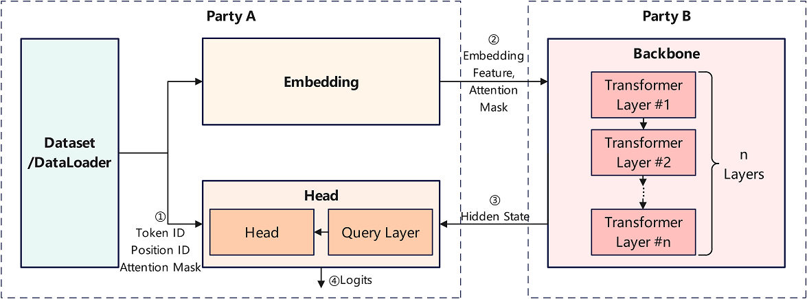

# Vertical Federated Learning Model Training - Pangu Alpha Large Model Cross-Domain Training

<a href="https://gitee.com/mindspore/docs/blob/master/docs/federated/docs/source_en/split_pangu_alpha_application.md" target="_blank"></a>

## Overview

With the advancement of hardware computing power and the continuous expansion of network data size, pre-training large models has increasingly become an important research direction in fields such as natural language processing and graphical multimodality. Take Pangu Alpha, which released a large pre-trained model of Chinese NLP in 2021, as an example, the number of model parameters reaches 200 billion, and the training process relies on massive data and advanced computing centers, which limits its application landing and technology evolution. A feasible solution is to integrate the computing power and data resources of multiple participants based on vertical federated learning or split learning techniques to achieve cross-domain collaborative training of pre-trained large models while ensuring security and privacy.

MindSpore Federated provides a vertical federated learning base functional component based on split learning. This sample provides a federated learning training sample for large NLP models by taking the Pangaea alpha model as an example.



As shown in the figure above, in this case, the Pangaea α model is sliced into three sub-networks, such as Embedding, Backbone and Head. The front-level subnetwork Embedding and the end-level subnetwork Head are deployed in the network domain of participant A, and the Backbone subnetwork containing multi-level Transformer modules is deployed in the network domain of participant B. The Embedding subnetwork and Head subnetwork read the data held by participant A and dominate the training and inference tasks for performing the Pangaea α model.

* In the forward inference stage, Participant A uses the Embedding subnetwork to process the original data and transmits the output Embedding Feature tensor and Attention Mask Feature tensor to Participant B as the input of Participant B Backbone subnetwork. Then, Participant A reads the Hide State Feature tensor output from the Backbone subnetwork as the input of Participant A Head subnetwork, and finally the predicted result or loss value is output by the Head sub-network.

* In the backward propagation phase, after completing the gradient calculation and parameter update of the Head subnetwork, Participant A transmits the gradient tensor associated with the Hide State Feature tensor to Participant B for the gradient calculation and parameter update of the Backbone subnetwork. Then, Participant B transmits the gradient tensor associated with the Embedding Feature tensor to Participant A for the gradient calculation and parameter update of the Embedding subnetwork after completing the gradient calculation and parameter update of the Backbone subnetwork.

The feature tensor and gradient tensor exchanged between participant A and participant B during the above forward inference and backward propagation are processed by using privacy security mechanisms and encryption algorithms, so that it is not necessary to transmit the data held by participant A to participant B for implementing the collaboration training of the network model by the two participants. Due to the small number of Embedding and Head subnetwork parameters and the huge number of Backbone subnetwork parameters, this sample application is suitable for the large model collaboration training or deployment between the service side (corresponding to participant A) and the computing center (corresponding to participant B).

For a detailed introduction to the pangu α model principles, please refer to [MindSpore ModelZoo - pangu_alpha](https://gitee.com/mindspore/models/tree/master/official/nlp/pangu_alpha), [Introduction to Pengcheng -pangu α](https://git.openi.org.cn/PCL-Platform.Intelligence/PanGu-Alpha), and its [research paper](https://arxiv.org/pdf/2104.12369.pdf).

## Preparation

### Environment Preparation

1. Refer to [Obtaining MindSpore Federated](https://mindspore.cn/federated/docs/en/master/federated_install.html) to install MindSpore version 1.8.1 and above and MindSpore Federated.

2. Download the MindSpore Federated code and install the Python packages that this sample application depends on.

    ```bash
    git https://gitee.com/mindspore/federated.git
    cd federated/example/splitnn_pangu_alpha/
    python -m pip install -r requirements.txt
    ```

### Dataset Preparation

Before running the sample, refer to [MindSpore ModelZoo - pangu_alpha - Dataset Generation](https://gitee.com/mindspore/models/tree/master/official/nlp/pangu_alpha#dataset-generation) and use the preprocess.py script to convert the raw text corpus for training into a dataset that can be used for model training.

## Defining the Vertical Federated Learning Training Process

MindSpore Federated Vertical Federated Learning Framework uses FLModel (see [Vertical Federated Learning Model Training Interface](https://mindspore.cn/federated/docs/en/master/vertical/vertical_federated_FLModel.html)) and yaml files (see [Yaml Configuration file for model training of vertical federated learning](https://mindspore.cn/federated/docs/en/master/vertical/vertical_federated_yaml.html)), to model vertical federated learning training process.

### Defining the Network Model

1. Call the function components provided by MindSpore and take nn.Cell (see [mindspore.nn.Cell](https://mindspore.cn/docs/en/master/api_python/nn/mindspore.nn.Cell.html#mindspore-nn-cell)) as a base class to program the training network of this participant to be involved in vertical federated learning. Taking the Embedding subnetwork of participant A in this application practice as an example, [sample code](https://gitee.com/mindspore/federated/blob/master/example/splitnn_pangu_alpha/src/split_pangu_alpha.py) is as follows:

   ```python
   class EmbeddingLossNet(nn.Cell):
       """
       Train net of the embedding party, or the tail sub-network.
       Args:
           net (class): EmbeddingLayer, which is the 1st sub-network.
           config (class): default config info.
       """

       def __init__(self, net: EmbeddingLayer, config):
           super(EmbeddingLossNet, self).__init__(auto_prefix=False)

           self.batch_size = config.batch_size
           self.seq_length = config.seq_length
           dp = config.parallel_config.data_parallel
           self.eod_token = config.eod_token
           self.net = net
           self.slice = P.StridedSlice().shard(((dp, 1),))
           self.not_equal = P.NotEqual().shard(((dp, 1), ()))
           self.batch_size = config.batch_size
           self.len = config.seq_length
           self.slice2 = P.StridedSlice().shard(((dp, 1, 1),))

       def construct(self, input_ids, position_id, attention_mask):
           """forward process of FollowerLossNet"""
           tokens = self.slice(input_ids, (0, 0), (self.batch_size, -1), (1, 1))
           embedding_table, word_table = self.net(tokens, position_id, batch_valid_length=None)
           return embedding_table, word_table, position_id, attention_mask
   ```

2. In the yaml configuration file, describe the corresponding name, input, output and other information of the training network. Taking the Embedding subnetwork of Participant A in this application practice, [example code](https://gitee.com/mindspore/federated/blob/master/example/splitnn_pangu_alpha/embedding.yaml) is as follows:

   ```yaml
   train_net:
       name: follower_loss_net
       inputs:
         - name: input_ids
           source: local
         - name: position_id
           source: local
         - name: attention_mask
           source: local
       outputs:
         - name: embedding_table
           destination: remote
         - name: word_table
           destination: remote
         - name: position_id
           destination: remote
         - name: attention_mask
           destination: remote
   ```

    The `name` field is the name of the training network and will be used to name the checkpoints file saved during the training process. The `inputs` field is the list of input tensor in the training network, and the `outputs` field is the list of output tensor in the training network.

    The `name` fields under the `inputs` and `outputs` fields are the input/output tensor names. The names and order of the input/output tensors need to correspond strictly to the inputs/outputs of the `construct` method in the corresponding Python code of the training network.

    `source` under the `inputs` field identifies the data source of the input tensor, with `local` representing that the input tensor is loaded from local data and `remote` representing that the input tensor is from network transmission of other participants.

    `destination` under the `outputs` field identifies the destination of the output tensor, with `local` representing the output tensor for local use only, and `remote` representing that the output tensor is transferred to other participants via networks.

3. Optionally, a similar approach is used to model the assessment network of vertical federated learning that this participant is to be involved.

### Defining the Optimizer

1. Call the functional components provided by MindSpore, to program the optimizer for parameter updates of this participant training network. As an example of a custom optimizer used by Participant A for Embedding subnetwork training in this application practice, [sample code](https://gitee.com/mindspore/federated/blob/master/example/splitnn_pangu_alpha/src/pangu_optim.py) is as follows:

    ```python
    class PanguAlphaAdam(TrainOneStepWithLossScaleCell):
        """
        Customized Adam optimizer for training of pangu_alpha in the splitnn demo system.
        """
        def __init__(self, net, optim_inst, scale_update_cell, config, yaml_data) -> None:
            # Custom optimizer-related operators
            ...

        def __call__(self, *inputs, sens=None):
            # Define the gradient calculation and parameter update process
            ...
    ```

    Developers can customize the input and output of the `__init__` method in the optimizer class, but the input of the `__call__` method in the optimizer class needs to contain only `inputs` and `sens`. `inputs` is of type `list`, corresponding to the input tensor list of the training network, and its elements are of type `mindspore.Tensor`. `sens` is of type `dict`, which saves the weighting coefficients used to calculate the gradient values of the training network parameters, and its key is a gradient weighting coefficient identifier of type `str`. Value is of type `dict`, whose key is of type `str`, and it is the name of the output tensor of the training network. Value is of type `mindspore.Tensor`, which is the weighting coefficient of the training network parameter gradient values corresponding to this output tensor.

2. In the yaml configuration file, describe the corresponding gradient calculation, parameter update, and other information of the optimizer. The [sample code](https://gitee.com/mindspore/federated/blob/master/example/splitnn_pangu_alpha/embedding.yaml) is as follows:

    ```yaml
    opts:
      - type: PanguAlphaAdam
        grads:
          - inputs:
              - name: input_ids
              - name: position_id
              - name: attention_mask
            output:
              name: embedding_table
            sens: hidden_states
          - inputs:
              - name: input_ids
              - name: position_id
              - name: attention_mask
            output:
              name: word_table
            sens: word_table
        params:
          - name: word_embedding
          - name: position_embedding
        hyper_parameters:
          learning_rate: 5.e-6
          eps: 1.e-8
          loss_scale: 1024.0
    ```

    The `type` field is of the optimizer type. Here is the developer-defined optimizer.

    The `grads` field is a list of `GradOperation` associated with the optimizer, which will use the `GradOperation` operator in the list to compute the output gradient values and update the training network parameters. The `inputs` and `output` fields are input and output tensor lists of the `GradOperation` operator, whose elements are an input/output tensor name, respectively. The `sens` field is the gradient weighting coefficient or the sensitivity identifier of the `GradOperation` operator (refer to [mindspore.ops.GradOperation](https://mindspore.cn/docs/en/master/api_python/ops/mindspore.ops.GradOperation.html?highlight=gradoperation)).

    The `params` field is a list of training network parameter names to be updated by the optimizer, whose elements are the names of one training network parameter each. In this example, the custom optimizer will update the network parameters with the `word_embedding` string and the `position_embedding` string in their names.

    The `hyper_parameters` field is a list of hyperparameters for the optimizer.

### Defining Gradient weighting coefficient Calculation

According to the chain rule of gradient calculation, the subnetwork located at the backstream of the global network needs to calculate the gradient value of its output tensor relative to the input tensor, i.e., the gradient weighting coefficient or sensitivity, to be passed to the sub-network located at the upstream of the global network for its training parameter update.

MindSpore Federated uses the `GradOperation` operator to complete the above gradient weighting coefficient or sensitivity calculation process. The developer needs to describe the `GradOperation` operator used to calculate the gradient weighting coefficients in the yaml configuration file. Taking Head of participant A in this application practice as an example, [sample code](https://gitee.com/mindspore/federated/blob/master/example/splitnn_pangu_alpha/head.yaml) is as follows:

```yaml
grad_scalers:
      - inputs:
          - name: hidden_states
          - name: input_ids
          - name: word_table
          - name: position_id
          - name: attention_mask
        output:
          name: output
        sens: 1024.0
```

The `inputs` and `output` fields are lists of input and output tensors of the `GradOperation` operator, whose elements are input/output tensor names, respectively. The `sens` field is the gradient weighting coefficient or sensitivity of this `GradOperation` operator (refer to [mindspore.ops.GradOperation](https://mindspore.cn/docs/en/master/api_python/ops/mindspore.ops.GradOperation.html?highlight=gradoperation)). If it is a `float` or `int` type value, a constant tensor will be constructed as the gradient weighting coefficient. If it is a `str` type string, the tensor corresponding to the name will be parsed as a weighting coefficient from the weighting coefficients transmitted by the other participants via the network.

### Executing the Training

1. After completing the above Python programming development and yaml configuration file, the `FLModel` class and `FLYamlData` class provided by MindSpore Federated are used to build the vertical federated learning process. Taking the Embedding subnetwork of participant A in this application practice as an example, [sample code](https://gitee.com/mindspore/federated/blob/master/example/splitnn_pangu_alpha/src/split_pangu_alpha.py) is as follows:

    ```python
    embedding_yaml = FLYamlData('./embedding.yaml')
    embedding_base_net = EmbeddingLayer(config)
    embedding_eval_net = embedding_train_net = EmbeddingLossNet(embedding_base_net, config)
    embedding_with_loss = _VirtualDatasetCell(embedding_eval_net)
    embedding_params = embedding_with_loss.trainable_params()
    embedding_group_params = set_embedding_weight_decay(embedding_params)
    embedding_optim_inst = FP32StateAdamWeightDecay(embedding_group_params, lr, eps=1e-8, beta1=0.9, beta2=0.95)
    embedding_optim = PanguAlphaAdam(embedding_train_net, embedding_optim_inst, update_cell, config, embedding_yaml)

    embedding_fl_model = FLModel(yaml_data=embedding_yaml,
                                 network=embedding_train_net,
                                 eval_network=embedding_eval_net,
                                 optimizers=embedding_optim)
    ```

    The `FLYamlData` class mainly completes the parsing and verification of yaml configuration files, and the `FLModel` class mainly provides the control interface for vertical federated learning training, inference and other processes.

2. Call the interface methods of the `FLModel` class to perform vertical federated learning training. Taking the Embedding subnetwork of participant A in this application practice as an example, [sample code](https://gitee.com/mindspore/federated/blob/master/example/splitnn_pangu_alpha/src/split_pangu_alpha.py) is as follows:

    ```python
    embedding_fl_model.load_ckpt()
    for epoch in range(50):
        for step, item in enumerate(train_iter, start=1):
            # forward process
            step = epoch * train_size + step
            embedding_out = embedding_fl_model.forward_one_step(item)
            ...
            # backward process
            head_scale = head_fl_model.backward_one_step(item, backbone_out)
            ...
            if step % 10 == 0:
                embedding_fl_model.save_ckpt()
    ```

    The `forward_one_step` method and the `backward_one_step` method perform the forward inference and backward propagation operations of a data batch, respectively. The `load_ckpt` method and the `save_ckpt` method perform the checkpoints file loading and saving operations respectively.

## Running the Example

This example provides 2 sample programs, both running as shell scripts to pull up Python programs.

1. `run_pangu_train_local.sh`: Single-process example program. Participant A and participant B are trained in the same process, which transmits the feature tensor and gradient tensor directly to the other participant in the form of intra-program variables.

2. `run_pangu_train_leader.sh` and `run_pangu_train_follower.sh`: Multi-process example program. Participant A and participant B run a separate process, which encapsulates the feature tensor and gradient tensor as protobuf messages, respectively, and transmits them to the other participant via the https communication interface. `run_pangu_train_leader.sh` and `run_pangu_train_follower.sh` can be run on two servers separately to achieve cross-domain collaboration training.

### Running a Single-Process Example

Taking `run_pangu_train_local.sh` as an example, run the sample program as follows:

1. Go to the sample program directory:

    ```bash
    cd federated/example/splitnn_pangu_alpha/
    ```

2. Taking the wiki dataset as an example, copy the dataset to the sample program directory:

    ```bash
    cp -r {dataset_dir}/wiki ./
    ```

3. Install the dependent Python packages:

    ```bash
    python -m pip install -r requirements.txt
    ```

4. Modify `src/utils.py` to configure parameters such as checkpoint file load path, training dataset path, and evaluation dataset path. Examples are as follows:

    ```python
    parser.add_argument("--load_ckpt_path", type=str, default='./checkpoints', help="predict file path.")
    parser.add_argument('--data_url', required=False, default='./wiki/train/', help='Location of data.')
    parser.add_argument('--eval_data_url', required=False, default='./wiki/eval/', help='Location of eval data.')
    ```

5. Execute the training script:

    ```bash
    ./run_pangu_train_local.sh
    ```

6. View the training loss information recorded in the training log `splitnn_pangu_local.txt`.

    ```text
    INFO:root:epoch 0 step 10/43391 loss: 10.616087
    INFO:root:epoch 0 step 20/43391 loss: 10.424824
    INFO:root:epoch 0 step 30/43391 loss: 10.209235
    INFO:root:epoch 0 step 40/43391 loss: 9.950026
    INFO:root:epoch 0 step 50/43391 loss: 9.712448
    INFO:root:epoch 0 step 60/43391 loss: 9.557744
    INFO:root:epoch 0 step 70/43391 loss: 9.501564
    INFO:root:epoch 0 step 80/43391 loss: 9.326054
    INFO:root:epoch 0 step 90/43391 loss: 9.387547
    INFO:root:epoch 0 step 100/43391 loss: 8.795234
    ...
    ```

    The corresponding visualization results are shown below, where the horizontal axis is the number of training steps, the vertical axis is the loss value, the red curve is the Pangu α training loss value, and the blue curve is the Pangu α training loss value based on splitting learning in this example. The trend of decreasing loss values is basically the same, and the correctness of the training process can be verified considering that the initialization of the network parameter values has randomness.

    

### Running a Multi-Process Example

1. Similar to the single-process example, go to the sample program directory, and install the dependent Python packages:

    ```bash
    cd federated/example/splitnn_pangu_alpha/
    python -m pip install -r requirements.txt
    ```

2. Copy the dataset to the sample program directory on Server 1:

   ```bash
    cp -r {dataset_dir}/wiki ./
   ```

3. Start the training script for Participant A on Server 1:

    ```bash
    ./run_pangu_train_leader.sh {ip_address_server1} {ip_address_server2} ./wiki/train ./wiki/train
    ```

    The first parameter of the training script is the IP address and port number of the local server (Server 1), and the second parameter is the IP address and port number of the peer server (Server 2). The third parameter is the training dataset file path. The fourth parameter is the evaluation dataset file path, and the fifth parameter identifies whether to load an existing checkpoint file.

4. Start the training script for Participant B on Server 2.

    ```bash
    ./run_pangu_train_follower.sh {ip_address_server2} {ip_address_server1}
    ```

    The first parameter of the training script is the IP address and port number of the local server (Server 2), and the second parameter is the IP address and port number of the peer server (Server 2). The third parameter identifies whether to load an existing checkpoint file.

5. Check the training loss information recorded in the training log `leader_processs.log` of Server 1. If the trend of its loss information is consistent with that of the centralized training loss values of Pangaea α, the correctness of the training process can be verified.