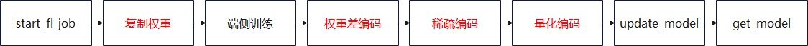
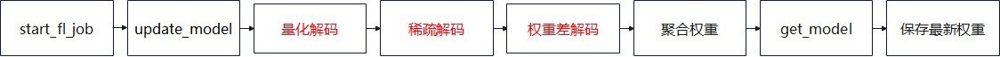
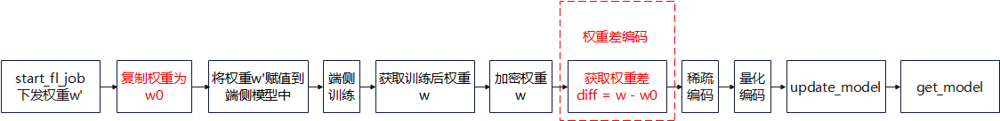
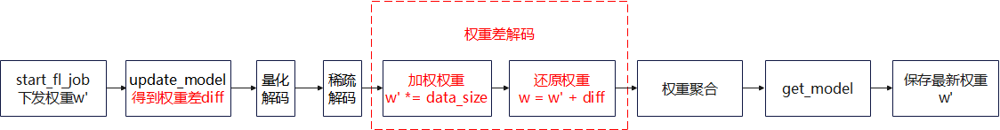
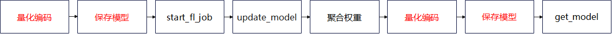
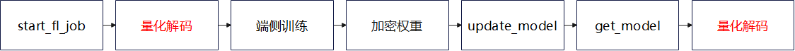

# 端云联邦学习通信压缩

<a href="https://gitee.com/mindspore/docs/blob/r1.7/docs/federated/docs/source_zh_cn/comunication_compression.md" target="_blank"></a>

在端云联邦学习训练过程中，通信量会影响端侧用户体验（用户流量、通信时延、FL-Client 参与数量），并受云侧性能约束（内存、带宽、CPU 占用率）限制。为了提高用户体验和减少性能瓶颈，MindSpore联邦学习框架在端云联邦场景中，提供上传和下载的通信量压缩功能。

## 压缩方法

### 上传压缩方法

上传压缩方法可以分为三个主要部分：权重差编解码、稀疏编解码和量化编解码，下面给出了FL-Client和FL-Server上的流程图。



图1 上传压缩方法在FL-Client上的流程图



图2 上传压缩方法在FL-Server上的流程图

### 权重差编解码

权重差即为端侧训练前后的权重矩阵的向量差。相较于原始权重而言，权重差的分布更符合高斯分布，因此更适合被压缩。FL-Client对权重差进行编码操作，FL-Server对权重差进行解码操作。值得注意的是，为了在FL-Server聚合权重前就将权重差还原为权重，FL-Client在上传权重时，不将权重乘以数据量。FL-Server解码时，需要将权重乘以数据量。



图3 权重差编码在FL-Client上的流程图



图4 权重差解码在FL-Server上的流程图

### 稀疏编解码

端云都遵循同样的随机算法生成稀疏掩码矩阵，该掩码矩阵和原本需要上传的权重形状相同。掩码矩阵只包含0或1两个值。每个FL-Client只上传和掩码矩阵非零值位置相同的权重的数据到FL-Server上。

以稀疏率sparse_rate=0.08的稀疏方法为例。FL-Client原本需要上传的参数：

| 参数名               | 长度  |
| -------------------- | ----- |
| albert.pooler.weight | 97344 |
| albert.pooler.bias   | 312   |
| classifier.weight    | 1560  |
| classifier.bias      | 5     |

将所有参数接为一维向量：

| 参数名      | 长度                   |
| ----------- | ---------------------- |
| merged_data | 97344+312+1560+5=99221 |

生成和拼接后参数长度一样的mask向量，其中，有7937 = int(sparse_rate*拼接后参数长度)个值为1，其余值为0（即mask_vector = (1,1,1,...,0,0,0,...)）：

| 参数名      | 长度  |
| ----------- | ----- |
| mask_vector | 99221 |

使用伪随机算法，将mask_vector随机打乱。随机种子为当前的iteration数。取出mask_vector中值为1的索引indexes。取出merged_data[indexes]的值，即压缩后的向量：

| 参数名            | 长度 |
| ----------------- | ---- |
| compressed_vector | 7937 |

稀疏压缩后，FL-Client需要上传的参数即为compressed_vector。

FL-Server在收到compressed_vector后，首先会用和FL-Client同样的伪随机算法和随机种子，构造出掩码向量mask_vector。然后取出mask_vector中值为1的索引indexes。再然后，生成和模型相同shape的全零矩阵weight_vector。依次将compressed_vector中的值放入weight_vector[indexes]中。weight_vector即为稀疏解码后的向量。

### 量化编解码

量化压缩方法即将浮点型的通信数据定点近似为有限多个离散值。

以8-bit量化举例来讲：

量化位数num_bits = 8

压缩前的浮点型数据为：

data = [0.03356021, -0.01842778, -0.009684053, 0.025363436, -0.027571501, 0.0077043395, 0.016391572, -0.03598478,  -0.0009508357]

计算最大和最小值：

min_val = -0.03598478

max_val = 0.03356021

计算缩放系数：

scale = (max_val - min_val ) / (2 ^ num_bits - 1) = 0.000272725450980392

将压缩前数据转换为-128到127之间的整数，转换公式为quant_data = round((data - min_val) / scale) - 2 ^ (num_bits - 1)。并强转数据类型到int8：

quant_data = [127, -64, -32, 97, -97, 32, 64, -128, 0]

量化编码后，FL-Client需要上传的参数即为quant_data以及最小和最大值min_val和max_val。

FL-Server在收到quant_data、min_val和max_val后，使用反量化公式(quant_data + 2 ^ (num_bits - 1)) * (max_val - min_val) / (2 ^ num_bits - 1) + min_val，还原出权重。

## 下载压缩方法

下载压缩方法主要为量化编解码操作，下面给出了FL-Server和FL-Client上的流程图。



图5 下载压缩方法在FL-Server上的流程图



图6 下载压缩方法在FL-Client上的流程图

### 量化编解码

量化的编解码方法和上传压缩中一样。

## 代码实现准备工作

若要使用上传和下载压缩方法，首先需要成功完成任一端云联邦场景的训练聚合过程，如[实现一个情感分类应用(Android)](https://www.mindspore.cn/federated/docs/zh-CN/r1.7/sentiment_classification_application.html)。在该文档中详细介绍了包括数据集和网络模型等准备工作和模拟启动多客户端参与联邦学习的流程。

## 算法开启脚本

上传和下载压缩方法目前只支持端云联邦学习场景。开启方式需要在启动云侧服务时，在server启动脚本中使用`context.set_fl_context()`设置`upload_compress_type='DIFF_SPARSE_QUANT'`和`download_compress_type='QUANT'`。上述两个超参数即可分别控制上传和下载压缩方法的开启和关闭。云侧完整启动脚本可参考ALBERT中云侧部署的[run_hybrid_train_server.py脚本](https://gitee.com/mindspore/mindspore/blob/r1.7/tests/st/fl/albert/run_hybrid_train_server.py)，这里给出启动该算法的相关参数配置。确定参数配置后，用户需要在执行训练前调用`set_fl_context`接口，传入算法参数，调用方式如下：

```python
# 打开上传压缩开关
parser.add_argument("--upload_compress_type", type=str, default="DIFF_SPARSE_QUANT")
# 上传压缩方法中稀疏率超参数
parser.add_argument("--upload_sparse_rate", type=float, default=0.4)
# 打开下载压缩开关
parser.add_argument("--download_compress_type", type=str, default="QUANT")
args, _ = parser.parse_known_args()
ctx = {
    "upload_compress_type": args.upload_compress_type,
    "upload_sparse_rate": args.upload_sparse_rate,
    "download_compress_type": args.download_compress_type,
}
context.set_fl_context(**fl_ctx)
```

| 超参名称&参考值                           | 超参描述                                                     |
| ----------------------------------------- | ------------------------------------------------------------ |
| "upload_compress_type":   "NO_COMPRESS"   | 上传压缩类型，string类型，包括："NO_COMPRESS",   "DIFF_SPARSE_QUANT" |
| "upload_sparse_rate": 0.5                 | 稀疏率，即权重保留率，float类型，定义域在(0, 1]内            |
| "download_compress_type":   "NO_COMPRESS" | 下载压缩类型，string类型，包括："NO_COMPRESS", "QUANT"       |

## ALBERT实验结果

联邦学习总迭代数为100，客户端本地训练epoch数为1，客户端数量为20，batchSize设置为16，学习率为1e-5，同时开启上传和下载压缩方法，上传稀疏率为0.4。最终在验证集上的准确率为72.5%，不压缩的普通联邦场景为72.3%。