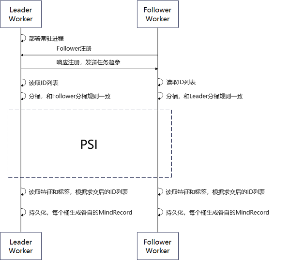

# 纵向联邦学习数据接入

<a href="https://gitee.com/mindspore/docs/blob/master/docs/federated/docs/source_zh_cn/data_join.md" target="_blank"></a>

和横向联邦学习不同，纵向联邦学习训练或推理时，两个参与方（leader和follower）拥有相同样本空间。因此，在纵向联邦学习的双方发起训练或推理之前，必须协同完成数据求交。双方必须读取各自的原始数据，并提取出每条数据对应的ID（每条数据的唯一标识符，且都不相同）进行求交（即求取交集）。然后，双方根据求交后的ID从原始数据中获得特征或标签等数据。最后各自导出持久化文件，并在后续训练或推理之前保序地读取数据。

## 总体流程

数据接入可以分为数据导出和数据读取两个部分。

### 数据导出

MindSpore Federated纵向联邦学习数据导出流程框架如图1所示：



图 1 纵向联邦学习数据接入流程框架图

在数据导出流程中，Leader Worker和 Follower Worker为纵向联邦学习的两个参与方。Leader Worker常驻并保持对Follower Worker的监听，Follower Worker可以在任意时刻进入数据接入流程中。

在Leader Worker收到 Follower Worker的注册请求后，会对注册内容进行校验。若注册成功，则给Follower Worker发送任务相关的超参（PSI 相关超参、分桶规则、ID字段名称等）。

然后Leader Worker 和 Follower Worker 分别读取各自的原始数据，再从各自的原始数据中提取出 ID 列表并实现分桶。

Leader Worker 和 Follower Worker 的每个桶都启动隐私求交方法获得两方的ID交集。

最后，两方根据ID交集提取原始数据中相应的数据并导出成MindRecord格式的文件。

### 数据读取

纵向联邦要求两个参与方在训练或推理的每一个批次的数据ID的值和顺序都一样的。MindSpore Federated通过在两方读取各自数据时，使用相同的随机种子和对导出的文件集合使用字典排序的方法，保证数据读取的顺序一致。

## 快速体验

### 数据准备样例

若要使用数据接入方法，首先需要准备好原始数据。用户可以使用[随机数据生成脚本](https://gitee.com/mindspore/federated/blob/master/tests/st/data_join/generate_random_data.py)生成出各参与方的伪造数据作为样例。

```shell
python generate_random_data.py \
    --seed=0 \
    --total_output_path=vfl/input/total_data.csv \
    --intersection_output_path=vfl/input/intersection_data.csv \
    --leader_output_path=vfl/input/leader_data_*.csv \
    --follower_output_path=vfl/input/follower_data_*.csv \
    --leader_file_num=4 \
    --follower_file_num=2 \
    --leader_data_num=300 \
    --follower_data_num=200 \
    --overlap_num=100 \
    --id_len=20 \
    --feature_num=30
```

用户可根据实际情况进行超参设置：

| 超参名称             | 超参描述                                                     |
| -------------------- | ------------------------------------------------------------ |
| seed                 | 随机种子，int类型。                                          |
| total_output_path    | 所有数据的输出路径，str类型。                                |
| intersection_output_path    | 交集数据的输出路径，str类型。                                |
| leader_output_path   | leader方数据的输出路径。若配置的内容包括`*`号，则会在导出多个文件时将`*`号依次替换为0、1、2……的序号。str类型。 |
| follower_output_path | follower方数据的输出路径。若配置的内容包括`*`号，则会在导出多个文件时将`*`号依次替换为0、1、2……的序号。str类型。 |
| leader_file_num      | leader方数据的输出文件数目，int类型。                        |
| follower_file_num    | follower方数据的输出文件数目，int类型。                      |
| leader_data_num      | leader方数据总量，int类型。                                  |
| follower_data_num    | follower方数据总量，int类型。                                |
| overlap_num          | 两方重叠的数据总量，int类型。                                |
| id_len               | 数据ID为字符串类型。该超参为字符串的长度，int类型。          |
| feature_num          | 导出的数据的列数。                                           |

运行数据准备后生成多个csv文件：

```text
follower_data_0.csv
follower_data_1.csv
intersection_data.csv
leader_data_0.csv
leader_data_1.csv
leader_data_2.csv
leader_data_3.csv
```

### 数据导出样例

用户可以使用[数据求交脚本](https://gitee.com/mindspore/federated/blob/master/tests/st/data_join/run_data_join.py)实现两方数据求交并导出成MindRecord格式文件。用户需要分别启动Leader和Follower两个进程。

启动Leader：

```shell
python run_data_join.py \
    --role="leader" \
    --main_table_files="vfl/input/leader/" \
    --output_dir="vfl/output/leader/" \
    --data_schema_path="vfl/leader_schema.yaml" \
    --http_server_address="127.0.0.1:1086" \
    --remote_server_address="127.0.0.1:1087" \
    --primary_key="oaid" \
    --bucket_num=5 \
    --store_type="csv" \
    --shard_num=1 \
    --join_type="psi" \
    --thread_num=0
```

启动Follower：

```shell
python run_data_join.py \
    --role="follower" \
    --main_table_files="vfl/input/follower/" \
    --output_dir="vfl/output/follower/" \
    --data_schema_path="vfl/follower_schema.yaml" \
    --http_server_address="127.0.0.1:1087" \
    --remote_server_address="127.0.0.1:1086" \
    --store_type="csv" \
    --thread_num=0
```

用户可根据实际情况进行超参设置：

| 超参名称            | 超参描述                                                |
| ------------------- | ------------------------------------------------------- |
| role                | worker的角色类型，str类型，包括："leader"、"follower"。 |
| main_table_files                  | 原始数据路径，可以配置单个或多个文件路径、数据目录路径，list或str类型。 |
| output_dir                        | 导出的MindRecord相关文件的目录路径，str类型。                |
| data_schema_path         | 导出时所需要配置的超参文件存放的路径，str类型。         |
| http_server_address      | 本机IP和端口地址，str类型。                             |
| remote_server_address | 对端IP和端口地址，str类型。                                |
| primary_key（Follower不需要配置） | 数据ID的名称，str类型。                                      |
| bucket_num（Follower不需要配置）  | 求交和导出时，分桶的数目，int类型。                          |
| store_type                        | 原始数据存储类型，str类型。包括："csv"。                                  |
| shard_num（Follower不需要配置）   | 单个桶导出的文件数量，int类型。                              |
| join_type（Follower不需要配置）   | 求交算法，str类型。包括："psi"。                                          |
| thread_num                        | 使用PSI求交算法时，计算所需线程数，int类型。                 |

在上述样例中，data_schema_path对应的文件可以参考[leader_schema.yaml](https://gitee.com/mindspore/federated/blob/master/tests/st/data_join/vfl/leader_schema.yaml)和[follower_schema.yaml](https://gitee.com/mindspore/federated/blob/master/tests/st/data_join/vfl/follower_schema.yaml)中的相应文件配置。用户需要在该文件中提供要导出的数据的列名和类型。

运行数据导出后生成多个MindRecord相关文件：

```text
mindrecord_0
mindrecord_0.db
mindrecord_1
mindrecord_1.db
mindrecord_2
mindrecord_2.db
mindrecord_3
mindrecord_3.db
mindrecord_4
mindrecord_4.db
```

### 数据读取样例

用户可以使用[读取数据脚本](https://gitee.com/mindspore/federated/blob/master/tests/st/data_join/load_joined_data.py)实现求交后的数据读取：

```shell
python load_joined_data.py \
    --seed=0 \
    --input_dir=vfl/output/leader/ \
    --shuffle=True
```

用户可根据实际情况进行超参设置：

| 超参名称  | 超参描述                                  |
| --------- | ----------------------------------------- |
| seed      | 随机种子，int类型。                       |
| input_dir | 输入的MindRecord相关文件的目录，str类型。 |
| shuffle   | 数据是否需要打乱，bool类型。              |

如果求交结果正确，两方各自读取数据时，两方的每条数据的OAID顺序一致，而每条数据中的其他列的数据可以为不同值。运行数据读取后打印交集数据：

```text
Leader数据导出运行结果：
{……, 'oaid': Tensor(shape=[], dtype=String, value= 'uMbgxIMMwWhMGrVMVtM7')}
{……, 'oaid': Tensor(shape=[], dtype=String, value= 'IwoGP08kWVtT4WHL2PLu')}
{……, 'oaid': Tensor(shape=[], dtype=String, value= 'MSRe6mURtxgyEgWzDn0b')}
{……, 'oaid': Tensor(shape=[], dtype=String, value= 'y7X0WcMKnTLrhxVcWfGF')}
{……, 'oaid': Tensor(shape=[], dtype=String, value= 'DicKRIVvbOYSiv63TvcL')}
{……, 'oaid': Tensor(shape=[], dtype=String, value= 'TCHgtynOhH3z11QYemsH')}
{……, 'oaid': Tensor(shape=[], dtype=String, value= 'OWmhgIfC3k8UTteGUhni')}
{……, 'oaid': Tensor(shape=[], dtype=String, value= 'NTV3qEYXBHqKBWyHGc7s')}
{……, 'oaid': Tensor(shape=[], dtype=String, value= 'wuinSeN1bzYgXy4XmSlR')}
{……, 'oaid': Tensor(shape=[], dtype=String, value= 'SSsCU0Pb46XGzUIa3Erg')}
……

Follower数据导出运行结果：
{……, 'oaid': Tensor(shape=[], dtype=String, value= 'uMbgxIMMwWhMGrVMVtM7')}
{……, 'oaid': Tensor(shape=[], dtype=String, value= 'IwoGP08kWVtT4WHL2PLu')}
{……, 'oaid': Tensor(shape=[], dtype=String, value= 'MSRe6mURtxgyEgWzDn0b')}
{……, 'oaid': Tensor(shape=[], dtype=String, value= 'y7X0WcMKnTLrhxVcWfGF')}
{……, 'oaid': Tensor(shape=[], dtype=String, value= 'DicKRIVvbOYSiv63TvcL')}
{……, 'oaid': Tensor(shape=[], dtype=String, value= 'TCHgtynOhH3z11QYemsH')}
{……, 'oaid': Tensor(shape=[], dtype=String, value= 'OWmhgIfC3k8UTteGUhni')}
{……, 'oaid': Tensor(shape=[], dtype=String, value= 'NTV3qEYXBHqKBWyHGc7s')}
{……, 'oaid': Tensor(shape=[], dtype=String, value= 'wuinSeN1bzYgXy4XmSlR')}
{……, 'oaid': Tensor(shape=[], dtype=String, value= 'SSsCU0Pb46XGzUIa3Erg')}
……
```

## 深度体验

下列代码的详细的API文档可以参考[数据接入文档](https://www.mindspore.cn/federated/docs/zh-CN/master/data_join/data_join.html)。

### 数据导出

用户可以使用已经封装好的接口实现数据求交以及导出MindRecord相关文件，方法如下：

```python
from mindspore_federated.data_join import FLDataWorker


if __name__ == '__main__':
    worker = FLDataWorker(role="leader",
                          main_table_files="vfl/input/leader/",
                          output_dir="vfl/output/leader/",
                          data_schema_path="vfl/leader_schema.yaml",
                          http_server_address="127.0.0.1:1086",
                          remote_server_address="127.0.0.1:1087",
                          primary_key="oaid",
                          bucket_num=5,
                          store_type="csv",
                          shard_num=1,
                          join_type="psi",
                          thread_num=0,
                          )
    worker.export()
```

### 数据读取

用户可以使用已经封装好的接口实现导出的MindRecord相关文件的数据读取，方法如下：

```python
from mindspore_federated.data_join import load_mindrecord


if __name__ == "__main__":
    dataset = load_mindrecord(input_dir="vfl/output/leader/", shuffle=True, seed=0)
```

