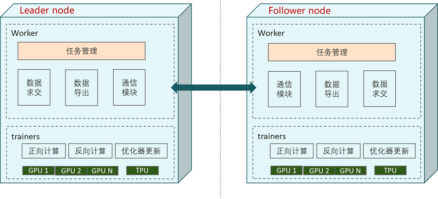

# 纵向联邦部署

<a href="https://gitee.com/mindspore/docs/blob/master/docs/federated/docs/source_zh_cn/deploy_vfl.md" target="_blank"></a>

本文档讲解如何使用和部署纵向联邦学习框架。

MindSpore Vertical Federated Learning (VFL) 物理架构如图所示：



如上图所示，在纵向联邦的交互中有两个参与方：Leader node和Follower node，每一个参与方都有两种角色的进程：`FLDataWorker`和`VFLTrainer`：

- FLDataWorker

    `FLDataWorker`的功能主要包括：

    1. 数据集合求交：获得纵向联邦参与双方的共有用户交集，支持隐私集合求交协议，可防止联邦学习参与方获得交集外的ID信息。
    2. 训练数据生成：在获得交集ID之后，扩充数据特征，生成用于训练的mindrecord文件。
    3. 开放管理面：向用户提供`RESTful`接口，实现对集群的管理。

    在一个联邦学习任务中，只有一个`Scheduler`，其与`Server`通过TCP协议通信。

- VFLTrainer

    `VFLTrainer`为执行纵向联邦训练任务的主体，执行模型拆分后的正反向计算、Embedding张量传输，梯度张量传输、反向优化器更新等任务。当前版本支持单机单卡和单机多卡的训练模式。

    在MindSpore联邦学习框架中，`Server`还支持弹性伸缩以及容灾，能够在训练任务不中断的情况下，动态调配硬件资源。

`FLDataWorker`和`VFLTrainer`一般部署在同一台服务器或者容器中。

## 准备环节

> 建议使用[Anaconda](https://www.anaconda.com/)创建虚拟环境进行如下操作。

### 安装MindSpore

MindSpore纵向联邦支持在x86 CPU、GPU CUDA和Ascend硬件平台上部署。可参考[MindSpore安装指南](https://www.mindspore.cn/install)安装MindSpore最新版本。

### 安装MindSpore Federated

通过[源码](https://gitee.com/mindspore/federated)编译安装。

```shell
git clone https://gitee.com/mindspore/federated.git -b master
cd federated
bash build.sh
```

对于`bash build.sh`，可通过例如`-jn`选项，例如`-j16`，加速编译；可通过`-S on`选项，从gitee而不是github下载第三方依赖。

编译完成后，在`build/package/`目录下找到Federated的whl安装包进行安装：

```shell
pip install mindspore_federated-{version}-{python_version}-linux_{arch}.whl
```

#### 验证是否成功安装

执行以下命令，验证安装结果。导入Python模块不报错即安装成功：

```python
from mindspore_federated import FLServerJob
```

## 运行样例

FLDataWorker的运行样例可参考[纵向联邦学习数据接入](https://www.mindspore.cn/federated/docs/zh-CN/master/data_join.html)。

VFLTrainer的运行样例可参考[纵向联邦学习模型训练 - Wide&Deep推荐应用](https://www.mindspore.cn/federated/docs/zh-CN/master/split_wnd_application.html)。
