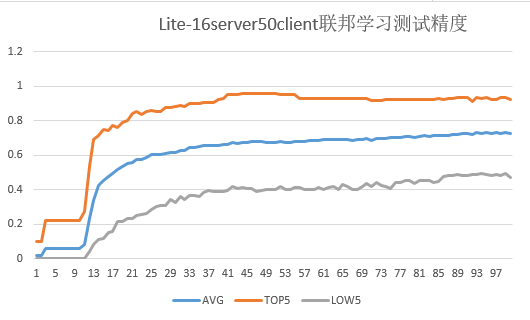

# 实现一个端云联邦的图像分类应用(x86)

<!-- TOC -->

- [实现一个端云图像分类应用(x86)](#实现一个端云图像分类应用x86)
    - [下载数据集](#下载数据集)
    - [定义网络](#定义网络)
    - [定义训练过程](#定义训练过程)
    - [生成端侧模型文件](#生成端侧模型文件)
    - [模拟启动多客户端参与联邦学习](#模拟启动多客户端参与联邦学习)

<!-- /TOC -->

<a href="https://gitee.com/mindspore/docs/blob/master/docs/federated/docs/source_zh_cn/image_classification_application.md" target="_blank"></a>

联邦学习根据参与客户的不同可分为云云联邦学习（cross-silo）和端云联邦学习（cross-device）。在云云联邦学习场景中，参与联邦学习的客户是不同的组织（例如，医疗或金融）或地理分布的数据中心，即在多个数据孤岛上训练模型。而在端云联邦学习场景中参与的客户为大量的移动或物联网设备。本框架将介绍如何在MindSpore端云联邦框架上使用网络LeNet实现一个图片分类应用，并提供在x86环境中模拟启动多客户端参与联邦学习的相关教程。

在动手进行实践之前，确保，你已经正确安装了MindSpore。如果没有，可以参考[MindSpore安装页面](https://www.mindspore.cn/install)完成安装。

## 下载数据集

参考[leaf数据集官方指导](https://github.com/TalwalkarLab/leaf)下载数据集。

本示例采用`leaf`数据集中的联邦学习数据集`FEMNIST`， 该数据集包含62个不同类别的手写数字和字母（数字0~9、26个小写字母、26个大写字母），图像大小为`28 x 28`像素，数据集包含3500个用户的手写数字和字母（最多可模拟3500个客户端参与联邦学习），总数据量为805263，平均每个用户包含数据量为226.83，所有用户数据量的方差为88.94。

1. 下载数据集前的环境要求。

    ```sh
    numpy==1.16.4
    scipy                      # conda install scipy
    tensorflow==1.13.1         # pip install tensorflow
    Pillow                     # pip install Pillow
    matplotlib                 # pip install matplotlib
    jupyter                    # conda install jupyter notebook==5.7.8 tornado==4.5.3
    pandas                     # pip install pandas
    ```

2. 使用git下载官方数据集生成脚本。

    ```sh
    git clone https://github.com/TalwalkarLab/leaf.git
    ```

    下载项目后，目录结构如下：

    ```sh
    leaf/data/femnist
        ├── data  # 用来存放指令生成的数据集
        ├── preprocess  # 存放数据预处理的相关代码
        ├── preprocess.sh  # femnist数据集生成shell脚本
        └── README.md  # 官方数据集下载指导文档
    ```

3. 以`femnist`数据集为例，运行以下指令进入指定路径。

    ```sh
    cd  leaf/data/femnist
    ```

4. 参考`README.md`文件中的说明，在终端输入指令即可下载对应数据集。

    运行`./preprocess.sh`具有以下标签的选择：

    - `-s`：'iid'以iid方式采样，或'niid'以非iid方式采样。
    - `--iu`：用户数（如果进行iid采样）；表示为用户总数的分数；默认值为0.01。
    - `--sf`：要采样的数据部分，用十进制表示；默认值为0.1。
    - `-k`：每个用户的最小样本数。
    - `-t`：'user'将用户划分为训练测试组，或'sample'将每个用户的样本划分为训练测试组。
    - `--tf`：训练集中的数据部分，用小数表示；默认值为0.9。
    - `--smplseed`：随机抽样数据之前要使用的种子。
    - `--spltseed`：随机分割数据之前要使用的种子。

    例如：

    - `./preprocess.sh -s niid --sf 1.0 -k 0 -t sample` （下载完整数据集）。
    - `./preprocess.sh -s niid --sf 0.05 -k 0 -t sample` （下载小型数据集）。

    在重新运行`preprocess.sh`之前，请确保删除数据目录中的`rem_user_data`、`sampled_data`、`test`和`train`子文件夹。

5. 用指令`./preprocess.sh -s niid --sf 1.0 -k 0 -t sample`生成的数据集包含3500个用户，且按照9:1对每个用户的数据划分训练和测试集。

    运行之后目录结构如下：

    ```text
    leaf/data/femnist/35_client_sf1_data/
        ├── all_data  # 所有数据集混合在一起，不区分训练测试集，共包含35个json文件，每个json文件包含100个用户的数据
        ├── test  # 按照9:1对每个用户的数据划分训练和测试集后的测试集，共包含35个json文件，每个json文件包含100个用户的数据
        ├── train  # 按照9:1对每个用户的数据划分训练和测试集后的训练集，共包含35个json文件，每个json文件包含100个用户的数据
        └── ...  # 其他文件，暂不需要用到，不作介绍
    ```

    其中每个json文件包含以下三个部分：

    - `users`: 用户列表。

    - `num_samples`: 每个用户的样本数量列表。

    - `user_data`: 一个以用户名为key，以它们各自的数据为value的字典对象；对于每个用户，数据表示为图像列表，每张图像表示为大小为784的整数列表（将`28 x 28`图像数组展平所得）。

6. 将35个json文件划分为3500个json文件（每个json文件代表一个用户）。

    参考代码如下：

    ```python
    import os
    import json

    def mkdir(path):
        if not os.path.exists(path):
            os.mkdir(path)

    def partition_json(root_path, new_root_path):
        """
        partition 35 json files to 3500 json file

        Each raw .json file is an object with 3 keys:
        1. 'users', a list of users
        2. 'num_samples', a list of the number of samples for each user
        3. 'user_data', an object with user names as keys and their respective data as values; for each user, data is represented as a list of images, with each image represented as a size-784 integer list (flattened from 28 by 28)

        Each new .json file is an object with 3 keys:
        1. 'user_name', the name of user
        2. 'num_samples', the number of samples for the user
        3. 'user_data', an dict object with 'x' as keys and their respective data as values; with 'y' as keys and their respective label as values;

        Args:
            root_path (str): raw root path of 35 json files
            new_root_path (str): new root path of 3500 json files
        """
        paths = os.listdir(root_path)
        count = 0
        file_num = 0
        for i in paths:
            file_num += 1
            file_path = os.path.join(root_path, i)
            print('======== process ' + str(file_num) + ' file: ' + str(file_path) + '======================')
            with open(file_path, 'r') as load_f:
                load_dict = json.load(load_f)
                users = load_dict['users']
                num_users = len(users)
                num_samples = load_dict['num_samples']
                for j in range(num_users):
                    count += 1
                    print('---processing user: ' + str(count) + '---')
                    cur_out = {'user_name': None, 'num_samples': None, 'user_data': {}}
                    cur_user_id = users[j]
                    cur_data_num = num_samples[j]
                    cur_user_path = os.path.join(new_root_path, cur_user_id + '.json')
                    cur_out['user_name'] = cur_user_id
                    cur_out['num_samples'] = cur_data_num
                    cur_out['user_data'].update(load_dict['user_data'][cur_user_id])
                    with open(cur_user_path, 'w') as f:
                        json.dump(cur_out, f)
        f = os.listdir(new_root_path)
        print(len(f), ' users have been processed!')
    # partition train json files
    partition_json("leaf/data/femnist/35_client_sf1_data/train", "leaf/data/femnist/3500_client_json/train")
    # partition test json files
    partition_json("leaf/data/femnist/35_client_sf1_data/test", "leaf/data/femnist/3500_client_json/test")
    ```

    其中`root_path`为`leaf/data/femnist/35_client_sf1_data/{train,test}`，`new_root_path`自行设置，用于存放生成的3500个用户json文件，需分别对训练和测试文件夹进行处理。

    新生成的3500个用户json文件，每个文件均包含以下三个部分：

    - `user_name`: 用户名。
    - `num_samples`: 用户的样本数。
    - `user_data`: 一个以'x'为key，以用户数据为value的字典对象； 以'y'为key，以用户数据对应的标签为value。

    运行该脚本打印如下，代表运行成功：

    ```sh
    ======== process 1 file: /leaf/data/femnist/35_client_sf1_data/train/all_data_16_niid_0_keep_0_train_9.json======================
    ---processing user: 1---
    ---processing user: 2---
    ---processing user: 3---
    ---processing user: 4---
    ---processing user: 5---
    ---processing user: 6---
    ---processing user: 7---
    ---processing user: 8---
    ---processing user: 9---
    ---processing user: 10---
    ---processing user: 11---
    ---processing user: 12---
    ---processing user: 13---
    ---processing user: 14---
    ......
    ```

7. 将json文件转换为图片文件。

    可参考如下代码：

    ```python
    import os
    import json
    import numpy as np
    from PIL import Image

    name_list = ['0', '1', '2', '3', '4', '5', '6', '7', '8', '9',
                 'A', 'B', 'C', 'D', 'E', 'F', 'G', 'H', 'I', 'J', 'K', 'L', 'M', 'N', 'O', 'P', 'Q', 'R', 'S', 'T', 'U',
                 'V', 'W', 'X', 'Y', 'Z',
                 'a', 'b', 'c', 'd', 'e', 'f', 'g', 'h', 'i', 'j', 'k', 'l', 'm', 'n', 'o', 'p', 'q', 'r', 's', 't', 'u',
                 'v', 'w', 'x', 'y', 'z'
                 ]

    def mkdir(path):
        if not os.path.exists(path):
            os.mkdir(path)

    def json_2_numpy(img_size, file_path):
        """
        read json file to numpy
        Args:
            img_size (list): contain three elements: the height, width, channel of image
            file_path (str): root path of 3500 json files
        return:
            image_numpy (numpy)
            label_numpy (numpy)
        """
        # open json file
        with open(file_path, 'r') as load_f_train:
            load_dict = json.load(load_f_train)
            num_samples = load_dict['num_samples']
            x = load_dict['user_data']['x']
            y = load_dict['user_data']['y']
            size = (num_samples, img_size[0], img_size[1], img_size[2])
            image_numpy = np.array(x, dtype=np.float32).reshape(size)  # mindspore doesn't support float64 and int64
            label_numpy = np.array(y, dtype=np.int32)
        return image_numpy, label_numpy

    def json_2_img(json_path, save_path):
        """
        transform single json file to images

        Args:
            json_path (str): the path json file
            save_path (str): the root path to save images

        """
        data, label = json_2_numpy([28, 28, 1], json_path)
        for i in range(data.shape[0]):
            img = data[i] * 255  # PIL don't support the 0/1 image ,need convert to 0~255 image
            im = Image.fromarray(np.squeeze(img))
            im = im.convert('L')
            img_name = str(label[i]) + '_' + name_list[label[i]] + '_' + str(i) + '.png'
            path1 = os.path.join(save_path, str(label[i]))
            mkdir(path1)
            img_path = os.path.join(path1, img_name)
            im.save(img_path)
            print('-----', i, '-----')

    def all_json_2_img(root_path, save_root_path):
        """
        transform json files to images
        Args:
            json_path (str): the root path of 3500 json files
            save_path (str): the root path to save images
        """
        usage = ['train', 'test']
        for i in range(2):
            x = usage[i]
            files_path = os.path.join(root_path, x)
            files = os.listdir(files_path)

            for name in files:
                user_name = name.split('.')[0]
                json_path = os.path.join(files_path, name)
                save_path1 = os.path.join(save_root_path, user_name)
                mkdir(save_path1)
                save_path = os.path.join(save_path1, x)
                mkdir(save_path)
                print('=============================' + name + '=======================')
                json_2_img(json_path, save_path)

    all_json_2_img("leaf/data/femnist/3500_client_json/", "leaf/data/femnist/3500_client_img/")
    ```

    运行该脚本打印如下，代表运行成功：

    ```sh
    =============================f0644_19.json=======================
    ----- 0 -----
    ----- 1 -----
    ----- 2 -----
    ----- 3 -----
    ----- 4 -----
    ----- 5 -----
    ----- 6 -----
    ----- 7 -----
    ----- 8 -----
    ----- 9 -----
    ----- 10 -----
    ......
    ```

8. 将图片数据集转换为联邦学习框架可用的bin文件格式。

    可参考下面代码：

    ```python
    import numpy as np
    import os
    import mindspore.dataset as ds
    import mindspore.dataset.transforms.c_transforms as tC
    import mindspore.dataset.vision.py_transforms as PV
    import mindspore.dataset.transforms.py_transforms as PT
    import mindspore

    def mkdir(path):
        if not os.path.exists(path):
            os.mkdir(path)

    def count_id(path):
        files = os.listdir(path)
        ids = {}
        for i in files:
            ids[i] = int(i)
        return ids

    def create_dataset_from_folder(data_path, img_size, batch_size=32, repeat_size=1, num_parallel_workers=1, shuffle=False):
        """ create dataset for train or test
            Args:
                data_path: Data path
                batch_size: The number of data records in each group
                repeat_size: The number of replicated data records
                num_parallel_workers: The number of parallel workers
            """
        # define dataset
        ids = count_id(data_path)
        mnist_ds = ds.ImageFolderDataset(dataset_dir=data_path, decode=False, class_indexing=ids)
        # define operation parameters
        resize_height, resize_width = img_size[0], img_size[1]  # 32

        transform = [
            PV.Decode(),
            PV.Grayscale(1),
            PV.Resize(size=(resize_height, resize_width)),
            PV.Grayscale(3),
            PV.ToTensor(),
        ]
        compose = PT.Compose(transform)

        # apply map operations on images
        mnist_ds = mnist_ds.map(input_columns="label", operations=tC.TypeCast(mindspore.int32))
        mnist_ds = mnist_ds.map(input_columns="image", operations=compose)

        # apply DatasetOps
        buffer_size = 10000
        if shuffle:
            mnist_ds = mnist_ds.shuffle(buffer_size=buffer_size)  # 10000 as in LeNet train script
        mnist_ds = mnist_ds.batch(batch_size, drop_remainder=True)
        mnist_ds = mnist_ds.repeat(repeat_size)
        return mnist_ds

    def img2bin(root_path, root_save):
        """
        transform images to bin files

        Args:
        root_path: the root path of 3500 images files
        root_save: the root path to save bin files

        """

        use_list = []
        train_batch_num = []
        test_batch_num = []
        mkdir(root_save)
        users = os.listdir(root_path)
        for user in users:
            use_list.append(user)
            user_path = os.path.join(root_path, user)
            train_test = os.listdir(user_path)
            for tag in train_test:
                data_path = os.path.join(user_path, tag)
                dataset = create_dataset_from_folder(data_path, (32, 32, 1), 32)
                batch_num = 0
                img_list = []
                label_list = []
                for data in dataset.create_dict_iterator():
                    batch_x_tensor = data['image']
                    batch_y_tensor = data['label']
                    trans_img = np.transpose(batch_x_tensor.asnumpy(), [0, 2, 3, 1])
                    img_list.append(trans_img)
                    label_list.append(batch_y_tensor.asnumpy())
                    batch_num += 1

                if tag == "train":
                    train_batch_num.append(batch_num)
                elif tag == "test":
                    test_batch_num.append(batch_num)

                imgs = np.array(img_list)  # (batch_num, 32,3,32,32)
                labels = np.array(label_list)
                path1 = os.path.join(root_save, user)
                mkdir(path1)
                image_path = os.path.join(path1, user + "_" + "bn_" + str(batch_num) + "_" + tag + "_data.bin")
                label_path = os.path.join(path1, user + "_" + "bn_" + str(batch_num) + "_" + tag + "_label.bin")

                imgs.tofile(image_path)
                labels.tofile(label_path)
                print("user: " + user + " " + tag + "_batch_num: " + str(batch_num))
        print("total " + str(len(use_list)) + " users finished!")

    root_path = "leaf/data/femnist/3500_client_img/"
    root_save = "leaf/data/femnist/3500_clients_bin"
    img2bin(root_path, root_save)
    ```

    运行该脚本打印如下，代表运行成功：

    ```sh
    user: f0141_43 test_batch_num: 1
    user: f0141_43 train_batch_num: 10
    user: f0137_14 test_batch_num: 1
    user: f0137_14 train_batch_num: 11
    user: f0049_32 test_batch_num: 1
    user: f0049_32 train_batch_num: 11
    user: f0178_39 test_batch_num: 1
    user: f0178_39 train_batch_num: 9
    user: f0222_06 test_batch_num: 1
    user: f0222_06 train_batch_num: 9
    ......
    total 3500 users finished!
    ```

9. 生成`3500_clients_bin`文件夹内共包含3500个用户文件夹，其目录结构如下：

    ```sh
    leaf/data/femnist/3500_clients_bin
      ├── f0000_14  # 用户编号
      │   ├── f0000_14_bn_10_train_data.bin  # 用户f0000_14的训练数据 （bn_后面的数字10代表batch number）
      │   ├── f0000_14_bn_10_train_label.bin  # 用户f0000_14的训练标签
      │   ├── f0000_14_bn_1_test_data.bin  # 用户f0000_14的测试数据   （bn_后面的数字1代表batch number）
      │   └── f0000_14_bn_1_test_label.bin  # 用户f0000_14的测试标签
      ├── f0001_41  # 用户编号
      │   ├── f0001_41_bn_11_train_data.bin  # 用户f0001_41的训练数据 （bn_后面的数字11代表batch number）
      │   ├── f0001_41_bn_11_train_label.bin  # 用户f0001_41的训练标签
      │   ├── f0001_41_bn_1_test_data.bin  # 用户f0001_41的测试数据   （bn_后面的数字1代表batch number）
      │   └── f0001_41_bn_1_test_label.bin  #  用户f0001_41的测试标签
      │                    ...
      └── f4099_10  # 用户编号
          ├── f4099_10_bn_4_train_data.bin  # 用户f4099_10的训练数据 （bn_后面的数字4代表batch number）
          ├── f4099_10_bn_4_train_label.bin  # 用户f4099_10的训练标签
          ├── f4099_10_bn_1_test_data.bin  # 用户f4099_10的测试数据   （bn_后面的数字1代表batch number）
          └── f4099_10_bn_1_test_label.bin  # 用户f4099_10的测试标签
    ```

## 定义网络

我们选择相对简单的LeNet网络。LeNet网络不包括输入层的情况下，共有7层：2个卷积层、2个下采样层（池化层）、3个全连接层。每层都包含不同数量的训练参数，如下图所示：


> 更多的LeNet网络的介绍不在此赘述，希望详细了解LeNet网络，可以查询<http://yann.lecun.com/exdb/lenet/>。

网络定义流程可参考[model.py文件](https://gitee.com/mindspore/mindspore/blob/master/tests/st/fl/mobile/src/model.py)。

具体网络定义流程可参考[初学入门](https://www.mindspore.cn/tutorials/zh-CN/master/quick_start.html#%E5%88%9B%E5%BB%BA%E6%A8%A1%E5%9E%8B)。

## 定义训练过程

可参考如下代码：

```python
import argparse
import numpy as np

import mindspore.context as context
import mindspore.nn as nn
from mindspore import Tensor
from mindspore.nn import TrainOneStepCell, WithLossCell
from src.model import LeNet5
from src.adam import AdamWeightDecayOp

parser = argparse.ArgumentParser(description="test_fl_lenet")
parser.add_argument("--device_target", type=str, default="CPU")
parser.add_argument("--server_mode", type=str, default="FEDERATED_LEARNING")
parser.add_argument("--ms_role", type=str, default="MS_WORKER")
parser.add_argument("--worker_num", type=int, default=0)
parser.add_argument("--server_num", type=int, default=1)
parser.add_argument("--scheduler_ip", type=str, default="127.0.0.1")
parser.add_argument("--scheduler_port", type=int, default=8113)
parser.add_argument("--fl_server_port", type=int, default=6666)
parser.add_argument("--start_fl_job_threshold", type=int, default=1)
parser.add_argument("--start_fl_job_time_window", type=int, default=3000)
parser.add_argument("--update_model_ratio", type=float, default=1.0)
parser.add_argument("--update_model_time_window", type=int, default=3000)
parser.add_argument("--fl_name", type=str, default="Lenet")
parser.add_argument("--fl_iteration_num", type=int, default=25)
parser.add_argument("--client_epoch_num", type=int, default=20)
parser.add_argument("--client_batch_size", type=int, default=32)
parser.add_argument("--client_learning_rate", type=float, default=0.1)
parser.add_argument("--scheduler_manage_port", type=int, default=11202)

args, _ = parser.parse_known_args()
device_target = args.device_target
server_mode = args.server_mode
ms_role = args.ms_role
worker_num = args.worker_num
server_num = args.server_num
scheduler_ip = args.scheduler_ip
scheduler_port = args.scheduler_port
fl_server_port = args.fl_server_port
start_fl_job_threshold = args.start_fl_job_threshold
start_fl_job_time_window = args.start_fl_job_time_window
update_model_ratio = args.update_model_ratio
update_model_time_window = args.update_model_time_window
fl_name = args.fl_name
fl_iteration_num = args.fl_iteration_num
client_epoch_num = args.client_epoch_num
client_batch_size = args.client_batch_size
client_learning_rate = args.client_learning_rate
scheduler_manage_port = args.scheduler_manage_port

ctx = {
    "enable_fl": True,
    "server_mode": server_mode,
    "ms_role": ms_role,
    "worker_num": worker_num,
    "server_num": server_num,
    "scheduler_ip": scheduler_ip,
    "scheduler_port": scheduler_port,
    "fl_server_port": fl_server_port,
    "start_fl_job_threshold": start_fl_job_threshold,
    "start_fl_job_time_window": start_fl_job_time_window,
    "update_model_ratio": update_model_ratio,
    "update_model_time_window": update_model_time_window,
    "fl_name": fl_name,
    "fl_iteration_num": fl_iteration_num,
    "client_epoch_num": client_epoch_num,
    "client_batch_size": client_batch_size,
    "client_learning_rate": client_learning_rate,
    "scheduler_manage_port": scheduler_manage_port
}

context.set_context(mode=context.GRAPH_MODE, device_target=device_target, save_graphs=False)
context.set_fl_context(**ctx)               # 设置联邦学习训练流程相关参数

if __name__ == "__main__":
    epoch = 5
    np.random.seed(0)
    network = LeNet5(62)
    criterion = nn.SoftmaxCrossEntropyWithLogits(sparse=True, reduction="mean")
    net_opt = nn.Momentum(network.trainable_params(), 0.01, 0.9)
    net_adam_opt = AdamWeightDecayOp(network.trainable_params(), weight_decay=0.1)
    net_with_criterion = WithLossCell(network, criterion)
    train_network = TrainOneStepCell(net_with_criterion, net_opt)
    train_network.set_train()
    losses = []

    for _ in range(epoch):
        data = Tensor(np.random.rand(32, 3, 32, 32).astype(np.float32))
        label = Tensor(np.random.randint(0, 61, (32)).astype(np.int32))
        loss = train_network(data, label).asnumpy()
        losses.append(loss)
    print(losses)
```

具体可参考脚本[test_mobile_lenet.py](https://gitee.com/mindspore/mindspore/blob/master/tests/st/fl/mobile/test_mobile_lenet.py)。其中字典`ctx`中参数`enable_fl`用于设置是否启动联邦学习训练流程，为`true`代表启动联邦学习流程，为`false`代表启动普通训练流程，其他参数可以根据实际情况进行设置。由于只需要生成可用的模型文件即可，上面脚本中`data`和`label`均采用了模拟数据。

其中`src.model`为模型定义文件可参考[model.py文件](https://gitee.com/mindspore/mindspore/blob/master/tests/st/fl/mobile/src/model.py)，`src.adam`为优化器定义文件可参考[adam.py文件](https://gitee.com/mindspore/mindspore/blob/master/tests/st/fl/mobile/src/adam.py)。

具体优化器损失函数定义可参考[初学入门](https://www.mindspore.cn/tutorials/zh-CN/master/quick_start.html#%E4%BC%98%E5%8C%96%E6%A8%A1%E5%9E%8B%E5%8F%82%E6%95%B0)。

## 生成端侧模型文件

1. 将模型导出为MindIR格式文件。

    可在[test_mobile_lenet.py](https://gitee.com/mindspore/mindspore/blob/master/tests/st/fl/mobile/test_mobile_lenet.py)的训练流程代码中添加`export`语句获取MindIR格式模型文件， 示例代码如下：

    ```python
    from mindspore import export
    ...

    for _ in range(epoch):
            data = Tensor(np.random.rand(32, 3, 32, 32).astype(np.float32))
            label = Tensor(np.random.randint(0, 61, (32)).astype(np.int32))
            loss = train_network(data, label).asnumpy()
            losses.append(loss)
            mindir_name = "lenet_train.mindir"
            export(train_network, data, label, file_name= mindir_name, file_format='MINDIR')  # 添加export语句获取MindIR格式模型文件
        print(losses)
    ```

    生成MindIR格式模型文件时，需要先将[test_mobile_lenet.py](https://gitee.com/mindspore/mindspore/blob/master/tests/st/fl/mobile/test_mobile_lenet.py)中`context.set_fl_context(**ctx)`语句注释，同时`epoch`设置为1即可，运行`test_mobile_lenet.py`要求环境中安装[MindSpore](https://www.mindspore.cn/install)。运行脚本`test_mobile_lenet.py`之后会在当前路径下生成文件`lenet_train.mindir`。

    具体可参考[导出MindIR格式文件](https://www.mindspore.cn/docs/programming_guide/zh-CN/master/save_model.html#mindir)。

2. 将MindIR文件转化为联邦学习端侧框架可用的ms文件。

    模型转换可参考[训练模型转换教程](https://www.mindspore.cn/lite/docs/zh-CN/master/use/converter_train.html )。

    模型转换示例如下：

    假设待转换的模型文件为`lenet_train.mindir`，执行如下转换命令：

    ```sh
    ./converter_lite --fmk=MINDIR --trainModel=true --modelFile=lenet_train.mindir --outputFile=lenet_train
    ```

    转换成功输出如下：

    ```sh
    CONVERTER RESULT SUCCESS:0
    ```

    这表明MindSpore模型成功转换为MindSpore端侧模型，并生成了新文件`lenet_train.ms`。如果转换失败输出如下：

    ```sh
    CONVERT RESULT FAILED:
    ```

    将生成的`.ms`格式的模型文件放在某个路径上，在调用联邦学习接口时可设置`FLParameter.trainModelPath`为该模型文件的路径。

## 模拟启动多客户端参与联邦学习

可编写一个Python脚本，调用联邦学习框架jar包（x86环境联邦学习jar包获取可参考[端侧部署中编译出包流程](https://www.mindspore.cn/federated/docs/zh-CN/master/deploy_federated_client.html)）来模拟启动多客户端联邦学习任务。

1. 以Lenet网络为例，参考脚本`run.py`如下。

    ```python
    import os
    import argparse
    import subprocess
    import random

    parser = argparse.ArgumentParser(description="Run TestClient.java case")
    parser.add_argument("--jarPath", type=str, default="mindspore-lite-java-flclient.jar")  # must be absolute path
    parser.add_argument("--train_dataset", type=str, default="leaf/data/femnist/3500_clients_bin/")   # must be absolute path
    parser.add_argument("--test_dataset", type=str, default="null")   # must be absolute path
    parser.add_argument("--vocal_file", type=str, default="null")   # must be absolute path
    parser.add_argument("--ids_file", type=str, default="null")   # must be absolute path
    parser.add_argument("--flName", type=str, default="lenet")
    parser.add_argument("--train_model_path", type=str, default="ms/lenet/")    # must be absolute path of .ms files
    parser.add_argument("--infer_model_path", type=str, default="ms/lenet/")    # must be absolute path of .ms files
    parser.add_argument("--use_ssl", type=str, default="false")
    parser.add_argument("--domain_name", type=str, default="http://10.113.216.106:6668")
    parser.add_argument("--server_num", type=int, default=0)
    parser.add_argument("--client_num", type=int, default=0)
    parser.add_argument("--if_use_elb", type=str, default="false")
    parser.add_argument("--cert_path", type=str, default="null")
    parser.add_argument("--task", type=str, default="train")

    args, _ = parser.parse_known_args()
    jarPath = args.jarPath
    train_dataset = args.train_dataset
    test_dataset = args.test_dataset
    vocal_file = args.vocal_file
    ids_file = args.ids_file
    flName = args.flName
    train_model_path = args.train_model_path
    infer_model_path = args.infer_model_path
    use_ssl = args.use_ssl
    domain_name = args.domain_name
    server_num = args.server_num
    client_num = args.client_num
    if_use_elb = args.if_use_elb
    cert_path = args.cert_path
    task = args.task

    users = os.listdir(train_dataset)

    def get_client_data_path(data_root_path, user):
        use_path = os.path.join(data_root_path, user)
        bin_file_paths = os.listdir(use_path)

        train_data_path = ""
        train_label_path = ""
        train_batch_num = ""

        test_data_path = ""
        test_label_path = ""
        test_batch_num = ""

        for file in bin_file_paths:
            info = file.split(".")[0].split("_")
            if info[4] == "train" and info[5] == "data":
                train_data_path = os.path.join(use_path, file)
                train_batch_num = info[3]
            elif info[4] == "train" and info[5] == "label":
                train_label_path = os.path.join(use_path, file)
            elif info[4] == "test" and info[5] == "data":
                test_data_path = os.path.join(use_path, file)
                test_batch_num = info[3]
            elif info[4] == "test" and info[5] == "label":
                test_label_path = os.path.join(use_path, file)
        train_path = train_data_path + "," + train_label_path
        test_path = test_data_path + "," + test_label_path
        return train_path, test_path, train_batch_num, test_batch_num

    for i in range(client_num):
        user = users[i]
        train_path, test_path = "", ""
        train_path, test_path, _, _= get_client_data_path(train_dataset, user)
        print("===========================")
        print("process id: ", i)
        print("train path: ", train_path)
        print("test path: ", test_path)

        cmd_client = "execute_path=$(pwd) && self_path=$(dirname \"${script_self}\") && "
        cmd_client += "rm -rf ${execute_path}/client_" + str(i) + "/ &&"
        cmd_client += "mkdir ${execute_path}/client_" + str(i) + "/ &&"
        cmd_client += "cd ${execute_path}/client_" + str(i) + "/ || exit &&"

        cmd_client += "java -jar "
        cmd_client += jarPath + " "
        cmd_client += train_path + " "
        cmd_client += vocal_file + " "
        cmd_client += ids_file + " "
        cmd_client += test_path + " "
        cmd_client += flName + " "
        cmd_client += train_model_path + "lenet_train" + str(i) + ".ms" + " "
        print("model path: ", train_model_path + "lenet_train" + str(i) + ".ms" + " ")
        cmd_client += infer_model_path + "lenet_train" + str(i) + ".ms" + " "
        print("model path: ", infer_model_path + "lenet_train" + str(i) + ".ms" + " ")
        cmd_client += use_ssl + " "
        cmd_client += domain_name + " "
        cmd_client += if_use_elb + " "
        cmd_client += str(server_num) + " "
        cmd_client += cert_path + " "
        cmd_client += task + " "
        cmd_client += " > client" + ".log 2>&1 &"
        subprocess.call(['bash', '-c', cmd_client])
    ```

    `run.py`脚本中入参含义如下，可根据实际情况进行设置。以下涉及路径的必须给出绝对路径。

    - `--jarPath`

        设置联邦学习jar包路径，x86环境联邦学习jar包获取可参考[端侧部署中编译出包流程](https://www.mindspore.cn/federated/docs/zh-CN/master/deploy_federated_client.html)。

    - `--train_dataset`

        训练数据集root路径，LeNet图片分类任务在该root路径中存放的是每个客户端的训练data.bin文件与label.bin文件，例如`leaf/data/femnist/3500_clients_bin/`。

    - `--test_dataset`

        测试数据集路径，LeNet图片分类任务不需要设置该参数，默认为null。

    - `--vocal_file`

        设置数据预处理的词典文件路径，LeNet网络设置为null。

    - `--ids_file`

        设置词典的映射id文件路径，LeNet网络设置为null。

    - `--flName`

        设置联邦学习模型名称，目前只支持`lenet`（采用LeNet网络进行图片分类任务）和`albert`（采用ALBERT网络进行情感分类任务）。

    - `--train_model_path`

        设置联邦学习使用的训练模型路径，为上面教程中拷贝的多份.ms文件所存放的目录，比如`ms/lenet`，必须为绝对路径。

    - `--infer_model_path`

        联邦学习使用的推理模型路径，为.ms格式的模型文件的绝对路径，LeNet图片分类任务可设置为与`train_model_path`相同。

    - `--use_ssl`

        设置端云通信是否进行ssl证书认证，ssl证书认证只在https通信中使用，设置为false，不进行ssl证书认证；设置为true时，进行ssl证书认证且只支持https通信，`useHttps`必须设置为true，`cert_path`必须给出具体证书路径；默认为false。

    - `--domain_name`

        用于设置端云通信url，目前，可支持https和http通信，对应格式分别为：https://......、http://......，当`if_use_elb`设置为true时，格式必须为：https://127.0.0.0:6666 或者http://127.0.0.0:6666 ，其中`127.0.0.0`对应提供云侧服务的机器ip（即云侧参数`--scheduler_ip`），`6666`对应云侧参数`--fl_server_port`。

    - `--server_num`

        设置server数量，与启动server端时的`server_num`参数保持一致，用于模拟客户端随机选择不同的server发送信息，真实场景不需要此参数。

    - `--client_num`

        设置client数量， 与启动server端时的`start_fl_job_cnt`保持一致，真实场景不需要此参数。

    - `--if_use_elb`

        用于多server场景，为true代表客户端每个round的请求都采用指定范围内的随机端口，false则采用固定端口。默认为false，当启动server端的`server_num`大于1时，该参数需设置成true。用于模拟客户端随机选择不同的server发送信息，真实场景不需要此参数。

    - `--cert_path`

        当`--use_ssl`设置为true时，需对该参数进行设置，设置证书的绝对路径，默认为`null`。

    - `--task`

        用于设置本此启动的任务类型，为`train`代表启动训练任务，为`inference`代表启动多条数据推理任务，为`getModel`代表启动获取云侧模型的任务，设置其他字符串代表启动单条数据推理任务。默认为`train`。由于初始的模型文件(.ms文件)是未训练过的，建议先启动训练任务，待训练完成之后，再启动推理任务（注意两次启动的`client_num`保持一致，以保证`inference`使用的模型文件与`train`保持一致）。

2. 为客户端准备好模型文件。

    由于真实场景一个客户端只包含一个.ms格式的模型文件，在模拟场景中，需要拷贝多份.ms文件，并按照`lenet_train{i}.ms`格式进行命名。其中i代表客户端编号，由于`run.py`中脚本的设置，需要设置为`0, 1, 2, 3, 4, 5 .....`等数字。每个客户端各使用一份.ms文件。

    可参考下面脚本，对原始.ms文件进行拷贝和命名：

    ```python
    import shutil
    import os

    def copy_file(raw_path,new_path,copy_num):
        # Copy the specified number of files from the raw path to the new path
        for i in range(copy_num):
            file_name = "lenet_train" + str(i) + ".ms"
            new_file_path = os.path.join(new_path, file_name)
            shutil.copy(raw_path ,new_file_path)
            print('====== copying ',i, ' file ======')
        print("the number of copy .ms files: ", len(os.listdir(new_path)))

    if __name__ == "__main__":
        raw_path = "lenet_train.ms"
        new_path = "ms/lenet"
        num = 5
        copy_file(raw_path, new_path, num)
    ```

    其中`raw_path`设置原始.ms文件路径，`new_path`设置拷贝的.ms文件需要放置的路径，`num`设置拷贝的份数，一般需要模拟启动客户端的数量。

    比如以上脚本中设置，在路径`ms/lenet`中生成了供5个客户端使用的.ms文件，其目录结构如下：

    ```sh
    ms/lenet
    ├── lenet_train0.ms  # 客户端0使用的.ms文件
    ├── lenet_train1.ms  # 客户端1使用的.ms文件
    ├── lenet_train2.ms  # 客户端2使用的.ms文件
    ├── lenet_train3.ms  # 客户端3使用的.ms文件
    └── lenet_train4.ms  # 客户端4使用的.ms文件
    ```

3. 启动客户端。

    启动客户端之前请先参照端侧部署教程中[x86环境部分](https://www.mindspore.cn/federated/docs/zh-CN/master/deploy_federated_client.html)进行端侧环境部署。

    运行`run.py`，指令如下：

    ```sh
    python run.py --ip=10.113.216.106 --port=6668 --server_num=8  --client_num=5 --task=train
    ```

    该指令代表启动5个客户端参与联邦学习，若启动成功，会在当前文件夹生成5个客户端对应的日志文件，查看日志文件内容可了解每个客户端的运行情况：

    ```text
    ./
    ├── client_0
    │   └── client.log  # 客户端0的日志文件
    ├── client_1
    │   └── client.log  # 客户端1的日志文件
    ├── client_2
    │   └── client.log  # 客户端2的日志文件
    ├── client_3
    │   └── client.log  # 客户端3的日志文件
    └── lenet_train4.ms
        └── client.log  # 客户端4的日志文件
    ```

4. 关闭客户端进程。

    可参考`finish.py`脚本，具体如下：

    ```python
    import os
    import argparse
    import subprocess

    parser = argparse.ArgumentParser(description="Finish test_mobile_lenet.py case")
    parser.add_argument("--kill_tag", type=str, default="mindspore-lite-java-flclient")

    args, _ = parser.parse_known_args()
    kill_tag = args.kill_tag

    cmd = "pid=`ps -ef|grep " + kill_tag
    cmd += " |grep -v \"grep\" | grep -v \"finish\" |awk '{print $2}'` && "
    cmd += "for id in $pid; do kill -9 $id && echo \"killed $id\"; done"

    subprocess.call(['bash', '-c', cmd])
    ```

    关闭客户端指令如下：

    ```sh
    python finish.py --kill_tag=mindspore-lite-java-flclient
    ```

    其中参数`--kill_tag`用于搜索该关键字对客户端进程进行kill，只需要设置`--jarPath`中的特殊关键字即可。默认为`mindspore-lite-java-flclient`，即联邦学习jar包名。

    假设启动了5个客户端，每个客户端包含一个Python进程和一个java进程，关闭成功会有以下打印：

    ```sh
    killed 56427
    killed 56432
    killed 56435
    killed 56444
    killed 56449
    killed 56451
    killed 56452
    killed 56461
    killed 56465
    killed 56474
    ```

    即有10个进程成功被kill。

5. 实验结果。

    目前`3500_clients_bin`文件夹中包含3500个客户端的数据，本脚本最多可模拟3500个客户端参与联邦学习。

    下图给出了50个客户端(设置`server_num`为16)进行联邦学习的测试集精度：

    

    其中联邦学习总迭代数为100，客户端本地训练epoch数为20，batchSize设置为32。

    图中测试精度指对于每个联邦学习迭代，各客户端测试集在云侧聚合后的模型上的精度。

    AVG：对于每个联邦学习迭代，50个客户端测试集精度的平均值。

    TOP5：对于每个联邦学习迭代，测试集精度最高的5个客户端的精度平均值。

    LOW5：对于每个联邦学习迭代，测试集精度最低的5个客户端的精度平均值。
