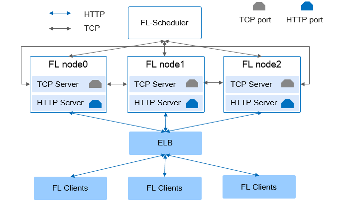

.. MindSpore documentation master file, created by
   sphinx-quickstart on Thu Mar 24 11:00:00 2020.
   You can adapt this file completely to your liking, but it should at least
   contain the root `toctree` directive.

MindSpore Federated 文档
=========================

MindSpore Federated是一款开源联邦学习框架，支持千万级无状态终端设备商用化部署，在用户数据留存在本地的情况下，使能全场景智能应用。

联邦学习是一种加密的分布式机器学习技术，它是指参与联邦学习的各用户在不共享本地数据的前提下共建AI模型。MindSpore Federated优先专注于大规模参与方的横向联邦的应用场景。

使用MindSpore Federated框架的优势
----------------------------------

1. 隐私安全

   MindSpore Federated框架数据留存本地进行训练，不交换数据本身，而是用加密方式交换更新的模型参数。

   支持基于多方安全计算（MPC）的精度无损的安全聚合方案防止模型窃取。

   支持基于本地差分隐私的性能无损的加密方案防止模型泄漏隐私数据。

2. 分布式联邦聚合

   云侧松耦合集群化处理方式，支持千万级大规模异构终端部署场景，实现高性能、高可用的分布式联邦聚合计算，可应对网络不稳定，负载突变等。

3. 联邦效率提升

   支持同步和异步的联邦模式，支持多种模型压缩算法，提高联邦学习效率，节省带宽资源。

   支持多种联邦聚合策略，提高联邦收敛的平滑度，兼顾全局和局部的精度最优化。

4. 灵活易用

   仅一行代码即可切换单机训练与联邦学习模式。

   网络模型可编程，聚合算法可编程，安全算法可编程，安全等级可定制。

使用MindSpore Federated的工作流程
----------------------------------

1. `场景识别、积累数据 <https://www.mindspore.cn/federated/docs/zh-CN/master/image_classification_application.html#id1>`_

   识别出使用联邦学习的场景，在客户端为联邦任务积累本地数据。

2. `模型选择、客户端部署 <https://www.mindspore.cn/federated/docs/zh-CN/master/image_classification_application.html#id4>`_

   进行模型原型的选择或开发，并使用工具生成方便部署的端侧模型。

3. `应用部署 <https://www.mindspore.cn/federated/docs/zh-CN/master/image_classification_application.html#id5>`_

   将Federated-Client部署到端侧应用中，并在云侧设置联邦配置任务和部署脚本。

常见的场景
----------

1. `图像分类 <https://www.mindspore.cn/federated/docs/zh-CN/master/image_classification_application.html>`_

   使用联邦学习实现图像分类应用。

2. `文本分类 <https://www.mindspore.cn/federated/docs/zh-CN/master/sentiment_classification_application.html>`_

   使用联邦学习实现文本分类应用。

.. toctree::
   :maxdepth: 1
   :caption: 安装部署

   federated_install
   deploy_federated_server
   deploy_federated_client

.. toctree::
   :maxdepth: 1
   :caption: 应用实践

   image_classification_application
   sentiment_classification_application
   image_classification_application_in_cross_silo
   object_detection_application_in_cross_silo

.. toctree::
   :maxdepth: 1
   :caption: 安全和隐私

   local_differential_privacy_training_noise
   local_differential_privacy_training_signds
   pairwise_encryption_training

.. toctree::
   :maxdepth: 1
   :caption: API参考

   federated_server
   federated_client

.. toctree::
   :maxdepth: 1
   :caption: 参考文档

   faq
