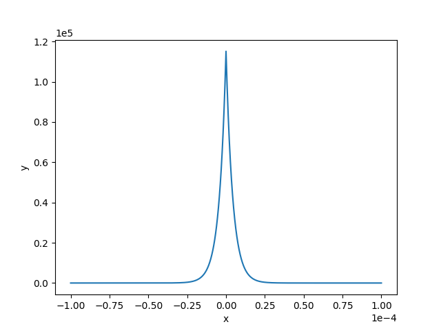
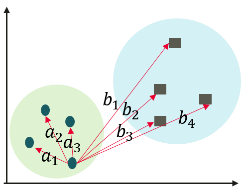
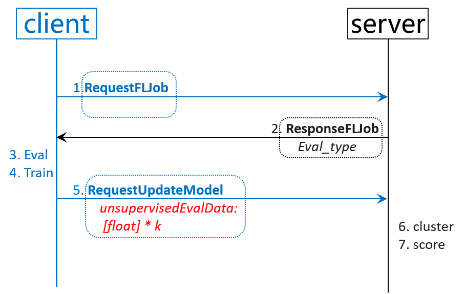
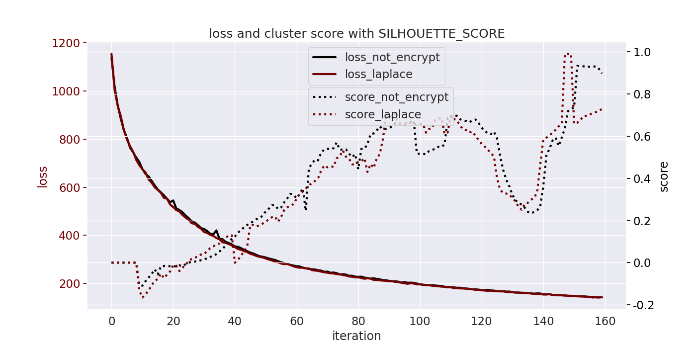

# 横向联邦-局部差分隐私推理结果保护

[](https://gitee.com/mindspore/docs/blob/master/docs/federated/docs/source_zh_cn/local_differential_privacy_eval_laplace.md)

## 隐私保护背景

评价联邦无监督模型训练的好坏，可通过端侧反馈的$loss$判断，也可利用端侧推理结果结合云侧聚类及聚类评估指标，来进一步监测联邦无监督模型训练进度。后者涉及到端侧推理数据上云，为满足隐私保护要求，需要对端侧推理数据进行隐私保护处理，同时云侧仍可进行聚类评估。该任务相较训练任务为辅助任务，则尽量使用轻量级算法，不能引入较训练阶段计算或通讯开销更大的隐私保护算法，本文介绍了一种利用局部差分隐私Laplace噪声机制保护推理结果的轻量级方案。

将隐私保护技术有效地融入到产品服务中，一方面有利于提升用户以及业界对产品及技术的信任度，另一方面有助于在满足当前隐私合规要求之下更好地开展联邦任务，打造全生命周期（训练-推理-评估）的隐私保护。

## 算法分析

### $L1$与$L2$范式

长度为$k$的向量$V$的$L1$范数为 $||V||_1=\sum^{k}_{i=1}{|V_i|}$，则在二维空间中，两个向量差的$L1$范数就是曼哈顿距离。

$L2$范数为 $||V||_2=\sqrt{\sum^{k}_{i=1}{V^2_i}}$。

推理结果一般为$softmax$结果，和为$1$，向量的各个维度值表示所属该维度对应类别的概率。

### $L1$与$L2$敏感度

本地差分隐私对要上传的数据引入不确定性，敏感度描述了不确定性的上界。在优化器和联邦训练中，可以给梯度添加$L2$敏感度的高斯噪声，因为添加前会对梯度向量进行裁剪操作。此处$softmax$推理结果满足和为$1$，因此添加$L1$的拉普拉斯噪声。对于$L2$灵敏度远低于$L1$灵敏度的应用程序，高斯机制允许增加更少的噪声，但该场景没有$L2$相关的约束限制，仅使用$L1$敏感度。

$L1$敏感度在本地差分隐私中表现为定义域内任意输入的最大距离：

$\Delta f=max||X-Y||_1$

在本场景中，$X=<x_1, x_2, ..., x_k>, Y=<y_1, y_2, ..., y_k>, \sum X = 1, \sum Y = 1, |x_1-y_1|+|x_2-y_2|+...+|x_k-y_k|\leq1=\Delta f$。

### Laplace分布

拉普拉斯分布是连续的，均值为0的拉普拉斯的概率密度函数为：

$Lap(x|b)=\frac{1}{2b}exp(-\frac{|x|}{b})$

### Laplace机制

$M(x,\epsilon)=X+Lap(\Delta f/\epsilon)$

其中，$Lap(\Delta f/\epsilon)$是和$X$同shape，独立同分布的随机变量向量。

在此场景中，$b$（又叫$scale$、$lambda$，$beta$）为$1/\epsilon$。

### 证明拉普拉斯机制是满足$\epsilon-LDP$的

任意两个不同的客户端，经过拉普拉斯机制处理之后，都输出相同结果来达到混淆不可区分的目的概率比有上确界。将$b=\Delta f/\epsilon$代入得到：

$Lap(\Delta f/\epsilon)=\frac{\epsilon}{2\Delta f}exp(-\frac{\epsilon|x|}{\Delta f})$

$\frac{P(Z|X)}{P(Z|Y)}$

$=\prod^k_{i=1}(\frac{exp(-\frac{\epsilon|x_i-z_i|}{\Delta f})}{exp(-\frac{\epsilon |y_i-z_i|}{\Delta f})})$

$=\prod^k_{i=1}exp(\epsilon\frac{|x_i-z_i|-|y_i-z_i|}{\Delta f})$

$\leq\prod^k_{i=1}(\epsilon\frac{|x_i-y_i|}{\Delta f})$

$=exp(\epsilon\frac{X-Y}{\Delta f})$

$\leq exp(\epsilon)$

#### $\epsilon$ 的确定与对应的概率密度图

结合数据特点计算出可用性较高的隐私预算，比如要求大概率输出$1e-5$量级的噪声，否则会直接严重影响聚类结果。下面给出产生指定量级噪声对应的隐私预算计算方法。

$90\%$概率输出$1e-5$量级的大小，对概率密度曲线积分得到$\epsilon$的取值。

$x>=0, Lap(x|b)=\frac{1}{2b}exp(-\frac{x}{b})$

$\int^ {E^{-5}}_0 {Lap(x|b)dx}$

$=1-\frac{1}{2}exp(-\frac{x}{b})|^{E^{-5}}_{0}$

$=\frac{1}{2}(exp(0)-exp(-\frac{E^{-5}}{b}))$

$=0.5(1-exp(-\frac{E^{-5}}{b})) = 0.45$

即：

$exp(-\frac{E^{-5}}{b})=0.1$

$b=-E^{-5}/ln(0.1)=E^{-5}/2.3026=1/\epsilon$

$\epsilon=2.3026E^5$

当隐私预算取该值时，拉普拉斯概率密度函数如下：



### 聚类评价指标的影响性分析

以**Calinski-Harabasz Index**评估方法举例，该评价指标计算过程分为两步：

1. 每个类计算该类中所有`点`到 `该类中心`距离的平方和；

2. 计算每个`类`与`类中心`距离平方和；

源码实现与加噪之后的影响性分析：

```python
# 1.云侧聚类算法得到所属类序号，有影响
n_labels = argmax(X)

extra_disp, intra_disp = 0.0, 0.0
# 2.计算所有点的类中心，不影响
mean = np.mean(X, axis=0)
for k in range(n_labels):
    # 3.得到第k类中的所有点，基于1的影响
    cluster_k = X[labels == k]
    # 4.得到该类中心，基于1的影响
    mean_k = np.mean(cluster_k, axis=0)
    # 5.该类与所有类中心距离，基于1的影响
    extra_disp += len(cluster_k) * np.sum((mean_k - mean) ** 2)
    # 6.点到该类中心距离，有影响
    intra_disp += np.sum((cluster_k - mean_k) ** 2)

return (
    1.0
    if intra_disp == 0.0
    else extra_disp * (n_samples - n_labels) / (intra_disp * (n_labels - 1.0))
)
```

综合分析，主要影响在加噪之后对聚类算法的影响，还有距离计算上的误差。在计算类中心时，由于噪声和期望为$0$，所以引入的误差较小。

以**SILHOUETTE SCORE**举例，该评价指标计算过程分为两步：

1. 计算一个样本点$i$与同簇的其他所有样本点的平均距离，记为$a_i$；该值越小，表示样本$i$越应该分到这个簇。

2. 计算样本$i$到其他某簇$C_j$的所有样本的平均距离$b_{ij}$，称为样本$i$与簇$C_j$的不相似度。定义为样本$i$的簇间不相似度：$b_i = min(b_{i1}, b_{i2}, …, b_{ik})$。该值越大，说明样本$i$越不应该属于这个簇。



$s_i=(b_i-a_i) / max(a_i, b_i)$.

$a_i$越小，$b_i$越大，结果为$1-a_i / b_i$就越接近$1$，聚类效果越好。

伪代码实现与加噪之后的影响性分析：

```c++
// 计算距离矩阵，空间换时间，上三角存储，加噪有影响
euclidean_distance_matrix(&distance_matrix, group_ids);

// 对每个点都进行相同的计算，最后计算均值
for (size_t i = 0; i < n_samples; ++i) {
    std::unordered_map<size_t, std::vector<float>> b_i_map;
    for (size_t j = 0; j < n_samples; ++j) {
        size_t label_j = labels[j];
        float distance = distance_matrix[i][j];
        // 同簇计算ai
        if (label_j == label_i) {
        a_distances.push_back(distance);
        } else {
            // 非同簇计算bi
            b_i_map[label_j].push_back(distance);
        }
    }
    if (a_distances.size() > 0) {
        // 计算该点距离同簇其他点平均距离
        a_i = std::accumulate(a_distances.begin(), a_distances.end(), 0.0) / a_distances.size();
    }
    for (auto &item : b_i_map) {
        auto &b_i_distances = item.second;
        float b_i_distance = std::accumulate(b_i_distances.begin(), b_i_distances.end(), 0.0) / b_i_distances.size();
        b_i = std::min(b_i, b_i_distance);
    }
    if (a_i == 0) {
        s_i[i] = 0;
    } else {
        s_i[i] = (b_i - a_i) / std::max(a_i, b_i);
    }
}
return std::accumulate(s_i.begin(), s_i.end(), 0.0) / n_samples;
```

同上，主要影响在加噪之后对聚类算法的影响，还有距离计算上的误差。

### 端侧Java实现

Java基本库中没有生成Laplace分布随机数的函数，采用如下随机数的组合策略产生。

源码如下：

```java
float genLaplaceNoise(SecureRandom secureRandom, float beta) {
    float u1 = secureRandom.nextFloat();
    float u2 = secureRandom.nextFloat();
    if (u1 <= 0.5f) {
        return (float) (-beta * log(1. - u2));
    } else {
        return (float) (beta * log(u2));
    }
}
```

在端侧获得新一轮模型后，立即执行推理计算，等待训练结束之后，连同新模型和隐私保护之后的推理结果一同上传至云侧，云侧最终执行聚类和分数计算等操作。流程见下图，其中红色部分为隐私保护处理的输出结果：



## 快速上手

### 准备工作

若要使用该功能，首先需要成功完成任一端云联邦场景的训练聚合过程，[实现一个端云联邦的图像分类应用(x86)](https://www.mindspore.cn/federated/docs/zh-CN/master/image_classification_application.html)详细介绍了数据集、网络模型等准备工作，以及模拟启动多客户端参与联邦学习的流程。

### 配置项

[云侧yaml配置文件](https://gitee.com/mindspore/federated/blob/master/tests/st/cross_device_cloud/default_yaml_config.yaml)给出了开启端云联邦的完整配置项，该方案涉及到的新增配置文件项如下：

```c
encrypt:
    privacy_eval_type: LAPLACE
    laplace_eval:
        laplace_eval_eps: 230260
```

其中`privacy_eval_type`目前仅支持`NOT_ENCRYPT`和`LAPLACE`，分别表示不使用隐私保护方法处理推理结果和使用`LAPLACE`机制处理。

`laplace_eval_eps`表示如果使用`LAPLACE`处理，所使用的的隐私预算为多少。

## 实验结果

推理结果评估函数相关的基本配置使用如下：

```c
unsupervised:
  cluster_client_num: 1000
  eval_type: SILHOUETTE_SCORE
```

观察在使用`NOT_ENCRYPT`和使用`laplace_eval_eps=230260`的`LAPLACE`机制下，$loss$与分数之间的关系如图所示：



红色虚线为使用Laplace机制保护推理结果后的SILHOUETTE分数，由于模型中含有$dropout$和高斯输入，两次训练的$loss$略微不同，基于不同的模型得到的分数也有略微不同。但整体趋势保持一致，可以辅助$loss$一起检测模型训练进展。
