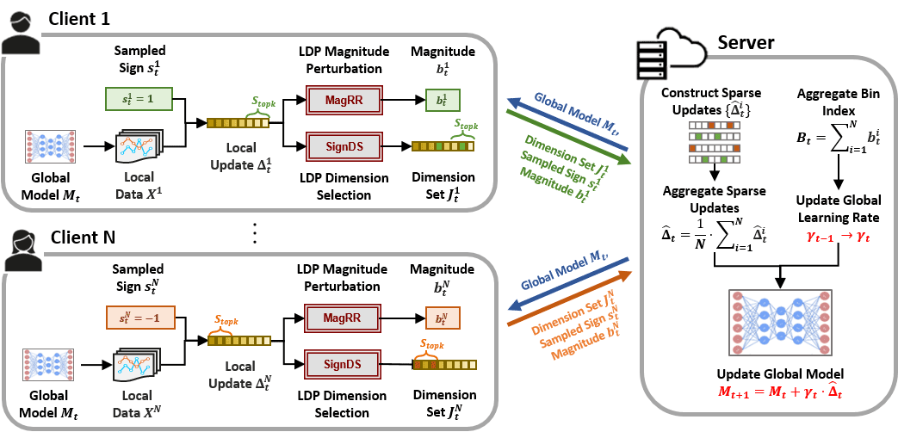
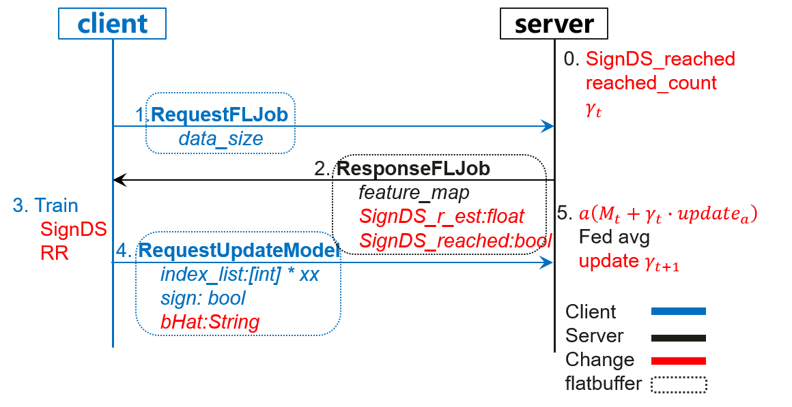
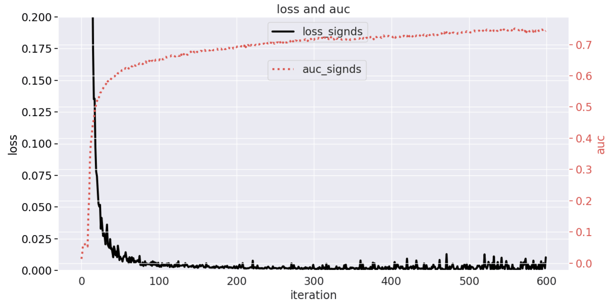

# 横向联邦-局部差分隐私SignDS训练

[](https://gitee.com/mindspore/docs/blob/master/docs/federated/docs/source_zh_cn/local_differential_privacy_training_signds.md)

## 隐私保护背景

联邦学习通过让参与方只上传本地训练后的新模型或更新模型的update信息，实现了client用户不上传原始数据集就能参与全局模型训练的目的，打通了数据孤岛。这种普通场景的联邦学习对应MindSpore联邦学习框架中的默认方案，启动`server`时，`encrypt_train_type`开关默认为`not_encrypt`，联邦学习教程中的`安装部署`与`应用实践`都默认使用这种方式，是没有任何加密扰动等保护隐私处理的普通联邦求均方案，为方便描述，下文以`not_encrypt`来特指这种默认方案。

这种联邦学习方案并不是毫无隐私泄漏的，使用上述`not_encrypt`方案进行训练，服务端Server收到客户端Client上传的本地训练模型，仍可通过一些攻击方法[1]重构用户训练数据，从而泄露用户隐私，所以`not_encrypt`方案需要进一步增加用户隐私保护机制。

联邦学习中客户端Client每轮接收的全局模型`oldModel`都是由服务端Server下发的，不涉及用户隐私问题。但各客户端Client本地训练若干epoch后得到的本地模型`newModel`拟合了其本地隐私数据，所以隐私保护重点是二者的权重差值`newModel`-`oldModel`=`update`。

MindSpore Federated框架中已实现的`DP_ENCRYPT`差分噪声方案通过向`update`迭加高斯随机噪声进行扰动，实现隐私保护。但随着模型维度增大，`update`范数增大会使噪声增大，从而需要较多的客户端Client参与同一轮聚合，以中和噪声影响，否则模型收敛性和精度会降低。如果设置的噪声过小，虽然收敛性和精度与`not_encrypt`方案性能接近，但隐私保护力度不够。同时每个客户端Client都需要发送扰动后的模型，随着模型增大，通信开销也会随之增大。我们期望手机为代表的客户端Client，以尽可能少的通信开销，即可实现全局模型的收敛。

## 算法流程介绍

SignDS[2]是Sign Dimension Select的缩写，处理对象是客户端Client的`update`。准备工作：把`update`的每一层Tensor拉平展开成一维向量，连接在一起，拼接向量维度数量记为$d$。

一句话概括算法：每个参与方仅上传重要维度的信息，信息包括它们的梯度方向和隐私保护的步长。分别对应下图中的SignDS和MagRR（Magnitude Random Response）模块。



下面举例来说明：现有3个客户端Client1，2，3，其`update`拉平展开后为$d=8$维向量，服务端Server计算这3个客户端Client的`avg`，并用该值更新全局模型，即完成一轮联邦学习。

| Client | d_1  | d_2  | d_3  | d_4  | d_5  | d_6  | d_7  |  d_8  |
| :----: | :--: | :--: | :--: | :--: | :--: | :--: | :--: | :---: |
|   1    | 0.4  | 0.1  | -0.2 | 0.3  | 0.5  | 0.1  | -0.2 | -0.3  |
|   2    | 0.5  | 0.2  |  0   | 0.1  | 0.3  | 0.2  | -0.1 | -0.2  |
|   3    | 0.3  | 0.1  | -0.1 | 0.5  | 0.2  | 0.3  |  0   |  0.1  |
|  avg   | 0.4  | 0.13 | -0.1 | 0.3  | 0.33 | 0.2  | -0.1 | -0.13 |

### SignDS

应选择重要性较高的维度，重要性衡量标准是**取值的大小**，需要对update进行排序。update取值正负代表不同的更新方向，故每轮联邦学习中，客户端Client的sign值各有**0.5的概率**取`1`或`-1`。如果sign=1，则将最大的$k$个`update`维度记为`topk`集合，剩余的记为`non-topk`集合；如果sign=-1，则将最小的$k$个记为`topk`集合。

如果服务端Server指定总共选择的维度数量`h`，客户端Client会直接使用该值，否则各客户端Client会本地计算出最优的输出维度`h`。

随后SignDS算法会输出应从`topk`集合和`non-topk`集合中选择的维度数量（记为$v$），如下表中示例，两个集合总共挑选维度h=3。

客户端Client按照SignDS算法输出的维度数量，均匀随机挑选维度，将维度序号和sign值发送至服务端Server，维度序号如果按照先从`topk`挑选，再从`non-topk`挑选的顺序输出，则需要对维度序号列表`index`进行洗牌打乱操作，下表为该算法各客户端Client最终传输至服务端Server的部分信息：

| Client | index | sign |
| :----: | :---: | :--: |
|   1    | 1,5,8 |  1   |
|   2    | 2,3,4 |  -1  |
|   3    | 3,6,7 |  1   |

### MagRR

服务端Server收到客户端发来的维度方向，但不清楚在该方向要更新的步长是多少。通常来讲，在训练初期，步长往往很大，随着训练逐渐收敛，步长缩小。步长变化的大致趋势如下图所示：


服务端Server希望估计一个针对实际步长$r$的动态范围$[0,2∗r_{est}]$，进而计算全局学习率$lr_{global}=2∗r_{est}*num_{clients}$。

$r$的调整采用类似二分法思路。具体流程如下：

1. 训练开始前，服务端初始化一个较小的$r_{est}$(不会对模型收敛方向造成过大影响）；
2. 每轮本地训练后，参与方计算真实幅值$r$（topk维度的均值），并根据当前云侧下发的$r_{est}$将$r$以一定规则转换为$b$；
3. 参与方对$b$进行本地差分Binary Randomized Response(BRR)扰动，并将结果上传。

整个训练过程分为两个阶段，即**快增长**阶段和**收缩**阶段。参与方在两个阶段进行$r \rightarrow b$转换和服务端更新$r_{est}$的规则略有不同：

- 快增长阶段，选取一个较小的$r_{est}$，如$e^{−5}$。此时，需要以一定倍数扩大$r_{est}$。
  因此定义：

  $$
  b = \begin{cases}
    0 & r \in [2*r_{est}, \infty] \\
    1 & r \in [0,2*r_{est})]
    \end{cases}
  $$

  服务端聚合所有端侧随机响应结果进行频率统计，计算众数$B$，
  若$B=0$，则认为目前$r_{est}$未到达𝑟的范围，需继续增大$r_{est}$；
  若$B=1$，则认为$r_{est}$已到达𝑟的范围，保持$r_{est}$不变。
- 收缩阶段，需要根据$r$的变化微调$r_{est}$。因此定义：

  $$
  b = \begin{cases}
    0 & r \in [r_{est}, \infty] \\
    1 & r \in [0,r_{est})]
    \end{cases}
  $$

  计算$B$，若$B=0$ ，则认为目前$r_{est}$和$r$较为接近，保持$r_{est}$不变；
  若$B=1$，则认为$r$普遍小于$r_{est}$，则将$r_{est}$减半。

服务端Server根据各客户端Client上传的维度序号，sign值和$r_{est}$，构建带隐私保护的`update`，对所有`update`进行聚合平均并更新当前`oldModel`即完成一轮联邦学习。下表展示了$2∗r_{est}*num_{clients}=1$时的聚合情况。

| Client |  d_1  |  d_2   |  d_3   |  d_4   |  d_5  |  d_6  |  d_7  |  d_8  |
| :----: | :---: | :----: | :----: | :----: | :---: | :---: | :---: | :---: |
|   1    | **1** |   0    |   0    |   0    | **1** |   0   |   0   | **1** |
|   2    |   0   | **-1** | **-1** | **-1** |   0   |   0   |   0   |   0   |
|   3    |   0   |   0    | **1**  |   0    |   0   | **1** | **1** |   0   |
|  avg   |  1/3  |  -1/3  |   0    |  -1/3  |  1/3  |  1/3  |  1/3  |  1/3  |

SignDS方案使端侧client只上传算法输出的int类型维度序号列表，一个布尔类型的随机Sign值和对估计值的反馈结果到云侧，相比普通场景中上传数万float级别的完整模型权重或梯度，通讯开销显著降低。从实际重构攻击的角度来看，云侧仅获得维度序号、代表梯度更新方向的一个Sign值和隐私保护的步长估计反馈值，攻击更加难以实现。整体方案的数据流字段如下图所示：



## 隐私保护证明

差分隐私噪声方案通过加噪的方式，让攻击者无法确定原始信息，从而实现隐私保护；而差分隐私SignDS方案只激活部分维度，且用sign值代替原始值，很大程度上保护了用户隐私。进一步的，利用差分隐私指数机制让攻击者无法确认激活的维度是否是重要（来自`topk`集合），且无法确认输出维度中来自`topk`的维度数量是否超过给定阈值。

### 基于指数机制的维度选择机制

对于每个客户端Client的任意两个update $\Delta$ 和 $\Delta'$  ，其`topk`维度集合分别是 $S_{topk}$ ， ${S'}_{topk}$ ，该算法任意可能的输出维度集合是 ${J}\in {\mathcal{J}}$ ，记 $\nu=|{S}_{topk}\cap {J}|$ ， $\nu'=|{S'}_{topk}\cap {J}|$ 是 ${J}$ 和`topk` 集合交集的数量，算法使得以下不等式成立：

$$
\frac{{Pr}[{J}|\Delta]}{{Pr}[{J}|\Delta']}=\frac{{Pr}[{J}|{S}_{topk}]}{{Pr}[{J}|{S'}_{topk}]}=\frac{\frac{{exp}(\frac{\epsilon}{\phi_u}\cdot u({S}_{topk},{J}))}{\sum_{{J'}\in {\mathcal{J}}}{exp}(\frac{\epsilon}{\phi_u}\cdot u({S}_{topk}, {J'}))}}{\frac{{exp}(\frac{\epsilon}{\phi_u}\cdot u({S'}_{topk}, {J}))}{\sum_{ {J'}\in {\mathcal{J}}}{exp}(\frac{\epsilon}{\phi_u}\cdot u( {S'}_{topk},{J'}))}}=\frac{\frac{{exp}(\epsilon\cdot \unicode{x1D7D9}(\nu \geq \nu_{th}))}{\sum_{\tau=0}^{\tau=\nu_{th}-1}\omega_{\tau} + \sum_{\tau=\nu_{th}}^{\tau=h}\omega_{\tau}\cdot {exp}(\epsilon)}}{\frac{ {exp}(\epsilon\cdot \unicode{x1D7D9}(\nu' \geq\nu_{th}))}{\sum_{\tau=0}^{\tau=\nu_{th}-1}\omega_{\tau}+\sum_{\tau=\nu_{th}}^{\tau=h}\omega_{\tau}\cdot {exp}(\epsilon)}}\\= \frac{{exp}(\epsilon\cdot \unicode{x1D7D9} (\nu \geq \nu_{th}))}{ {exp}(\epsilon\cdot \unicode{x1D7D9} (\nu' \geq \nu_{th}))} \leq \frac{{exp}(\epsilon\cdot 1)}{{exp}(\epsilon\cdot 0)} = {exp}(\epsilon),
$$

证明该算法满足局部差分隐私。

### 局部差分隐私-随机响应机制

参与方收到服务端下发的估计值，在本地训练完成后，计算真实update的topk维度权重均值，根据magRR策略输出0或1，我们认为0或1仍然带有权重均值范围信息，则需要进一步保护。

随机响应机制的输入为待保护数据（$b\in \{0,1\}$）和隐私参数$\epsilon$，按照一定的概率对数据进行翻转，输出$\hat{b} \in \{0,1\}$，规则如下：

$$
\hat{b} = \begin{cases}
b & with \quad probability \quad P \\
1-b & with \quad probability \quad 1-P
\end{cases}
$$

其中$P=\frac{e^\epsilon}{1+e^\epsilon}$。

#### 基于随机响应机制的频率统计

通过随机响应的方式使敌手很难区分真实数据和扰动数据，来达到以假乱真的效果，但也会影响云侧统计任务的可用性。服务端可通过降噪的方式近似的真实统计频率值，但很难逆向推断出用户的真实输入。记$N$为一轮参与方总数，$N^T$为原始为1的总数，$N^C$为服务端收集到的1的总数，则有：

$$
N^T*P+(N-N^T)*(1-P)=N^C \\
N^T=\frac{N^C-N+NP}{2P-1}
$$

## 准备工作

若要使用该算法，首先需要成功完成任一端云联邦场景的训练聚合过程，[实现一个端云联邦的图像分类应用(x86)](https://www.mindspore.cn/federated/docs/zh-CN/master/image_classification_application.html)详细介绍了数据集、网络模型等准备工作，以及模拟启动多客户端参与联邦学习的流程。

## 算法开启脚本

本地差分隐私SignDS训练目前只支持端云联邦学习场景。开启方式需要在启动云侧服务时，在yaml文件中更改下列参数配置，云侧完整启动脚本可参考云侧部署，这里给出启动该算法的相关参数配置。以LeNet任务为例，yaml相关配置如下：

```python
encrypt:
  encrypt_train_type: SIGNDS
  ...
  signds:
    sign_k: 0.2
    sign_eps: 100
    sign_thr_ratio: 0.6
    sign_global_lr: 0.1
    sign_dim_out: 0
```

具体样例可参考[图像分类应用](https://www.mindspore.cn/federated/docs/zh-CN/master/image_classification_application.html)
云侧代码实现给出了各个参数的定义域，若不在定义域内的，Server会报错提示定义域。以下参数改动的前提是保持其余4个参数不变：

- `sign_k`：(0,0.25]，k*inputDim>50. default=0.01，`inputDim`是模型或update的拉平长度，若不满足，端侧警告。排序update，占比前k（%）的组成`topk`集合。减少k，则意味着要从更重要的维度中以较大概率挑选，输出的维度会减少，但维度更重要，无法确定收敛性的变化，用户需观察模型update稀疏度来确定该值，当比较稀疏时（update有很多0），则应取小一点。
- `sign_eps`：(0,100]，default=100。隐私保护预算，数序符号为$\epsilon$，简写为eps。eps减少，挑选不重要的维度概率会增大，隐私保护力度增强，输出维度减少，占比不变，精度降低。
- `sign_thr_ratio`：[0.5,1]，default=0.6。激活的维度中来自`topk`的维度占比阈值下界。增大会减少输出维度，但输出维度中来自`topk`的占比会增加，当过度增大该值，要求输出中更多的来自`topk`，为了满足要求只能减少总的输出维度，当client用户数量不够多时，精度下降。
- `sign_global_lr`：(0,)，default=1。该值乘上sign来代替update，直接影响收敛快慢与精度，适度增大该值会提高收敛速度，但有可能让模型震荡，梯度爆炸。如果每个client用户本地跑更多的epoch，且增大本地训练使用的学习率，那么需要相应提高该值；如果参与聚合的client用户数目增多，那么也需要提高该值，因为重构时需要把该值聚合再除以用户数目，只有增大该值，结果才保持不变。若参与聚合的新版本（r0.2）参与方占比不足5%，则MagRR算法的$lr_{global}$直接调整为该入参。
- `sign_dim_out`：[0,50]，default=0。若给出非0值，client端直接使用该值，增大该值输出的维度增多，但来自`topk`的维度占比会减少；若为0，client用户要计算出最优的输出参数。eps不够大时，若增大该值，则会输出很多`non-topk`的不重要维度导致影响模型收敛，精度下降；当eps足够大时，增大该值会让更多的用户重要的维度信息离开本地，精度提升。

## LeNet实验结果

使用`3500_clients_bin`其中的100个client数据集，联邦聚合600个iteration，每个client本地运行20个epoch，端侧本地训练使用学习率为0.01，SignDS相关参数为`k=0.2,eps=100,ratio=0.6,lr=4,out=0`，Loss和Auc的变化曲线如下图所示。端侧训练结束上传到云侧的数据长度为266084，但SignDS上传的数据长度仅为656。



## 参考文献

[1] Ligeng Zhu, Zhijian Liu, and Song Han. [Deep Leakage from Gradients](http://arxiv.org/pdf/1906.08935.pdf). NeurIPS, 2019.

[2] Xue Jiang, Xuebing Zhou, and Jens Grossklags. "SignDS-FL: Local Differentially-Private Federated Learning with Sign-based Dimension Selection." ACM Transactions on Intelligent Systems and Technology, 2022.