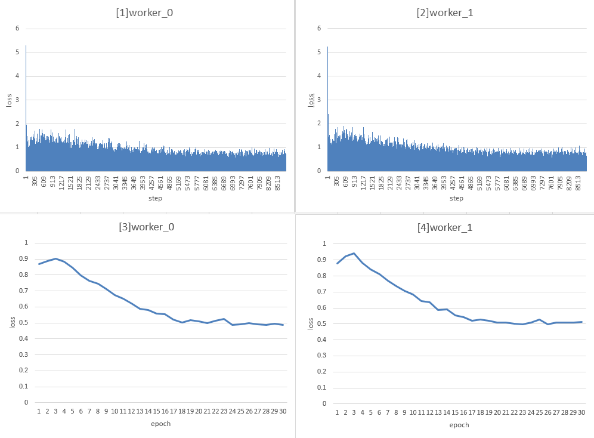

# 实现一个云云联邦的目标检测应用(x86)

<a href="https://gitee.com/mindspore/docs/blob/master/docs/federated/docs/source_zh_cn/object_detection_application_in_cross_silo.md" target="_blank"></a>

根据参与客户端的类型，联邦学习可分为云云联邦学习（cross-silo）和端云联邦学习（cross-device）。在云云联邦学习场景中，参与联邦学习的客户端是不同的组织（例如，医疗或金融）或地理分布的数据中心，即在多个数据孤岛上训练模型。在端云联邦学习场景中，参与的客户端为大量的移动或物联网设备。本框架将介绍如何在MindSpore Federated云云联邦框架上使用网络Fast R-CNN实现一个目标检测应用。

启动云云联邦的目标检测应用的完整脚本可参考[这里](https://gitee.com/mindspore/federated/tree/master/example/cross_silo_faster_rcnn)。

## 任务前准备

本教程基于MindSpore model_zoo中提供的的faster_rcnn网络部署云云联邦目标检测任务，请先根据官方[faster_rcnn教程及代码](https://gitee.com/mindspore/models/tree/master/official/cv/faster_rcnn)先了解COCO数据集、faster_rcnn网络结构、训练过程以及评估过程。由于COCO数据集已开源，请参照其[官网](https://cocodataset.org/#home)指引自行下载好数据集，并进行数据集切分（例如模拟100个客户端，可将数据集切分成100份，每份代表一个客户端所持有的数据）。

由于原始COCO数据集为json文件格式，云云联邦学习框架提供的目标检测脚本暂时只支持MindRecord格式输入数据，可根据以下步骤将json文件转换为MindRecord格式文件。

- 首先在配置文件[default_config.yaml](https://gitee.com/mindspore/federated/blob/master/example/cross_silo_faster_rcnn/default_config.yaml)中设置以下参数：

    - 参数`mindrecord_dir`

        用于设置生成的MindRecord格式文件保存路径，文件夹名称必须为mindrecord_{num}格式，数字num代表客户端标号0，1，2，3，......

        ```sh
        mindrecord_dir:"./datasets/coco_split/split_100/mindrecord_0"
        ```

    - 参数`instance_set`

        用于设置原始json文件路径。

        ```sh
        instance_set: "./datasets/coco_split/split_100/train_0.json"
        ```

- 运行脚本[generate_mindrecord.py](https://gitee.com/mindspore/federated/blob/master/example/cross_silo_faster_rcnn/generate_mindrecord.py)即可生成`train_0.json`对应的MindRecord文件，保存在路径`mindrecord_dir`中。

## 启动云云联邦任务

### 安装MindSpore和Mindspore Federated

包括源码和下载发布版两种方式，支持CPU、GPU硬件平台，根据硬件平台选择安装即可。安装步骤可参考[MindSpore安装指南](https://www.mindspore.cn/install)， [Mindspore Federated安装指南](https://www.mindspore.cn/federated/docs/zh-CN/master/index.html)。

目前联邦学习框架只支持Linux环境中部署，cross-silo联邦学习框架需要MindSpore版本号>=1.5.0。

### 启动任务

参考[示例](https://gitee.com/mindspore/federated/tree/master/example/cross_silo_faster_rcnn)，启动集群。参考示例目录结构如下：

```text
cross_silo_faster_rcnn
├── src
│   ├── FasterRcnn
│   │   ├── __init__.py                  // init文件
│   │   ├── anchor_generator.py          // 锚点生成器
│   │   ├── bbox_assign_sample.py        // 第一阶段采样器
│   │   ├── bbox_assign_sample_stage2.py // 第二阶段采样器
│   │   ├── faster_rcnn_resnet.py        // Faster R-CNN网络
│   │   ├── faster_rcnn_resnet50v1.py    // 以Resnet50v1.0作为backbone的Faster R-CNN网络
│   │   ├── fpn_neck.py                  // 特征金字塔网络
│   │   ├── proposal_generator.py        // 候选生成器
│   │   ├── rcnn.py                      // R-CNN网络
│   │   ├── resnet.py                    // 骨干网络
│   │   ├── resnet50v1.py                // Resnet50v1.0骨干网络
│   │   ├── roi_align.py                 // ROI对齐网络
│   │   └── rpn.py                       // 区域候选网络
│   ├── dataset.py                     // 创建并处理数据集
│   ├── lr_schedule.py                 // 学习率生成器
│   ├── network_define.py              // Faster R-CNN网络定义
│   ├── util.py                        // 例行操作
│   └── model_utils
│           ├── __init__.py                  // init文件
│           ├── config.py                    // 获取.yaml配置参数
│           ├── device_adapter.py            // 获取云上id
│           ├── local_adapter.py             // 获取本地id
│           └── moxing_adapter.py            // 云上数据准备
├── requirements.txt
├── mindspore_hub_conf.py
├── generate_mindrecord.py              // 将.json格式的annotations文件转化为MindRecord格式，以便读取datasets
├── default_config.yaml                 // 网络结构、数据集地址、fl_plan所需配置文件
├── default.yaml                         // 联邦训练所需配置文件
├── config.json                         // 容灾所需配置文件
├── run_cross_silo_fasterrcnn_worker.py // 启动云云联邦worker脚本
└── test_fl_fasterrcnn.py               // 客户端使用的训练脚本
```

1. 注意在`test_fl_fasterrcnn.py`文件中可通过设置参数`dataset_sink_mode`来选择是否记录每个step的loss值：

   ```python
   model.train(config.client_epoch_num, dataset, callbacks=cb)  # 不设置dataset_sink_mode代表只记录每个epoch中最后一个step的loss值，代码里默认为这种方式
   model.train(config.client_epoch_num, dataset, callbacks=cb, dataset_sink_mode=False)   # 设置dataset_sink_mode=False代表记录每个step的loss值
   ```

2. 在配置文件[default_config.yaml](https://gitee.com/mindspore/federated/blob/master/example/cross_silo_faster_rcnn/default_config.yaml)中设置以下参数：

   - 参数`pre_trained`

     用于设置预训练模型路径（.ckpt 格式）。

     本教程中实验的预训练模型是在ImageNet2012上训练的ResNet-50检查点。你可以使用ModelZoo中 [resnet50](https://gitee.com/mindspore/models/tree/master/official/cv/resnet) 脚本来训练，然后使用src/convert_checkpoint.py把训练好的resnet50的权重文件转换为可加载的权重文件。

3. 启动redis

   ```sh
   redis-server --port 2345 --save ""
   ```

4. 启动Scheduler

   `run_sched.py`是用于启动`Scheduler`的Python脚本，并支持通过`argparse`传参修改配置。执行指令如下，代表启动本次联邦学习任务的`Scheduler`，`--yaml_config`用于设置yaml文件路径，其管理ip:port为`10.113.216.40:18019`。

   ```sh
   python run_sched.py --yaml_config="default.yaml" --scheduler_manage_address="10.113.216.40:18019"
   ```

   具体实现详见[run_sched.py](https://gitee.com/mindspore/federated/blob/master/tests/st/cross_device_cloud/run_sched.py)。

   打印如下代表启动成功：

   ```sh
   [INFO] FEDERATED(3944,2b280497ed00,python):2022-10-10-17:11:08.154.878 [mindspore_federated/fl_arch/ccsrc/scheduler/scheduler.cc:35] Run] Scheduler started successfully.
   [INFO] FEDERATED(3944,2b28c5ada700,python):2022-10-10-17:11:08.155.056 [mindspore_federated/fl_arch/ccsrc/common/communicator/http_request_handler.cc:90] Run] Start http server!
   ```

5. 启动Server

   `run_server.py`是用于启动若干`Server`的Python脚本，并支持通过`argparse`传参修改配置。执行指令如下，代表启动本次联邦学习任务的`Server`，其TCP地址为`10.113.216.40`，联邦学习HTTP服务起始端口为`6668`，`Server`数量为`4`个。

   ```sh
   python run_server.py --yaml_config="default.yaml" --tcp_server_ip="10.113.216.40" --checkpoint_dir="fl_ckpt" --local_server_num=4 --http_server_address="10.113.216.40:6668"
   ```

   以上指令等价于启动了4个`Server`进程，每个`Server`的联邦学习服务端口分别为`6668`、`6669`、`6670`和`6671`，具体实现详见[run_server.py](https://gitee.com/mindspore/federated/blob/master/tests/st/cross_device_cloud/run_server.py)。

   打印如下代表启动成功：

   ```sh
   [INFO] FEDERATED(3944,2b280497ed00,python):2022-10-10-17:11:08.154.645 [mindspore_federated/fl_arch/ccsrc/common/communicator/http_server.cc:122] Start] Start http server!
   [INFO] FEDERATED(3944,2b280497ed00,python):2022-10-10-17:11:08.154.725 [mindspore_federated/fl_arch/ccsrc/common/communicator/http_request_handler.cc:85] Initialize] Ev http register handle of: [/d    isableFLS, /enableFLS, /state, /queryInstance, /newInstance] success.
   [INFO] FEDERATED(3944,2b280497ed00,python):2022-10-10-17:11:08.154.878 [mindspore_federated/fl_arch/ccsrc/scheduler/scheduler.cc:35] Run] Scheduler started successfully.
   [INFO] FEDERATED(3944,2b28c5ada700,python):2022-10-10-17:11:08.155.056 [mindspore_federated/fl_arch/ccsrc/common/communicator/http_request_handler.cc:90] Run] Start http server!
   ```

6. 启动Worker

    `run_cross_silo_femnist_worker.py`是用于启动若干`worker`的Python脚本，并支持通过`argparse`传参修改配置。执行指令如下，代表启动本次联邦学习任务的`worker`，联邦学习任务正常进行需要的`worker`数量为`2`个：

    ```sh
    python run_cross_silo_fasterrcnn_worker.py --worker_num=2 --dataset_path datasets/coco_split/split_100 --http_server_address=10.113.216.40:6668
    ```

   具体实现详见[run_cross_silo_femnist_worker.py](https://gitee.com/mindspore/federated/blob/master/example/cross_silo_faster_rcnn/run_cross_silo_fasterrcnn_worker.py)。

    如上指令，`--worker_num=2`代表启动两个客户端，且两个客户端使用的数据集分别为`datasets/coco_split/split_100/mindrecord_0`和`datasets/coco_split/split_100/mindrecord_1`，请根据`任务前准备`教程准备好对应客户端所需数据集。

    当执行以上三个指令之后，等待一段时间之后，进入当前目录下`worker_0`文件夹，通过指令`grep -rn "\epoch:" *`查看`worker_0`日志，可看到类似如下内容的日志信息：

    ```sh
    epoch: 1 step: 1 total_loss: 0.6060338
    ```

    则说明云云联邦启动成功，`worker_0`正在训练，其他worker可通过类似方式查看。

以上脚本中参数配置说明请参考[yaml配置说明](https://www.mindspore.cn/federated/docs/zh-CN/master/horizontal/federated_server_yaml.html)。

### 日志查看

成功启动任务之后，会在当前目录`cross_silo_faster_rcnn`下生成相应日志文件，日志文件目录结构如下：

```text
cross_silo_faster_rcnn
├── scheduler
│   └── scheduler.log     # 运行scheduler过程中打印日志
├── server_0
│   └── server.log        # server_0运行过程中打印日志
├── server_1
│   └── server.log        # server_1运行过程中打印日志
├── server_2
│   └── server.log        # server_2运行过程中打印日志
├── server_3
│   └── server.log        # server_3运行过程中打印日志
├── worker_0
│   ├── ckpt              # 存放worker_0在每个联邦学习迭代结束时获取的聚合后的模型ckpt
│   │  └── mindrecord_0
│   │      ├── mindrecord_0-fast-rcnn-0epoch.ckpt
│   │      ├── mindrecord_0-fast-rcnn-1epoch.ckpt
│   │      │
│   │      │              ......
│   │      │
│   │      └── mindrecord_0-fast-rcnn-29epoch.ckpt
│   ├──loss_0.log         # 记录worker_0训练过程中的每个step的loss值
│   └── worker.log        # 记录worker_0参与联邦学习任务过程中输出日志
└── worker_1
    ├── ckpt              # 存放worker_1在每个联邦学习迭代结束时获取的聚合后的模型ckpt
    │  └── mindrecord_1
    │      ├── mindrecord_1-fast-rcnn-0epoch.ckpt
    │      ├── mindrecord_1-fast-rcnn-1epoch.ckpt
    │      │
    │      │                     ......
    │      │
    │      └── mindrecord_1-fast-rcnn-29epoch.ckpt
    ├──loss_0.log         # 记录worker_1训练过程中的每个step的loss值
    └── worker.log        # 记录worker_1参与联邦学习任务过程中输出日志
```

### 关闭任务

若想中途退出，则可用以下指令：

```sh
python finish_cloud.py --redis_port=2345
```

具体实现详见[finish_cloud.py](https://gitee.com/mindspore/federated/blob/master/tests/st/cross_device_cloud/finish_cloud.py)。

或者等待训练任务结束之后集群会自动退出，不需要手动关闭。

### 实验结果

- 使用数据：

  COCO数据集，拆分为100份，取前两份分别作为两个worker的数据集

- 客户端本地训练epoch数：1

- 云云联邦学习总迭代数：30

- 实验结果（记录客户端本地训练过程中的loss值）：

  进入当前目录下`worker_0`文件夹，通过指令`grep -rn "\]epoch:" *`查看`worker_0`日志，可看到每个step输出的loss值，如下所示：

  ```sh
  epoch: 1 step: 1 total_loss: 5.249325
  epoch: 1 step: 2 total_loss: 4.0856013
  epoch: 1 step: 3 total_loss: 2.6916502
  epoch: 1 step: 4 total_loss: 1.3917351
  epoch: 1 step: 5 total_loss: 0.8109232
  epoch: 1 step: 6 total_loss: 0.99101084
  epoch: 1 step: 7 total_loss: 1.7741735
  epoch: 1 step: 8 total_loss: 0.9517553
  epoch: 1 step: 9 total_loss: 1.7988946
  epoch: 1 step: 10 total_loss: 1.0213892
  epoch: 1 step: 11 total_loss: 1.1700443
                    .
                    .
                    .
  ```

worker_0和worker_1在30个迭代的训练过程中，统计每个step的训练loss变换柱状图如下[1]和[2]：

worker_0和worker_1在30个迭代的训练过程中，统计每个epoch的平均loss (一个epoch中包含的所有step的loss之和除以step数)的折线图如下[3]和[4]：


