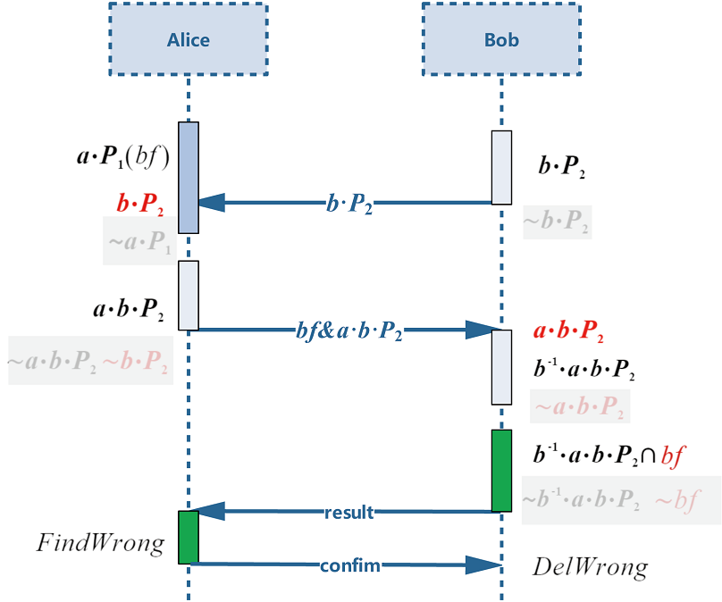

# 隐私集合求交

<a href="https://gitee.com/mindspore/docs/blob/master/docs/federated/docs/source_zh_cn/private_set_intersection.md" target="_blank"></a>

## 隐私保护背景

随着数字化转型和数据要素流通的需求提升，以及《数据安全法》、《个人信息保护法》和欧盟《通用数据保护条例》（GDPR）的施行，数据的隐私性（Privacy）越来越成为诸多场景下必要的需求。例如，当数据集合是用户的敏感信息（医疗诊断信息、交易记录、身份识别码、设备唯一标识符 OAID 等），或者是公司的秘密信息时，为了防止信息泄露，在开放状态下使用数据之前必须采用密码学或者脱敏手段来确保数据的机密性（Confidentiality），以达到数据“可用不可见”的目标。考虑两个参与方利用各自数据共同训练一个机器学习模型（例如纵向联邦学习），该任务的第一步就是需要对齐双方的样本集，也就是所谓的实体解析（Entity Resolution）过程。传统的明文求交不可避免地会泄露整个数据库的 OAID，对双方的数据私密性产生破坏，因此需要采用隐私集合求交（Private Set Intersection，PSI）技术来完成该任务。

PSI 是安全多方计算（MPC）协议的一种，它接收两方的数据集合作为输入，经过一系列哈希、加密、数据交换等步骤，最终向约定的输出方输出集合的交集，同时保证参与方无法获得交集以外数据的任何信息。在纵向联邦学习任务中使用 PSI 协议，符合 GDPR 提出的数据最小化（Data Minimisation）要求，即除训练过程必须的部分（交集），数据不产生非必要的暴露；从数据控制者的角度来看，业务上不得不适当共享数据，但又只想基于业务共享必须数据，不对外暴露额外数据。值得注意的是，虽然 PSI 可以直接套用已有的 MPC 协议进行计算，但是这样做往往会带来较大的计算和通信开销，不利于业务的开展。本文将介绍一种结合布隆过滤器和椭圆曲线点乘逆元抵消的技术，实现 ECDH-PSI（Elliptic Curve Diffie–Hellman key Exchange-PSI），去更好地支撑云服务和开展隐私保护集合交集计算服务。

## 算法流程介绍

ECDH-PSI 的核心思想是：一条数据先经过 Alice 加密再经过 Bob 加密，与交换加密顺序的结果相同。那么一方在不泄露自己隐私的情况下，发送用自己私钥加密的数据，另一方基于接收的加密数据再用自己私钥再加密，如果加密结果相同，则说明原始数据相同。

求逆的 ECDH-PSI 的核心优化点是：在面对数据量不均衡的双方求交场景时（记 Bob 为数据量少的一方，$a$，$b$ 分别为 Alice 和 Bob 的私钥，双方的原始数据映射到椭圆曲线上分别记为 $P_1$ 和 $P_2$ ，用私钥 $k$ 进行椭圆曲线的点乘加密记为 $P^k$ 或 $kP$，私钥$k$的逆元为$k^{-1}$），尽可能的减少基于数据量多的集合的加密计算。那么 Alice 执行完 $p_1^a$ 发送至 Bob 后，Bob 不再基于此执行加密计算了，而是发送 $p_2^b$ 至Alice，Alice 发送$P_2^{ba}$之后，Bob 通过点乘自己私钥的逆元完成抵消操作，即计算$P_2^{bab^{-1}}$，将其与Alice发送来的 $P_1^a$ 进行对比，如果加密结果相同，那么说明 $P_1=P_2$。求逆 ECDH-PSI 流程图如图所示，红色字样表示收到的对方数据：



图中 $bf$ 为布隆过滤器（bloom filter, bf）的缩写。若要在一个集合中查询是否存在一个元素，基本方法是遍历一遍集合进行查询，或将集合进行排序，使用二分查找进行查询，但当数据量过大时，排序不支持并行所以十分耗时。若使用布隆过滤器，将集合中的元素通过若干哈希函数映射至一个初始全 0 比特串中的若干位，所有集合中的元素共用一个比特串。查询时，只需将待查询数据也使用相同的这些若干哈希函数处理，直接访问所有对应位是否激活为 1，全为 1 则说明命中，数据存在；反之不存在。其中碰撞的概率可通过控制哈希函数的个数来实现。相较发送整个集合和发送布隆过滤器输出的一个比特串，后者通讯开销更低；在建立布隆过滤器和使用过滤器进行大规模数据查询过程中，也可以通过并行来加速计算。

## 快速体验

### 前置需要

在 Python 环境中完成安装`mindspore-federated`库。

### 启动脚本

可从 [MindSpore federated ST](https://gitee.com/mindspore/federated/blob/master/tests/st/psi/run_psi.py) 获取PSI双方启动脚本，开启两个进程分别模拟两方，下面给出本机与本机通讯的启动命令：

```python
python run_psi.py --comm_role="server" --peer_comm_role="client" --server_address="127.0.0.1:8004" --peer_server_address="127.0.0.1:8005" --input_begin=1 --input_end=100

python run_psi.py --comm_role="client" --peer_comm_role="server" --server_address="127.0.0.1:8005" --peer_server_address="127.0.0.1:8004" --input_begin=50 --input_end=150
```

- `input_begin`与`input_end`搭配使用，生成用于求交的数据集；
- `peer_input_begin`与`peer_input_end`表示对方的数据起止范围，使`need_check`为`True`，可通过 Python set1.intersection(set2) 求交函数得到真实结果，用于校验 PSI 的正确性；
- `--bucket_size`（可选）表示串行进行多桶求交的 for 循环次数；
- `--thread_num`（可选）表示计算所使用的并行线程数；
- 如需运行明文通讯求交，命令中加入参数`--plain_intersection=True`即可。

### 输出结果

运行脚本前，可通过设置环境变量`export GLOG_v=1`来显示`INFO`级别的日志，也可以观察协议内部各个阶段的运行情况。脚本运行结束后，会打印输出交集结果，因交集数据量可能过大，这里限制输出前20个交集结果。

```bash
PSI result:['50', '51', '52', '53', '54', '55', '56', '57', '58', '59', '60', '61', '62', '63', '64', '65', '66', '67', '68', '69'] (display limit:20)
```

## 深度体验

### 导入模块

运行隐私集合求交，需要依赖联邦库的通讯模块和求交模块，导入方法如下：

```python
from mindspore_federated.startup.vertical_federated_local import VerticalFederatedCommunicator, ServerConfig
from mindspore_federated._mindspore_federated import RunPSI
from mindspore_federated._mindspore_federated import PlainIntersection
```

### 数据准备

`RunPSI`和`PlainIntersection`对输入数据的要求都是`List(String)`格式，这里给出了通过文件读取和for循环产生数据集的方法：

```python
def generate_input_data(input_begin_, input_end_, read_file_, file_name_):
    input_data_ = []
    if read_file_:
        with open(file_name_, 'r') as f:
            for line in f.readlines():
                input_data_.append(line.strip())
    else:
        input_data_ = [str(i) for i in range(input_begin_, input_end_)]
    return input_data_
```

其中入参`input_begin_`和 `input_end_`限制了for循环的数据范围，`read_file_`和`file_name_`表示是否要读取文件和文件所在路径，文件可以自行构造，每行代表一个数据即可。

### 通信创建

在调用本接口前，需要初始化纵向联邦通讯实例，操作如下：

```python
http_server_config = ServerConfig(server_name=comm_role, server_address=server_address)
remote_server_config = ServerConfig(server_name=peer_comm_role, server_address=peer_server_address)
vertical_communicator = VerticalFederatedCommunicator(http_server_config=http_server_config,
                                                      remote_server_config=remote_server_config)
vertical_communicator.launch()
```

- `server_name`根据该进程属于`server`还是`client`来确定，`comm_role`赋值为对应的"server"或"client"即可，`peer_comm_role_`表示对方的角色。
- `server_address`的格式为"ip:port"，赋值为该进程的`ip`与`port`信息，如"127.0.0.1:8001"，`peer_server_address`赋值为对方的相关信息。

### 开始求交

安全集合求交对外接口为`RunPSI`和`PlainIntersection`，分别为密文和明文求交，入参和返回结果类型、含义均相同，这里仅介绍密文求交`RunPSI`：

```python
result = RunPSI(input_data, comm_role, peer_comm_role, bucket_id, thread_num)
```

- `input_data`: (list[string])； psi 一方的输入数据；
- `comm_role`: (string)；通讯相关参数，"server" 或 "client"。
- `peer_comm_role`: (string)；通讯相关参数，"server" 或 "client"，与 comm_role 不同。
- `bucket_id`: (int)；外部分桶，传入桶的序号；传入负数、小数或其他类型报`TypeError`错误；双进程通讯若双方该值不同，server 报错退出，client 阻塞等待。
- `thread_num`: (int)；线程数目，自然数，0 为默认值，表示使用机器最大可用线程数目减 5，其他值会限定在 1 到机器最大可使用值；传入负数、小数或其他类型报`TypeError`错误。

### 输出结果

返回结果`result`是`list[string]`格式，表示交集结果，可自行打印输出。这里给出 Python 集合求交的方法：

```python
def compute_right_result(self_input, peer_input):
    self_input_set = set(self_input)
    peer_input_set = set(peer_input)
    return self_input_set.intersection(peer_input_set)
```

可将上述方法的结果和`result`进行对比，检测是否一致，可校验该接口的正确性。
