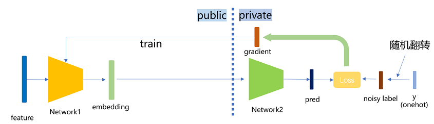

# 纵向联邦-基于差分隐私的标签保护

<a href="https://gitee.com/mindspore/docs/blob/master/docs/federated/docs/source_zh_cn/secure_vertical_federated_learning_with_DP.md" target="_blank"></a>

## 背景

纵向联邦学习（vFL）是联邦学习（FL）的一大重要分支。当几个参与方拥有同一批用户不同属性的数据时，他们便可使用 vFL 进行协同训练。在 vFL 中，拥有用户特征的参与方（简称follower 方，如下图参与方 A）会持有一个下层网络（Bottom Model），他们将特征输入下层网络，计算得到中间结果（embedding），发送给拥有标签的参与方（简称 leader 方，如下图参与方 B），leader 方使用这些embedding 和自己持有的标签来训练上层网络（上层网络），再将算得的梯度回传给各个参与方来训练下层网络。由此可见，vFL 不需要任何参与方上传自己的原始数据即可协同训练模型。


vFL框架避免了原始数据的直接上传，因此在一定程度上保护了隐私安全，然而一个半诚实或者恶意的follower方有可能从leader方回传的梯度反推出leader方的标签信息，造成隐私安全隐患。考虑到在大量vFL场景中，标签是最有价值并且最需要保护的信息，在这样的背景下，我们需要对vFL训练提供更强的隐私保证来避免隐私信息的泄露。

差分隐私（Differential Privacy，DP）是一种严格基于统计学/信息论的隐私定义，是目前数据分析领域对于隐私保护的黄金标准。DP核心思想是通过在计算过程中引入随机性，来淹没个体数据对最终计算结果的影响，从而保证计算结果难以反推出个体信息。DP保护能够在极强的威胁模型下保持成立，即使在以下条件下都无法被攻破：

- 攻击者知道算法的所有细节
- 攻击者有无限的算力
- 攻击者关于原始数据有任意多的背景知识

关于DP的背景、理论和具体实现，可以参见[1]获取更细致的介绍。

本设计方案基于标签差分隐私（label differential privacy，label dp）[2]，在纵向联邦学习训练时为 leader 参与方的标签提供差分隐私保证，使攻击者难以从回传的梯度反推出数据的标签信息。在本方案的保护下，即使follower方是半诚实或者恶意的，都能确保在训练过程中leader方的标签信息不会被泄露，缓解参与方对于数据隐私安全的担忧。

## 算法实现

MindSpore Federated采用了一种轻量级的label dp实现方式：训练时，leader参与方在使用标签数据训练之前，对一定比例的标签进行随机翻转操作。由于随机性的引入，攻击者若想反推标签，最多只能反推出随机翻转/扰动之后的标签，增加了反推出原始标签的难度，满足差分隐私保证。在实际应用时，我们可以调整隐私参数`eps`（可以理解为随机翻转标签的比例）来满足不同的场景需求：

- 较小`eps`（<1.0）对应高隐私，低精度
- 较大`eps`（>5.0）对应高精度，低隐私



本方案具体实际实现时，分为binary标签和onehot标签两种情况，函数中会自动判断输入的是binary还是onehot标签，输出的也是同类的标签。具体算法如下：

### binary标签保护

1. 根据预设的隐私参数eps，计算翻转概率$p = \frac{1}{1 + e^{eps}}$。
2. 以概率$p$翻转每个标签。

### one-hot标签保护

1. 对于n个类的标签，计算$p_1 = \frac{e^{eps}}{n - 1 + e^{eps}}$，$p_2 = \frac{1}{n - 1 + e^{eps}}$。
2. 根据以下概率随机扰乱标签：维持当前标签不变的概率为$p_1$；改成其他n - 1个类里的任意一个的概率都为$p_2$。

## 快速体验

我们以[Wide&Deep纵向联邦学习案例](https://gitee.com/mindspore/federated/tree/master/example/splitnn_criteo)中的单进程案例为例，介绍如何在一个纵向联邦模型中加入label dp保护。

### 前置需要

1. 安装MindSpore1.8.1或其更高版本，请参考[MindSpore官网安装指引](https://www.mindspore.cn/install)。
2. 安装MindSpore Federated及所依赖Python库

   ```shell
   cd federated
   python -m pip install -r requirements_test.txt
   ```

3. 准备criteo数据集，请参考[Wide&Deep纵向联邦学习案例](https://gitee.com/mindspore/federated/tree/master/example/splitnn_criteo)。

### 启动脚本

1. 下载federated仓

   ```bash
   git clone https://gitee.com/mindspore/federated.git
   ```

2. 进入脚本所在文件夹

   ```bash
   cd federated/example/splitnn_criteo
   ```

3. 运行脚本

   ```bash
   sh run_vfl_train_local_label_dp.sh
   ```

### 查看结果

在训练日志`log_local_gpu.txt`查看模型训练的loss变化：

```sh
INFO:root:epoch 0 step 100/2582 loss: 0.588637
INFO:root:epoch 0 step 200/2582 loss: 0.561055
INFO:root:epoch 0 step 300/2582 loss: 0.556246
INFO:root:epoch 0 step 400/2582 loss: 0.557931
INFO:root:epoch 0 step 500/2582 loss: 0.553283
INFO:root:epoch 0 step 600/2582 loss: 0.549618
INFO:root:epoch 0 step 700/2582 loss: 0.550243
INFO:root:epoch 0 step 800/2582 loss: 0.549496
INFO:root:epoch 0 step 900/2582 loss: 0.549224
INFO:root:epoch 0 step 1000/2582 loss: 0.547547
INFO:root:epoch 0 step 1100/2582 loss: 0.546989
INFO:root:epoch 0 step 1200/2582 loss: 0.552165
INFO:root:epoch 0 step 1300/2582 loss: 0.546926
INFO:root:epoch 0 step 1400/2582 loss: 0.558071
INFO:root:epoch 0 step 1500/2582 loss: 0.548258
INFO:root:epoch 0 step 1600/2582 loss: 0.546442
INFO:root:epoch 0 step 1700/2582 loss: 0.549062
INFO:root:epoch 0 step 1800/2582 loss: 0.546558
INFO:root:epoch 0 step 1900/2582 loss: 0.542755
INFO:root:epoch 0 step 2000/2582 loss: 0.543118
INFO:root:epoch 0 step 2100/2582 loss: 0.542587
INFO:root:epoch 0 step 2200/2582 loss: 0.545770
INFO:root:epoch 0 step 2300/2582 loss: 0.554520
INFO:root:epoch 0 step 2400/2582 loss: 0.551129
INFO:root:epoch 0 step 2500/2582 loss: 0.545622
...
```

## 深度体验

我们以[Wide&Deep纵向联邦学习案例](https://gitee.com/mindspore/federated/tree/master/example/splitnn_criteo)中的单进程案例为例，介绍在纵向联邦模型中加入label dp保护的具体操作方法。

### 前置需要

和[快速体验](#快速体验)相同：安装MindSpore、安装MindSpore Federated、准备数据集。

### 方案一：调用FLModel类中集成的label dp功能

MindSpore Federated采用`FLModel`（参见[纵向联邦学习模型训练接口](https://www.mindspore.cn/federated/docs/zh-CN/master/vertical/vertical_federated_FLModel.html)）和yaml文件（参见[纵向联邦学习yaml详细配置项](https://www.mindspore.cn/federated/docs/zh-CN/master/vertical/vertical_federated_yaml.html)），建模纵向联邦学习的训练过程。

我们在`FLModel`类中集成了label dp功能。使用者在正常完成整个纵向联邦学习的训练过程建模后（关于vFL训练的详细介绍可以参见[纵向联邦学习模型训练 - 盘古α大模型跨域训练](https://www.mindspore.cn/federated/docs/zh-CN/master/split_pangu_alpha_application.html)），只需在标签方的yaml文件中，在`privacy`模块下加入`label_dp`子模块（若没有`privacy`模块则需使用者输入添加），并在`label_dp`模块内设定`eps`参数（差分隐私参数$\epsilon$，使用者可以根据实际需求设置此参数的值），即可让模型享受label dp保护：

```yaml
privacy:
  label_dp:
    eps: 1.0
```

### 方案二：直接调用LabelDP类

使用者也可以直接调用`LabelDP`类，更加灵活地使用label dp功能。`LabelDP`类集成在`mindspore_federated.privacy`模块中，使用者可以先指定`eps`的值定义一个`LabelDP`对象，然后将标签组作为参数传入这个对象，对象的`__call__`函数中会自动识别当前传入的是one-hot还是binary标签，输出一个经过label dp处理后的标签组。可参见以下范例：

```python
# make private a batch of binary labels
import numpy as np
import mindspore
from mindspore import Tensor
from mindspore_federated.privacy import LabelDP
label_dp = LabelDP(eps=0.0)
label = Tensor(np.zero(5, 1), dtype=mindspore.float32)
dp_label = label_dp(label)

# make private a batch of one-hot labels
label = Tensor(np.hstack((np.ones((5, 1)), np.zeros((5, 2)))), dtype=mindspore.float32)
dp_label = label_dp(label)
print(dp_label)
```

## 参考文献

[1] Dwork C, Roth A. The algorithmic foundations of differential privacy[J]. Foundations and Trends® in Theoretical Computer Science, 2014, 9(3–4): 211-407.

[2] Ghazi B, Golowich N, Kumar R, et al. Deep learning with label differential privacy[J]. Advances in Neural Information Processing Systems, 2021, 34: 27131-27145.
