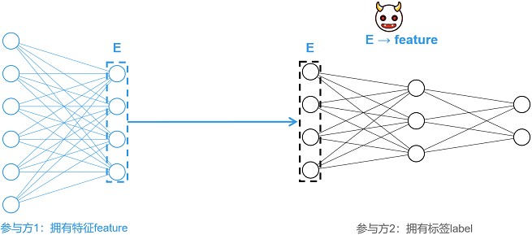
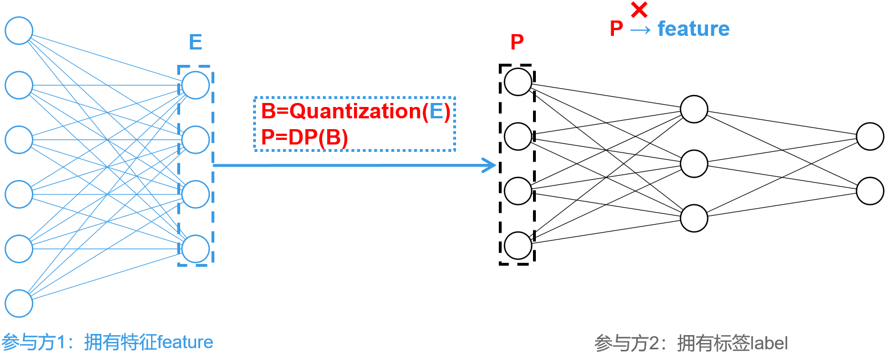
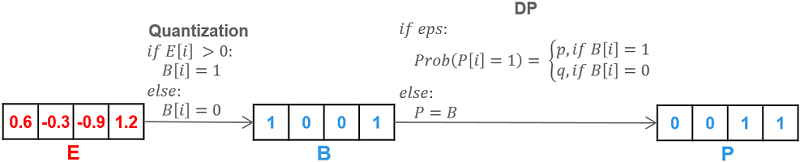

# 纵向联邦-基于信息混淆的特征保护

<a href="https://gitee.com/mindspore/docs/blob/master/docs/federated/docs/source_zh_cn/secure_vertical_federated_learning_with_EmbeddingDP.md" target="_blank"></a>

## 背景介绍

纵向联邦学习（vertical Federated Learning, vFL）是一种主流且重要的联合学习范式。在vFL中，n(n≥2)个参与方拥有大量相同用户，但用户特征重叠较小。MindSpore Federated采用拆分学习（Split Learning, SL）技术实现vFL。以下图所示两方拆分学习为例，各参与方并不直接分享原始数据，而是分享经过本地模型提取的中间特征进行训练与推理，满足了原始数据不出本地的隐私要求。

然而，有研究表明[1]，攻击者（例如参与方2）可以通过中间特征（E）还原出对应的原始数据（feature），造成隐私泄露。针对此类特征重构攻击，本教程提供一种基于信息混淆的轻量级特征保护方案[2]。



## 方案详述

保护方案名为EmbeddingDP，总体如下图所示。对生成的中间特征E，依次施加量化（Quantization）和差分隐私（Differential Privacy, DP）等混淆操作，生成P，并将P作为中间特征发送至参与方2。混淆操作大大降低了中间特征与原始输入之间的相关性，加大了攻击难度。



目前，本教程支持单比特量化和基于随机响应的差分隐私保护，方案细节如下图所示。

1. **单比特量化（Quantization）**：对于输入向量E，单比特量化会将其中大于0的数置为1，小于等于0的数置为0，生成二值向量B。

2. **基于随机响应的差分隐私（DP）**：差分隐私需要配置关键参数`eps`。若未配置`eps`，则不进行差分隐私，直接将二值向量B作为待传的中间特征；若正确配置`eps`（即`eps`为非负实数），`eps`越大，混淆的概率越低，对数据影响越小，同时，隐私保护力度相对较弱。对二值向量B中的任一维度i，若B[i]=1，则以概率p保持数值不变；若B[i]=0，则以概率q翻转B[i]，即令B[i]=1。其中，概率p和q依据如下公式计算。其中，e表示自然底数。

$$p = \frac{e^{(eps / 2)}}{e^{(eps / 2)} + 1},\quad q = \frac{1}{e^{(eps / 2)} + 1}$$



## 特性体验

本特性可对一维或二维的张量数组进行处理。一维数组仅可由数字0和1组成，二维数组需由独热编码格式的一维向量组成。在[安装MindSpore与Federated](https://mindspore.cn/federated/docs/zh-CN/master/federated_install.html#%E8%8E%B7%E5%8F%96mindspore-federated)后，可应用本特性处理符合要求的张量数组，示例程序如下所示：

```python
import mindspore as ms
from mindspore import Tensor
from mindspore.common.initializer import Normal
from mindspore_federated.privacy import EmbeddingDP

ori_tensor = Tensor(shape=(2,3), dtype=ms.float32, init=Normal())
print(ori_tensor)
dp_tensor = EmbeddingDP(eps=1)(ori_tensor)
print(dp_tensor)
```

## 应用案例

### 保护盘古α大模型跨域训练

#### 准备环节

下载federated代码仓，并依据教程[纵向联邦学习模型训练 - 盘古α大模型跨域训练](https://mindspore.cn/federated/docs/zh-CN/master/split_pangu_alpha_application.html#%E5%87%86%E5%A4%87%E7%8E%AF%E8%8A%82)，配置运行环境与实验数据集，而后可根据需要运行单进程或多进程示例程序。

```bash
git clone https://gitee.com/mindspore/federated.git
```

#### 单进程样例

1. 进入样例所在目录，并执行[运行单进程样例](https://mindspore.cn/federated/docs/zh-CN/master/split_pangu_alpha_application.html#%E8%BF%90%E8%A1%8C%E5%8D%95%E8%BF%9B%E7%A8%8B%E6%A0%B7%E4%BE%8B)中第2至4步：

    ```bash
    cd federated/example/splitnn_pangu_alpha
    ```

2. 启动配置了EmbeddingDP的训练脚本：

    ```bash
    sh run_pangu_train_local_embedding_dp.sh
    ```

3. 查看训练日志`splitnn_pangu_local.txt`中的训练loss：

    ```text
    2023-02-07 01:34:00 INFO: The embedding is protected by EmbeddingDP with eps 5.000000.
    2023-02-07 01:35:40 INFO: epoch 0 step 10/43391 loss: 10.653997
    2023-02-07 01:36:25 INFO: epoch 0 step 20/43391 loss: 10.570406
    2023-02-07 01:37:11 INFO: epoch 0 step 30/43391 loss: 10.470503
    2023-02-07 01:37:58 INFO: epoch 0 step 40/43391 loss: 10.242296
    2023-02-07 01:38:45 INFO: epoch 0 step 50/43391 loss: 9.970814
    2023-02-07 01:39:31 INFO: epoch 0 step 60/43391 loss: 9.735226
    2023-02-07 01:40:16 INFO: epoch 0 step 70/43391 loss: 9.594692
    2023-02-07 01:41:01 INFO: epoch 0 step 80/43391 loss: 9.340107
    2023-02-07 01:41:47 INFO: epoch 0 step 90/43391 loss: 9.356388
    2023-02-07 01:42:34 INFO: epoch 0 step 100/43391 loss: 8.797981
    ...
    ```

#### 多进程样例

1. 进入样例所在目录，安装依赖包，并配置数据集：

    ```bash
    cd federated/example/splitnn_pangu_alpha
    python -m pip install -r requirements.txt
    cp -r {dataset_dir}/wiki ./
    ```

2. 在服务器1启动配置了EmbeddingDP的训练脚本：

    ```bash
    sh run_pangu_train_leader_embedding_dp.sh {ip1:port1} {ip2:port2} ./wiki/train ./wiki/train
    ```

    `ip1`和`port1`表示参与本地服务器（服务器1）的IP地址和端口号，`ip2`和`port2`表示对端服务器（服务器2）的IP地址和端口号，`./wiki/train`是训练数据集文件路径，`./wiki/test`是评估数据集文件路径。

3. 在服务器2启动另一参与方的训练脚本：

    ```bash
    sh run_pangu_train_follower.sh {ip2:port2} {ip1:port1}
    ```

4. 查看训练日志`leader_process.log`中的训练loss：

    ```text
    2023-02-07 01:39:15 INFO: config is:
    2023-02-07 01:39:15 INFO: Namespace(ckpt_name_prefix='pangu', ...)
    2023-02-07 01:39:21 INFO: The embedding is protected by EmbeddingDP with eps 5.000000.
    2023-02-07 01:41:05 INFO: epoch 0 step 10/43391 loss: 10.669225
    2023-02-07 01:41:38 INFO: epoch 0 step 20/43391 loss: 10.571924
    2023-02-07 01:42:11 INFO: epoch 0 step 30/43391 loss: 10.440327
    2023-02-07 01:42:44 INFO: epoch 0 step 40/43391 loss: 10.253876
    2023-02-07 01:43:16 INFO: epoch 0 step 50/43391 loss: 9.958257
    2023-02-07 01:43:49 INFO: epoch 0 step 60/43391 loss: 9.704673
    2023-02-07 01:44:21 INFO: epoch 0 step 70/43391 loss: 9.543740
    2023-02-07 01:44:54 INFO: epoch 0 step 80/43391 loss: 9.376131
    2023-02-07 01:45:26 INFO: epoch 0 step 90/43391 loss: 9.376905
    2023-02-07 01:45:58 INFO: epoch 0 step 100/43391 loss: 8.766671
    ...
    ```

## 参考文献

[1] Erdogan, Ege, Alptekin Kupcu, and A. Ercument Cicek. "Unsplit: Data-oblivious model inversion, model stealing, and label inference attacks against split learning." arXiv preprint arXiv:2108.09033 (2021).

[2] Anonymous Author(s). "MistNet: Towards Private Neural Network Training with Local Differential Privacy". (https://github.com/TL-System/plato/blob/2e5290c1f3acf4f604dad223b62e801bbefea211/docs/papers/MistNet.pdf)
