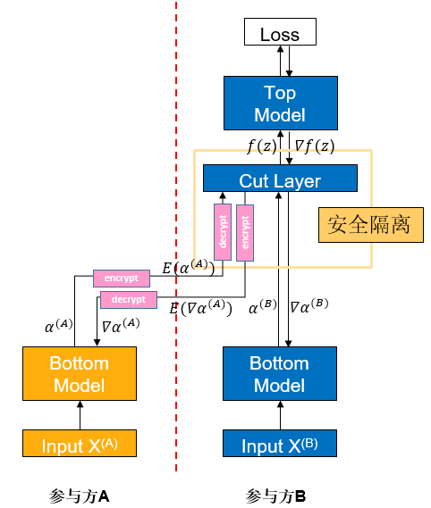

# 纵向联邦-基于可信执行环境的特征保护

<a href="https://gitee.com/mindspore/docs/blob/r2.0.0-alpha/docs/federated/docs/source_zh_cn/secure_vertical_federated_learning_with_TEE.md" target="_blank"></a>

注：这是一个实验特性，未来有可能被修改或删除。

## 背景

纵向联邦学习（vFL）是联邦学习（FL）的一大重要分支。当不同的参与方拥有来自相同一批用户但属性不同的数据时，他们便可使用vFL进行协同训练。在vFL中，拥有属性的参与方都会持有一个下层网络（Bottom Model），他们分别将属性输入下层网络，得到中间结果（embedding），发送给拥有标签的参与方（简称leader方，如下图参与方B，而不拥有标签的被称作follower方，如下图参与方A），leader方使用embedding和标签来训练上层网络，再将算得的梯度回传给各个参与方用以训练下层网络。由此可见，vFL不需要任何参与方上传自己的原始数据即可协同训练模型。


由于避免了直接上传原始数据，vFL在一定程度上保护了隐私安全（这也是vFL的核心目标之一），然而攻击者还是有可能从上传的embedding反推出用户信息，造成隐私安全隐患。在这样的背景下，我们需要对vFL在训练时传输的embedding和梯度提供更强的隐私保证来规避隐私安全风险。

可信执行环境（Trusted Execution Environment，TEE）是一种基于硬件的可信计算方案，通过使硬件中的整个计算过程相对于外界黑盒化，来保证计算过程的数据安全。在vFL中，我们使用TEE将网络中的关键层屏蔽，可以使该层计算难以被反推，从而保证vFL训练和推理过程的数据安全。

## 算法介绍



如图，如果参与方A将中间结果$\alpha^{(A)}$直接发给参与方B，则参与方B很有可能用中间结果反推出参与方A的原始数据$X^{(A)}$。为了降低这样的风险，参与方A将Bottom Model计算得到的中间结果$\alpha^{(A)}$先进行加密得到$E(\alpha^{(A)})$，将$E(\alpha^{(A)})$传给参与方B，参与方B将$E(\alpha^{(A)})$输入到TEE中的Cut Layer层中，然后在TEE的内部解密出$\alpha^{(A)}$进行前向传播。上述的整个过程，对于B来说都是黑盒的。

反向传梯度时也类似，Cut Layer运算出梯度$\nabla\alpha^{(A)}$，加密成$E(\nabla\alpha^{(A)})$后再由参与方B传回给参与方A，然后参与方A解密成$\nabla\alpha^{(A)}$后继续做反向传播。

## 快速体验

我们以[Wide&Deep纵向联邦学习案例](https://gitee.com/mindspore/federated/tree/r2.0.0-alpha/example/splitnn_criteo)中的单进程案例为例，给出一个配置TEE保护的范例脚本。

### 前置需要&环境配置

1. 环境要求：

   - 处理器：需要支持Intel SGX（Intel Sofrware Guard Extensions）功能
   - 操作系统：openEuler 20.03、openEuler 21.03 LTS SP2或更高版本

2. 安装SGX和SecGear（可以参考[secGear官网](https://gitee.com/openeuler/secGear)）：

   ```sh
   sudo yum install -y cmake ocaml-dune linux-sgx-driver sgxsdk libsgx-launch libsgx-urts sgxssl
   git clone https://gitee.com/openeuler/secGear.git
   cd secGear
   source /opt/intel/sgxsdk/environment && source environment
   mkdir debug && cd debug && cmake .. && make && sudo make install
   ```

3. 安装MindSpore1.8.1或更高版本，请参考[MindSpore官网安装指引](https://www.mindspore.cn/install)。

4. 下载federated仓

   ```sh
   git clone https://gitee.com/mindspore/federated.git
   ```

5. 安装MindSpore Federated依赖Python库，请参考[Wide&Deep纵向联邦学习案例](https://gitee.com/mindspore/federated/tree/r2.0.0-alpha/example/splitnn_criteo)。

6. 为TEE编译安装MindSpore Federated（需要加入额外编译选项，表示是否使用SGX）：

   ```sh
   sh federated/build.sh -s on
   pip install federated/build/packages/mindspore_federated-XXXXX.whl
   ```

7. 准备criteo数据集，请参考[Wide&Deep纵向联邦学习案例](https://gitee.com/mindspore/federated/tree/r2.0.0-alpha/example/splitnn_criteo)。

### 启动脚本

1. 进入脚本所在文件夹

   ```sh
   cd federated/example/splitnn_criteo
   ```

2. 运行脚本

   ```sh
   sh run_vfl_train_local_tee.sh
   ```

### 查看结果

在训练日志`log_local_cpu_tee.txt`查看模型训练的loss变化：

```sh
INFO:root:epoch 0 step 100/41322 wide_loss: 0.661822 deep_loss: 0.662018
INFO:root:epoch 0 step 100/41322 wide_loss: 0.685003 deep_loss: 0.685198
INFO:root:epoch 0 step 200/41322 wide_loss: 0.649380 deep_loss: 0.649381
INFO:root:epoch 0 step 300/41322 wide_loss: 0.612189 deep_loss: 0.612189
INFO:root:epoch 0 step 400/41322 wide_loss: 0.630079 deep_loss: 0.630079
INFO:root:epoch 0 step 500/41322 wide_loss: 0.602897 deep_loss: 0.602897
INFO:root:epoch 0 step 600/41322 wide_loss: 0.621647 deep_loss: 0.621647
INFO:root:epoch 0 step 700/41322 wide_loss: 0.624762 deep_loss: 0.624762
INFO:root:epoch 0 step 800/41322 wide_loss: 0.622042 deep_loss: 0.622042
INFO:root:epoch 0 step 900/41322 wide_loss: 0.585274 deep_loss: 0.585274
INFO:root:epoch 0 step 1000/41322 wide_loss: 0.590947 deep_loss: 0.590947
INFO:root:epoch 0 step 1100/41322 wide_loss: 0.586775 deep_loss: 0.586775
INFO:root:epoch 0 step 1200/41322 wide_loss: 0.597362 deep_loss: 0.597362
INFO:root:epoch 0 step 1300/41322 wide_loss: 0.607390 deep_loss: 0.607390
INFO:root:epoch 0 step 1400/41322 wide_loss: 0.584204 deep_loss: 0.584204
INFO:root:epoch 0 step 1500/41322 wide_loss: 0.583618 deep_loss: 0.583618
INFO:root:epoch 0 step 1600/41322 wide_loss: 0.573294 deep_loss: 0.573294
INFO:root:epoch 0 step 1700/41322 wide_loss: 0.600686 deep_loss: 0.600686
INFO:root:epoch 0 step 1800/41322 wide_loss: 0.585533 deep_loss: 0.585533
INFO:root:epoch 0 step 1900/41322 wide_loss: 0.583466 deep_loss: 0.583466
INFO:root:epoch 0 step 2000/41322 wide_loss: 0.560188 deep_loss: 0.560188
INFO:root:epoch 0 step 2100/41322 wide_loss: 0.569232 deep_loss: 0.569232
INFO:root:epoch 0 step 2200/41322 wide_loss: 0.591643 deep_loss: 0.591643
INFO:root:epoch 0 step 2300/41322 wide_loss: 0.572473 deep_loss: 0.572473
INFO:root:epoch 0 step 2400/41322 wide_loss: 0.582825 deep_loss: 0.582825
INFO:root:epoch 0 step 2500/41322 wide_loss: 0.567196 deep_loss: 0.567196
INFO:root:epoch 0 step 2600/41322 wide_loss: 0.602022 deep_loss: 0.602022
```

## 深度体验

TEE层的正向传播、反向传播都需要调用它自己的函数而非通过MindSpore，因此在实现时和通常的vFL模型存在不同。

通常，vFL模型在训练的反向传播时，Top Model和Cut Layer是放在一起，由参与方B通过MindSpore一步求导、一步更新的；而含有TEE的网络在反向传播时，Top Model由参与方B基于MindSpore更新，而Cut Layer（TEE）是在接收到Top Model传回的梯度后，在它自己内部进行更新的，再将需要传回参与方A的梯度加密后传出给参与方B，整个过程都在TEE内部完成。

目前在MindSpore Federated中，上述功能是通过在`mindspore_federated.vfl_model.FLModel()`定义时传入`grad_network`来实现自定义的反向传播流程的。因此，要实现含有TEE的网络，用户可以在`grad_network`中定义好Top Model和Cut Layer的反向传播流程并传入`FLModel`即可，在反向传播时`FLModel`就会走用户自定义的训练流程。

我们以[Wide&Deep纵向联邦学习案例](https://gitee.com/mindspore/federated/tree/r2.0.0-alpha/example/splitnn_criteo)中的单进程案例为例，介绍在纵向联邦模型中配置TEE保护的具体操作方法。介绍的内容主要针对使用TEE时配置上和通常情况下的不同点，相同点则会略过（关于vFL训练的详细介绍可以参见[纵向联邦学习模型训练 - 盘古α大模型跨域训练](https://www.mindspore.cn/federated/docs/zh-CN/r2.0.0-alpha/split_pangu_alpha_application.html)）。

### 前置需要&环境配置

参照[快速体验](#快速体验)。

### 定义网络模型

#### 正向传播

和通常的vFL训练相同，使用者需要基于MindSpore提供的`nn.Cell`（参见[mindspore.nn.Cell](https://mindspore.cn/docs/zh-CN/r2.0.0-alpha/api_python/nn/mindspore.nn.Cell.html#mindspore-nn-cell)）来开发训练网络。不同点则在于，在TEE所在的这一层，使用者需要在该类的`construct`函数中调用TEE前向传播的函数：

```python
from mindspore_federated._mindspore_federated import init_tee_cut_layer, backward_tee_cut_layer, \
    encrypt_client_data, secure_forward_tee_cut_layer

class TeeLayer(nn.Cell):
    """
    TEE layer of the leader net.
    Args:
        config (class): default config info.
    """
    def __init__(self, config):
        super(TeeLayer, self).__init__()
        init_tee_cut_layer(config.batch_size, 2, 2, 1, 3.5e-4, 1024.0)
        self.concat = ops.Concat(axis=1)
        self.reshape = ops.Reshape()

    def construct(self, wide_out0, deep_out0, wide_embedding, deep_embedding):
        """Convert and encrypt the intermediate data"""
        local_emb = self.concat((wide_out0, deep_out0))
        remote_emb = self.concat((wide_embedding, deep_embedding))
        aa = remote_emb.flatten().asnumpy().tolist()
        bb = local_emb.flatten().asnumpy().tolist()
        enc_aa, enc_aa_len = encrypt_client_data(aa, len(aa))
        enc_bb, enc_bb_len = encrypt_client_data(bb, len(bb))
        tee_output = secure_forward_tee_cut_layer(remote_emb.shape[0], remote_emb.shape[1],
                                                  local_emb.shape[1], enc_aa, enc_aa_len, enc_bb, enc_bb_len, 2)
        tee_output = self.reshape(Tensor(tee_output), (remote_emb.shape[0], 2))
        return tee_output
```

#### 反向传播

在通常的vfl模型中，反向传播是由`FLModel`类自动配置实现的，但在含有TEE的模型中，使用者需开发一个`grad_network`来定义反向传播流程。`grad_network`也基于`nn.Cell`，包括一个`__init__`函数和一个`construct`函数，初始化时，需要传入训练使用的网络，并且在`__init__`函数中定义：求导算子、Cut Layer之外网络的参数、loss函数、Cut Layer之外网络的优化器，示例如下：

```python
class LeaderGradNet(nn.Cell):
    """
    grad_network of the leader party.
    Args:
        net (class): LeaderNet, which is the net of leader party.
        config (class): default config info.
    """

    def __init__(self, net: LeaderNet):
        super().__init__()
        self.net = net
        self.sens = 1024.0

        self.grad_op_param_sens = ops.GradOperation(get_by_list=True, sens_param=True)
        self.grad_op_input_sens = ops.GradOperation(get_all=True, sens_param=True)

        self.params_head = ParameterTuple(net.head_layer.trainable_params())
        self.params_bottom_deep = vfl_utils.get_params_by_name(self.net.bottom_net, ['deep', 'dense'])
        self.params_bottom_wide = vfl_utils.get_params_by_name(self.net.bottom_net, ['wide'])

        self.loss_net = HeadLossNet(net.head_layer)
        self.loss_net_l2 = L2LossNet(net.bottom_net, config)

        self.optimizer_head = Adam(self.params_head, learning_rate=3.5e-4, eps=1e-8, loss_scale=self.sens)
        self.optimizer_bottom_deep = Adam(self.params_bottom_deep, learning_rate=3.5e-4, eps=1e-8, loss_scale=self.sens)
        self.optimizer_bottom_wide = FTRL(self.params_bottom_wide, learning_rate=5e-2, l1=1e-8, l2=1e-8,
                                          initial_accum=1.0, loss_scale=self.sens)
```

`grad_network`的`construct`函数的输入是`local_data_batch`和`remote_data_batch`两个字典，在`construct`函数中首先需要从字典中提取相应的数据。接下来，除TEE外的其他层，需要分别调用MindSpore关于参数和关于输入的求导算子进行求导操作，并用优化器进行更新；TEE层则需要调用TEE的内置函数进行求导和更新，示例如下：

```python
def construct(self, local_data_batch, remote_data_batch):
    """
    The back propagation of the leader net.
    """
    # data processing
    id_hldr = local_data_batch['id_hldr']
    wt_hldr = local_data_batch['wt_hldr']
    label = local_data_batch['label']
    wide_embedding = remote_data_batch['wide_embedding']
    deep_embedding = remote_data_batch['deep_embedding']

    # forward
    wide_out0, deep_out0 = self.net.bottom_net(id_hldr, wt_hldr)
    local_emb = self.concat((wide_out0, deep_out0))
    remote_emb = self.concat((wide_embedding, deep_embedding))
    head_input = self.net.cut_layer(wide_out0, deep_out0, wide_embedding, deep_embedding)
    loss = self.loss_net(head_input, label)

    # update of head net
    sens = ops.Fill()(ops.DType()(loss), ops.Shape()(loss), 1024.0)
    grad_head_input, _ = self.grad_op_input_sens(self.loss_net)(head_input, label, sens)
    grad_head_param = self.grad_op_param_sens(self.loss_net, self.params_head)(head_input, label, sens)
    self.optimizer_head(grad_head_param)

    # update of cut layer

    tmp = grad_head_input.flatten().asnumpy().tolist()
    grad_input = backward_tee_cut_layer(remote_emb.shape[0], remote_emb.shape[1], local_emb.shape[1], 1, tmp)
    grad_inputa = self.reshape(Tensor(grad_input[0]), remote_emb.shape)
    grad_inputb = self.reshape(Tensor(grad_input[1]), local_emb.shape)
    grad_cutlayer_input = (grad_inputb[:, :1], grad_inputb[:, 1:2], grad_inputa[:, :1], grad_inputa[:, 1:2])

    # update of bottom net
    grad_bottom_wide = self.grad_op_param_sens(self.net.bottom_net,
                                               self.params_bottom_wide)(id_hldr, wt_hldr,
                                                                        grad_cutlayer_input[0:2])
    self.optimizer_bottom_wide(grad_bottom_wide)
    grad_bottom_deep = self.grad_op_param_sens(self.net.bottom_net,
                                               self.params_bottom_deep)(id_hldr, wt_hldr,
                                                                        grad_cutlayer_input[0:2])
    grad_bottom_l2 = self.grad_op_param_sens(self.loss_net_l2, self.params_bottom_deep)(sens)
    zipped = zip(grad_bottom_deep, grad_bottom_l2)
    grad_bottom_deep = tuple(map(sum, zipped))
    self.optimizer_bottom_deep(grad_bottom_deep)

    # output the gradients for follower party
    scales = {}
    scales['wide_loss'] = OrderedDict(zip(['wide_embedding', 'deep_embedding'], grad_cutlayer_input[2:4]))
    scales['deep_loss'] = scales['wide_loss']
    return scales
```

#### 定义优化器

定义优化器时，在yaml文件中就不需定义`grad_network`已涉及到的反向传播部分了，除此之外和通常的vfl模型定义优化器就没有区别了。

### 构建训练脚本

#### 构建网络

与通常的vFL训练相同，用户需要使用MindSpore Federated提供的类，将自己构造好的网络封装成纵向联邦网络。详细的API文档可以参考[纵向联邦训练接口](https://gitee.com/mindspore/federated/blob/r2.0.0-alpha/docs/api/api_python/vertical/vertical_federated_FLModel.rst)。不同点则在于：构建leader方网络时，需要加上`grad_network`：

```python
from mindspore_federated import FLModel, FLYamlData
from network_config import config
from wide_and_deep import LeaderNet, LeaderLossNet, LeaderGradNet


leader_base_net = LeaderNet(config)
leader_train_net = LeaderLossNet(leader_base_net, config)
leader_grad_net = LeaderGradNet(leader_base_net, config)

leader_yaml_data = FLYamlData(config.leader_yaml_path)
leader_fl_model = FLModel(yaml_data=leader_yaml_data,
                          network=leader_base_net,
                          grad_network=Leader_grad_net,
                          train_network=leader_train_net)
```

除了上述提到的内容之外，TEE训练的其他的部分都和通常的vFL训练完全一致，使用者在配置完成后便可让模型享受TEE的安全保证。
