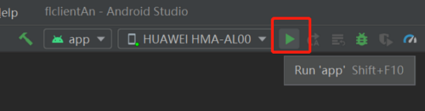

# 实现一个情感分类应用(Android)

<a href="https://gitee.com/mindspore/docs/blob/master/docs/federated/docs/source_zh_cn/sentiment_classification_application.md" target="_blank"></a>

通过端云协同的联邦学习建模方式，可以充分发挥端侧数据的优势，避免用户敏感数据直接上报云侧。由于用户在使用输入法时对自己的文字隐私十分看重，并且输入法上的智慧功能也是用户非常需要的。因此，联邦学习天然适用在输入法场景中。

MindSpore Federated将联邦语言模型应用到了输入法的表情图片预测功能中。联邦语言模型会根据聊天文本数据推荐出适合当前语境的表情图片。在使用联邦学习建模时，每一张表情图片会被定义为一个情感标签类别，而每个聊天短语会对应一个表情图片。MindSpore Federated将表情图片预测任务定义为联邦情感分类任务。

## 准备环节

### 环境

参考[服务端环境配置](https://www.mindspore.cn/federated/docs/zh-CN/master/deploy_federated_server.html)和[客户端环境配置](https://www.mindspore.cn/federated/docs/zh-CN/master/deploy_federated_client.html)。

### 数据

[用于训练的数据](https://mindspore-website.obs.cn-north-4.myhuaweicloud.com/notebook/datasets/supervise/client.tar.gz)包含20个用户聊天文件，其目录结构如下：

```text
datasets/supervise/client/
    ├── 0.txt  # 用户0的训练数据
    ├── 1.txt  # 用户1的训练数据
    │
    │          ......
    │
    └── 19.txt  # 用户19的训练数据
```

[用于验证的数据](https://mindspore-website.obs.cn-north-4.myhuaweicloud.com/notebook/datasets/supervise/eval.tar.gz)包含1个聊天文件，其目录结构如下：

```text
datasets/supervise/eval/
    ├── eval.txt  # 验证数据
```

[标签对应的表情图片数据](https://mindspore-website.obs.cn-north-4.myhuaweicloud.com/notebook/datasets/memo.tar.gz)包含4类表情，每类表情包括若干张图片，其目录结构如下：

```text
datasets/memo/
    ├── good  # good类表情
    │   ├── 2018new_geili_org.png
    │   ├── 2018new_good_org.png
    │   ├── 2018new_xianhua_org.png
    │   ├── 2018new_zan_org.png
    │   └── 2018new_zhongguozan_org.png
    ├── leimu  # leimu类表情
    │   ├── 2018new_beishang_org.png
    │   ├── 2018new_kelian_org.png
    │   ├── 2018new_leimu_org.png
    │   ├── 2018new_weiqu_org.png
    │   ├── 2021_alongdog_org.png
    │   ├── 2021_LZcry_org.png
    │   └── 2021_LZpoor_org.png
    ├── xiaoku  # xiaoku类表情
    │   ├── 2018new_doge02_org.png
    │   ├── 2018new_guzhang_org.png
    │   ├── 2018new_huaixiao_org.png
    │   ├── 2018new_xiaoerbuyu_org.png
    │   ├── 2018new_xiaoku_thumb.png
    │   └── 2018new_yinxian_org.png
    └── xin  # xin类表情
        ├── 2018new_aini_org.png
        ├── 2018new_huaxin_org.png
        ├── 2018new_tianping_org.png
        ├── 2018new_xin_org.png
        └── qixi2018_xiaoxinxin_org.png
```

### 模型相关文件

生成模型需要的起始[CheckPoint文件](https://mindspore-website.obs.cn-north-4.myhuaweicloud.com/notebook/models/albert_init.ckpt)、[词典](https://mindspore-website.obs.cn-north-4.myhuaweicloud.com/notebook/datasets/vocab.txt)和[词典ID映射文件](https://mindspore-website.obs.cn-north-4.myhuaweicloud.com/notebook/datasets/vocab_map_ids.txt)的目录结构如下：

```text
models/
    ├── albert_init.ckpt  # 起始的checkpoint
    ├── vocab.txt  # 词典
    └── vocab_map_ids.txt  # 词典ID映射文件
```

## 定义网络

联邦学习中的语言模型使用ALBERT模型[1]。客户端上的ALBERT模型包括：embedding层、encoder层和classifier层。

具体网络定义请参考[源码](https://gitee.com/mindspore/mindspore/tree/master/tests/st/fl/albert/src/model.py)。

### 生成端侧模型文件

#### 将模型导出为MindIR格式文件

示例代码如下：

```python
import argparse
import os
import random
from time import time
import numpy as np
from mindspore import context, set_seed, load_checkpoint, Tensor, export
from mindspore.nn import AdamWeightDecay
from src.config import train_cfg, client_net_cfg
from src.utils import restore_params
from src.model import AlbertModelCLS
from src.cell_wrapper import NetworkWithCLSLoss, NetworkTrainCell


def parse_args():
    """
    parse args
    """
    parser = argparse.ArgumentParser(description='export task')
    parser.add_argument('--device_target', type=str, default='GPU', choices=['Ascend', 'GPU'])
    parser.add_argument('--device_id', type=str, default='0')
    parser.add_argument('--init_model_path', type=str, default='none')
    parser.add_argument('--output_dir', type=str, default='./models/mindir/')
    parser.add_argument('--seed', type=int, default=0)
    return parser.parse_args()


def supervise_export(args_opt):
    set_seed(args_opt.seed), random.seed(args_opt.seed)
    start = time()
    # 参数配置
    os.environ['CUDA_VISIBLE_DEVICES'] = args_opt.device_id
    init_model_path = args_opt.init_model_path
    output_dir = args_opt.output_dir
    if not os.path.exists(output_dir):
        os.makedirs(output_dir)
    print('Parameters setting is done! Time cost: {}'.format(time() - start))
    start = time()

    # MindSpore配置
    context.set_context(mode=context.GRAPH_MODE, device_target=args_opt.device_target)
    print('Context setting is done! Time cost: {}'.format(time() - start))
    start = time()

    # 建立模型
    albert_model_cls = AlbertModelCLS(client_net_cfg)
    network_with_cls_loss = NetworkWithCLSLoss(albert_model_cls)
    network_with_cls_loss.set_train(True)
    print('Model construction is done! Time cost: {}'.format(time() - start))
    start = time()

    # 建立优化器
    client_params = [_ for _ in network_with_cls_loss.trainable_params()]
    client_decay_params = list(
        filter(train_cfg.optimizer_cfg.AdamWeightDecay.decay_filter, client_params)
    )
    client_other_params = list(
        filter(lambda x: not train_cfg.optimizer_cfg.AdamWeightDecay.decay_filter(x), client_params)
    )
    client_group_params = [
        {'params': client_decay_params, 'weight_decay': train_cfg.optimizer_cfg.AdamWeightDecay.weight_decay},
        {'params': client_other_params, 'weight_decay': 0.0},
        {'order_params': client_params}
    ]
    client_optimizer = AdamWeightDecay(client_group_params,
                                       learning_rate=train_cfg.client_cfg.learning_rate,
                                       eps=train_cfg.optimizer_cfg.AdamWeightDecay.eps)
    client_network_train_cell = NetworkTrainCell(network_with_cls_loss, optimizer=client_optimizer)
    print('Optimizer construction is done! Time cost: {}'.format(time() - start))
    start = time()

    # 构造数据
    input_ids = Tensor(np.zeros((train_cfg.batch_size, client_net_cfg.seq_length), np.int32))
    attention_mask = Tensor(np.zeros((train_cfg.batch_size, client_net_cfg.seq_length), np.int32))
    token_type_ids = Tensor(np.zeros((train_cfg.batch_size, client_net_cfg.seq_length), np.int32))
    label_ids = Tensor(np.zeros((train_cfg.batch_size,), np.int32))
    print('Client data loading is done! Time cost: {}'.format(time() - start))
    start = time()

    # 读取checkpoint
    if init_model_path != 'none':
        init_param_dict = load_checkpoint(init_model_path)
        restore_params(client_network_train_cell, init_param_dict)
    print('Checkpoint loading is done! Time cost: {}'.format(time() - start))
    start = time()

    # 导出
    export(client_network_train_cell, input_ids, attention_mask, token_type_ids, label_ids,
           file_name=os.path.join(output_dir, 'albert_supervise'), file_format='MINDIR')
    print('Supervise model export process is done! Time cost: {}'.format(time() - start))


if __name__ == '__main__':
    total_time_start = time()
    args = parse_args()
    supervise_export(args)
    print('All is done! Time cost: {}'.format(time() - total_time_start))

```

#### 将MindIR文件转化为联邦学习端侧框架可用的ms文件

参考[图像分类应用](https://www.mindspore.cn/federated/docs/zh-CN/master/image_classification_application.html)中生成端侧模型文件部分。

## 启动联邦学习流程

首先在服务端启动脚本，参考[云端部署方式](https://www.mindspore.cn/federated/docs/zh-CN/master/deploy_federated_server.html)。

以ALBERT模型的训练与推理任务为基础，整体流程为：

1. Android新建工程；

2. 编译MindSpore Lite AAR包；

3. Android实例程序结构说明；

4. 编写代码；

5. Android工程配置依赖项；

6. Android构建与运行。

### Android新建工程

在Android Studio中新建项目工程，并安装相应的SDK（指定SDK版本后，由Android Studio自动安装）。


### 编译MindSpore Lite AAR包

1. 参考[端侧部署](https://www.mindspore.cn/federated/docs/zh-CN/master/deploy_federated_client.html)完成部署。

2. 获取生成的Android AAR包。

   ```text
   mindspore-lite-<version>.aar
   ```

3. 把AAR包放置安卓工程的app/libs/目录下。

### Android实例程序结构说明

```text
app
│   ├── libs # Android库项目的二进制归档文件
|   |   └── mindspore-lite-version.aar #  MindSpore Lite针对Android版本的归档文件
├── src/main
│   ├── assets # 资源目录
|   |   └── model # 模型目录
|   |       └── albert_supervise.mindir.ms # 存放的预训练模型文件
│   |       └── albert_inference.mindir.ms # 存放的推理模型文件
│   |   └── data # 数据目录
|   |       └── 0.txt # 模型数据文件
|   |       └── vocab.txt # 词典文件
|   |       └── vocab_map_ids.txt # 词典ID映射文件
|   |       └── eval.txt # 训练结果评估文件
|   |       └── eval_no_label.txt # 推理数据文件
│   |
│   ├── java # java层应用代码
│   │       └── ... 存放Android代码文件，相关目录可以自定义
│   │
│   ├── res # 存放Android相关的资源文件
│   └── AndroidManifest.xml # Android配置文件
│
│
├── build.gradle # Android工程构建配置文件
├── download.gradle # 工程依赖文件下载
└── ...
```

### 编写代码

1. AssetCopyer.java：该代码文件作用是把Android工程的app/src/main/assets目录下的资源文件存放到Android系统的磁盘中，以便在模型训练与推理时联邦学习框架的接口能够根据绝对路径读取到资源文件。

    ```java
    import android.content.Context;
    import java.io.File;
    import java.io.FileOutputStream;
    import java.io.InputStream;
    import java.util.logging.Logger;
    public class AssetCopyer {
        private static final Logger LOGGER = Logger.getLogger(AssetCopyer.class.toString());
        public static void copyAllAssets(Context context,String destination) {
            LOGGER.info("destination: " + destination);
            copyAssetsToDst(context,"",destination);
        }
        // copy assets目录下面的资源文件到Android系统的磁盘中，具体的路径可打印destination查看
        private static void copyAssetsToDst(Context context,String srcPath, String dstPath) {
            try {
                // 递归获取assets目录的所有的文件名
                String[] fileNames =context.getAssets().list(srcPath);
                if (fileNames.length > 0) {
                    // 构建目标file对象
                    File file = new File(dstPath);
                    //创建目标目录
                    file.mkdirs();
                    for (String fileName : fileNames) {
                        // copy文件到指定的磁盘
                        if(!srcPath.equals("")) {
                            copyAssetsToDst(context,srcPath + "/" + fileName,dstPath+"/"+fileName);
                        }else{
                            copyAssetsToDst(context, fileName,dstPath+"/"+fileName);
                        }
                    }
                } else {
                    // 构建源文件的输入流
                    InputStream is = context.getAssets().open(srcPath);
                    // 构建目标文件的输出流
                    FileOutputStream fos = new FileOutputStream(new File(dstPath));
                    // 定义1024大小的缓冲数组
                    byte[] buffer = new byte[1024];
                    int byteCount=0;
                    // 源文件写到目标文件
                    while((byteCount=is.read(buffer))!=-1) {
                        fos.write(buffer, 0, byteCount);
                    }
                    // 刷新输出流
                    fos.flush();
                    // 关闭输入流
                    is.close();
                    // 关闭输出流
                    fos.close();
                }
            } catch (Exception e) {
                e.printStackTrace();
            }
        }
    }
    ```

2. FlJob.java：该代码文件作用是定义训练与推理任务的内容，具体的联邦学习接口含义请参考[联邦学习接口介绍](https://www.mindspore.cn/federated/api/zh-CN/master/interface_description_federated_client.html)。

   ```java
   import android.annotation.SuppressLint;
   import android.os.Build;
   import androidx.annotation.RequiresApi;
   import com.mindspore.flAndroid.utils.AssetCopyer;
   import com.mindspore.flclient.FLParameter;
   import com.mindspore.flclient.SyncFLJob;
   import java.util.Arrays;
   import java.util.UUID;
   import java.util.logging.Logger;
   public class FlJob {
       private static final Logger LOGGER = Logger.getLogger(AssetCopyer.class.toString());
       private final String parentPath;
       public FlJob(String parentPath) {
           this.parentPath = parentPath;
       }
       // Android的联邦学习训练任务
       @SuppressLint("NewApi")
       @RequiresApi(api = Build.VERSION_CODES.M)
       public void syncJobTrain() {
           // 构造dataMap
           String trainTxtPath = "data/albert/supervise/client/1.txt";
           String evalTxtPath = "data/albert/supervise/eval/eval.txt";      // 非必须，getModel之后不进行验证可不设置
           String vocabFile = "data/albert/supervise/vocab.txt";                // 数据预处理的词典文件路径
           String idsFile = "data/albert/supervise/vocab_map_ids.txt"   // 词典的映射id文件路径
           Map<RunType, List<String>> dataMap = new HashMap<>();
           List<String> trainPath = new ArrayList<>();
           trainPath.add(trainTxtPath);
           trainPath.add(vocabFile);
           trainPath.add(idsFile);
           List<String> evalPath = new ArrayList<>();    // 非必须，getModel之后不进行验证可不设置
           evalPath.add(evalTxtPath);                  // 非必须，getModel之后不进行验证可不设置
           evalPath.add(vocabFile);                  // 非必须，getModel之后不进行验证可不设置
           evalPath.add(idsFile);                  // 非必须，getModel之后不进行验证可不设置
           dataMap.put(RunType.TRAINMODE, trainPath);
           dataMap.put(RunType.EVALMODE, evalPath);      // 非必须，getModel之后不进行验证可不设置

           String flName = "com.mindspore.flclient.demo.albert.AlbertClient";                             // AlBertClient.java 包路径
           String trainModelPath = "ms/albert/train/albert_ad_train.mindir0.ms";                      // 绝对路径
           String inferModelPath = "ms/albert/train/albert_ad_train.mindir0.ms";                      // 绝对路径, 和trainModelPath保持一致
           String sslProtocol = "TLSv1.2";
           String deployEnv = "android";

           // 端云通信url，请保证Android能够访问到server，否则会出现connection failed
           String domainName = "http://10.113.216.106:6668";
           boolean ifUseElb = true;
           int serverNum = 4;
           int threadNum = 4;
           BindMode cpuBindMode = BindMode.NOT_BINDING_CORE;
           int batchSize = 32;

           FLParameter flParameter = FLParameter.getInstance();
           flParameter.setFlName(flName);
           flParameter.setDataMap(dataMap);
           flParameter.setTrainModelPath(trainModelPath);
           flParameter.setInferModelPath(inferModelPath);
           flParameter.setSslProtocol(sslProtocol);
           flParameter.setDeployEnv(deployEnv);
           flParameter.setDomainName(domainName);
           flParameter.setUseElb(useElb);
           flParameter.setServerNum(serverNum);
           flParameter.setThreadNum(threadNum);
           flParameter.setCpuBindMode(BindMode.valueOf(cpuBindMode));

           // start FLJob
           SyncFLJob syncFLJob = new SyncFLJob();
           syncFLJob.flJobRun();
       }
       // Android的联邦学习推理任务
       public void syncJobPredict() {
           // 构造dataMap
           String inferTxtPath = "data/albert/supervise/eval/eval.txt";
           String vocabFile = "data/albert/supervise/vocab.txt";
           String idsFile = "data/albert/supervise/vocab_map_ids.txt"
           Map<RunType, List<String>> dataMap = new HashMap<>();
           List<String> inferPath = new ArrayList<>();
           inferPath.add(inferTxtPath);
           inferPath.add(vocabFile);
           inferPath.add(idsFile);
           dataMap.put(RunType.INFERMODE, inferPath);

           String flName = "com.mindspore.flclient.demo.albert.AlbertClient";                             // AlBertClient.java 包路径
           String inferModelPath = "ms/albert/train/albert_ad_train.mindir0.ms";                      // 绝对路径, 和trainModelPath保持一致;
           int threadNum = 4;
           BindMode cpuBindMode = BindMode.NOT_BINDING_CORE;
           int batchSize = 32;

           FLParameter flParameter = FLParameter.getInstance();
           flParameter.setFlName(flName);
           flParameter.setDataMap(dataMap);
           flParameter.setInferModelPath(inferModelPath);
           flParameter.setThreadNum(threadNum);
           flParameter.setCpuBindMode(BindMode.valueOf(cpuBindMode));
           flParameter.setBatchSize(batchSize);

           // inference
           SyncFLJob syncFLJob = new SyncFLJob();
           int[] labels = syncFLJob.modelInference();
           LOGGER.info("labels = " + Arrays.toString(labels));
       }
   }
   ```

   上面的eval_no_label.txt是指不存在标签的文件，每一行为一条语句，格式参考如下，用户可自由设置：

    ```text
    愿以吾辈之青春 护卫这盛世之中华🇨🇳
    girls help girls
    太美了，祝祖国繁荣昌盛！
    中国人民站起来了
    难道就我一个人觉得这个是plus版本？
    被安利到啦！明天起来就看！早点睡觉莲莲
    ```

3. MainActivity.java：该代码文件作用是启动联邦学习训练与推理任务。

    ```java
    import android.os.Build;
    import android.os.Bundle;
    import androidx.annotation.RequiresApi;
    import androidx.appcompat.app.AppCompatActivity;
    import com.mindspore.flAndroid.job.FlJob;
    import com.mindspore.flAndroid.utils.AssetCopyer;
    @RequiresApi(api = Build.VERSION_CODES.P)
    public class MainActivity extends AppCompatActivity {
        private String parentPath;
        @Override
        protected void onCreate(Bundle savedInstanceState) {
            super.onCreate(savedInstanceState);
            // 获取该应用程序在Android系统中的磁盘路径
            this.parentPath = this.getExternalFilesDir(null).getAbsolutePath();
            // copy assets目录下面的资源文件到Android系统的磁盘中
            AssetCopyer.copyAllAssets(this.getApplicationContext(), parentPath);
            // 新建一个线程，启动联邦学习训练与推理任务
            new Thread(() -> {
                FlJob flJob = new FlJob(parentPath);
                flJob.syncJobTrain();
                flJob.syncJobPredict();
            }).start();
        }
    }
    ```

### Android工程配置依赖项

1. AndroidManifest.xml

    ```xml
    <?xml version="1.0" encoding="utf-8"?>
    <manifest xmlns:android="http://schemas.android.com/apk/res/android"
        package="com.mindspore.flAndroid">
        <!--允许网络访问权限-->
        <uses-permission android:name="android.permission.INTERNET" />
        <application
            android:allowBackup="true"
            android:supportsRtl="true"
            android:usesCleartextTraffic="true"
            android:theme="@style/Theme.Flclient">
            <!--MainActivity的文件位置，根据自定义填写-->
            <activity android:name="com.mindspore.flAndroid.activity.MainActivity">
                <intent-filter>
                    <action android:name="android.intent.action.MAIN" />
                    <category android:name="android.intent.category.LAUNCHER" />
                </intent-filter>
            </activity>
        </application>
    </manifest>
    ```

2. app/build.gradle

    ```text
    plugins {
        id 'com.android.application'
    }
    android {
        // Android SDK的编译版本，建议大于27
        compileSdkVersion 30
        buildToolsVersion "30.0.3"
        defaultConfig {
            applicationId "com.mindspore.flAndroid"
            minSdkVersion 27
            targetSdkVersion 30
            versionCode 1
            versionName "1.0"
            multiDexEnabled true
            testInstrumentationRunner "androidx.test.runner.AndroidJUnitRunner"
            ndk {
                // 不同的手机型号，对应ndk不相同，本人使用的mate20手机是'armeabi-v7a'
                abiFilters 'armeabi-v7a'
            }
        }
        //指定ndk版本
        ndkVersion '21.3.6528147'
        sourceSets{
            main {
                // 指定jni目录
                jniLibs.srcDirs = ['libs']
                jni.srcDirs = []
            }
        }
        compileOptions {
            sourceCompatibility JavaVersion.VERSION_1_8
            targetCompatibility JavaVersion.VERSION_1_8
        }
    }
    dependencies {
        //指定扫描libs目录下的AAR包
        implementation fileTree(dir:'libs',include:['*.aar'])
        implementation 'androidx.appcompat:appcompat:1.1.0'
        implementation 'com.google.android.material:material:1.1.0'
        implementation 'androidx.constraintlayout:constraintlayout:1.1.3'
        androidTestImplementation 'androidx.test.ext:junit:1.1.1'
        androidTestImplementation 'androidx.test.espresso:espresso-core:3.2.0'
        implementation 'com.android.support:multidex:1.0.3'

        //添加联邦学习所依赖的第三方开源软件
        implementation group: 'com.squareup.okhttp3', name: 'okhttp', version: '3.14.9'
        implementation group: 'com.google.flatbuffers', name: 'flatbuffers-java', version: '2.0.0'
        implementation(group: 'org.bouncycastle',name: 'bcprov-jdk15on', version: '1.68')
    }
    ```

### Android构建与运行

1. 连接Android设备，运行联邦学习训练与推理应用程序。通过USB连接Android设备调试，点击`Run 'app'`即可在你的设备上运行联邦学习任务。

    

2. Android Studio连接设备调试操作，可参考<https://developer.android.com/studio/run/device?hl=zh-cn>。手机需开启“USB调试模式”，Android Studio才能识别到手机。 华为手机一般在`设置->系统和更新->开发人员选项->USB调试`中打开“USB调试模式”。

3. 在Android设备上，点击“继续安装”，安装完即可在APP启动之后执行ALBERT模型的联邦学习的训练与推理任务。

4. 程序运行结果如下：

   ```text
   I/SyncFLJob: <FLClient> [model inference] inference finish
   I/SyncFLJob: labels = [2, 0, 0, 0, 0, 1, 1, 1, 1, 2, 2, 2, 2, 4, 4, 4, 4]
   ```

## 实验结果

联邦学习总迭代数为10，客户端本地训练epoch数为1，batchSize设置为16。

```text
<FLClient> total acc:0.44488978
<FLClient> total acc:0.583166333
<FLClient> total acc:0.609218437
<FLClient> total acc:0.645290581
<FLClient> total acc:0.667334669
<FLClient> total acc:0.685370741
<FLClient> total acc:0.70741483
<FLClient> total acc:0.711422846
<FLClient> total acc:0.719438878
<FLClient> total acc:0.733466934
```

## 参考文献

[1] Lan Z ,  Chen M ,  Goodman S , et al. ALBERT: A Lite BERT for Self-supervised Learning of Language Representations[J].  2019.
