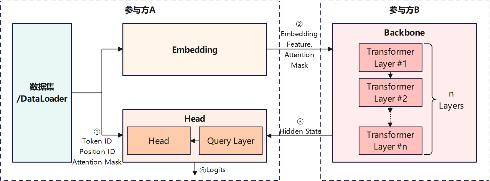
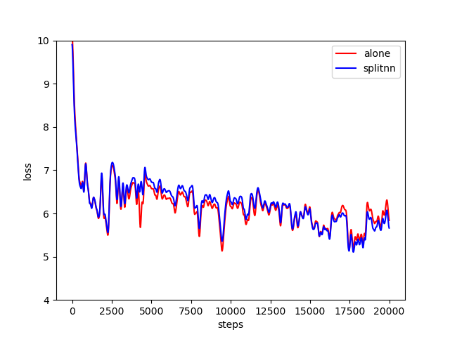

# 纵向联邦学习模型训练 - 盘古α大模型跨域训练

<a href="https://gitee.com/mindspore/docs/blob/master/docs/federated/docs/source_zh_cn/split_pangu_alpha_application.md" target="_blank"></a>

## 概述

随着硬件算力的进步和网络数据规模的持续膨胀，预训练大模型已日趋成为自然语言处理、图文多模态等领域的重要研究方向。以2021年发布中文NLP预训练大模型的盘古α为例，其模型参数量达2000亿，训练过程依赖海量数据和先进计算中心，限制了其应用落地和技术演进。一种可行的解决方案是基于纵向联邦学习或拆分学习（Split Learning）技术，整合多参与方的算力和数据资源，在确保安全隐私的前提下，实现预训练大模型的的跨域协同训练。

MindSpore Federated提供基于拆分学习的纵向联邦学习基础功能组件。本样例以盘古α模型为例，提供了面向NLP大模型的联邦学习训练样例。



如上图所示，该案例中， 盘古α模型被依次切分为Embedding、Backbone、Head等3个子网络。其中，前级子网络Embedding和末级子网络Head部署在的参与方A网络域内，包含多级Transformer模块的Backbone子网络部署在参与方B网络域内。Embedding子网络和Head子网络读取参与方A所持有的数据，主导执行盘古α模型的训练和推理任务。

* 前向推理阶段，参与方A采用Embedding子网络处理原始数据后，将输出的Embedding Feature特征张量和Attention Mask特征张量传输给参与方B，作为参与方B Backbone子网络的输入。然后，参与方A读取Backbone子网络输出的Hide State特征张量，作为参与方A Head子网络的输入，最终由Head子网络输出预测结果或损失值。

* 反向传播阶段，参与方A在完成Head子网络的梯度计算和参数更新后，将Hide State特征张量所关联的梯度张量，传输给参与方B，用于Backbone子网络的梯度计算和参数更新。然后，参与方B在完成Backbone子网络的梯度计算和参数更新后，将Embedding Feature特征张量所关联的梯度张量，传输给参与方A，用于Embedding子网络的梯度计算和参数更新。

上述前向推理和反向传播过程中，参与方A和参与方B交换的特征张量和梯度张量，均采用隐私安全机制和加密算法进行处理，从而无需将参与方A所持有的数据传输给参与方B，即可实现两个参与方对网络模型的协同训练。由于Embedding子网络和Head子网络参数量较少，而Backbone子网络参数量巨大，该应用样例适用于业务方（对应参与方A）与计算中心（对应参与方B）的大模型协同训练或部署。

盘古α模型原理的详细介绍，可参考[MindSpore ModelZoo - pangu_alpha](https://gitee.com/mindspore/models/tree/master/official/nlp/pangu_alpha)、[鹏程·盘古α介绍](https://git.openi.org.cn/PCL-Platform.Intelligence/PanGu-Alpha)，及其[研究论文](https://arxiv.org/pdf/2104.12369.pdf)。

## 准备环节

### 环境准备

1. 参考[获取MindSpore Federated](https://mindspore.cn/federated/docs/zh-CN/master/federated_install.html)，安装MindSpore 1.8.1及以上版本和MindSpore Federated。

2. 下载MindSpore Federated代码，安装本应用样例依赖的Python软件包。

    ```bash
    git https://gitee.com/mindspore/federated.git
    cd federated/example/splitnn_pangu_alpha/
    python -m pip install -r requirements.txt
    ```

### 数据集准备

在运行样例前，需参考[MindSpore ModelZoo - pangu_alpha - Dataset Generation](https://gitee.com/mindspore/models/tree/master/official/nlp/pangu_alpha#dataset-generation)，采用preprocess.py脚本将用于训练的原始文本语料，转换为可用于模型训练的数据集。

## 定义纵向联邦学习训练过程

MindSpore Federated纵向联邦学习框架采用FLModel（参见 [纵向联邦学习模型训练接口](https://mindspore.cn/federated/docs/zh-CN/master/vertical/vertical_federated_FLModel.html) ）和yaml文件（参见 [纵向联邦学习yaml详细配置项](https://mindspore.cn/federated/docs/zh-CN/master/vertical/vertical_federated_yaml.html) ），建模纵向联邦学习的训练过程。

### 定义网络模型

1. 采用MindSpore提供的功能组件，以nn.Cell（参见 [mindspore.nn.Cell](https://mindspore.cn/docs/zh-CN/master/api_python/nn/mindspore.nn.Cell.html?highlight=cell#mindspore-nn-cell) ）为基类，编程开发本参与方待参与纵向联邦学习的训练网络。以本应用实践中参与方A的Embedding子网络为例，[示例代码](https://gitee.com/mindspore/federated/tree/master/example/splitnn_pangu_alpha/src/split_pangu_alpha.py)如下：

   ```python
   class EmbeddingLossNet(nn.Cell):
       """
       Train net of the embedding party, or the tail sub-network.
       Args:
           net (class): EmbeddingLayer, which is the 1st sub-network.
           config (class): default config info.
       """

       def __init__(self, net: EmbeddingLayer, config):
           super(EmbeddingLossNet, self).__init__(auto_prefix=False)

           self.batch_size = config.batch_size
           self.seq_length = config.seq_length
           dp = config.parallel_config.data_parallel
           self.eod_token = config.eod_token
           self.net = net
           self.slice = P.StridedSlice().shard(((dp, 1),))
           self.not_equal = P.NotEqual().shard(((dp, 1), ()))
           self.batch_size = config.batch_size
           self.len = config.seq_length
           self.slice2 = P.StridedSlice().shard(((dp, 1, 1),))

       def construct(self, input_ids, position_id, attention_mask):
           """forward process of FollowerLossNet"""
           tokens = self.slice(input_ids, (0, 0), (self.batch_size, -1), (1, 1))
           embedding_table, word_table = self.net(tokens, position_id, batch_valid_length=None)
           return embedding_table, word_table, position_id, attention_mask
   ```

2. 在yaml配置文件中，描述训练网络对应的名称、输入、输出等信息。以本应用实践中参与方A的Embedding子网络为例，[示例代码](https://gitee.com/mindspore/federated/tree/master/example/splitnn_pangu_alpha/embedding.yaml)如下：

   ```yaml
   train_net:
       name: follower_loss_net
       inputs:
         - name: input_ids
           source: local
         - name: position_id
           source: local
         - name: attention_mask
           source: local
       outputs:
         - name: embedding_table
           destination: remote
         - name: word_table
           destination: remote
         - name: position_id
           destination: remote
         - name: attention_mask
           destination: remote
   ```

其中，`name`字段为训练网络名称，将用于命名训练过程中保存的checkpoints文件。`inputs`字段为训练网络输入张量列表，`outputs`字段为训练网络输入张量列表。

`inputs`和`outputs`字段下的`name`字段，为输入/输出张量名称。输入/输出张量的名称和顺序，需要与训练网络对应Python代码中`construct`方法的输入/输出严格对应。

`inputs`字段下的`source`字段标识输入张量的数据来源，`local`代表输入张量来源于本地数据加载，`remote`代表输入张量来源于其它参与方网络传输。

`outputs`字段下的`destination`字段标识输出张量的数据去向，`local`代表输出张量仅用于本地，`remote`代表输出张量将通过网络传输给其它参与方。

3. 可选的，采用类似方法建模本参与方待参与纵向联邦学习的评估网络。

### 定义优化器

1. 采用MindSpore提供的功能组件，编程开发用于本参与方训练网络参数更新的优化器。以本应用实践中参与方A用于Embedding子网络训练的自定义优化器为例，[示例代码](https://gitee.com/mindspore/federated/tree/master/example/splitnn_pangu_alpha/src/pangu_optim.py)如下:

    ```python
    class PanguAlphaAdam(TrainOneStepWithLossScaleCell):
        """
        Customized Adam optimizer for training of pangu_alpha in the splitnn demo system.
        """
        def __init__(self, net, optim_inst, scale_update_cell, config, yaml_data) -> None:
            # 定义自定义优化器相关算子
            ...

        def __call__(self, *inputs, sens=None):
            # 定义梯度计算和参数更新过程
            ...
    ```

开发者可自定义优化器类的`__init__`方法的输入输出，但优化器类的`__call__`方法的输入需仅包含`inputs`和`sens`。其中，`inputs`为`list`类型，对应训练网络的输入张量列表，其元素为`mindspore.Tensor`类型。`sens`为`dict`类型，保存用于计算训练网络参数梯度值的加权系数，其key为`str`类型的梯度加权系数标识符；value为`dict`类型，其key为`str`类型，是训练网络输出张量名称，value为`mindspore.Tensor`类型，是该输出张量对应的训练网络参数梯度值的加权系数。

2. 在yaml配置文件中，描述优化器对应的梯度计算、参数更新等信息。[示例代码](https://gitee.com/mindspore/federated/tree/master/example/splitnn_pangu_alpha/embedding.yaml)如下：

    ```yaml
    opts:
      - type: PanguAlphaAdam
        grads:
          - inputs:
              - name: input_ids
              - name: position_id
              - name: attention_mask
            output:
              name: embedding_table
            sens: hidden_states
          - inputs:
              - name: input_ids
              - name: position_id
              - name: attention_mask
            output:
              name: word_table
            sens: word_table
        params:
          - name: word_embedding
          - name: position_embedding
        hyper_parameters:
          learning_rate: 5.e-6
          eps: 1.e-8
          loss_scale: 1024.0
    ```

其中，`type`字段为优化器类型，此处为开发者自定义优化器。

`grads`字段为优化器关联的`GradOperation`列表，优化器将使用列表中`GradOperation`算子计算输出的梯度值，更新训练网络参数。`inputs`和`output`字段为`GradOperation`算子的输入和输出张量列表，其元素分别为一个输入/输出张量名称。`sens`字段为`GradOperation`算子的梯度加权系数或灵敏度（参考[mindspore.ops.GradOperation](https://mindspore.cn/docs/zh-CN/master/api_python/ops/mindspore.ops.GradOperation.html?highlight=gradoperation) ）的标识符。

`params`字段为优化器即将更新的训练网络参数名称列表，其元素分别为一个训练网络参数名称。本示例中，自定义优化器将更新名称中包含`word_embedding`字符串和`position_embedding`字符串的网络参数。

`hyper_parameters`字段为优化器的超参数列表。

### 定义梯度加权系数计算

根据梯度计算的链式法则，位于全局网络后级的子网络，需要计算其输出张量相对于输入张量的梯度值，即梯度加权系数或灵敏度，传递给位于全局网络前级的子网络，用于其训练参数更新。

MindSpore Federated采用`GradOperation`算子，完成上述梯度加权系数或灵敏度计算过程。开发者需在yaml配置文件中，描述用于计算梯度加权系数的`GradOperation`算子。以本应用实践中参与方A的Head为例，[示例代码](https://gitee.com/mindspore/federated/blob/master/example/splitnn_pangu_alpha/head.yaml)如下：

```yaml
grad_scalers:
      - inputs:
          - name: hidden_states
          - name: input_ids
          - name: word_table
          - name: position_id
          - name: attention_mask
        output:
          name: output
        sens: 1024.0
```

其中，`inputs`和`output`字段为`GradOperation`算子的输入和输出张量列表，其元素分别为一个输入/输出张量名称。`sens`字段为该`GradOperation`算子的梯度加权系数或灵敏度（参考[mindspore.ops.GradOperation](https://mindspore.cn/docs/zh-CN/master/api_python/ops/mindspore.ops.GradOperation.html?highlight=gradoperation) ），如果为`float`或`int`型数值，则将构造一个常量张量作为梯度加权系数，如果为`str`型字符串，则将从其它参与方经网络传输的加权系数中，解析名称与其对应的张量作为加权系数。

### 执行训练

1. 完成上述Python编程开发和yaml配置文件编写后，采用MindSpore Federated提供的`FLModel`类和`FLYamlData`类，构建纵向联邦学习流程。以本应用实践中参与方A的Embedding子网络为例，[示例代码](https://gitee.com/mindspore/federated/tree/master/example/splitnn_pangu_alpha/src/split_pangu_alpha.py)如下：

    ```python
    embedding_yaml = FLYamlData('./embedding.yaml')
    embedding_base_net = EmbeddingLayer(config)
    embedding_eval_net = embedding_train_net = EmbeddingLossNet(embedding_base_net, config)
    embedding_with_loss = _VirtualDatasetCell(embedding_eval_net)
    embedding_params = embedding_with_loss.trainable_params()
    embedding_group_params = set_embedding_weight_decay(embedding_params)
    embedding_optim_inst = FP32StateAdamWeightDecay(embedding_group_params, lr, eps=1e-8, beta1=0.9, beta2=0.95)
    embedding_optim = PanguAlphaAdam(embedding_train_net, embedding_optim_inst, update_cell, config, embedding_yaml)

    embedding_fl_model = FLModel(yaml_data=embedding_yaml,
                                 network=embedding_train_net,
                                 eval_network=embedding_eval_net,
                                 optimizers=embedding_optim)
    ```

其中，`FLYamlData`类主要完成yaml配置文件的解析和校验，`FLModel`类主要提供纵向联邦学习训练、推理等流程的控制接口。

2. 调用`FLModel`类的接口方法，执行纵向联邦学习训练。以本应用实践中参与方A的Embedding子网络为例，[示例代码](https://gitee.com/mindspore/federated/tree/master/example/splitnn_pangu_alpha/src/split_pangu_alpha.py)如下：

    ```python
    embedding_fl_model.load_ckpt()
    for epoch in range(50):
        for step, item in enumerate(train_iter, start=1):
            # forward process
            step = epoch * train_size + step
            embedding_out = embedding_fl_model.forward_one_step(item)
            ...
            # backward process
            head_scale = head_fl_model.backward_one_step(item, backbone_out)
            ...
            if step % 10 == 0:
                embedding_fl_model.save_ckpt()
    ```

其中，`forward_one_step`方法和`backward_one_step`方法分别执行一个数据batch的前向推理和反向传播操作。`load_ckpt`方法和`save_ckpt`方法分别执行checkpoints文件的加载和保存操作。

## 运行样例

本样例提供2个示例程序，均以Shell脚本拉起Python程序的形式运行。

1. `run_pangu_train_local.sh`：单进程示例程序，参与方A和参与方B同一进程训练，其以程序内变量的方式，直接传输特征张量和梯度张量至另一参与方。

2. `run_pangu_train_leader.sh`和`run_pangu_train_follower.sh`：多进程示例程序，参与方A和参与方B分别运行一个进程，其分别将特征张量和梯度张量封装为protobuf消息后，通过https通信接口传输至另一参与方。`run_pangu_train_leader.sh`和`run_pangu_train_follower.sh`可分别在两台服务器上运行，实现跨域协同训练。

### 运行单进程样例

`run_pangu_train_local.sh`为例，运行示例程序的步骤如下：

1. 进入示例程序目录：

    ```bash
    cd federated/example/splitnn_pangu_alpha/
    ```

2. 以wiki数据集为例，拷贝数据集至示例程序目录：

    ```bash
    cp -r {dataset_dir}/wiki ./
    ```

3. 安装依赖的Python软件包：

    ```bash
    python -m pip install -r requirements.txt
    ```

4. 修改`src/utils.py`，配置checkpoint文件加载路径、训练数据集路径、评估数据集路径等参数，示例如下：

    ```python
    parser.add_argument("--load_ckpt_path", type=str, default='./checkpoints', help="predict file path.")
    parser.add_argument('--data_url', required=False, default='./wiki/train/', help='Location of data.')
    parser.add_argument('--eval_data_url', required=False, default='./wiki/eval/', help='Location of eval data.')
    ```

5. 执行训练脚本：

    ```bash
    ./run_pangu_train_local.sh
    ```

6. 查看训练日志`splitnn_pangu_local.txt`中记录的训练loss信息。

    ```text
    INFO:root:epoch 0 step 10/43391 loss: 10.616087
    INFO:root:epoch 0 step 20/43391 loss: 10.424824
    INFO:root:epoch 0 step 30/43391 loss: 10.209235
    INFO:root:epoch 0 step 40/43391 loss: 9.950026
    INFO:root:epoch 0 step 50/43391 loss: 9.712448
    INFO:root:epoch 0 step 60/43391 loss: 9.557744
    INFO:root:epoch 0 step 70/43391 loss: 9.501564
    INFO:root:epoch 0 step 80/43391 loss: 9.326054
    INFO:root:epoch 0 step 90/43391 loss: 9.387547
    INFO:root:epoch 0 step 100/43391 loss: 8.795234
    ...
    ```

对应的可视化结果如下图所示，其中横轴为训练步数，纵轴为loss值，红色曲线为盘古α训练loss值，蓝色曲线为本示例中基于拆分学习的盘古α训练loss值。二者loss值下降的趋势基本一致，考虑到网络参数值初始化具有随机性，可验证训练过程的正确性。



### 运行多进程样例

1. 类似单进程样例，进入示例程序目录，安装依赖的Python软件包：

    ```bash
    cd federated/example/splitnn_pangu_alpha/
    python -m pip install -r requirements.txt
    ```

2. 拷贝数据集至服务器1的示例程序目录：

   ```bash
    cp -r {dataset_dir}/wiki ./
   ```

3. 在服务器1启动参与方A的训练脚本：

    ```bash
    ./run_pangu_train_leader.sh {ip_address_server1} {ip_address_server2} ./wiki/train ./wiki/train
    ```

训练脚本的第1个参数是本地服务器（服务器1）的IP地址和端口号，第2个参数是对端服务器（服务器2）的IP地址和端口号，第3个参数是训练数据集文件路径，第4个参数是评估数据集文件路径，第5个参数标识是否加载已有的checkpoint文件。

4. 在服务器2启动参与方B的训练脚本：

    ```bash
    ./run_pangu_train_follower.sh {ip_address_server2} {ip_address_server1}
    ```

训练脚本的第1个参数是本地服务器（服务器2）的IP地址和端口号，第2个参数是对端服务器（服务器2）的IP地址和端口号，第3个参数标识是否加载已有的checkpoint文件。

5. 查看服务器1的训练日志`leader_processs.log`中记录的训练loss信息。若其loss信息与盘古α集中式训练loss值趋势一致，可验证训练过程的正确性。