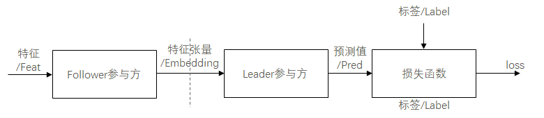
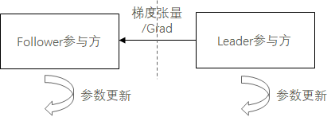
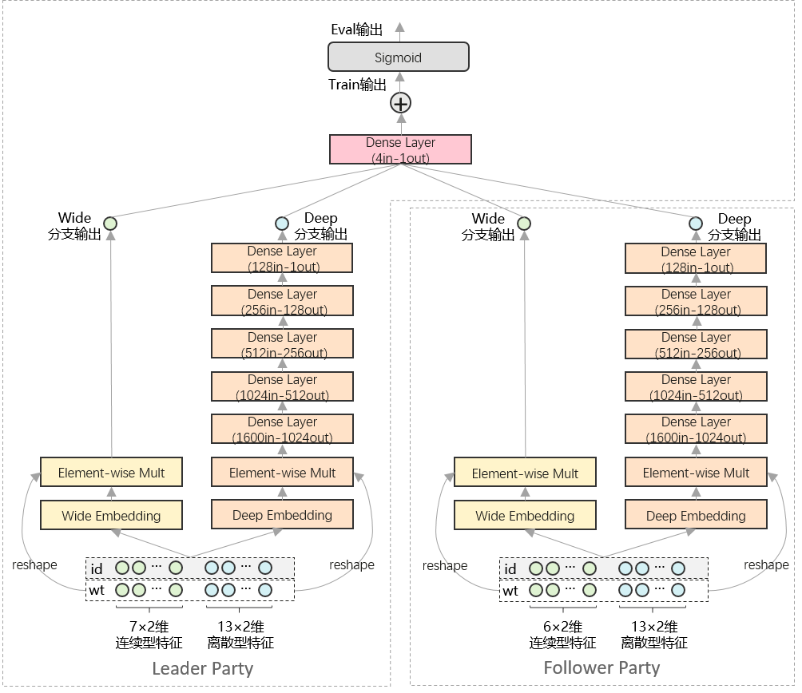

# 纵向联邦学习模型训练 - Wide&Deep推荐应用

<a href="https://gitee.com/mindspore/docs/blob/r2.0/docs/federated/docs/source_zh_cn/split_wnd_application.md" target="_blank"></a>

## 概述

MindSpore Federated提供基于拆分学习（Split Learning）的纵向联邦学习基础功能组件。

纵向FL模型训练场景：包括前向传播和后向传播/参数更新两个阶段。

前向传播：经数据求交模块处理参数方数据，配准特征信息和标签信息后，Follower参与方将本地特征信息输入前级网络模型，将前级网络模型输出的特征张量，经隐私安全模块加密/加扰后，由通信模块传输给Leader参与方。Leader参与方将收到的特征张量输入后级网络模型，以后级网络模型输出的预测值和本地标签信息为损失函数输入，计算损失值。



后向传播：Leader参与方基于损失值，计算后级网络模型的参数梯度，训练更新后级网络模型的参数，并将与特征张量关联的梯度张量，经隐私安全模块加密/加扰后，由通信模块传输传输给Follower参与方。Follower参与方将收到的梯度张量用于前级网络模型的参数训练更新。



纵向FL模型推理场景：与训练场景的前向传播阶段类似，但直接以后级网络模型的预测值为输出，而无需计算损失值。

## 网络和数据



本样例以Wide&Deep网络和Criteo数据集为例，提供了面向推荐任务的联邦学习训练样例。如上图所示，本案例中，纵向联邦学习系统由Leader参与方和Follower参与方组成。其中，Leader参与方持有20×2维特征信息和标签信息，Follower参与方持有19×2维特征信息。Leader参与方和Follower参与方分别部署1组Wide&Deep网络，并通过交换embedding向量和梯度向量，在不泄露原始特征和标签信息的前提下，实现对网络模型的协同训练。

Wide&Deep网络原理特性的详细介绍，可参考[MindSpore ModelZoo - Wide&Deep - Wide&Deep概述](https://gitee.com/mindspore/models/blob/master/official/recommend/Wide_and_Deep/README_CN.md#widedeep%E6%A6%82%E8%BF%B0) 及其[研究论文](https://arxiv.org/pdf/1606.07792.pdf)。

## 数据集准备

本样例基于Criteo数据集进行训练和测试，在运行样例前，需参考[MindSpore ModelZoo - Wide&Deep - 快速入门](https://gitee.com/mindspore/models/blob/master/official/recommend/Wide_and_Deep/README_CN.md#%E5%BF%AB%E9%80%9F%E5%85%A5%E9%97%A8)，对Criteo数据集进行预处理。

1. 克隆MindSpore ModelZoo代码。

   ```shell
   git clone https://gitee.com/mindspore/models.git
   cd models/official/recommend/Wide_and_Deep
   ```

2. 下载数据集。

   ```shell
   mkdir -p data/origin_data && cd data/origin_data
   wget http://go.criteo.net/criteo-research-kaggle-display-advertising-challenge-dataset.tar.gz
   tar -zxvf criteo-research-kaggle-display-advertising-challenge-dataset.tar.gz
   ```

3. 使用此脚本预处理数据。预处理过程可能需要一小时，生成的MindRecord数据存放在data/mindrecord路径下。预处理过程内存消耗巨大，建议使用服务器。

   ```shell
   cd ../..
   python src/preprocess_data.py  --data_path=./data/ --dense_dim=13 --slot_dim=26 --threshold=100 --train_line_count=45840617 --skip_id_convert=0
   ```

## 快速体验

本样例以Shell脚本拉起Python程序的形式运行。

1. 参考[MindSpore官网指引](https://www.mindspore.cn/install) ，安装MindSpore 1.8.1或更高版本。

2. 采用安装MindSpore Federated所依赖Python库。

   ```shell
   cd federated
   python -m pip install -r requirements_test.txt
   ```

3. 拷贝[预处理](#数据集准备) 后的Criteo数据集至本目录下。

   ```shell
   cd tests/st/splitnn_criteo
   cp -rf ${DATA_ROOT_PATH}/data/mindrecord/ ./
   ```

4. 运行示例程序启动脚本。

   ```shell
   # 启动leader进程：
   bash run_vfl_train_socket_leader.sh

   # 启动follower进程：
   bash run_vfl_train_socket_follower.sh

   # 以https加密通信的方式启动leader进程：
   bash run_vfl_train_leader.sh 127.0.0.1:10087 127.0.0.1:10086 /path/to/data_set True server_cert_password client_cert_password /path/to/server_cert /path/to/client_cert /path/to/ca_cert

   # 以https加密通信的方式启动follower进程：
   bash run_vfl_train_follower.sh 127.0.0.1:10086 127.0.0.1:10087 /path/to/data_set True server_cert_password client_cert_password /path/to/server_cert /path/to/client_cert /path/to/ca_cert
   ```

5. 查看训练日志`log_local_gpu.txt`。

   ```text
   INFO:root:epoch 0 step 100/2582 wide_loss: 0.528141 deep_loss: 0.528339
   INFO:root:epoch 0 step 200/2582 wide_loss: 0.499408 deep_loss: 0.499410
   INFO:root:epoch 0 step 300/2582 wide_loss: 0.477544 deep_loss: 0.477882
   INFO:root:epoch 0 step 400/2582 wide_loss: 0.474377 deep_loss: 0.476771
   INFO:root:epoch 0 step 500/2582 wide_loss: 0.472926 deep_loss: 0.475157
   INFO:root:epoch 0 step 600/2582 wide_loss: 0.464844 deep_loss: 0.467011
   INFO:root:epoch 0 step 700/2582 wide_loss: 0.464496 deep_loss: 0.466615
   INFO:root:epoch 0 step 800/2582 wide_loss: 0.466895 deep_loss: 0.468971
   INFO:root:epoch 0 step 900/2582 wide_loss: 0.463155 deep_loss: 0.465299
   INFO:root:epoch 0 step 1000/2582 wide_loss: 0.457914 deep_loss: 0.460132
   INFO:root:epoch 0 step 1100/2582 wide_loss: 0.453361 deep_loss: 0.455767
   INFO:root:epoch 0 step 1200/2582 wide_loss: 0.457566 deep_loss: 0.459997
   INFO:root:epoch 0 step 1300/2582 wide_loss: 0.460841 deep_loss: 0.463281
   INFO:root:epoch 0 step 1400/2582 wide_loss: 0.460973 deep_loss: 0.463365
   INFO:root:epoch 0 step 1500/2582 wide_loss: 0.459204 deep_loss: 0.461563
   INFO:root:epoch 0 step 1600/2582 wide_loss: 0.456771 deep_loss: 0.459200
   INFO:root:epoch 0 step 1700/2582 wide_loss: 0.458479 deep_loss: 0.460963
   INFO:root:epoch 0 step 1800/2582 wide_loss: 0.449609 deep_loss: 0.452122
   INFO:root:epoch 0 step 1900/2582 wide_loss: 0.451775 deep_loss: 0.454225
   INFO:root:epoch 0 step 2000/2582 wide_loss: 0.460343 deep_loss: 0.462826
   INFO:root:epoch 0 step 2100/2582 wide_loss: 0.456814 deep_loss: 0.459201
   INFO:root:epoch 0 step 2200/2582 wide_loss: 0.452091 deep_loss: 0.454555
   INFO:root:epoch 0 step 2300/2582 wide_loss: 0.461522 deep_loss: 0.464001
   INFO:root:epoch 0 step 2400/2582 wide_loss: 0.442355 deep_loss: 0.444790
   INFO:root:epoch 0 step 2500/2582 wide_loss: 0.450675 deep_loss: 0.453242
   ...
   ```

6. 关闭训练进程。

   ```shell
   pid=`ps -ef|grep run_vfl_train_socket |grep -v "grep" | grep -v "finish" |awk '{print $2}'` && for id in $pid; do kill -9 $id && echo "killed $id"; done
   ```

## 深度体验

在启动纵向联邦学习训练之前，用户需要和使用MindSpore做普通深度学习训练一样，构造数据集迭代器和网络结构。

### 构造数据集

当前采用模拟流程，即两方读取数据源一样，但训练时，两方只使用部分的特征或标签数据，如[网络和数据](#网络和数据)所示。后续将采用[数据接入](https://www.mindspore.cn/federated/docs/zh-CN/r0.1/data_join/data_join.html)方法两方各自导入数据。

```python
from run_vfl_train_local import construct_local_dataset


ds_train, _ = construct_local_dataset()
train_iter = ds_train.create_dict_iterator()
```

### 构建网络

Leader参与方网络：

```python
from wide_and_deep import WideDeepModel, BottomLossNet, LeaderTopNet, LeaderTopLossNet, LeaderTopEvalNet, \
     LeaderTeeNet, LeaderTeeLossNet, LeaderTopAfterTeeNet, LeaderTopAfterTeeLossNet, LeaderTopAfterTeeEvalNet, \
     AUCMetric
from network_config import config


# Leader Top Net
leader_top_base_net = LeaderTopNet()
leader_top_train_net = LeaderTopLossNet(leader_top_base_net)
...
# Leader Bottom Net
leader_bottom_eval_net = leader_bottom_base_net = WideDeepModel(config, config.leader_field_size)
leader_bottom_train_net = BottomLossNet(leader_bottom_base_net, config)
```

Follower参与方网络：

```python
from wide_and_deep import WideDeepModel, BottomLossNet
from network_config import config


follower_bottom_eval_net = follower_base_net = WideDeepModel(config, config.follower_field_size)
follower_bottom_train_net = BottomLossNet(follower_base_net, config)
```

### 纵向联邦通信底座

在训练前首先要启动通信底座，使Leader和Follower参与方组网。详细的API文档可以参考[纵向联邦通信器](https://gitee.com/mindspore/federated/blob/r0.1/docs/api/api_python/vertical/vertical_communicator.rst)。

两方都需要导入纵向联邦通信器：

```python
from mindspore_federated.startup.vertical_federated_local import VerticalFederatedCommunicator, ServerConfig
```

Leader参与方通信底座：

```python
http_server_config = ServerConfig(server_name='leader', server_address=config.http_server_address)
remote_server_config = ServerConfig(server_name='follower', server_address=config.remote_server_address)
self.vertical_communicator = VerticalFederatedCommunicator(http_server_config=http_server_config,
                                                           remote_server_config=remote_server_config,
                                                           compress_configs=compress_configs)
self.vertical_communicator.launch()
```

Follower参与方通信底座：

```python
http_server_config = ServerConfig(server_name='follower', server_address=config.http_server_address)
remote_server_config = ServerConfig(server_name='leader', server_address=config.remote_server_address)
self.vertical_communicator = VerticalFederatedCommunicator(http_server_config=http_server_config,
                                                           remote_server_config=remote_server_config,
                                                           compress_configs=compress_configs)
self.vertical_communicator.launch()
```

### 构建纵向联邦网络

用户需要使用MindSpore Federated提供的类，将自己构造好的网络封装成纵向联邦网络。详细的API文档可以参考[纵向联邦训练接口](https://gitee.com/mindspore/federated/blob/r0.1/docs/api/api_python/vertical/vertical_federated_FLModel.rst)。

两方都需要导入纵向联邦训练接口：

```python
from mindspore_federated import FLModel, FLYamlData
```

Leader参与方纵向联邦网络：

```python
leader_bottom_yaml_data = FLYamlData(config.leader_bottom_yaml_path)
leader_top_yaml_data = FLYamlData(config.leader_top_yaml_path)
...
self.leader_top_fl_model = FLModel(yaml_data=leader_top_yaml_data,
                                   network=leader_top_train_net,
                                   metrics=self.eval_metric,
                                   eval_network=leader_top_eval_net)
...
self.leader_bottom_fl_model = FLModel(yaml_data=leader_bottom_yaml_data,
                                      network=leader_bottom_train_net,
                                      eval_network=leader_bottom_eval_net)
```

Follower参与方纵向联邦网络：

```python
follower_bottom_yaml_data = FLYamlData(config.follower_bottom_yaml_path)
...
self.follower_bottom_fl_model = FLModel(yaml_data=follower_bottom_yaml_data,
                                        network=follower_bottom_train_net,
                                        eval_network=follower_bottom_eval_net)
```

### 纵向训练

纵向训练的流程可以参考[概述](#概述)。

Leader参与方训练流程：

```python
for epoch in range(config.epochs):
    for step, item in enumerate(train_iter):
        leader_embedding = self.leader_bottom_fl_model.forward_one_step(item)
        item.update(leader_embedding)
        follower_embedding = self.vertical_communicator.receive("follower")
        ...
        leader_out = self.leader_top_fl_model.forward_one_step(item, follower_embedding)
        grad_scale = self.leader_top_fl_model.backward_one_step(item, follower_embedding)
        scale_name = 'loss'
        ...
        grad_scale_follower = {scale_name: OrderedDict(list(grad_scale[scale_name].items())[2:])}
        self.vertical_communicator.send_tensors("follower", grad_scale_follower)
        grad_scale_leader = {scale_name: OrderedDict(list(grad_scale[scale_name].items())[:2])}
        self.leader_bottom_fl_model.backward_one_step(item, sens=grad_scale_leader)
```

Follower参与方训练流程：

```python
for _ in range(config.epochs):
    for _, item in enumerate(train_iter):
        follower_embedding = self.follower_bottom_fl_model.forward_one_step(item)
        self.vertical_communicator.send_tensors("leader", follower_embedding)
        scale = self.vertical_communicator.receive("leader")
        self.follower_bottom_fl_model.backward_one_step(item, sens=scale)
```

