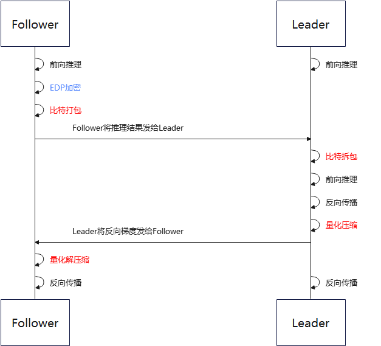
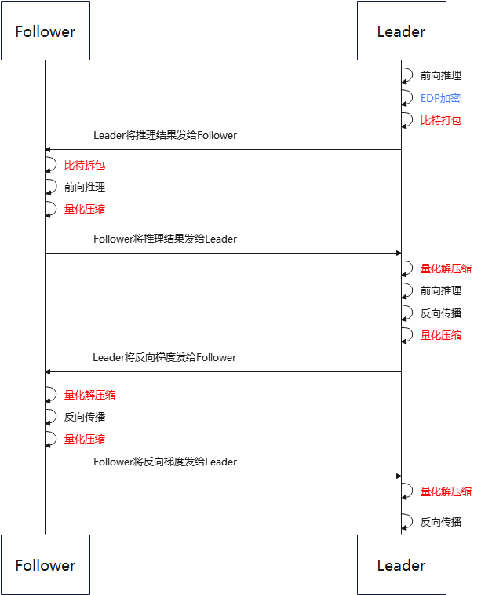

# 纵向联邦学习通信压缩

<a href="https://gitee.com/mindspore/docs/blob/master/docs/federated/docs/source_zh_cn/vfl_communication_compression.md" target="_blank"></a>

纵向联邦学习通信量会影响用户体验（用户流量、通信时延、联邦学习训练效率），并受性能约束（内存、带宽、CPU 占用率）限制。小的通信量对提高用户体验和减少性能瓶颈都有很大帮助，因此需要对通信量进行压缩。MindSpore Federated 在纵向联邦应用场景中，实现了Leader和Follower之间的双向通信压缩。

## 总体流程



图 1 普通纵向联邦学习通信压缩流程框架图

首先在Follower上进行Embedding DP（EDP）加密操作。然后进入比特打包流程。比特打包流程中会自动判断输入数据是否可以被打包，只有输入数据可以被强转为指定比特存储格式且没有精度丢失时，才会执行比特打包操作。Follower将打包后的数据发送给Leader，Leader会根据上报的数据信息判断是否需要被拆包。在Leader将数据传给Follower之前，会将数据进行量化压缩。Follower收到数据后会对量化数据进行解压缩。



图 2 盘古纵向联邦学习通信压缩流程框架图

总体流程和普通纵向联邦学习通信压缩流程一致。盘古纵向联邦相较于普通纵向联邦，每个iteration会多一轮通信，因此需要多进行一次量化压缩和解压缩流程。

## 压缩方法

### 比特打包压缩方法

比特打包压缩方法是一种将数据结构序列转换为 一种紧凑的二进制表示方法。比特打包本身属于无损压缩方法，但通常输入给比特打包的数据经过了有损压缩。

以 3-bit 打包举例来讲：

量化位数 bit_num= 3

压缩前的存储格式为float32的数据为：

data = [3, -4, 3, -2, 3, -2, -4, 0, 1, 3]

首先判断使用比特打包压缩是否可以压缩：

data_int = int(data)

若data - data_int中的元素不都为0，则退出比特打包流程。

将源数据根据bit_num转换为二进制格式：

data_bin = [011, 100, 011, 110, 011, 110, 100, 000, 001, 011]

注：转换前需要判断当前数据是否在bit_num所能容纳的范围内，若超过范围退出比特打包流程。

由于原生C++没有专门的二进制存储格式，需要将多个二进制数据拼接，组合成int8格式数据存储。若位数不够，则在最后一个数据上补零。组合后数据：

data_int8 = [01110001, 11100111, 10100000, 00101100]

再将二进制数据转换为-128 到 127 之间的整数，并强转数据类型到 int8：

data_packed = [113, -25, -96, 44]

最后将data_packed和bit_num传递给对端。

拆包时，接收方将上述流程反过来即可。

### 量化压缩方法

量化压缩方法即将浮点型的通信数据定点近似为有限多个离散值。当前支持的量化压缩方法为最小最大压缩（min_max）。

以 8-bit 量化举例来讲：

量化位数 bit_num= 8

压缩前的浮点型数据为：

data = [0.03356021, -0.01842778, -0.009684053, 0.025363436, -0.027571501, 0.0077043395, 0.016391572, -0.03598478, -0.0009508357]

计算最大和最小值：

min_val = -0.03598478

max_val = 0.03356021

计算缩放系数：

scale = (max_val - min_val) / (2 ^ bit_num- 1) = 0.000272725450980392

将压缩前数据转换为-128 到 127 之间的整数，转换公式为 quant_data = round((data - min_val) / scale) - 2 ^ (bit_num - 1)。并强转数据类型到 int8：

quant_data = [127, -64, -32, 97, -97, 32, 64, -128, 0]

量化编码后，发送方需要上传的参数即为 quant_data、bit_num 以及最大小值 min_val 和 max_val。

接收方在收到 quant_data、min_val 和 max_val 后，使用反量化公式(quant_data + 2 ^ (bit_num - 1)) * (max_val - min_val) / (2 ^ bit_num - 1) + min_val，还原出权重。

## 快速体验

若要使用比特打包或量化压缩方法，首先需要成功完成任一纵向联邦场景的训练聚合过程，如[纵向联邦学习模型训练 - Wide&Deep推荐应用](https://www.mindspore.cn/federated/docs/zh-CN/master/split_wnd_application.html)。在该文档中详细介绍了包括数据集和网络模型等准备工作和模拟启动联邦学习的流程。

1. 安装MindSpore、MindSpore Federated以及数据预处理操作参照[纵向联邦学习模型训练 - Wide&Deep推荐应用](https://www.mindspore.cn/federated/docs/zh-CN/master/split_wnd_application.html)。

2. 在[相应yaml](https://gitee.com/mindspore/federated/tree/master/example/splitnn_criteo/yaml_files)中设置压缩相关配置。

   [leader_top.yaml](https://gitee.com/mindspore/federated/blob/master/example/splitnn_criteo/yaml_files/leader_top.yaml)的配置如下：

   ```yaml
   role: leader
   model: # define the net of vFL party
     train_net:
       name: leader_loss_net
       inputs:
         - name: leader_wide_embedding
           source: local
         - name: leader_deep_embedding
           source: local
         - name: follower_wide_embedding
           source: remote
           compress_type: min_max
           bit_num: 6
         - name: follower_deep_embedding
           source: remote
           compress_type: min_max
           bit_num: 6
   ...
   ```

   [follower_bottom.yaml](https://gitee.com/mindspore/federated/blob/master/example/splitnn_criteo/yaml_files/follower_bottom.yaml)的配置如下：

   ```yaml
   role: follower
   model: # define the net of vFL party
     train_net:
       name: follower_loss_net
       inputs:
         - name: id_hldr0
           source: local
         - name: wt_hldr0
           source: local
       outputs:
         - name: follower_wide_embedding
           destination: remote
           compress_type: min_max
           bit_num: 6
         - name: follower_deep_embedding
           destination: remote
           compress_type: min_max
           bit_num: 6
         - name: follower_l2_regu
           destination: local
   ...
   ```

3. 用户可根据实际情况，进行超参修改。

   - compress_type：压缩类型，string类型，包括："min_max",   "bit_pack"。
   - bit_num：比特数，int类型，定义域在[1, 8]内。

4. 运行示例程序启动脚本。

   ```shell
   # 启动leader进程：
   bash run_vfl_train_leader.sh 127.0.0.1:1984 127.0.0.1:1230 ./mindrecord/ False
   # 启动follower进程：
   bash run_vfl_train_follower.sh 127.0.0.1:1230 127.0.0.1:1984 ./mindrecord/ False
   ```

5. 查看训练日志`vfl_train_leader.log`。loss正常收敛。

   ```text
   epoch 0 step 0 loss: 0.693124
   epoch 0 step 100 loss: 0.512151
   epoch 0 step 200 loss: 0.493524
   epoch 0 step 300 loss: 0.473054
   epoch 0 step 400 loss: 0.466222
   epoch 0 step 500 loss: 0.464252
   epoch 0 step 600 loss: 0.469296
   epoch 0 step 700 loss: 0.451647
   epoch 0 step 800 loss: 0.457797
   epoch 0 step 900 loss: 0.457930
   epoch 0 step 1000 loss: 0.461664
   epoch 0 step 1100 loss: 0.460415
   epoch 0 step 1200 loss: 0.466883
   epoch 0 step 1300 loss: 0.455919
   epoch 0 step 1400 loss: 0.466984
   epoch 0 step 1500 loss: 0.454486
   epoch 0 step 1600 loss: 0.458730
   epoch 0 step 1700 loss: 0.451275
   epoch 0 step 1800 loss: 0.445938
   epoch 0 step 1900 loss: 0.458323
   epoch 0 step 2000 loss: 0.446709
   ...
   ```

6. 关闭训练进程。

   ```shell
   pid=`ps -ef|grep run_vfl_train_ |grep -v "grep" | grep -v "finish" |awk '{print $2}'` && for id in $pid; do kill -9 $id && echo "killed $id"; done
   ```

## 深度体验

### 获取压缩配置

用户可以使用已经封装好的接口获取通讯压缩相关配置。[模型训练yaml详细配置项](https://www.mindspore.cn/federated/docs/zh-CN/master/vertical/vertical_federated_yaml.html)给出启动的相关参数配置说明。[模型训练接口](https://www.mindspore.cn/federated/docs/zh-CN/master/vertical/vertical_federated_FLModel.html)提供了获取压缩配置的接口。示例方法如下：

```python
# parse yaml files
leader_top_yaml_data = FLYamlData(config.leader_top_yaml_path)

# Leader Top Net
leader_top_base_net = LeaderTopNet()
leader_top_train_net = LeaderTopLossNet(leader_top_base_net)
leader_top_fl_model = FLModel(
    yaml_data=leader_top_yaml_data,
    network=leader_top_train_net
)

# get compress config
compress_configs = leader_top_fl_model.get_compress_configs()
```

### 设置压缩配置

用户可以使用已经封装好的[纵向联邦学习通信器](https://www.mindspore.cn/federated/docs/zh-CN/master/vertical/vertical_communicator.html)接口将通讯压缩相关配置设置到通信器中，方法如下：

```python
# build vertical communicator
http_server_config = ServerConfig(server_name='leader', server_address=config.http_server_address)
remote_server_config = ServerConfig(server_name='follower', server_address=config.remote_server_address)
vertical_communicator = VerticalFederatedCommunicator(
    http_server_config=http_server_config,
    remote_server_config=remote_server_config,
    compress_configs=compress_configs
)
vertical_communicator.launch()
```

设置好通讯压缩配置以后，纵向联邦框架会在后端自动将通讯内容进行压缩。

