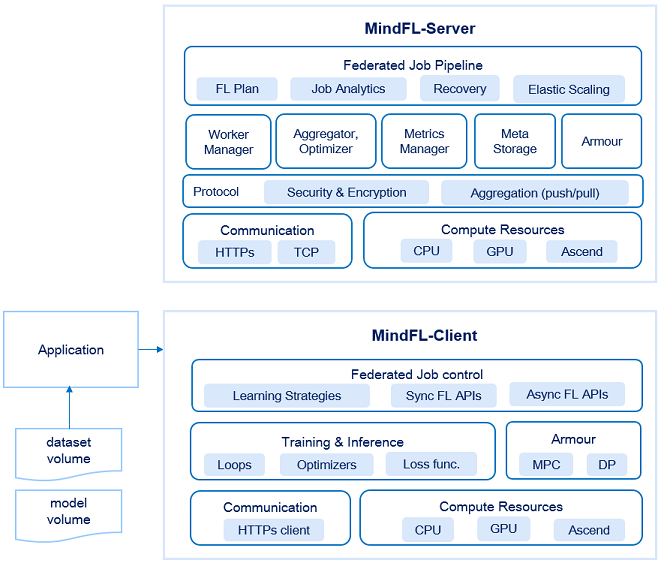

# 概述

`Linux` `Windows` `联邦学习` `分布式应用` `中级` `高级` `贡献者`

MindSpore Federated是一款开源联邦学习框架，支持面向千万级无状态终端设备的商用化部署，可在用户数据不出本地的前提下，使能全场景智能应用。

联邦学习是一种加密的分布式机器学习技术，其支持机器学习的各参与方在不直接共享本地数据的前提下，共建AI模型。MindSpore Federated目前优先专注于参与方数量规模较大的横向联邦学习应用场景。

## MindSpore Federated 框架优势

- 隐私安全

  支持参与方数据留存本地进行协同训练，不交换数据本身，而是用加密方式交换更新的模型参数。

  支持基于多方安全计算（MPC）的精度无损的安全聚合方案，防止模型窃取。

  支持基于本地差分隐私的性能无损的加密方案，防止模型泄漏隐私数据。

- 分布式联邦聚合

  云侧松耦合集群化处理方式，支持千万级数量的大规模异构终端部署场景，实现高性能、高可用的分布式联邦聚合计算，可应对网络不稳定，负载突变等问题。

- 联邦效率提升

  支持同步和异步的联邦模式，支持多种模型压缩算法，提高联邦学习效率，节省带宽资源。

  支持多种联邦聚合策略，提高联邦收敛的平滑度，兼顾全局和局部的精度最优化。

- 灵活易用

  仅一行代码即可切换单机训练与联邦学习模式

  网络模型可编程，聚合算法可编程，安全算法可编程，安全等级可定制。

## MindSpore Federated 组网架构

MindSpore Federated采用松耦合组网模式，应对大规模、无状态、不可靠的异构设备的联邦学习任务。

Federated-Scheduler：联邦学习调度器，与Federated-Server保持TCP长链接，通过心跳完成Federated-Server node的组网结构，并负责管理面任务的下发。

Federated-Server：联邦学习服务器，Federated-Server集群对外暴露唯一地址，内部根据负载均衡策略将Federated-Client请求路由到各Federated-Server node，实现联邦学习服务化，解决大规模不稳定Federated-Client的接入。集群内部保证集群事务弱一致性，并完成联邦聚合算法的分布式计算。使得Federated-Client在任何时刻访问任意Federated-Server，都能获得训练所需的全量数据。

Federated-Client：联邦学习客户端，负责本地数据训练以及作为https的客户端与Federated-Server交互。

## MindSpore Federated 总体架构

MindSpore FL 分为客户端模块和服务器模块两个部分，其框架的总体架构如下所示：

- Federated-Server模块：

    - **Federated Job Pipeline:** 联邦学习任务配置执行、弹性扩缩、容错容灾的主控流程。

    - **Worker Manager:** 设备管理相关逻辑。

    - **Aggregator/Optimizer:** 联邦学习在中心侧的聚合和优化逻辑单元，包括多server node间的分布式聚合处理。

    - **Meta Data/Model Storage：**负责数据存储，主要包括每轮迭代中元数据的跨节点分布式存储，以及训练模型。

    - **Time Limited Communication Module**：限时通信模块，保证在Cross-Device场景下，不会出现由于端侧设备连接不稳定导致训练任务无法继续执行。

    - **Armour:** 安全处理模块，包括多方安全计算等模型加解密策略。

    - **Protocol:** 议解析器，上层模块只需专注于联邦计算，屏蔽底层通信协议类型。

    - **Communication:** 通信组件，支持多种通讯协议，用于接收来自FL-Client，FL-Scheduler和其他FL-Server的消息以及帮助FL-Server组网。

    - **Compute Resources:** 用于联邦学习中心侧的硬件计算资源。

- Federated-Client模块：

    - **Federated Job Pipeline:** 端侧联邦学习任务执行的主控逻辑，包括学习策略、同步/异步端云交互。

    - **Training & Inference:** 轻量化的端侧训练和推理的能力，包括runtime和高性能算子库。

    - **Armour:** 用于端侧的安全处理模块，包括多方安全计算、本地差分隐私等模型加解密策略。

    - **Communication:** 端侧用于联邦学习任务的通信组件。

    - **Compute Resources:** 用于联邦学习端侧的硬件计算资源。

## 使用MindSpore Federated的工作流程

- 识别场景、积累数据：识别出可使用联邦学习的业务场景，在客户端为联邦任务积累本地数据。
- 模型选型、客户端部署：进行模型原型的选型或开发，并使用工具生成方便部署的端侧模型。
- 应用部署：将Federated-Client部署到端侧应用中，并在云侧设置Federated-Plan和部署脚本。

## 应用场景

- 图像分类

- 文本分类  
