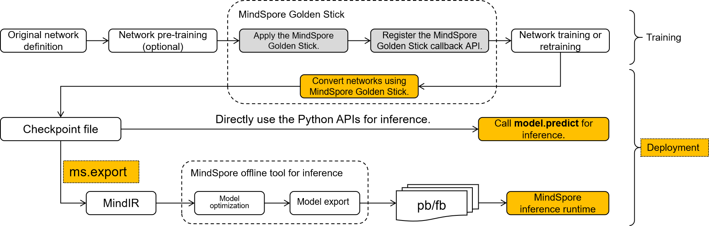

# Model Deployment Overview

The network compressed by MindSpore Golden Stick may require additional steps to transform the structure related to model compression in the network from the training form to the deployment form, which is convenient for further model export and model deployment. Mainly considering the following three points:

1. Different algorithms implement algorithm logic by introducing different neural network operators or custom backend operators. If these custom operators of compression algorithm exist in the network, the network will not be able to perform inference on the MindSpore backend. For example, pseudo-quantization operators in various quantization algorithms, mask operators in pruning algorithms, etc., these operators should be optimized and removed in advance.
2. The training form and the deployment form of the network are very different, more attention is paid to the power consumption and performance during deployment, so some optimizations are usually made to the training network, such as data type optimization, constant folding, etc., in order to improve the performance of deployment as much as possible.
3. MindIR is the intermediate expression of MindSpore, and exporting the model to MindIR format will facilitate the convenient deployment of the model in different inference devices.

Above all, from the overall perspective of the model compression algorithm, its final output should be a standard quantization network in order to be deployed on different backends to realize the value of the algorithm. MindSpore Golden Stick provides a simple and easy-to-use interface for users to convert and export the network and then deploy the model.

## Three steps for model deployment

1. [Model Convert](https://www.mindspore.cn/golden_stick/docs/en/master/deployment/convert.html)：The algorithmically optimized model is further converted into a standard MindSpore network;
2. Model Export：Export the model to MindIR format, MindSpore Golden Stick use MindSpore interface for exporting model to MindIR, see [mindspore.export documentation](https://www.mindspore.cn/docs/en/master/api_python/mindspore/mindspore.export.html) for details.
3. Model Inference: The MindIR model exported after algorithm optimization will be deployed on the device, GPU or Ascend. Device deployment is divided into two steps, see [lite converting tools] (https://www.mindspore.cn/lite/docs/en/master/use/converter_tool.html) and [lite inference] (https://www.mindspore.cn/lite/docs/en/master/use/runtime_cpp.html) for details.

