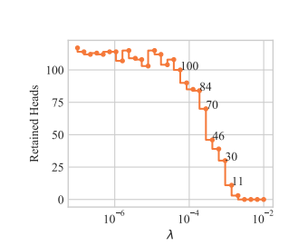

# LRP Head Pruning

[](https://gitee.com/mindspore/docs/blob/master/docs/golden_stick/docs/source_en/pruner/lrp.md)

MindSpore Golden Stick LRP module is an implementation of the LRP method for head pruning first presented in the article
[Analyzing Multi-Head Self-Attention: Specialized Heads Do the Heavy Lifting, the Rest Can Be Pruned](https://www.aclweb.org/anthology/P19-1580) and explained below.

For a complete tutorial of how to use this module please refer to the [tutorial page](lrp_tutorial.md).

## Introduction

### Pruning Attention Heads

The attention mechanism is a crucial component of the transformer architecture.
Different studies have shown that most attention heads are not confident in their decisions and can be pruned.
Since then, several algorithms have been proposed on how to intelligently prune attention heads.

### LRP method

The LRP method starts from a converged model that was not necessarily specially trained to support head pruning.
Then, it fine-tunes the model to support head pruning, and at the end of the fine-tuning phase some heads are pruned.

During the fine-tuning, the original Transformer architecture is modified by multiplying the representation computed by each head with a scalar gate.
That is, when moving from the standard Transformer to the modified one, the representation computed by each ${\rm head}_i$ is multiplied by a scalar gate $g_i$ before being concatenated with results of other attention heads in a layer:
${\rm MultiHead}(Q, K, V) = {\rm Concat}_i({\rm head}_i)W^O \rightarrow {\rm Concat}_i(g_i*{\rm head}_i)W^O $

Note, $g_i$ are parameters specific to heads and are independent of the input (i.e. the sentence).

Ideally, the values of the gates are either 1 (“open”) or 0 (“closed”), and the sparsity of the gates is encouraged by applying $L0$ regularization to the scalar gates $g_i$.
The $L0$ norm equals the number of non-zero components and would push the model to switch off less important heads.

Unfortunately, a direct implementation of this idea leads to an objective function that is non-differentiable with respect to the added gates.
So instead, the algorithm uses a stochastic relaxation in which each gate is modeled as a continuous random variable drawn independently of a head-specific
[Hard Concrete distribution](https://openreview.net/pdf?id=H1Y8hhg0b). The distributions have non-zero probability mass at 0 and 1; look at the illustration.


The non-differentiable $L0$ norm is replaced by the sum of the probabilities of heads being non-zero ($L_C$) as a stochastic relaxation,
and the resulting training objective is

$L = L_{xent} + \lambda L_C$

By varying the coefficient $\lambda$ in the optimized objective, we obtain models with different numbers of retained heads. Below is shown how the probabilities of encoder heads being completely closed $(P(g_i)=0)$ change in training for different values of $\lambda$ (pruning starts from a converged model). 
White color denotes $P(g_i=0) = 1$, which means that a head is completely removed from the model.


(Gif is for the model trained on EN-RU WMT. For other datasets, values of $\lambda$ can be different.)

Empirically, the model converges to solutions where gates are either almost completely closed or completely open.
This means that at test time we can treat the model as a standard Transformer and use only a subset of heads.

Overall, there are 3 main parameters that the user needs to know in order to get a general understanding of the algorithm backstage:

* ```l0_penalty```
    * The regularization coefficient through which we control the number of pruned heads
    * The larger the coefficient is, the more heads are pruned
* ```temperature```
    * Controls the relaxation of the ideal objective function
    * As the temperature decreases, the degree of approximation improves (at the expense of the derivatives' stability)
* ```log_a```
    * A per head parameter indicating the “openness” of the gate associated with the head
    * These parameters are learned by the algorithm in the fine-tuning phase (unlike the previous two parameters that are set by the user)

#### $L$0_penalty graph

(From Differentiable Subset Pruning of Transformer Heads article)



#### Link to the article

[Differentiable Subset Pruning of Transformer Heads](https://arxiv.org/abs/2108.04657)

## HeadPruning API

Our headPruning algorithm is integrated within the standard training loop,
and returns a pruned model.

__Create Dataset:__

Create an NLP Dataset for your model.

__Create optimizer:__

The model parameter 'log_a' (which is introduced by the algorithm) should be defined with a high learning rate.

To define a different learning rate especially for this parameter, use the following script

```text
params = network.trainable_params()
pruning_params = list(filter(lambda x: 'log_a' in x.name, params))
other_params = list(filter(lambda x: 'log_a' not in x.name, params))
group_params = [{'params': other_params},
                {'params': pruning_params, 'lr': 0.1},
                {'order_params': params}]
```

__Load Model:__

Load trained model from mindspore.

```python
bert_model = BertModel(bert_net_cfg, True)
```

__Create HeadPruner:__

Initiate HeadPruner

```python
from mindspore_gs.prune_heads import HeadPruningFactory, PruningType, SupportedModels

model_params = {'config': bert_net_config}

l0_penalty = 0.0015
head_pruner_config = {'model_params': model_params,
                      'l0_penalty': l0_penalty }

factory_dic = {"prune_type": PruningType.LRP,
               "arch_type": SupportedModels.BERT,
               "config": head_pruner_config}

pruner = HeadPruningFactory.get_pruner(pruner_config)
```

The parameters required for HeadPruner initialization are:

* prune_type (Enum) – Type of pruning method.
* arch_type (Enum) – Type of model to prune
* config (Dictionary) - Head pruner config, contain:
    * model_params (Dictionary) - Parameters of model.
    * l0_penalty (float) – penalty value for gate calculation.

__Apply model:__

Repackage the model with additional functionality that supports the pruning.

```python
bert_model_gated = pruner.apply(bert_model)
```

The function input is:

* model - model to prune, possible with/without head.

### Train Gated Model

For the fine-tuning of the model, we add a penalty factor to the loss expression

```python
 sequence_output, pooled_output, embedding_table, total_reg = \
                                model(input_ids, token_type_id, input_mask)
 loss = ...
 loss += total_reg
```

Train the model between 1-3 epoch.

__Get mask:__

```python
 mask = bert_model_gated.get_gate_values()
```

__Prune model:__

After training / fine-tuning, prune the model.

```python
 prune_model = pruner.convert(bert_model_gated)
```

The function has an option to get another parameter:

* save_dir_path (string) - path for saving the model before pruning, and pickle file with heads to prune dictionary.

```text
 save_dir_path = '...'
 prune_model = pruner.convert(bert_model_gated, save_dir_path)
```

## Run sample

### BERT on MNLI

We provide a code example for LRP pruning of Bert model in [run_sample_bert.py](https://gitee.com/mindspore/golden-stick/tree/master/mindspore_gs/pruner/heads/lrp/bert/samples/run_sample_bert.py) file. It can be run using the following shell command

```bash
export DEVICE_TARGET = "GPU"
export DATA_DIR = data/MNLI/
export TRAINING_MODEL_CKPT = "..."
python run_sample_bert.py \
          --device_target $DEVICE_TARGET \
          --distribute "false" \
          --epoch_size 3 \
          --enable_save_ckpt "false" \
          --enable_lossscale "true" \
          --do_shuffle "true" \
          --enable_data_sink "true" \
          --data_sink_steps 20 \
          --load_checkpoint_path $TRAINING_MODEL_CKPT \
          --save_checkpoint_path "" \
          --save_checkpoint_steps 10000 \
          --save_checkpoint_num 1 \
          --data_dir $DATA_DIR \
```
