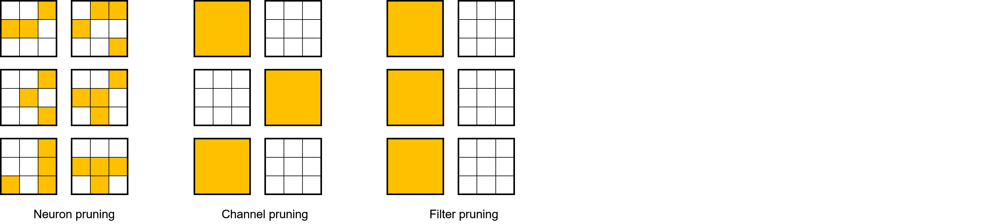

# Pruning Algorithm Overview

The following describes some basic concepts of pruning algorithms to help users understand the pruning algorithms. If you have a deep understanding of pruning algorithms, skip to [Examples](#examples).

## What Is Pruning

Just like neural networks, the pruning algorithm is inspired by neurobiology. In neurobiology, there is a concept called synaptic pruning, which usually occurs among infants of mammals. Through the synaptic pruning mechanism, neuron connections in the brain are simplified and reconstructed so that the brain can work more efficiently with lower energy. Pruning is to reduce network parameters by removing some components (such as a weight, a feature map, and a convolution kernel) in a neural network while ensuring that network accuracy is just slightly reduced, so as to reduce storage and computing costs during network deployment.

Neural network inference can be regarded as the process of activation and weight computation. Therefore, pruning is classified into activation pruning and weight pruning. In the MindSpore Golden Stick, we only discuss weight pruning.

Weight pruning is classified into structured pruning mode and unstructured pruning mode. As shown in the figure, from left to right, the pruning modes become more coarse-grained, and the results obtained through pruning become more structured.

Unstructured pruning refers to pruning a weighted value at any position in a weight tensor by using a single weighted value as a granularity. This pruning mode has less impact on the accuracy of the network due to its fine granularity, but it leads to the sparseness of the weight tensor. The sparse weight tensor is not friendly to memory access and parallel computing. Therefore, it is difficult for the unstructured pruned network to obtain a high acceleration ratio.

Structured pruning refers to deleting some weights in a model by using a weighted channel or an entire convolution kernel as a granularity. Because an entire channel or an entire convolution kernel is directly pruned, a weight obtained through pruning is more regular and has a smaller scale. This is the meaning of structured pruning. Compared with unstructured pruning, structured pruning obtains more regular weights and is more friendly to memory access. Therefore, structured pruning is suitable for accelerated inference on devices such as the CPU and GPU.

## Examples

In the current version, the MindSpore Golden Stick provides a structured weight pruning algorithm. For details, see [SCOP Algorithm Example](https://www.mindspore.cn/golden_stick/docs/en/r0.1/pruner/scop.html).
